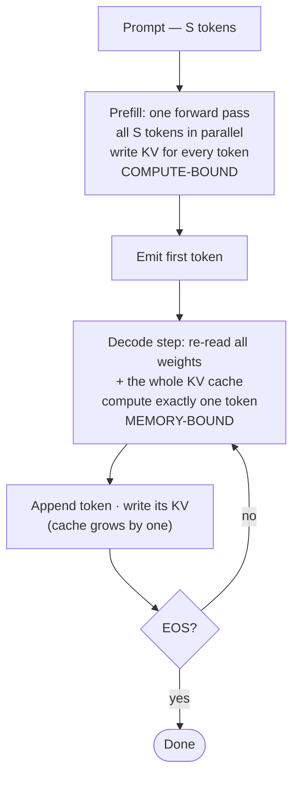

# Inference Flow: Prefill & Decode

!!! info "Baseline: **vLLM 0.26.0** · model `Qwen2.5-7B-Instruct` · single RTX 4090 (24 GB)"
    All flags/APIs on this page are verified against vLLM 0.26.0 via Context7 (ADR-0004). Performance figures are **illustrative / order-of-magnitude references** — measure the real ones on your own AutoDL box. The FLOP/byte arithmetic below is *exact* (multiplication and division), not a benchmark.

---

## 1 · Intuition & why it matters

An LLM is, mechanically, a **next-token predictor** run in a loop. You feed it a sequence, it produces a probability distribution over the vocabulary for the *next* token, you pick one, append it, and feed the whole thing back in. This is what **autoregressive** means: every new token is generated conditioned on all previous tokens, including the ones the model just produced.

That loop has a hidden asymmetry, and it is *the* thing to internalize before touching any serving knob. The **first** forward pass has to digest the entire prompt — dozens to thousands of tokens — but it happens **once** and can process all those tokens **in parallel**. Every subsequent forward pass produces exactly **one** token, but there are **hundreds** of them, and each one is **serial** (you can't compute token 51 before token 50 exists).

These two regimes are so different in their resource profile that the whole field gives them names: **prefill** (the one big parallel pass over the prompt) and **decode** (the long serial loop that emits the answer). Prefill is **compute-bound**; decode is **memory-bound**. Almost every optimization later in this path targets one phase or the other, so knowing which is which turns a pile of tricks into a map. → see the [Glossary](../glossary.md) entries for *Prefill*, *Decode*, *Memory-bound / Compute-bound*.

## 2 · Mental model

Autoregression forces inference into **two regimes with opposite resource profiles**. The control flow makes the asymmetry obvious — one pass in, then a loop:



**How to read it.** Prefill is a *single* box: the whole prompt goes through one forward pass, and because all $S$ tokens are present at once, the GPU reuses each weight across all of them — lots of math per byte loaded. Decode is a *loop*: every trip re-reads the entire model *and* the whole KV cache just to emit one token, then writes that token's KV back and asks "EOS?". That loop edge is the whole reason generation is slow — and nearly everything in Parts 4–7 is an attack on it.

The flowchart deliberately hides one detail worth seeing on its own: the **KV cache grows by exactly one token per decode step**. Prefill writes it in one shot; every decode step extends it by one:

```text
PREFILL  (one pass, all prompt tokens in parallel)
  prompt = [The  capital  of  France  is]        5 tokens, seen at once
             |    |       |    |      |
             v    v       v    v      v
           ┌───────────────────────────┐
           │   one big forward pass     │  -> writes K,V for all 5 tokens
           └───────────────────────────┘  -> emits token #1 of the answer:  "Paris"

DECODE   (a loop, one token per step, each step reuses all prior K,V)
  step 1:  [... Paris]              reuse KV(prompt);      write KV(Paris)   -> "."
  step 2:  [... Paris .]            reuse KV(prompt,Paris);write KV(.)       -> "It"
  step 3:  [... Paris . It]         reuse KV(...);         write KV(It)      -> "is"
  ...                                                                        (until EOS)
             \___________________/
              the KV cache: one big write during prefill, then +1 token per decode step
```

Two shapes to hold in your head:

- **Prefill is wide and shallow:** many tokens, one step. The GPU does a huge batched matmul — lots of arithmetic, and it *reuses* every weight across all prompt tokens. High work-per-byte-loaded.
- **Decode is narrow and deep:** one token, many steps. Each step drags the **entire** model's weights *and* the whole KV cache through the GPU to produce a single token. Tiny work-per-byte-loaded.

That asymmetry is not an implementation detail — it is dictated by autoregression, and it is why the two phases hit two different walls.

## 3 · Principle & math

The clean way to see "compute-bound vs memory-bound" is **arithmetic intensity**: FLOPs performed ÷ bytes moved from HBM. High intensity → the GPU is busy doing math (compute-bound); low intensity → the GPU stalls waiting on memory (memory-bound). → [Roofline](../glossary.md).

Let $N$ = model parameter count, $b$ = bytes per weight (BF16 → $b=2$), and let $\kappa$ = KV bytes per token (from the [KV Cache](kv-cache.md) lesson: $\kappa = 2\,L\,n_{\text{kv}}\,d_h\,b$).

**Prefill** over a prompt of $S$ tokens does roughly $2N$ FLOPs per token, for $S$ tokens, while reading each weight from HBM only **once** (they're reused across all $S$ tokens):

$$
I_{\text{prefill}}(S) \;\approx\; \frac{2NS}{\underbrace{Nb}_{\text{weights, read once}} + \underbrace{\kappa S}_{\text{KV written}}} \;\approx\; \frac{2S}{b} \quad (\kappa S \ll Nb)
$$

Intensity **grows ~linearly with $S$** in the realistic regime — $\kappa S \ll Nb$ holds until $S \approx Nb/\kappa \approx 266\text{k}$ tokens, far past the model's 32k context — so feeding it more prompt makes it *more* compute-bound. (At extreme context it eventually saturates near $2N/\kappa$.) This is why prefill saturates the GPU's math units.

**Decode** produces one token per step but must re-read **all** the weights *and* the entire KV cache for a context of length $S$:

$$
I_{\text{decode}}(S) \;\approx\; \frac{2N}{\underbrace{Nb}_{\text{weights}} + \underbrace{\kappa S}_{\text{whole KV}}} \;\le\; \frac{2N}{Nb} = \frac{2}{b} = 1 \quad(\text{BF16})
$$

Intensity is **pinned near 1 FLOP/byte** and only *drops* as context grows. A 4090 can do ~hundreds of FLOPs per byte of bandwidth, so at intensity ≈ 1 the math units sit ~99% idle waiting on HBM — **decode is memory-bound.**

**Reading the two side by side.** The denominator is the *same* (weights + KV); the numerator is the entire difference. Prefill's numerator scales with the prompt — $2NS$ — so intensity climbs with $S$. Decode's numerator is frozen at $2N$ (one token), so intensity can only *fall* as the KV term grows. The line that separates "compute-bound" from "memory-bound" is the GPU's **ridge point** — peak FLOP/s ÷ memory bandwidth. On a 4090 that lands in the low hundreds of FLOP/byte ($\approx 165\ \text{TFLOP/s} \div 1\ \text{TB/s}$, BF16). Prefill sails past the ridge into the compute-bound region; decode, pinned near 1, sits **more than 100× below** it — squarely memory-bound. This is exactly the roofline picture you will make quantitative in [Part 2](../part2/roofline-analysis.md).

This single inequality explains the latency metrics too: **TTFT** (Time To First Token) is dominated by prefill (you wait for the whole prompt to be digested before the first token appears); **TPOT** (Time Per Output Token) is dominated by decode (each step's memory traffic). Their formal definitions and measurement are Part 0B's job; here we only need the causal link. → [TTFT, TPOT](../glossary.md).

## 4 · Complete runnable code + line-by-line

This estimator is **offline-runnable** — pure CPU, no GPU, no network. It turns the two intensity formulas into numbers you can poke at, so "prefill = compute, decode = bandwidth" falls out arithmetically.

```python title="phase_intensity.py"
"""Prefill vs decode arithmetic-intensity estimator (pure CPU, offline-runnable)."""
from dataclasses import dataclass


@dataclass
class ModelConfig:
    name: str
    params: int              # total parameter count N
    kv_bytes_per_token: int  # kappa = 2 * L * n_kv * d_h * b  (see the KV Cache lesson)
    weight_bytes: int = 2    # b: BF16/FP16 = 2


def prefill_intensity(cfg: ModelConfig, prompt_len: int) -> float:
    flops = 2 * cfg.params * prompt_len                     # 2N FLOPs/token, over S tokens
    # weights are read once and reused across all S tokens; KV for S tokens is written
    bytes_moved = cfg.params * cfg.weight_bytes + cfg.kv_bytes_per_token * prompt_len
    return flops / bytes_moved


def decode_intensity(cfg: ModelConfig, context_len: int) -> float:
    flops = 2 * cfg.params                                  # one new token
    # every step re-reads ALL weights AND the whole KV cache for the current context
    bytes_moved = cfg.params * cfg.weight_bytes + cfg.kv_bytes_per_token * context_len
    return flops / bytes_moved


if __name__ == "__main__":
    # ~7.6B params (exact count derived in the "Transformer, the Infra View" lesson);
    # kappa = 57344 bytes/token for Qwen2.5-7B (2*28*4*128*2), from the KV Cache lesson.
    qwen = ModelConfig("Qwen2.5-7B-Instruct", params=7_615_000_000, kv_bytes_per_token=57344)

    for s in (128, 1024, 8192):
        print(f"prefill S={s:>5}: intensity ~= {prefill_intensity(qwen, s):8.1f} FLOP/byte")
    for s in (128, 1024, 8192):
        print(f"decode  ctx={s:>5}: intensity ~= {decode_intensity(qwen, s):8.2f} FLOP/byte")
```

**Line-by-line:**

- `ModelConfig` — three numbers decide the regime: parameter count $N$, KV bytes/token $\kappa$ (borrowed from the [KV Cache](kv-cache.md) formula), and weight dtype width $b$.
- `prefill_intensity` — numerator $2N \cdot S$ is the whole-prompt FLOPs; denominator reads the weights **once** ($N b$) plus writes $S$ tokens of KV. The `/ bytes_moved` is the arithmetic intensity.
- `decode_intensity` — numerator is a single token's $2N$; denominator re-reads **all** weights *and* the full KV cache ($\kappa \cdot \text{context}$). Same weights, but now amortized over one token instead of $S$ — that's the whole story. (Using total $N$ here is a simplification — the embedding is a gather, not a full read — but it doesn't move the ≈ 1 result.)
- `__main__` — plugs in Qwen2.5-7B and sweeps three lengths per phase. Watch prefill's intensity climb into the thousands while decode's clings to ~1.

Expected output (exact arithmetic, not a benchmark):

```text
prefill S=  128: intensity ~=    127.9 FLOP/byte
prefill S= 1024: intensity ~=   1020.1 FLOP/byte
prefill S= 8192: intensity ~=   7946.9 FLOP/byte
decode  ctx=  128: intensity ~=     1.00 FLOP/byte
decode  ctx= 1024: intensity ~=     1.00 FLOP/byte
decode  ctx= 8192: intensity ~=     0.97 FLOP/byte
```

Prefill's intensity is **~1000–8000×** decode's. A modern GPU wants hundreds of FLOP/byte to stay busy; prefill clears that bar easily, decode never does.

## 5 · Lab — watch the two phases in vLLM

!!! gpu "GPU Lab"
    - **Min VRAM:** 24 GB
    - **Suggested AutoDL card:** RTX 4090 (24 GB)
    - **Est. time / cost:** ~15 min · ~¥1 of GPU time (illustrative)
    - **Platform:** NVIDIA CUDA (default)
    - **Non-NVIDIA:** vLLM also runs on AMD ROCm and CPU builds; wall-clock numbers and kernel behavior differ by backend — check your platform's vLLM build notes.

The two phases show up directly in latency. Reuse only APIs already verified in the [KV Cache](kv-cache.md) lab (`LLM`, `SamplingParams`, `generate`), and vary the **prompt length** (drives prefill) independently from `max_tokens` (drives the number of decode steps):

```python title="phases.py"
import time
from vllm import LLM, SamplingParams

llm = LLM(model="Qwen/Qwen2.5-7B-Instruct-AWQ", max_model_len=8192)

def one(prompt: str, max_tokens: int):
    t0 = time.perf_counter()
    out = llm.generate([prompt], SamplingParams(max_tokens=max_tokens, temperature=0))
    dt = time.perf_counter() - t0
    n_out = len(out[0].outputs[0].token_ids)
    print(f"prompt≈{len(prompt.split()):>4} words, {n_out:>3} new tokens -> {dt:.2f}s wall")

one("Summarize in one word: hello.", max_tokens=8)          # tiny prefill, few decode steps
one("Summarize in one word: " + "context " * 2000, max_tokens=8)   # BIG prefill, few decode steps
one("Summarize in one word: hello.", max_tokens=256)        # tiny prefill, MANY decode steps
```

**What to observe:** growing the **prompt** inflates the first-token wait (more prefill compute) but barely changes per-token cadence afterward. Growing `max_tokens` adds roughly *linear* wall time — each extra token is one more memory-bound decode step. That linear-in-output-tokens behavior is the decode wall you'll spend Parts 4–7 fighting (continuous batching, PagedAttention, speculative decoding).

## 6 · Common pitfalls / counter-intuitive points

- **"Prefill is one step, so it's free."** It's one *step* but not one *token* of work — a 4000-token prompt is 4000× a single token's FLOPs. On long prompts, prefill can dominate TTFT.
- **You cannot parallelize decode *within a request*.** Token 51 depends on token 50's identity. This serial dependency, not a lack of hardware, is why decode is slow — and why [speculative decoding](../glossary.md) (guess-then-verify) exists.
- **Batching helps decode, not a single stream.** Running many sequences' decode steps *together* raises arithmetic intensity (weights are read once, reused across the batch) — that's the core idea behind [continuous batching](../glossary.md). One lonely stream stays memory-bound no matter what.
- **Low TTFT and high throughput are different goals.** Chunked prefill and PD disaggregation (Part 4) exist precisely because tuning for one can hurt the other.
- **"It's a 7B model, surely it's compute-bound."** Size doesn't set the regime; *arithmetic intensity* does. Decode of a 70B model is still memory-bound.

## 7 · Interview links

- [Prefill vs decode](../interview/prefill-vs-decode.md) — the high-frequency question this lesson prepares you for: *which phase is compute- vs memory-bound, why, and what each implies for TTFT/TPOT and batching?*

## 8 · Summary & further reading

**One line:** autoregression splits inference into a wide, compute-bound **prefill** and a narrow, memory-bound **decode** loop — and knowing which phase a given optimization targets is the key that organizes everything that follows.

Further reading:

- vLLM docs — engine architecture and scheduling (baseline v0.26.0).
- *Orca: A Distributed Serving System for Transformer-Based Generative Models* — the origin of continuous batching, which lives entirely in the decode phase.
- The [KV Cache](kv-cache.md) lesson — the memory that decode re-reads every step.
- The [Operator Roofline](../part2/roofline-analysis.md) lesson (Part 2) — where "decode is memory-bound" becomes quantitative, via arithmetic intensity and the ridge point.
- The [scheduler](../part5/scheduler-chunked-prefill-pd.md) lesson (Part 5) — how the engine interleaves the two phases (chunked prefill, PD disaggregation) to balance TTFT against throughput.

## 9 · Self-check

??? question "Which phase is compute-bound and which is memory-bound, and in one sentence, why?"
    Prefill is compute-bound (it processes many prompt tokens in parallel, reusing each weight across all of them → high arithmetic intensity); decode is memory-bound (it produces one token per step but must re-read all weights and the whole KV cache → intensity ≈ 1 FLOP/byte, so the GPU stalls on HBM bandwidth).

??? question "Why can't you speed up a single request's decode by throwing more GPU cores at it?"
    Decode is *serial*: token *t+1* is conditioned on the actual value of token *t*, which doesn't exist until step *t* finishes. Extra cores can't compute a token whose input isn't known yet. You attack this with batching (parallelize *across* requests) or speculative decoding (guess several tokens with a small model, verify in one big-model pass).

??? question "A request has a 4000-token prompt and generates 50 tokens. Where does most of the *first-token* latency (TTFT) come from, and where does the rest of the wall-clock go?"
    TTFT is dominated by **prefill** — digesting 4000 tokens in one compute-heavy pass before any output appears. The remaining wall-clock is 50 **decode** steps, each a memory-bound pass that emits one token; that part scales roughly linearly with the 50 output tokens.
