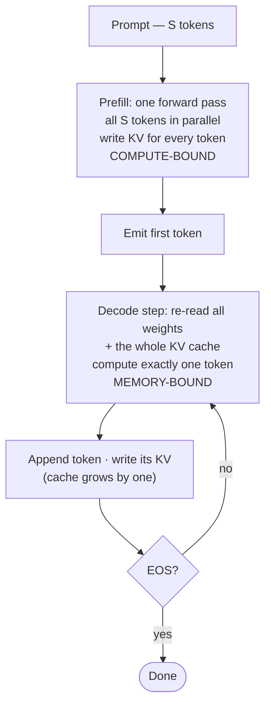

# 推理流程：Prefill 与 Decode

!!! info "基线：**vLLM 0.26.0** · 模型 `Qwen2.5-7B-Instruct` · 单张 RTX 4090（24 GB）"
    本页所有 flag/API 均针对 vLLM 0.26.0 经 Context7 核实（ADR-0004）。性能数字为**示例 / 量级参考**——真实数字请在你自己的 AutoDL 环境实测。下文 FLOP/字节 的算术是**精确**的（乘除法而已），不是跑分。

---

## 1 · 直觉 & 为什么重要

LLM 从机制上看就是一个跑在循环里的**下一个 token 预测器**。你喂进一段序列，它给出词表上*下一个* token 的概率分布，你挑一个、拼接上去，再把整段喂回去。这就是**自回归**的含义：每个新 token 的生成都以此前所有 token 为条件，包括模型刚刚产出的那些。

这个循环藏着一个不对称，而它正是碰任何服务旋钮之前**最该**刻进脑子的东西。**第一次**前向要消化整段 prompt——几十到几千个 token——但它只发生**一次**，且能**并行**处理所有这些 token。之后的每一次前向恰好产出**一个** token，但这样的前向有**几百次**，而且每次都是**串行**的（token 50 还没出现，你算不了 token 51）。

这两种状态在资源画像上如此不同，以至于整个领域给了它们各自的名字：**prefill**（对 prompt 的那一次大并行前向）与 **decode**（吐出答案的那个长串行循环）。Prefill 是 **compute-bound（算力受限）**；decode 是 **memory-bound（带宽受限）**。本路径后面几乎每个优化都针对其中一个阶段，所以搞清谁是谁，能把一堆招式变成一张地图。→ 见[术语表](../glossary.md)的 *Prefill*、*Decode*、*Memory-bound / Compute-bound*。

## 2 · 心智模型

自回归把推理逼成**两种资源画像相反的状态**。控制流让这个不对称一目了然——一次前向进去，然后进入循环：



**怎么读这张图。** Prefill 是*一个*方框：整段 prompt 走一次前向，因为所有 $S$ 个 token 同时在场，GPU 把每个权重跨所有 token 复用——每搬一字节做很多算术。Decode 是一个*循环*：每一圈都重读整个模型*和*整个 KV 缓存，只为吐出一个 token，然后把这个 token 的 KV 写回、再问一句「EOS 了吗？」。这条循环边就是生成之所以慢的全部原因——Part 4–7 里几乎所有东西都在攻击它。

这张流程图刻意藏起一个值得单独看的细节：**KV 缓存每个 decode 步恰好增长一个 token**。Prefill 一次写好；之后每个 decode 步把它延长一格：

```text
PREFILL  (one pass, all prompt tokens in parallel)
  prompt = [The  capital  of  France  is]        5 tokens, seen at once
             |    |       |    |      |
             v    v       v    v      v
           ┌───────────────────────────┐
           │   one big forward pass     │  -> writes K,V for all 5 tokens
           └───────────────────────────┘  -> emits token #1 of the answer:  "Paris"

DECODE   (a loop, one token per step, each step reuses all prior K,V)
  step 1:  [... Paris]              reuse KV(prompt);      write KV(Paris)   -> "."
  step 2:  [... Paris .]            reuse KV(prompt,Paris);write KV(.)       -> "It"
  step 3:  [... Paris . It]         reuse KV(...);         write KV(It)      -> "is"
  ...                                                                        (until EOS)
             \___________________/
              the KV cache: one big write during prefill, then +1 token per decode step
```

脑中要记住两个形状：

- **Prefill 又宽又浅：** 很多 token，一步搞定。GPU 做一个巨大的批量矩阵乘——算术量大，且每个权重被所有 prompt token *复用*。每搬一字节所做的运算很高。
- **Decode 又窄又深：** 一个 token，很多步。每一步都要把**整个**模型权重*和*整个 KV 缓存拖过 GPU，只为产出一个 token。每搬一字节所做的运算极小。

这个不对称不是实现细节——它由自回归决定，也正是两个阶段撞上两堵不同墙的原因。

## 3 · 原理与数学

看清「compute-bound vs memory-bound」的干净办法是**算术强度**：所做 FLOPs ÷ 从 HBM 搬运的字节。强度高 → GPU 忙于算术（compute-bound）；强度低 → GPU 卡在等内存（memory-bound）。→ [Roofline](../glossary.md)。

设 $N$ = 模型参数量，$b$ = 每权重字节数（BF16 → $b=2$），$\kappa$ = 每 token 的 KV 字节数（来自 [KV 缓存](kv-cache.md) 课：$\kappa = 2\,L\,n_{\text{kv}}\,d_h\,b$）。

**Prefill** 处理 $S$ 个 token 的 prompt，每 token 约 $2N$ FLOPs、共 $S$ 个 token，而每个权重只从 HBM 读**一次**（被所有 $S$ 个 token 复用）：

$$
I_{\text{prefill}}(S) \;\approx\; \frac{2NS}{\underbrace{Nb}_{\text{权重，只读一次}} + \underbrace{\kappa S}_{\text{写入 KV}}} \;\approx\; \frac{2S}{b} \quad (\kappa S \ll Nb)
$$

强度在现实区间**随 $S$ 近似线性增长**——$\kappa S \ll Nb$ 一直成立到 $S \approx Nb/\kappa \approx 266\text{k}$ 个 token，远超模型的 32k 上下文——所以喂越多 prompt，它越 compute-bound。（在极长上下文下它最终饱和于 $2N/\kappa$ 附近。）这就是 prefill 能打满 GPU 算术单元的原因。

**Decode** 每步产出一个 token，却要重读**全部**权重*以及*上下文长度为 $S$ 的整个 KV 缓存：

$$
I_{\text{decode}}(S) \;\approx\; \frac{2N}{\underbrace{Nb}_{\text{权重}} + \underbrace{\kappa S}_{\text{整个 KV}}} \;\le\; \frac{2N}{Nb} = \frac{2}{b} = 1 \quad(\text{BF16})
$$

强度**被钉在 1 FLOP/字节 附近**，且只会随上下文增长而*下降*。一张 4090 每字节带宽能做几百 FLOPs，于是在强度 ≈ 1 时算术单元约 99% 空闲、干等 HBM——**decode 是 memory-bound。**

**把两式并排读。** 分母是*一样*的（权重 + KV）；分子才是全部差别。Prefill 的分子随 prompt 增长——$2NS$——所以强度随 $S$ 攀升。Decode 的分子被冻在 $2N$（一个 token），所以强度只会随 KV 项增大而*下降*。把「compute-bound」与「memory-bound」分开的那条线，是 GPU 的 **ridge point（脊点）**——峰值 FLOP/s ÷ 内存带宽。一张 4090 落在几百 FLOP/字节 这个量级（$\approx 165\ \text{TFLOP/s} \div 1\ \text{TB/s}$，BF16）。Prefill 一举越过脊点、进入 compute-bound 区；decode 钉在 1 附近，落在脊点**下方 100× 以上**——妥妥的 memory-bound。这正是你将在 [Part 2](../part2/roofline-analysis.md) 里量化的 roofline 图景。

这个不等式也解释了延迟度量：**TTFT**（首 token 延迟）由 prefill 主导（要等整段 prompt 被消化完，第一个 token 才出现）；**TPOT**（每输出 token 时间）由 decode 主导（每步的内存搬运）。它们的正式定义与测量是 Part 0B 的活；这里只需建立因果链。→ [TTFT、TPOT](../glossary.md)。

## 4 · 完整可跑代码 + 逐行讲解

这个估算器**可离线运行**——纯 CPU、无 GPU、无网络。它把两条强度公式变成你能动手拨弄的数字，让「prefill = 算力，decode = 带宽」从算术里自然浮现。

```python title="phase_intensity.py"
"""Prefill vs decode 算术强度估算器（纯 CPU，可离线运行）。"""
from dataclasses import dataclass


@dataclass
class ModelConfig:
    name: str
    params: int              # 总参数量 N
    kv_bytes_per_token: int  # kappa = 2 * L * n_kv * d_h * b（见 KV 缓存课）
    weight_bytes: int = 2    # b：BF16/FP16 = 2


def prefill_intensity(cfg: ModelConfig, prompt_len: int) -> float:
    flops = 2 * cfg.params * prompt_len                     # 每 token 2N FLOPs，共 S 个 token
    # 权重只读一次、被所有 S 个 token 复用；写入 S 个 token 的 KV
    bytes_moved = cfg.params * cfg.weight_bytes + cfg.kv_bytes_per_token * prompt_len
    return flops / bytes_moved


def decode_intensity(cfg: ModelConfig, context_len: int) -> float:
    flops = 2 * cfg.params                                  # 一个新 token
    # 每步都重读全部权重 + 当前上下文的整个 KV 缓存
    bytes_moved = cfg.params * cfg.weight_bytes + cfg.kv_bytes_per_token * context_len
    return flops / bytes_moved


if __name__ == "__main__":
    # ~7.6B 参数（精确值在「Transformer 的 Infra 视角」课里推导）；
    # kappa = 57344 字节/token，对应 Qwen2.5-7B（2*28*4*128*2），来自 KV 缓存课。
    qwen = ModelConfig("Qwen2.5-7B-Instruct", params=7_615_000_000, kv_bytes_per_token=57344)

    for s in (128, 1024, 8192):
        print(f"prefill S={s:>5}: intensity ~= {prefill_intensity(qwen, s):8.1f} FLOP/byte")
    for s in (128, 1024, 8192):
        print(f"decode  ctx={s:>5}: intensity ~= {decode_intensity(qwen, s):8.2f} FLOP/byte")
```

**逐行讲解：**

- `ModelConfig` — 三个数字决定状态：参数量 $N$、每 token KV 字节 $\kappa$（借自 [KV 缓存](kv-cache.md) 公式）、权重 dtype 宽度 $b$。
- `prefill_intensity` — 分子 $2N \cdot S$ 是整段 prompt 的 FLOPs；分母把权重读**一次**（$N b$）再写 $S$ 个 token 的 KV。`/ bytes_moved` 即算术强度。
- `decode_intensity` — 分子是单 token 的 $2N$；分母重读**全部**权重*以及*完整 KV 缓存（$\kappa \cdot \text{context}$）。同样的权重，如今只摊到一个 token 而非 $S$ 个——这就是全部的故事。（这里用总参数 $N$ 是个简化——embedding 是查表、不是整读——但它不改变 ≈ 1 的结论。）
- `__main__` — 代入 Qwen2.5-7B，每个阶段扫三种长度。看 prefill 的强度攀到几千，而 decode 的死死贴着 ~1。

预期输出（精确算术，非跑分）：

```text
prefill S=  128: intensity ~=    127.9 FLOP/byte
prefill S= 1024: intensity ~=   1020.1 FLOP/byte
prefill S= 8192: intensity ~=   7946.9 FLOP/byte
decode  ctx=  128: intensity ~=     1.00 FLOP/byte
decode  ctx= 1024: intensity ~=     1.00 FLOP/byte
decode  ctx= 8192: intensity ~=     0.97 FLOP/byte
```

Prefill 的强度是 decode 的 **~1000–8000×**。现代 GPU 要几百 FLOP/字节 才不空转；prefill 轻松越线，decode 永远够不着。

## 5 · Lab —— 在 vLLM 里看两个阶段

!!! gpu "GPU Lab"
    - **最低显存：** 24 GB
    - **建议 AutoDL 卡型：** RTX 4090（24 GB）
    - **预估耗时 / 花费：** ~15 分钟 · ~¥1 GPU 时长（示例）
    - **平台：** NVIDIA CUDA（默认）
    - **非 NVIDIA：** vLLM 也能在 AMD ROCm 与 CPU 构建上跑；墙钟数字与 kernel 行为随后端而异——请查你所在平台的 vLLM 构建说明。

两个阶段会直接体现在延迟上。只复用 [KV 缓存](kv-cache.md) lab 里已核实的 API（`LLM`、`SamplingParams`、`generate`），并把 **prompt 长度**（驱动 prefill）与 `max_tokens`（驱动 decode 步数）分开变化：

```python title="phases.py"
import time
from vllm import LLM, SamplingParams

llm = LLM(model="Qwen/Qwen2.5-7B-Instruct-AWQ", max_model_len=8192)

def one(prompt: str, max_tokens: int):
    t0 = time.perf_counter()
    out = llm.generate([prompt], SamplingParams(max_tokens=max_tokens, temperature=0))
    dt = time.perf_counter() - t0
    n_out = len(out[0].outputs[0].token_ids)
    print(f"prompt≈{len(prompt.split()):>4} words, {n_out:>3} new tokens -> {dt:.2f}s wall")

one("Summarize in one word: hello.", max_tokens=8)          # 小 prefill，少 decode 步
one("Summarize in one word: " + "context " * 2000, max_tokens=8)   # 大 prefill，少 decode 步
one("Summarize in one word: hello.", max_tokens=256)        # 小 prefill，多 decode 步
```

**观察什么：** 加长 **prompt** 会抬高首 token 等待（更多 prefill 算力），但之后每 token 的节奏几乎不变。加大 `max_tokens` 让墙钟大致*线性*增长——每多一个 token 就是多一个 memory-bound 的 decode 步。这条「随输出 token 线性增长」的行为，正是你在 Part 4–7 要对付的 decode 墙（continuous batching、PagedAttention、speculative decoding）。

## 6 · 常见坑 / 反直觉点

- **「Prefill 只有一步，所以免费。」** 它是一*步*，但不是一个 *token* 的工作量——一段 4000-token 的 prompt 就是单 token FLOPs 的 4000 倍。长 prompt 下，prefill 会主导 TTFT。
- **一个请求*内部*的 decode 无法并行。** token 51 依赖 token 50 的具体取值。这种串行依赖（而非硬件不够）才是 decode 慢的原因——也是 [speculative decoding](../glossary.md)（先猜后验）存在的理由。
- **批处理帮的是 decode，不是单条流。** 把很多序列的 decode 步*一起*跑能抬高算术强度（权重读一次、跨整批复用）——这正是 [continuous batching](../glossary.md) 的核心想法。孤零零一条流无论如何都还是 memory-bound。
- **低 TTFT 与高吞吐是两个目标。** chunked prefill 与 PD 分离（Part 4）之所以存在，正因为为其一调优可能伤害其二。
- **「7B 大模型，肯定 compute-bound 吧。」** 决定状态的不是尺寸，而是*算术强度*。70B 模型的 decode 一样是 memory-bound。

## 7 · 面试连线

- [Prefill vs decode](../interview/prefill-vs-decode.md) —— 本课为你准备的高频题：*哪个阶段 compute- 还是 memory-bound，为什么，以及各自对 TTFT/TPOT 与批处理意味着什么？*

## 8 · 小结 & 延伸阅读

**一句话：** 自回归把推理劈成又宽又 compute-bound 的 **prefill** 和又窄又 memory-bound 的 **decode** 循环——而搞清某个优化针对哪个阶段，是组织后续一切的钥匙。

延伸阅读：

- vLLM 文档 —— engine 架构与调度（基线 v0.26.0）。
- *Orca: A Distributed Serving System for Transformer-Based Generative Models* —— continuous batching 的源头，它整个活在 decode 阶段。
- [KV 缓存](kv-cache.md) 课 —— decode 每步重读的那块显存。
- [算子 Roofline](../part2/roofline-analysis.md) 课（Part 2）—— 「decode 是 memory-bound」在这里被算术强度与 ridge point 量化。
- [调度器](../part5/scheduler-chunked-prefill-pd.md) 课（Part 5）—— engine 如何交错这两个阶段（chunked prefill、PD 分离）以在 TTFT 与吞吐间权衡。

## 9 · 自测小问

??? question "哪个阶段 compute-bound、哪个 memory-bound，用一句话说为什么？"
    Prefill 是 compute-bound（它并行处理很多 prompt token，每个权重被所有 token 复用 → 算术强度高）；decode 是 memory-bound（每步只产一个 token，却要重读全部权重和整个 KV 缓存 → 强度 ≈ 1 FLOP/字节，于是 GPU 卡在 HBM 带宽上）。

??? question "为什么给单个请求的 decode 堆更多 GPU 核也提不了速？"
    Decode 是*串行*的：token *t+1* 以 token *t* 的实际取值为条件，而后者在第 *t* 步结束前并不存在。多余的核算不了一个输入还未知的 token。你只能靠批处理（*跨*请求并行）或 speculative decoding（用小模型猜若干 token、大模型一次验证）来攻击它。

??? question "一个请求有 4000-token 的 prompt、生成 50 个 token。*首 token* 延迟（TTFT）主要来自哪里？剩下的墙钟去了哪？"
    TTFT 由 **prefill** 主导——在任何输出出现前，先用一次算力密集的前向消化 4000 个 token。剩余墙钟是 50 个 **decode** 步，每步都是一次 memory-bound 的前向、吐一个 token；这部分大致随 50 个输出 token 线性增长。
