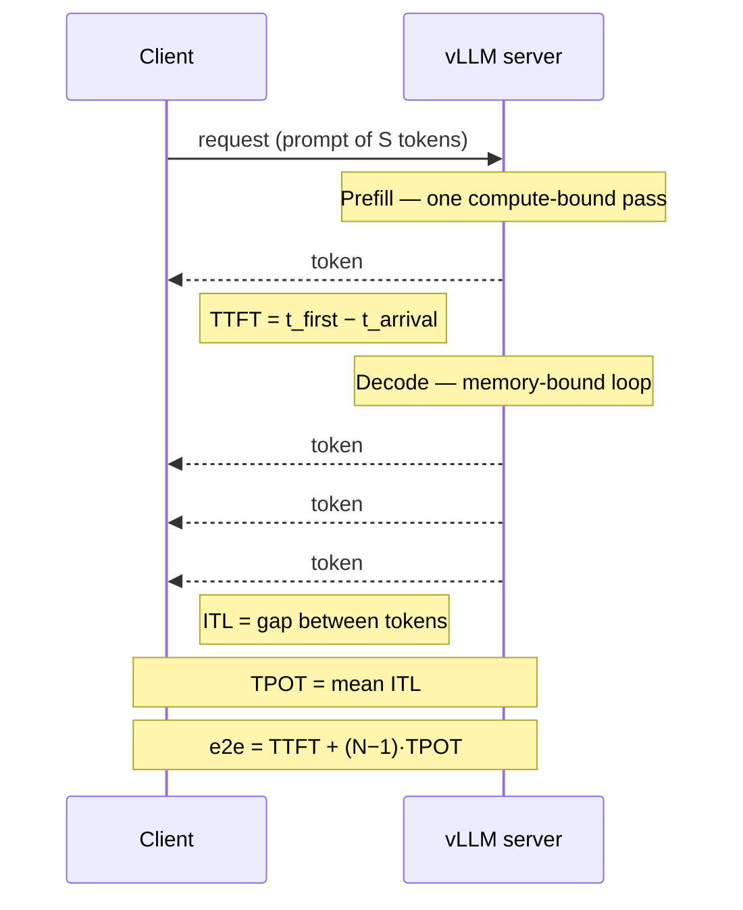

# 推理性能度量

!!! info "基线：**vLLM 0.26.0** · 模型 `Qwen2.5-7B-Instruct` · 单张 RTX 4090（24 GB）"
    本页所有 CLI/flag/metric 名均针对 vLLM 0.26.0 经 Context7 核实（ADR-0004）。延迟/吞吐数字为**示例 / 量级参考**——真实数字请在你自己的 AutoDL 环境用 `vllm bench serve` 实测。下文度量的算术（差、比、百分位）是*精确*的。

---

## 1 · 直觉 & 为什么重要

「它快吗？」是个错问题。一个服务系统会**同时以四种不同方式**快，而它们彼此权衡，所以在你能给每一个命名并测量之前，什么都调不了：

- 用户多久能看到*任何*东西？→ **TTFT**（Time To First Token，首 token 延迟）
- 一旦开始流式，之后每个字有多跟手？→ **TPOT / ITL**（Time Per Output Token / Inter-Token Latency）
- *整台机器*每秒能为所有用户推出多少 token？→ **throughput（吞吐）**
- 其中有多少 token 真的在我们承诺的*延迟之内*送达？→ **goodput（有效吞吐）**

陷阱在于优化其一、悄悄毁掉其二。往一个 batch 里塞更多请求，聚合 **throughput** 飙升——但每个请求的 **TTFT** 与 **TPOT** 都变差，因为现在它们共享 GPU。一个系统可以报出华丽的吞吐，却悄悄在 30% 的请求上违反它的延迟 SLO；**goodput** 正是那个不让你藏起这件事的度量。本课给你精确定义、测量配方、以及把延迟、并发、吞吐绑到一起的那条定律（Little's）。→ 见[术语表](../glossary.md)的 *TTFT*、*TPOT / ITL*、*Throughput*、*Goodput*、*SLO*。

## 2 · 心智模型

一个请求，画成 client 与 server 之间的一段对话——每个度量都是两个事件之间的间隔：



同一个请求画成**时间线**，每个度量就成了一段可测的区间：

```text
SINGLE REQUEST (streaming)
  t_arrival        t_first                                   t_last
     |                |        |       |       |       |        |
     |<---- TTFT ---->| tok#1  tok#2   tok#3   tok#4   tok#5    |
     |                |<-ITL->|<-ITL->|<-ITL->|<-ITL->|         |
     |                                                          |
     |<---------------------- e2e latency --------------------->|

  TTFT = t_first - t_arrival                 (dominated by PREFILL)
  ITL  = gap between consecutive tokens       (each decode step)
  TPOT = mean ITL = (t_last - t_first)/(N-1)  (dominated by DECODE)
  e2e  = TTFT + (N-1)*TPOT

MANY REQUESTS (the system view)
  throughput = (all output tokens) / wall-clock          <- raw tokens/s
  goodput    = (tokens/reqs that MET the SLO) / wall-clock <- honest tokens/s
                     e.g. SLO = "TTFT <= 0.5s AND TPOT <= 50ms"
```

要握住两个形状：

- **单请求延迟是两个数，不是一个。** TTFT（等待）与 TPOT（节奏）来自[推理流程](inference-flow.md) 的两个阶段——prefill 定 TTFT，decode 定 TPOT——而用户对它们的感受不同：TTFT 慢是画面冻住，TPOT 慢是流式卡顿。
- **系统吞吐与单请求延迟朝相反方向拉。** 更大的 batch 把权重读取摊到更多请求上（更高吞吐，正是 [continuous batching](../glossary.md) 的要点），但每个请求要排在更多工作之后（更差的 TTFT/TPOT）。goodput 就是那份张力被诚实计分的地方。

## 3 · 原理与数学

设一个请求在 $t_0$ 到达，在 $t_1$ 吐出首 token、在 $t_e$ 吐出末 token，产出 $N$ 个输出 token、各间隔延迟为 $\ell_1,\dots,\ell_{N-1}$。

$$
\text{TTFT} = t_1 - t_0, \qquad
\text{ITL}_i = \ell_i, \qquad
\text{TPOT} = \frac{t_e - t_1}{N-1} = \frac{1}{N-1}\sum_{i} \ell_i
$$

$$
\text{e2e 延迟} = \text{TTFT} + (N-1)\cdot\text{TPOT} = t_e - t_0
$$

TPOT 就是 ITL 的**均值**；当你在意*抖动*时报 ITL（批处理让间隔不均），在意*平均*节奏时报 TPOT。

在墙钟窗口 $W$ 内跨 $R$ 个请求：

$$
\text{输出吞吐} = \frac{\sum_r N_r}{W}\ \text{(tok/s)}, \qquad
\text{请求吞吐} = \frac{R}{W}\ \text{(req/s)}
$$

**Goodput** 把分子限制为满足 [SLO](../glossary.md) 的请求。用指示函数 $\mathbb{1}(\text{SLO}_r)$（请求 $r$ 满足*每一个*延迟目标时为 1）：

$$
\text{goodput} = \frac{\sum_r N_r \cdot \mathbb{1}(\text{SLO}_r)}{W}
$$

goodput 恒 $\le$ throughput；两者之差就是你靠违背承诺「挣」来的吞吐。一次 batch size 扫描通常*单调抬高* throughput，却让 goodput *先升后降*——那个峰值才是你真正想要的工作点。

**Little's Law** 把一切绑到一起。稳态下平均并发 $L$（在飞请求数）、到达率 $\lambda$、平均延迟 $W$：

$$
L = \lambda \cdot W
$$

三种读法：要在延迟 $W$ 下服务到达率 $\lambda$，你需要 $L=\lambda W$ 个常驻请求（决定你的 batch/KV 预算）；在 GPU 受限时抬 $\lambda$ 会逼 $W$ 上升（负载下延迟劣化）；而吞吐-延迟曲线的[拐点](../glossary.md) 就是 $W$ 开始比 $\lambda$ 涨得更快的地方。这里百分位很重要——报 **p50、p90、p99**，绝不只报均值，因为违反 SLO 的正是尾延迟。

## 4 · 完整可跑代码 + 逐行讲解

这段代码从**一组固定的单请求时间戳日志**算出上面每个度量——纯 CPU、可离线运行、确定性。它正是客户端压测器（或 `vllm bench serve`）内部所做的事。

```python title="metrics.py"
"""从请求日志算 TTFT / TPOT / ITL / throughput / goodput（纯 CPU）。"""
from dataclasses import dataclass
from statistics import mean


@dataclass
class RequestLog:
    arrival: float             # t0：请求发出的时刻
    token_times: list[float]   # 每个输出 token 的绝对时刻


def ttft(r: RequestLog) -> float:
    return r.token_times[0] - r.arrival                       # 首 token 等待

def tpot(r: RequestLog) -> float:
    n = len(r.token_times)
    return (r.token_times[-1] - r.token_times[0]) / (n - 1)   # 平均 token 间间隔

def e2e(r: RequestLog) -> float:
    return r.token_times[-1] - r.arrival                      # 总墙钟

def meets_slo(r: RequestLog, max_ttft: float, max_tpot: float) -> bool:
    return ttft(r) <= max_ttft and tpot(r) <= max_tpot        # 所有目标都要满足


def percentile(xs: list[float], p: float) -> float:
    s = sorted(xs)
    k = round((p / 100) * (len(s) - 1))                       # 0..n-1 上的最近秩
    return s[k]


if __name__ == "__main__":
    # 三个合成请求（时间单位秒）。C 故意有一个慢 TTFT。
    reqs = [
        RequestLog(0.00, [0.20, 0.25, 0.30, 0.35, 0.40]),           # A：TTFT .20，TPOT .05
        RequestLog(0.10, [0.60, 0.64, 0.68, 0.72, 0.76, 0.80]),     # B：TTFT .50，TPOT .04
        RequestLog(0.20, [0.90, 1.00, 1.10]),                       # C：TTFT .70，TPOT .10
    ]
    MAX_TTFT, MAX_TPOT = 0.50, 0.05                              # SLO

    ttfts = [ttft(r) for r in reqs]
    tpots = [tpot(r) for r in reqs]
    print(f"TTFT  p50={percentile(ttfts,50):.2f}s  p99={percentile(ttfts,99):.2f}s  mean={mean(ttfts):.3f}s")
    print(f"TPOT  p50={percentile(tpots,50):.2f}s  mean={mean(tpots):.4f}s")

    wall = max(r.token_times[-1] for r in reqs) - min(r.arrival for r in reqs)
    total_out = sum(len(r.token_times) for r in reqs)
    good_out = sum(len(r.token_times) for r in reqs if meets_slo(r, MAX_TTFT, MAX_TPOT))
    print(f"throughput = {total_out}/{wall:.2f}s = {total_out/wall:.2f} tok/s")
    print(f"goodput    = {good_out}/{wall:.2f}s = {good_out/wall:.2f} tok/s "
          f"（{good_out}/{total_out} 个 token 满足 SLO）")
```

**逐行讲解：**

- `RequestLog` — 每个服务基准的原料：你何时发出请求、以及回来的每个 token 的时间戳。其余一切都是导出的。
- `ttft` / `tpot` / `e2e` — §3 公式的直接转写。注意 `tpot` 除以 `n-1`（$N$ 个 token 之间有 $N-1$ 个*间隔*），这是要写对的经典差一错误。
- `meets_slo` — 那个 and 就是要点：一个请求只有满足**每一个**目标才算「好」。有一维违反就出局。
- `percentile` — 在 0 索引已排序列表上的最近秩；3 个点的 p99 就是最大值，这正是*为什么*尾部度量需要样本量才有意义。
- `__main__` — 三个请求；C 的 0.70 秒 TTFT 打爆 0.50 秒 SLO，于是它的 3 个 token 计入 throughput 却**不**计入 goodput。

预期输出（精确算术，非跑分）：

```text
TTFT  p50=0.50s  p99=0.70s  mean=0.467s
TPOT  p50=0.05s  mean=0.0633s
throughput = 14/1.10s = 12.73 tok/s
goodput    = 11/1.10s = 10.00 tok/s （11/14 个 token 满足 SLO）
```

throughput 说「12.7 tok/s」；goodput 说「其中只有 10.0 是如约交付的」。这 2.7 tok/s 的差值恰好就是请求 C——在吞吐榜上高高在上，在 goodput 上隐形。这个差值正是压测要找的东西。

## 5 · Lab —— 用 vLLM 真刀真枪地测

!!! gpu "GPU Lab"
    - **最低显存：** 24 GB（加载 `Qwen2.5-7B-Instruct-AWQ`）
    - **建议 AutoDL 卡型：** RTX 4090（24 GB）
    - **预估耗时 / 花费：** ~20 分钟 · ~¥1–2 GPU 时长（示例）
    - **平台：** NVIDIA CUDA（默认）
    - **非 NVIDIA：** `vllm bench serve` 与后端无关（它是个 HTTP 客户端）；它打的*服务端*必须是你平台上能跑的 vLLM 构建（ROCm/CPU 数字不同）。

vLLM 把 §4 的那套压测器做成了 CLI。先把模型 serve 起来，再压测，再读服务端自己的 metrics——三个已核实的面。

Serve 模型（Prometheus metrics 默认在 `/metrics` 开启）：

```bash
vllm serve Qwen/Qwen2.5-7B-Instruct-AWQ --max-model-len 8192 --enable-per-request-metrics
```

打负载、拿到带百分位的 TTFT/TPOT/ITL + throughput（`vllm bench` 需 `pip install vllm[bench]`）：

```bash
vllm bench serve \
  --model Qwen/Qwen2.5-7B-Instruct-AWQ \
  --host localhost --port 8000 \
  --random-input-len 512 --random-output-len 128 \
  --num-prompts 200 --max-concurrency 16
```

直接读服务端聚合的直方图（已核实的 metric 名，`vllm:` 前缀）：

```bash
curl http://localhost:8000/metrics | grep -E \
  'vllm:time_to_first_token_seconds|vllm:request_prefill_time_seconds|vllm:request_decode_time_seconds|vllm:generation_tokens_total'
```

**观察什么：** 把 `--max-concurrency` 设为 1、8、32、64 重跑 `vllm bench serve`，看权衡上演——**输出 token 吞吐爬升**，同时 **p99 TTFT 与 TPOT 也爬升**。把 throughput（x）对 p99 TTFT（y）画出来，你就手绘了那条延迟-吞吐曲线；它的[拐点](../glossary.md) 就是你 goodput 最大化的工作点。（vLLM 甚至把这自动化了：`vllm bench sweep serve_workload` 跑扫描、`vllm bench sweep plot` 画曲线。）

## 6 · 常见坑 / 反直觉点

- **报均值、藏尾部。** 均值延迟很好看，而 p99 却在你最倒霉的 1% 用户上违反 SLO。永远报 p50/p90/p99；SLO 是对着尾部写的。
- **把 throughput 与 goodput 混为一谈。** batch size 扫描让 throughput 单调上升，而 goodput *先升后降*。把裸吞吐优化过 goodput 峰值，买到的是没人按时收到的 token。
- **更大的 batch，更好*也*更坏。** 更大 batch 抬高聚合吞吐，却抬高单请求 TTFT/TPOT。不存在单一的「更快」——说清你指的是哪个度量。
- **客户端测量含网络。** 客户端观测的 TTFT = 服务端计算 + 排队 + 网络 RTT。拿它对照服务端的 `vllm:` 直方图，把「模型慢」与「链路慢」分开。
- **忘了预热。** 第一个请求要付 CUDA graph 捕获与权重/缓存预热。丢掉预热请求，否则你的 p99 其实是「第一个请求」。
- **TPOT 藏住 ITL 抖动。** continuous batching 让 token 间间隔不均（接纳新请求的那一步更重）。均值 TPOT 很好也可能感觉卡顿——看 ITL 百分位，别只看均值。

## 7 · 面试连线

- [延迟与吞吐度量](../interview/latency-throughput-metrics.md) —— 本课为你准备的高频题：*定义 TTFT/TPOT/ITL/throughput/goodput，说你会怎么测每一个，并解释为什么 batch size 用 TTFT 换 throughput、goodput 相对 throughput 多给了什么。*

## 8 · 小结 & 延伸阅读

**一句话：** 服务速度是四个耦合的数——TTFT（prefill）、TPOT/ITL（decode）、throughput（整台机器）、goodput（守住 SLO 承诺的那部分吞吐）——用百分位测量、由 Little's Law $L=\lambda W$ 绑到一起；你无法调你不能命名的东西。

延伸阅读：

- vLLM 文档 —— *Benchmarking*（`vllm bench serve` / `sweep`）与 *v1 Metrics*（`vllm:` Prometheus 面），基线 v0.26.0。
- Zhong 等 —— *DistServe* —— 把「SLO 下的 goodput」作为首要目标、并为此做 prefill/decode 分离。
- [推理流程](inference-flow.md) 那节课 —— 为什么 TTFT 是 prefill 度量、TPOT 是 decode 度量。
- [压测找拐点](../part8/load-testing-knee.md) 课（Part 8）—— 在真实负载下测量这些度量并找到并发拐点。
- [SLO 驱动调优](../part8/slo-driven-tuning.md) 课（Part 8）—— 把 goodput 与百分位 SLO 落成具体的 engine 配置。

## 9 · 自测小问

??? question "定义 TTFT 与 TPOT，各自绑到推理的一个阶段，并给出一个请求端到端延迟的公式。"
    TTFT = 从请求到达到首个输出 token 的时间，由 **prefill** 主导（消化整段 prompt）。TPOT = 之后每个输出 token 的平均时间 = $(t_{\text{last}}-t_{\text{first}})/(N-1)$，由 **decode** 主导（每 token 一个 memory-bound 步）。端到端延迟 $= \text{TTFT} + (N-1)\cdot\text{TPOT}$。

??? question "你把 batch size 翻倍后 throughput 涨了 20%，但用户抱怨变慢了。如何自洽？"
    两者都对。batch 翻倍把权重读取摊到更多请求上，于是**聚合吞吐**（整台机器的 token/s）上升——但每个请求现在要与更多工作共享 GPU，于是它的 **TTFT 与 TPOT**（单个用户的感受）上升。「更快」从来不是一个数。若延迟上升把请求推过了 SLO，则即便 throughput 涨了，**goodput** 很可能反而降了——那才是真正的回归。

??? question "为什么把 goodput 而非 throughput 作为调优目标，以及为什么报 p99 而非均值延迟？"
    throughput 数*所有* token，包括那些送达太晚已无意义的；**goodput** 只数其请求满足延迟 SLO 的 token，所以最大化它优化的是*有用*工作，并揭示 batch size 的那个峰值——越过它的额外吞吐是幻觉。用 **p99**（非均值）是因为 SLO 是对*尾部*的承诺——一个均值很好但 p99 违反 SLO 的系统意味着 1% 的用户被稳定地辜负，而均值把这掩盖了。
