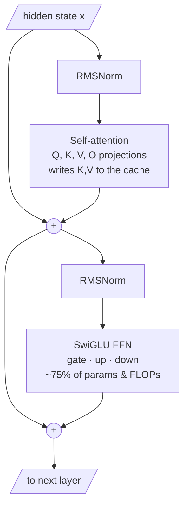

# Transformer 的 Infra 视角

!!! info "基线：**vLLM 0.26.0** · 模型 `Qwen2.5-7B-Instruct` · 单张 RTX 4090（24 GB）"
    本页所有 flag/API 均针对 vLLM 0.26.0 经 Context7 核实（ADR-0004）。下文的参数量与 FLOP 计数是从 Qwen2.5-7B 公开 `config.json` 推出的**精确算术**；任何吞吐/延迟含义都是**示例 / 量级参考**，不是跑分。

---

## 1 · 直觉 & 为什么重要

你已经知道 Transformer *算*什么。对推理 infra 而言，有用的问题不一样：**每个部件*花*多少钱？** 别把 decoder-only 层读成「注意力 + MLP」，而要读成一张有三列的**物料清单**：

- **权重字节** — 加载时**一次性**付清的 VRAM。固定，不随负载增长。
- **Prefill FLOPs** — 一个 token 穿过权重要付的算力。决定 prefill 有多 compute-bound。
- **KV 缓存字节** — **按 token、按并发序列**付的 VRAM。随负载增长。正是它决定并发（→ [KV 缓存](kv-cache.md)）。

一旦你能把每个结构选择——多少 KV 头、FFN 多宽、embedding 是否共享、dense 还是 MoE——映射到这三列，模型配置里的数字就不再是琐碎细节，而成了在你租 GPU *之前*就能预测 VRAM、TTFT 与吞吐上限的杠杆。

## 2 · 心智模型

先看一个 pre-norm decoder 层的**形状**——残差流，以及 KV 缓存在哪里被写入：



**怎么读这张图。** 两个残差加法（`+`）夹住两个子层：**注意力**——唯一**把 K、V 写入缓存**的地方——与 **SwiGLU FFN**，参数与 FLOPs 的大头住在这里。RMSNorm 位于每个子层*之前*（pre-norm）。现在给每个方框标上主导成本——把同一层读作一张**物料清单（bill of materials）**：

```text
                       WEIGHTS   PREFILL FLOPs   KV CACHE
  x ─► RMSNorm         tiny      tiny            —
       │
       ├─► Q proj      medium    medium          —          }
       ├─► K proj      small     small           writes K    } attention:
       ├─► V proj      small     small           writes V    }  KV grows here!
       │   (RoPE on Q,K: no weights, cheap)                  }
       ├─► attention score·softmax··V   —   O(S²) at prefill  reads all K,V
       └─► O proj      medium    medium          —          }
       │
  x ─► RMSNorm         tiny      tiny            —
       └─► FFN (SwiGLU: gate, up, down)  BIG    BIG          —   <-- most params & FLOPs
```

要分清的两个预算：

- **固定预算（权重）：** embedding + `L ×`（注意力 + FFN）+ `lm_head`。由 **FFN** 主导。
- **按 token 预算（KV）：** 只有 **K 和 V 投影**喂它，而且只按 **KV 头数**（`n_kv`）算，不是 query 头数。这就是 [GQA](../glossary.md) 存在的全部理由。

反直觉的头条：**注意力抢尽了眼球，但参数和 FLOPs 其实住在 FFN 里。** 注意力独特的成本不是 FLOPs——是它逼你存下的 KV 缓存。

## 3 · 原理与数学

设 $d$ = hidden size，$h$ = query 头数，$n_{\text{kv}}$ = KV 头数，$d_h$ = 头维度（故 $h\,d_h = d$），$d_{\text{ff}}$ = FFN 中间维度，$V$ = 词表大小，$L$ = 层数。

**注意力投影**（Q、K、V、O），每层——注意 K 和 V 随 $n_{\text{kv}}$ 缩小：

$$
P_{\text{attn}} = \underbrace{d\,(h\,d_h)}_{Q} + \underbrace{2\,d\,(n_{\text{kv}}\,d_h)}_{K,\,V} + \underbrace{(h\,d_h)\,d}_{O}
$$

**FFN**（Qwen 用 SwiGLU → 三个矩阵：gate、up、down），每层：

$$
P_{\text{ffn}} = 3\,d\,d_{\text{ff}}
$$

**Embedding + LM head：** 各 $V d$（不共享则 $2Vd$，共享则 $Vd$）。

**Prefill FLOPs** 遵循标准经验法则——一个含 $P$ 权重的矩阵乘，每 token 约 $2P$ FLOPs（每权重一乘一加）。所以每 token 前向 FLOPs $\approx 2 \times$（非 embedding 参数）。**embedding 是查表（gather），不是矩阵乘 → ~0 FLOPs**；**lm_head 是真矩阵乘 → 计入。** 此外还有一项随序列 $O(S^2)$ 增长的注意力分数项（$QK^\top$ 与 $\cdot V$ 矩阵乘）；短上下文可忽略，长上下文才增长——那是 [Roofline](../part2/roofline-analysis.md) 的话题（Part 2）。

**KV 缓存** 直接沿用 KV 缓存课的结论：$\kappa = 2\,L\,n_{\text{kv}}\,d_h\,b$ 字节/token。这里的旋钮是 $n_{\text{kv}}$：

- **MHA**（Multi-Head）：$n_{\text{kv}} = h$——每个 query 头一份 K/V。缓存最大。
- **MQA**（Multi-Query）：$n_{\text{kv}} = 1$——所有 query 头共享一份 K/V。缓存最小，质量风险最高。
- **GQA**（Grouped-Query）：$1 < n_{\text{kv}} < h$——query 头分组共享 K/V。实用的折中。

Qwen2.5-7B 取 $h=28$、$n_{\text{kv}}=4$ → KV 缓存比 MHA 小 $28/4 = 7\times$，而质量损失可忽略。**GQA 大幅改动 KV 列，却几乎不动 FLOP 列**——这正是它近乎通用的原因。

**RoPE** 通过旋转 Q 和 K 注入位置——**无权重、FLOPs 微不足道**，其外推特性正是长上下文得以成立的基础（→ Part 5B，票 #16）。

**MoE** 把单个 FFN 换成 $E$ 个专家，但每 token 只路由到其中 $k$ 个。参数暴涨（全部 $E$ 个专家都驻留 VRAM），而**每 token 激活 FLOPs 接近一个 dense 的 $k$-专家模型**。所以 MoE 用*权重 VRAM* 换*每 token 廉价算力*——成本地图上的另一个点（→ Part 6，票 #16/#17）。Qwen2.5-7B 是 **dense**，故下面的计数器是 dense 版。

## 4 · 完整可跑代码 + 逐行讲解

**可离线运行**——纯 CPU、无 GPU、无网络。它把 §3 每条公式变成针对*已核实* Qwen2.5-7B 配置的分部件表格。

```python title="param_flop_counter.py"
"""dense decoder-only LLM 的分部件参数与 prefill-FLOP 计数器。

纯 CPU，可离线运行。只数主导 VRAM 与 FLOPs 的权重矩阵；RMSNorm 参数与注意力
bias（对本模型约 0.1%）为清晰起见略去，故总数略低于头条的 7.62B。
"""
from dataclasses import dataclass


@dataclass
class Config:
    name: str
    num_layers: int    # L
    hidden: int        # d
    num_heads: int     # h（query 头）
    num_kv_heads: int  # n_kv（GQA 时 <= h）
    head_dim: int      # d_h
    ffn_hidden: int    # d_ff（intermediate_size）
    vocab: int         # V
    tie_embeddings: bool = False


def attn_params(c: Config) -> int:
    q = c.hidden * c.num_heads * c.head_dim
    kv = 2 * c.hidden * c.num_kv_heads * c.head_dim   # K 与 V 随 n_kv 缩小（GQA）
    o = c.num_heads * c.head_dim * c.hidden
    return q + kv + o


def ffn_params(c: Config) -> int:
    return 3 * c.hidden * c.ffn_hidden                # SwiGLU：gate、up、down


def report(c: Config) -> None:
    embed = c.vocab * c.hidden
    lm_head = 0 if c.tie_embeddings else c.vocab * c.hidden
    attn_all = attn_params(c) * c.num_layers
    ffn_all = ffn_params(c) * c.num_layers
    total = embed + attn_all + ffn_all + lm_head

    # 每 token prefill FLOPs ~= 2 *（token 以矩阵乘形式流经的参数）。
    # embedding 是 gather（非矩阵乘）-> ~0；lm_head 是矩阵乘 -> 计入。
    flop_bearing = attn_all + ffn_all + lm_head

    print(f"{c.name}")
    print(f"  {'component':<22}{'params':>16}{'share':>9}{'FLOP/token':>16}")
    rows = [
        ("embedding (lookup)", embed, "~0 (gather)"),
        ("all attention", attn_all, f"{2*attn_all/1e9:.2f} G"),
        ("all FFN", ffn_all, f"{2*ffn_all/1e9:.2f} G"),
        ("lm_head", lm_head, f"{2*lm_head/1e9:.2f} G"),
    ]
    for name, p, flop in rows:
        print(f"  {name:<22}{p:>16,}{p/total:>8.1%}{flop:>16}")
    print(f"  {'TOTAL':<22}{total:>16,}{1.0:>8.1%}{2*flop_bearing/1e9:>13.1f} G")


if __name__ == "__main__":
    # 对照 Qwen/Qwen2.5-7B-Instruct config.json 核实（ADR-0004）。
    qwen = Config("Qwen2.5-7B-Instruct", num_layers=28, hidden=3584, num_heads=28,
                  num_kv_heads=4, head_dim=128, ffn_hidden=18944, vocab=152064)
    report(qwen)
```

**逐行讲解：**

- `Config` — 来自 `config.json`、驱动一切成本的七个数字。`num_kv_heads`（4）刻意与 `num_heads`（28）分开：这个差就是 GQA 收益。
- `attn_params` — Q 和 O 是全宽（$d \times d$）；**K 和 V 随 `num_kv_heads` 缩放**，故 GQA 下只是 Q 的一小部分。四个投影之和。
- `ffn_params` — SwiGLU 的三个 $d \times d_{\text{ff}}$ 矩阵。因 $d_{\text{ff}} = 18944 \approx 5.3d$，它把注意力甩在身后。
- `report` — 分出**固定**预算（embedding、lm_head，以及 `L ×` 每个 block），打印参数、占总量比例、每 token prefill FLOPs（$2 \times$ 参数，不含 embedding 查表）。
- `__main__` — **已核实**的 dense Qwen2.5-7B 配置；无 MoE，故专家不参与。

预期输出（精确算术，非跑分）：

```text
Qwen2.5-7B-Instruct
  component                       params    share      FLOP/token
  embedding (lookup)         544,997,376    7.2%     ~0 (gather)
  all attention              822,083,584   10.8%          1.64 G
  all FFN                  5,703,204,864   74.9%         11.41 G
  lm_head                    544,997,376    7.2%          1.09 G
  TOTAL                    7,615,283,200  100.0%         14.1 G
```

表格让头条无可辩驳：**~75% 的参数与 ~81% 的每 token FLOPs 都在 FFN 里。** 注意力只占 ~11% 参数——它真正的成本住在 KV *缓存*里，不在这。

## 5 · Lab —— 用真实模型核对计数器

!!! gpu "GPU Lab"
    - **最低显存：** 读配置不需要（纯 CPU）；若同时加载权重则 24 GB。
    - **建议 AutoDL 卡型：** RTX 4090（24 GB）——或在**无卡**实例上读配置（免费）。
    - **预估耗时 / 花费：** ~5 分钟 · ~¥0（读配置纯 CPU）（示例）
    - **平台：** NVIDIA CUDA（默认）
    - **非 NVIDIA：** 读模型配置是纯 Python——与后端无关。

核对架构数字不需要 GPU——用 `transformers` 读配置即可（vLLM 消费的也是同一份配置）：

```python title="inspect_config.py"
from transformers import AutoConfig

cfg = AutoConfig.from_pretrained("Qwen/Qwen2.5-7B-Instruct")
print("layers      :", cfg.num_hidden_layers)      # 28
print("hidden      :", cfg.hidden_size)            # 3584
print("q heads     :", cfg.num_attention_heads)    # 28
print("kv heads    :", cfg.num_key_value_heads)    # 4   <-- GQA：28/4 = 小 7 倍的 KV
print("ffn hidden  :", cfg.intermediate_size)      # 18944
print("vocab       :", cfg.vocab_size)             # 152064
print("head_dim    :", cfg.hidden_size // cfg.num_attention_heads)   # 128
```

**观察什么：** 把这些代入 `param_flop_counter.py`——数字对上。再做个思想实验：把 `num_kv_heads = 28`（假设的 MHA），用 [KV 缓存](kv-cache.md) 课的 KV 公式重算——KV 缓存跳 7×，而这张参数/FLOP 表几乎不动。这个反差*就是* infra 视角。

## 6 · 常见坑 / 反直觉点

- **是 FFN、不是注意力，主导参数和 FLOPs。** 面试者张口就说「注意力很贵」。注意力贵的*产物*是 KV 缓存；它的 FLOPs 只占层内少数。
- **GQA 缩的是 KV 缓存，不是算力。** 它改的是 `n_kv`，这在 KV 公式里，却几乎不在 FLOP 总量里。别指望 GQA 大幅加速 prefill。
- **KV 大小按 `n_kv × head_dim` 缩放，不是 `num_heads`。** 在 KV 公式里用 query 头数，是本模型经典的「差 7 倍」错误。
- **MoE 总参数 ≠ 激活参数。** 一个「57B MoE」可能每 token 只激活 ~14B。VRAM 跟总量走（全部专家驻留）；算力跟激活走。两个不同的列。
- **共享 vs 不共享 embedding。** Qwen2.5-7B *不共享*——embedding 与 lm_head 是两个独立矩阵（各 ~0.55B）。共享能省 ~0.55B 参数；搞错会让 VRAM 估算偏。
- **「2 × 参数」是每 token prefill 估算。** 它不含 $O(S^2)$ 的注意力分数 FLOPs，那只在长上下文才重要（Part 2 Roofline 话题）。

## 7 · 面试连线

- [注意力变体：MHA / MQA / GQA](../interview/attention-variants.md) —— 本课为你准备的高频题：*注意力变体如何改动 KV 缓存与吞吐上限，质量上如何权衡？*
- 相关：[KV 缓存与吞吐上限](../interview/kv-cache.md) —— 上面 KV 列带来的显存预算后果。

## 8 · 小结 & 延伸阅读

**一句话：** 把 Transformer 层读成三列成本——固定权重 VRAM（大头在 FFN）、每 token prefill FLOPs（大头在 FFN）、每 token KV 缓存（只有 K/V、只算 `n_kv` 头）——于是每个架构选择都成了这张地图上可预测的一步。

延伸阅读：

- *Qwen2.5 技术报告* —— 上文所用的配置数字。
- *GQA: Training Generalized Multi-Query Transformer Models* —— 为什么更少 KV 头几乎不伤质量。
- *RoFormer*（RoPE）—— 旋转位置编码及其外推。
- [KV 缓存](kv-cache.md) 课 —— 深入那一列的每 token 成本。
- [FlashAttention](../part2/flash-attention.md) 课（Part 2）—— attention 那一列实际如何被 IO 高效地算出来。
- [长上下文推理](../part6/long-context-inference.md) 课（Part 6）—— RoPE 的外推与 KV 列在规模上如何相遇。

## 9 · 自测小问

??? question "在 Qwen2.5-7B 里，哪个单一部件占了大部分参数，大约多少比例？"
    **FFN**（SwiGLU 的 gate/up/down），约占全部参数的 ~75%（7.6B 里 ~5.7B）。注意力投影只占 ~11%。「注意力是大头」的直觉说的是 KV *缓存*，不是权重。

??? question "把模型从 GQA（n_kv=4）切到 MHA（n_kv=28），哪些成本列会动，动多少？"
    **KV 缓存**涨 7×（28/4）——K、V 投影与每 token KV 字节都随 `n_kv` 缩放。**FLOP/token** 总量几乎不动（K,V 投影只是层内一小片，而大头 FFN 完全没变）。所以 MHA 主要让你付出的是*并发*，不是算力。

??? question "为什么 MoE 模型抬高 VRAM 远多于抬高每 token 算力？"
    全部 $E$ 个专家的权重都必须驻留 VRAM（固定预算暴涨），但每 token 只路由到 $k \ll E$ 个专家，故它实际产生的 FLOPs 接近一个 dense 的 $k$-专家 FFN。总参数与激活参数是不同的列——MoE 以权重 VRAM 为代价，换来每 token 的廉价算力。
