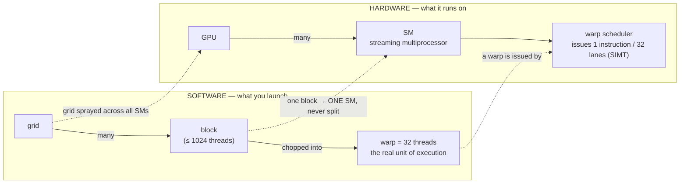

# The CUDA Execution Model: Threads, Warps, and Occupancy

!!! info "Baseline: **vLLM 0.26.0** · model `Qwen2.5-7B-Instruct` · single RTX 4090 (24 GB, Ada Lovelace, compute capability 8.9)"
    The `torch.cuda` device-query API (`get_device_properties`, `Event`) is verified against PyTorch via Context7 (ADR-0004). **Warp size = 32** and **max 1536 resident threads/SM (48 warps) on compute capability 8.9** are *architecture-documented* constants from the CUDA C Programming Guide, not measured — the lab reads only the verified `.multi_processor_count`, `.name`, `.major/.minor`, `.total_memory` from the device. All timing/occupancy figures are **illustrative / order-of-magnitude references**.

---

## 1 · Intuition & why it matters

You are not going to hand-write CUDA C++ (that's out of scope per ADR-0002 — read + tune + read the source, not a kernel-writing contest). So why learn the execution model at all? Two reasons, both practical: to **read** vLLM's and Triton's kernels without drowning, and to **reason about why a kernel is slow** — the "会调 / tune" half of the job. When a profiler says a decode kernel sits at 30% "achieved occupancy," you need a mental model of what that number *means* before you can move it.

Here is the one idea that makes everything else fall into place: **a GPU does not make a single thread fast — it makes thousands of slow threads finish together, and it hides memory latency by having far more work in flight than it can execute at once.** A CPU core races one thread through a deep pipeline with big caches and branch prediction. A GPU [SM](../part0/gpu-hardware.md) does the opposite — it holds *dozens* of thread groups resident and, whenever one stalls on a ~hundreds-of-cycles HBM read, instantly switches to another that's ready. Latency is never eliminated; it's *hidden* behind other work. This is why "launch a massive grid" is the whole game, and why a kernel that can't fill the machine leaves the GPU idle no matter how fast each thread is. → see the [Glossary](../glossary.md) for *SM / Warp / Occupancy*.

## 2 · Mental model

The launch hierarchy, and what maps to what in hardware (a *topology*, so one clean Mermaid graph, per ADR-0005):



Latency hiding is the *point* of that hierarchy — a numeric picture the graph deliberately leaves out:

```text
LATENCY HIDING (the point of it all)
  SM holds up to 48 warps resident (cc 8.9).  Warp A issues a load ─► stalls ~400 cyc
     │                                          scheduler instantly runs warp B, C, D…
     └─ occupancy = resident warps / 48  ──►  more resident warps ⇒ more slack to hide the stall
```

Three shapes to hold:

- **The warp — not the thread — is the unit of execution.** Threads come in groups of 32 that march in lockstep: the scheduler issues *one* instruction and all 32 lanes execute it (SIMT — Single Instruction, Multiple Threads). You reason about warps, not individual threads.
- **A block lives entirely on one SM.** It never splits across SMs, and its threads can cooperate through fast on-chip [shared memory](memory-access.md) and `__syncthreads()`. The grid is how you tile a big problem into blocks the scheduler sprays across all SMs.
- **Occupancy is slack for hiding latency, not a speed dial.** It's the ratio of resident warps to the SM's maximum. More resident warps means more independent work to switch to when one stalls — but past "enough to hide the latency," extra occupancy buys nothing, and a kernel can be memory-bound at 100% occupancy.

## 3 · Principle & math

### 3.1 The hierarchy and the thread index

A kernel launches a **grid** of **blocks**; each block has up to 1024 **threads**. Every thread computes its own global index from built-in coordinates — the canonical 1-D form is

$$
i = \text{blockIdx.x}\times\text{blockDim.x} + \text{threadIdx.x}
$$

so thread `threadIdx.x` in block `blockIdx.x` handles element $i$. The hardware then chops each block into **warps of 32 consecutive threads**: threads 0–31 are warp 0, 32–63 are warp 1, and so on. This chopping is fixed and is why 32 (and multiples of it) show up everywhere in launch configs.

### 3.2 SIMT and warp divergence

A warp scheduler issues **one instruction per cycle for the whole warp** — all 32 lanes do the same thing. That's free as long as the 32 lanes *agree* on the control flow. When they don't — a data-dependent `if` where some lanes go left and others right — the warp **serializes both paths**, executing the taken side with the other lanes masked off, then the other side:

$$
T_{\text{divergent branch}} \approx T_{\text{if-body}} + T_{\text{else-body}}
\quad\text{vs.}\quad
T_{\text{uniform branch}} \approx T_{\text{taken-body}}
$$

The cost is per *warp*, not per thread: if all 32 lanes in a warp take the same side, there is **no** divergence penalty even though other warps chose the other side. Divergence is only expensive *within* a warp. (Different warps are fully independent; they diverge for free.)

### 3.3 Latency hiding and occupancy

An HBM load costs ~hundreds of cycles. The SM hides that by keeping many warps resident and switching to a ready one whenever the current warp stalls — a zero-cost context switch, because every resident warp's registers stay live on the SM the whole time. Roughly, to fully hide a stall of latency $L$ you need enough independent warp-instructions in flight to cover it (a Little's-law argument): $\text{warps needed} \approx L \times \text{issue rate} / \text{instructions per warp between stalls}$.

**Occupancy** makes this concrete:

$$
\text{Occupancy} = \frac{\text{resident warps per SM}}{\text{max warps per SM}}
$$

On compute capability 8.9 the SM caps out at **1536 resident threads = 48 warps**. What stops you from reaching 48 is whichever per-SM resource runs out first:

- **Registers**: each SM has a fixed register file (65,536 32-bit registers on cc 8.9). If a kernel uses 64 registers/thread, then $65536/64 = 1024$ threads = 32 warps fit → occupancy $\le 32/48 \approx 67\%$.
- **Shared memory**: a fixed budget per SM split across resident blocks; a shared-memory-hungry block reduces how many blocks (hence warps) co-reside.
- **Block size / block-count limits**: threads/block and a hard cap on resident blocks per SM.

The punchline for tuning: **you don't maximize occupancy, you maximize *enough* occupancy** — the point where added warps stop improving latency hiding. Past that, cutting registers to raise occupancy can *hurt* (register spills to slow local memory).

## 4 · Complete runnable code + line-by-line

This models **warp divergence** — the SIMT cost of §3.2 — with no GPU and no CUDA. It groups a per-thread branch decision into warps of 32 and counts branch-bodies executed: a warp that's split pays for *both* sides. It then shows that the *same* set of decisions, rearranged so each warp is uniform, pays nothing extra. Pure CPU, offline-runnable.

```python title="warp_divergence.py"
"""How SIMT charges for a branch: cost is per-warp, and only divergent warps pay double.
Pure CPU, offline — no GPU, models the scheduling rule, not real timings."""

WARP = 32

def branch_bodies_executed(conditions):
    """conditions[i] = does thread i take the 'if' side?
    A warp executes: 1 body if uniform, 2 bodies (if THEN else, masked) if divergent."""
    bodies = 0
    for start in range(0, len(conditions), WARP):
        warp = conditions[start:start + WARP]        # the 32 lanes of one warp
        if all(warp) or not any(warp):               # all agree -> one side only
            bodies += 1
        else:                                        # lanes disagree -> serialize BOTH sides
            bodies += 2
    return bodies

if __name__ == "__main__":
    n = 32 * 8                                        # 256 threads = 8 warps
    # (a) data-dependent: even threads take the 'if' -> EVERY warp is split
    interleaved = [i % 2 == 0 for i in range(n)]
    # (b) same 50/50 workload, but grouped so each warp is uniform (aligned to 32)
    aligned = [(i // WARP) % 2 == 0 for i in range(n)]

    ideal = n // WARP                                 # 8 warps, if nothing diverged
    print(f"warps                         : {ideal}")
    print(f"(a) interleaved  branch-bodies: {branch_bodies_executed(interleaved)}  "
          f"(divergence tax {branch_bodies_executed(interleaved)/ideal:.2f}x)")
    print(f"(b) warp-aligned branch-bodies: {branch_bodies_executed(aligned)}  "
          f"(divergence tax {branch_bodies_executed(aligned)/ideal:.2f}x)")
```

**Line-by-line:**

- `branch_bodies_executed` — the scheduling rule made literal: iterate the threads in chunks of `WARP` (32). `all(warp) or not any(warp)` is the *uniform* case → one body. Otherwise the warp is divergent and the hardware runs the `if` body and the `else` body in sequence with lanes masked → two bodies.
- `interleaved` — the classic anti-pattern: a branch on `threadIdx % 2` (or any data that alternates lane-by-lane) makes *every* warp contain both true and false lanes, so every warp diverges.
- `aligned` — the **exact same 50/50 split of work**, but the decision changes only every 32 threads, so each warp is internally uniform. Same total work, zero divergence tax.
- The ratio is the divergence tax. It shows the cost is about *how the branch aligns to warps*, not how much work each side does.

Expected output (a scheduling model, not a benchmark):

```text
warps                         : 8
(a) interleaved  branch-bodies: 16  (divergence tax 2.00x)
(b) warp-aligned branch-bodies: 8  (divergence tax 1.00x)
```

Both layouts send half the threads down each path — identical arithmetic. The interleaved one costs **2×** purely because the branch splits every warp. That is the entire lesson of SIMT divergence: keep control flow uniform *within* a warp.

### Reading it in vLLM's source (v0.26.0)

The abstract launch hierarchy of §2 is a concrete launch config in every vLLM CUDA kernel. The simplest to read is the fused SiLU-and-multiply activation, [`csrc/libtorch_stable/activation_kernels.cu`](https://github.com/vllm-project/vllm/blob/v0.26.0/csrc/libtorch_stable/activation_kernels.cu):

- The host launcher `silu_and_mul` uses the macro `LAUNCH_ACTIVATION_GATE_KERNEL`, whose grid/block are exactly the §3.1 hierarchy: **`dim3 grid(num_tokens)`** — one block per token, sprayed across the SMs — and **`dim3 block(std::min(d, 1024))`** — threads per block, hard-capped at the 1024 the guide gives (the vectorized path uses `std::min(d / vec_size, 1024)`).
- Inside `__global__ void act_and_mul_kernel`, the block indexes its token with **`blockIdx.x`** (`input + blockIdx.x * 2 * d`) — the "one block lives on one SM" rule made literal — and each thread strides its slice with **`for (int i = threadIdx.x; i < d; i += blockDim.x)`**. Consecutive `threadIdx.x` touch consecutive elements, so the warp's 32 lanes are [coalesced](memory-access.md) — the launch config and the access pattern are the two levers this Part is about, in six lines.

You won't write this kernel (ADR-0002 — read + tune, don't hand-author), but you can now open it and read the grid/block dims as *the SM-mapping decision they encode*: how many blocks the scheduler sprays, and how many warps (`block/32`) each SM tries to keep resident.

## 5 · Lab — see the machine, and watch latency hiding kick in

!!! gpu "GPU Lab"
    - **Min VRAM:** 2 GB (device query allocates nothing; the bandwidth sweep allocates a few hundred MB)
    - **Suggested AutoDL card:** RTX 4090 (24 GB) — matches the baseline (Ada, cc 8.9)
    - **Est. time / cost:** ~3 min · ~¥0.3 of GPU time (illustrative)
    - **Platform:** NVIDIA CUDA (default)
    - **Non-NVIDIA:** device-property fields differ on ROCm; `warp_size` is 64 on AMD wavefronts (not 32). The latency-hiding *principle* holds; the constants don't.

Part A prints the real SM count of your card (verified API) and combines it with the architecture-documented constants to get the theoretical max resident warps. Part B demonstrates *why* you want to fill those warps: a memory-bound op reaches a fraction of peak bandwidth on tiny tensors (too little work to hide latency) and climbs as the grid grows big enough to keep the SMs busy.

```python title="occupancy_and_latency_hiding.py"
import torch
assert torch.cuda.is_available()

# --- Part A: what the hardware offers (only verified fields are read from the device) ---
p = torch.cuda.get_device_properties(0)
WARP = 32                                              # architecture constant (all NVIDIA GPUs)
MAX_THREADS_PER_SM = 1536 if (p.major, p.minor) == (8, 9) else None   # cc 8.9 (Ada) documented
print(f"device            : {p.name}  (cc {p.major}.{p.minor})")
print(f"SMs               : {p.multi_processor_count}")
print(f"total VRAM        : {p.total_memory / 1024**3:.1f} GiB")
if MAX_THREADS_PER_SM:
    warps_per_sm = MAX_THREADS_PER_SM // WARP          # 1536 / 32 = 48
    print(f"max warps / SM    : {warps_per_sm}  (documented for cc 8.9)")
    print(f"max resident warps: {warps_per_sm * p.multi_processor_count}  (whole GPU, illustrative)")

# --- Part B: latency hiding — effective bandwidth vs grid size ---
def gbps(nbytes, elems):                               # a memory-bound elementwise op
    x = torch.randn(elems, device="cuda", dtype=torch.float32)
    for _ in range(3):                                 # warmup (allocations, clocks)
        y = x * 2.0
    torch.cuda.synchronize()
    s, e = torch.cuda.Event(enable_timing=True), torch.cuda.Event(enable_timing=True)
    s.record()
    for _ in range(50):
        y = x * 2.0                                    # reads x, writes y -> 2 * nbytes moved
    e.record(); torch.cuda.synchronize()
    ms = s.elapsed_time(e) / 50
    return 2 * nbytes / (ms / 1e3) / 1e9

print("\neffective bandwidth vs problem size (bigger grid -> more warps -> better hiding):")
for elems in (2**12, 2**16, 2**20, 2**24, 2**26):      # 4K … 67M float32
    print(f"  {elems:>10,} elems: {gbps(elems*4, elems):6.0f} GB/s")
```

**What to observe:** at 4K elements the op moves only a few GB/s — there aren't enough warps to hide the launch and memory latency, so the SMs sit mostly idle. As the tensor grows, effective bandwidth climbs toward the card's HBM peak (~1 TB/s on a 4090, illustrative) and then plateaus — that plateau is the machine *full*, latency fully hidden. It's the same story every LLM decode step faces: batch 1 can't fill the GPU, which is exactly why [continuous batching](../part5/index.md) exists to pack many sequences into one fat launch.

## 6 · Common pitfalls / counter-intuitive points

- **"Max out threads-per-block for speed."** Bigger blocks don't imply higher occupancy — occupancy is capped by registers/thread and shared-mem/block. A 1024-thread block using many registers can achieve *lower* occupancy than a 256-thread block. Tune to *enough* occupancy, then stop.
- **Confusing occupancy with utilization (and both with speed).** High occupancy only means lots of warps are resident; a memory-bound kernel can show 100% occupancy while bottlenecked on HBM bandwidth (see the [roofline](../part2/roofline-analysis.md)). Occupancy is *necessary* slack for latency hiding, not *sufficient* for throughput.
- **Divergence from data, not from code.** A branch is only expensive when the 32 lanes of a warp *disagree*. `if (threadIdx.x < 32)` at a warp boundary is free; `if (data[i] > 0)` on lane-varying data serializes. Sorting/bucketing data so like-goes-with-like restores uniformity.
- **Thinking one thread should do a lot.** The GPU wants *many tiny* threads so the scheduler always has a ready warp. A few heavy threads starve the latency-hiding machine.
- **`__syncthreads()` is block-wide, not grid-wide.** It's a barrier for the threads *in one block*; there is no cheap global barrier across the grid within a kernel. Cross-block coordination means a new kernel launch (the overhead the [CUDA graphs](../part2/kernel-fusion-cuda-graphs.md) lesson attacks).
- **Warp size is not universal.** It's 32 on every NVIDIA GPU to date, but AMD wavefronts are 64. Don't bake 32 into portable reasoning about non-NVIDIA hardware.
- **The tail effect (wave quantization).** A grid runs in *waves* of blocks across the SMs; if the block count isn't a multiple of (SMs × blocks-per-SM), the **final wave leaves SMs idle** — a kernel at 100% occupancy can still waste a whole wave's worth of the machine. It bites hardest when there are *few* waves (a small grid, like the `dim3 grid(num_tokens)` decode launch of the read-along with a tiny batch); with thousands of blocks one partial wave is noise. It's occupancy's blind spot — distinct from resident-warp occupancy, and yet another reason batch 1 underfills the GPU.

## 7 · Interview links

- [CUDA execution model: warps, SIMT & occupancy](../interview/cuda-execution-model.md) — the high-frequency question this lesson prepares you for: *what is a warp, what does SIMT divergence cost and why, and does maxing occupancy always help?*

## 8 · Summary & further reading

**One line:** A GPU hides memory latency by keeping many 32-thread warps resident per SM and switching to a ready one whenever another stalls; you reason in warps (SIMT — divergence within a warp serializes), and occupancy is the resident-warp slack that enables hiding — you want *enough* of it, not the maximum.

Further reading:

- *CUDA C++ Programming Guide* — "Hardware Implementation" (SIMT) and the "Compute Capabilities" table (the 1536-threads/SM, 48-warps, register-file constants used here).
- *NVIDIA GPU Performance Background* — the latency-hiding / occupancy framing, first-party.
- The [GPU Hardware Mental Model](../part0/gpu-hardware.md) lesson — where SM / warp / HBM-vs-SRAM came from.
- The [Memory Access](memory-access.md) lesson — the other half of kernel performance: how those warps should *touch* memory.

## 9 · Self-check

??? question "What is a warp, and why is it — not the thread — the unit you reason about?"
    A warp is a group of **32 threads** that the SM schedules and executes together: the warp scheduler issues **one instruction per cycle for all 32 lanes** (SIMT). Because instructions, stalls, and divergence all happen at warp granularity, warps — not individual threads — are what you reason about. Launch configs are multiples of 32 for exactly this reason (a block of 40 threads still occupies two warps, wasting 24 lanes in the second).

??? question "A kernel has a `if (data[i] > 0) …  else …` where roughly half the elements are positive, scattered randomly. What's the SIMT cost, and how could you reduce it?"
    Because the positive/negative decision varies lane-by-lane, essentially **every warp is divergent** — it serializes both the `if` and the `else` body (with lanes masked), so the branch costs ~2× a uniform one. The cost is per-warp: it comes from lanes *within a warp* disagreeing, not from the total work. To reduce it, make warps internally uniform — e.g. **sort or bucket** the data so positives and negatives are contiguous (aligned to 32-thread boundaries), so most warps take a single side and pay no divergence tax.

??? question "Profiler shows 100% achieved occupancy but the kernel is still slow. What does occupancy *not* tell you, and where would you look next?"
    Occupancy only says the SM is holding its maximum number of resident warps — it's slack for **hiding latency**, not a measure of throughput. A kernel can be fully occupied yet **memory-bound**, spending all its time waiting on HBM bandwidth (intensity below the roofline ridge). Next look at the [roofline](../part2/roofline-analysis.md): measure achieved vs peak **bandwidth**, and check the memory-access pattern ([coalescing](memory-access.md)) — raising occupancy further won't help a kernel that's already bandwidth-saturated.
