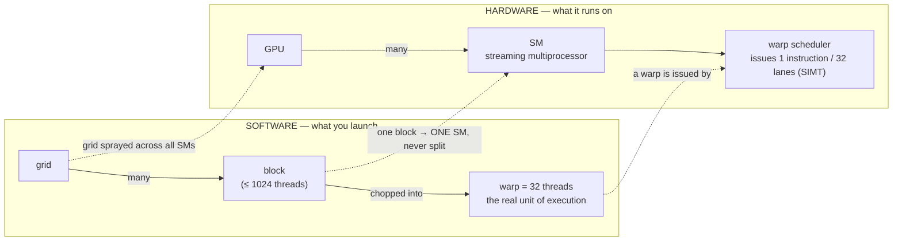

# CUDA 执行模型：线程、Warp 与 Occupancy

!!! info "基线：**vLLM 0.26.0** · 模型 `Qwen2.5-7B-Instruct` · 单张 RTX 4090（24 GB，Ada Lovelace，compute capability 8.9）"
    `torch.cuda` 设备查询 API（`get_device_properties`、`Event`）经 Context7 对照 PyTorch 核实（ADR-0004）。**warp 大小 = 32** 与 **compute capability 8.9 上每 SM 最多 1536 个驻留线程（48 个 warp）** 是 CUDA C Programming Guide 里*架构文档给定*的常量，非实测——Lab 只从设备读取已核实的 `.multi_processor_count`、`.name`、`.major/.minor`、`.total_memory`。所有时延/occupancy 数字均为**示例 / 量级参考**。

---

## 1 · 直觉 & 为什么重要

你不会去手写 CUDA C++（按 ADR-0002 明确不在范围内——读懂 + 会调 + 读源码，而非写 kernel 竞赛）。那为什么还要学执行模型？两个很实际的理由：为了**读懂** vLLM 与 Triton 的 kernel 而不淹死，以及为了**推理一个 kernel 为什么慢**——这是工作里「会调」的那一半。当 profiler 说某个 decode kernel 只有 30% 的 "achieved occupancy" 时，你得先有一个心智模型知道那个数字*意味着什么*，才谈得上去动它。

有一个想法能让其余一切各就各位：**GPU 不是把单个线程跑快，而是让成千上万个慢线程一起完成，并靠让在飞的工作远多于它一次能执行的量来隐藏访存时延。** 一个 CPU 核用很深的流水线、大缓存、分支预测把一个线程冲到底。一个 GPU 的 [SM](../part0/gpu-hardware.md) 反其道而行——它同时驻留*几十个*线程组，一旦某组在 ~几百周期的 HBM 读上 stall，就立刻切到另一个就绪的组。时延从不被消除；它被*隐藏*在别的工作背后。这就是为什么「发一个巨大的 grid」是全部要义，也是为什么一个填不满机器的 kernel 无论每个线程多快都让 GPU 闲着。→ 术语 *SM / Warp / Occupancy* 见[术语表](../glossary.md)。

## 2 · 心智模型

启动层级，以及各自映射到什么硬件（一张*拓扑*图，用一张 Mermaid，遵循 ADR-0005；图内标签保持英文）：



时延隐藏是这套层级的*要义*——一个数值画面，图里刻意略去：

```text
LATENCY HIDING (the point of it all)
  SM holds up to 48 warps resident (cc 8.9).  Warp A issues a load ─► stalls ~400 cyc
     │                                          scheduler instantly runs warp B, C, D…
     └─ occupancy = resident warps / 48  ──►  more resident warps ⇒ more slack to hide the stall
```

三个要抓住的形状：

- **warp——而非 thread——是执行单位。** 线程以 32 个为一组齐步走：scheduler 发射*一条*指令，全部 32 条 lane 执行它（SIMT——Single Instruction, Multiple Threads）。你按 warp 推理，而非按单个线程。
- **一个 block 完全驻留在一个 SM 上。** 它绝不跨 SM 拆分，它的线程能通过快速的片上 [shared memory](memory-access.md) 与 `__syncthreads()` 协作。grid 则是把一个大问题切成许多 block、让 scheduler 撒到所有 SM 上的方式。
- **occupancy 是隐藏时延的余量，不是速度旋钮。** 它是驻留 warp 数与 SM 上限的比值：驻留 warp 越多，某个 stall 时能切去做的独立工作越多——但一旦「够隐藏时延」，多出来的 occupancy 便毫无收益，而且一个 kernel 可以在 100% occupancy 下仍是 memory-bound。

## 3 · 原理与数学

### 3.1 层级与线程索引

一个 kernel 启动一个 **grid** 的 **block**；每个 block 最多 1024 个 **thread**。每个线程从内建坐标算出自己的全局索引——一维的经典形式是

$$
i = \text{blockIdx.x}\times\text{blockDim.x} + \text{threadIdx.x}
$$

于是 block `blockIdx.x` 里的线程 `threadIdx.x` 处理元素 $i$。硬件随后把每个 block 切成**每 32 个连续线程一个 warp**：线程 0–31 是 warp 0，32–63 是 warp 1，以此类推。这个切分是固定的，也是为什么 32（及其倍数）在启动配置里无处不在。

### 3.2 SIMT 与 warp divergence

一个 warp scheduler **每周期为整个 warp 发射一条指令**——全部 32 条 lane 做同一件事。只要 32 条 lane 在控制流上*一致*，这就是免费的。当它们不一致时——一个数据相关的 `if`，一些 lane 走左、另一些走右——warp 会**串行执行两条路径**（跑其中一侧时把另一侧的 lane 屏蔽掉），再跑另一侧：

$$
T_{\text{divergent branch}} \approx T_{\text{if-body}} + T_{\text{else-body}}
\quad\text{对比}\quad
T_{\text{uniform branch}} \approx T_{\text{taken-body}}
$$

代价是按*warp*算的，不是按线程：若一个 warp 的全部 32 条 lane 走同一侧，就**没有** divergence 惩罚，哪怕别的 warp 选了另一侧。divergence 只在 warp *内部*才昂贵。（不同 warp 完全独立；它们之间 divergence 是免费的。）

### 3.3 时延隐藏与 occupancy

一次 HBM load 要 ~几百周期。SM 靠驻留许多 warp、并在当前 warp stall 时切到就绪 warp 来隐藏它——这是零代价的上下文切换，因为每个驻留 warp 的寄存器全程留在 SM 上。粗略地说，要完全隐藏一个时延 $L$ 的 stall，你需要足够多在飞的 warp 指令去覆盖它（一个 Little's-law 式的论证）：$\text{所需 warp} \approx L \times \text{发射率} / \text{每 warp 两次 stall 间的指令数}$。

**occupancy** 把这点具体化：

$$
\text{Occupancy} = \frac{\text{每 SM 驻留 warp 数}}{\text{每 SM 最大 warp 数}}
$$

在 compute capability 8.9 上，SM 上限是 **1536 个驻留线程 = 48 个 warp**。挡住你摸到 48 的，是最先耗尽的那项每-SM 资源：

- **寄存器**：每个 SM 有固定的寄存器堆（cc 8.9 上 65,536 个 32-bit 寄存器）。若 kernel 用 64 寄存器/线程，则 $65536/64 = 1024$ 线程 = 32 warp 能放下 → occupancy $\le 32/48 \approx 67\%$。
- **shared memory**：每 SM 一份固定预算，被驻留的各 block 瓜分；一个吃 shared memory 的 block 会减少能共驻的 block（因而 warp）数。
- **block 大小 / block 数上限**：线程/block，以及每 SM 驻留 block 的硬上限。

调优的要点在于：**你不是最大化 occupancy，而是最大化*足够*的 occupancy**——即多加 warp 不再改善时延隐藏的那个点。过了那点，为拉高 occupancy 而砍寄存器反而可能*有害*（寄存器溢出到慢的 local memory）。

## 4 · 完整可跑代码 + 逐行讲解

这段建模 **warp divergence**——§3.2 的 SIMT 代价——无 GPU、无 CUDA。它把逐线程的分支决定按 32 个一组分进 warp，统计执行了多少个分支体：一个被劈开的 warp 要为*两*侧都付费。它接着展示：*同一组*决定，重排成每个 warp 内部一致后，就不再多付。纯 CPU、可离线运行。

```python title="warp_divergence.py"
"""SIMT 如何为一个分支收费：代价按 warp 算，且只有 divergent 的 warp 付双倍。
纯 CPU、离线——建模的是调度规则，不是真实时延。"""

WARP = 32

def branch_bodies_executed(conditions):
    """conditions[i] = 线程 i 是否走 'if' 侧？
    一个 warp 执行：一致时 1 个体，divergent 时 2 个体（if 再 else，带屏蔽）。"""
    bodies = 0
    for start in range(0, len(conditions), WARP):
        warp = conditions[start:start + WARP]        # 一个 warp 的 32 条 lane
        if all(warp) or not any(warp):               # 全体一致 -> 只走一侧
            bodies += 1
        else:                                        # lane 有分歧 -> 串行执行两侧
            bodies += 2
    return bodies

if __name__ == "__main__":
    n = 32 * 8                                        # 256 线程 = 8 个 warp
    # (a) 数据相关：偶数线程走 'if' -> 每个 warp 都被劈开
    interleaved = [i % 2 == 0 for i in range(n)]
    # (b) 同样的 50/50 工作量，但分组成每个 warp 内部一致（对齐到 32）
    aligned = [(i // WARP) % 2 == 0 for i in range(n)]

    ideal = n // WARP                                 # 8 个 warp，如果没有 divergence
    print(f"warps                         : {ideal}")
    print(f"(a) interleaved  branch-bodies: {branch_bodies_executed(interleaved)}  "
          f"(divergence tax {branch_bodies_executed(interleaved)/ideal:.2f}x)")
    print(f"(b) warp-aligned branch-bodies: {branch_bodies_executed(aligned)}  "
          f"(divergence tax {branch_bodies_executed(aligned)/ideal:.2f}x)")
```

**逐行讲解：**

- `branch_bodies_executed` —— 把调度规则写成字面：以 `WARP`（32）为块遍历线程。`all(warp) or not any(warp)` 是*一致*情形 → 一个体。否则 warp 是 divergent 的，硬件会带屏蔽地顺序跑 `if` 体和 `else` 体 → 两个体。
- `interleaved` —— 经典反模式：在 `threadIdx % 2`（或任何逐 lane 交替的数据）上分支，会让*每个* warp 同时含 true 和 false 的 lane，于是每个 warp 都 divergent。
- `aligned` —— **完全相同的 50/50 工作切分**，但决定每 32 个线程才变一次，于是每个 warp 内部一致。相同总工作，零 divergence tax。
- 比值就是 divergence tax。它表明代价关乎*分支如何对齐到 warp*，而非每侧做多少工作。

预期输出（一个调度模型，不是 benchmark）：

```text
warps                         : 8
(a) interleaved  branch-bodies: 16  (divergence tax 2.00x)
(b) warp-aligned branch-bodies: 8  (divergence tax 1.00x)
```

两种布局都让一半线程走每条路径——算术完全相同。interleaved 那个纯粹因为分支劈开了每个 warp 而付 **2×**。这就是 SIMT divergence 的全部教训：让 warp *内部*的控制流保持一致。

### 在 vLLM 源码里读它（v0.26.0）

§2 那个抽象的启动层级，在每个 vLLM CUDA kernel 里都是一段具体的启动配置。最好读的是融合的 SiLU-and-multiply 激活，[`csrc/libtorch_stable/activation_kernels.cu`](https://github.com/vllm-project/vllm/blob/v0.26.0/csrc/libtorch_stable/activation_kernels.cu)：

- 宿主启动器 `silu_and_mul` 用宏 `LAUNCH_ACTIVATION_GATE_KERNEL`，它的 grid/block 恰是 §3.1 的层级：**`dim3 grid(num_tokens)`**——每 token 一个 block、撒到各 SM 上——与 **`dim3 block(std::min(d, 1024))`**——每 block 的线程数，硬顶在指南给的 1024 上（向量化路径用 `std::min(d / vec_size, 1024)`）。
- 在 `__global__ void act_and_mul_kernel` 内，block 用 **`blockIdx.x`** 索引自己那个 token（`input + blockIdx.x * 2 * d`）——「一个 block 驻留在一个 SM 上」的字面化——而每个线程用 **`for (int i = threadIdx.x; i < d; i += blockDim.x)`** 跨步处理自己那片。连续的 `threadIdx.x` 触碰连续元素，于是 warp 的 32 条 lane 被 [coalesce](memory-access.md)——启动配置与访存模式，正是本 Part 的两根杠杆，六行代码里都在。

你不会写这个 kernel（ADR-0002——读 + 调，不手写），但你现在能打开它、把 grid/block 维度读成*它们编码的 SM-映射决定*：scheduler 撒出多少 block，每个 SM 试图驻留多少 warp（`block/32`）。

## 5 · Lab —— 看见机器，并看着时延隐藏起效

!!! gpu "GPU Lab"
    - **最低显存：** 2 GB（设备查询不分配任何东西；带宽扫描分配几百 MB）
    - **建议 AutoDL 卡型：** RTX 4090（24 GB）——对齐基线（Ada，cc 8.9）
    - **预估耗时 / 花费：** ~3 分钟 · ~¥0.3 GPU 时长（示例）
    - **平台：** NVIDIA CUDA（默认）
    - **非 NVIDIA：** ROCm 上设备属性字段不同；AMD wavefront 的 `warp_size` 是 64（不是 32）。时延隐藏的*原理*成立，常量不成立。

Part A 打印你卡的真实 SM 数（已核实的 API），再与架构文档给定的常量组合出理论最大驻留 warp 数。Part B 展示*为什么*你想填满这些 warp：一个 memory-bound 的算子在小张量上只达到峰值带宽的一小部分（工作太少，隐藏不了时延），随着 grid 大到足以让 SM 忙起来而攀升。

```python title="occupancy_and_latency_hiding.py"
import torch
assert torch.cuda.is_available()

# --- Part A：硬件能提供什么（只从设备读已核实的字段）---
p = torch.cuda.get_device_properties(0)
WARP = 32                                              # 架构常量（所有 NVIDIA GPU）
MAX_THREADS_PER_SM = 1536 if (p.major, p.minor) == (8, 9) else None   # cc 8.9（Ada）文档给定
print(f"device            : {p.name}  (cc {p.major}.{p.minor})")
print(f"SMs               : {p.multi_processor_count}")
print(f"total VRAM        : {p.total_memory / 1024**3:.1f} GiB")
if MAX_THREADS_PER_SM:
    warps_per_sm = MAX_THREADS_PER_SM // WARP          # 1536 / 32 = 48
    print(f"max warps / SM    : {warps_per_sm}  (documented for cc 8.9)")
    print(f"max resident warps: {warps_per_sm * p.multi_processor_count}  (whole GPU, illustrative)")

# --- Part B：时延隐藏 —— 有效带宽随 grid 大小变化 ---
def gbps(nbytes, elems):                               # 一个 memory-bound 的逐元素算子
    x = torch.randn(elems, device="cuda", dtype=torch.float32)
    for _ in range(3):                                 # 预热（分配、时钟）
        y = x * 2.0
    torch.cuda.synchronize()
    s, e = torch.cuda.Event(enable_timing=True), torch.cuda.Event(enable_timing=True)
    s.record()
    for _ in range(50):
        y = x * 2.0                                    # 读 x、写 y -> 搬 2 * nbytes
    e.record(); torch.cuda.synchronize()
    ms = s.elapsed_time(e) / 50
    return 2 * nbytes / (ms / 1e3) / 1e9

print("\neffective bandwidth vs problem size (bigger grid -> more warps -> better hiding):")
for elems in (2**12, 2**16, 2**20, 2**24, 2**26):      # 4K … 67M float32
    print(f"  {elems:>10,} elems: {gbps(elems*4, elems):6.0f} GB/s")
```

**要观察什么：** 在 4K 元素时算子只搬几个 GB/s——没有足够的 warp 去隐藏启动与访存时延，SM 大多闲着。随着张量变大，有效带宽向卡的 HBM 峰值（4090 上 ~1 TB/s，示例）攀升，然后趋于平台——那个平台就是机器*被填满*、时延被完全隐藏。这正是每个 LLM decode step 面对的故事：batch 1 填不满 GPU，而这恰恰是 [continuous batching](../part5/index.md) 存在的理由——把许多序列打包进一次胖启动。

## 6 · 常见坑 / 反直觉点

- **「把每-block 线程数拉满以求快」。** 更大的 block 不意味着更高 occupancy——occupancy 受寄存器/线程与 shared-mem/block 上限约束。一个用很多寄存器的 1024 线程 block，occupancy 可能*低于*一个 256 线程 block。调到*足够*的 occupancy 便停手。
- **把 occupancy 与 utilization 混淆（并把二者当成速度）。** 高 occupancy 只表示很多 warp 驻留；一个 memory-bound kernel 可以在 100% occupancy 下仍卡在 HBM 带宽上（见 [roofline](../part2/roofline-analysis.md)）。occupancy 是隐藏时延所*必要*的余量，不是吞吐的*充分*条件。
- **divergence 来自数据，而非代码。** 一个分支只在 warp 的 32 条 lane *分歧*时才昂贵。在 warp 边界上的 `if (threadIdx.x < 32)` 是免费的；在逐 lane 变化数据上的 `if (data[i] > 0)` 会串行化。把数据排序/分桶让同类聚在一起就恢复了一致性。
- **以为一个线程该做很多事。** GPU 想要*许多微小*的线程，好让 scheduler 总有就绪 warp。少数重线程会饿死时延隐藏机器。
- **`__syncthreads()` 是 block 内的，不是 grid 内的。** 它是*一个 block* 内线程的 barrier；一个 kernel 内没有便宜的跨 grid 全局 barrier。跨 block 协调意味着一次新的 kernel 启动（正是 [CUDA graphs](../part2/kernel-fusion-cuda-graphs.md) 那节课攻击的开销）。
- **warp 大小并非通用。** 它在迄今每块 NVIDIA GPU 上都是 32，但 AMD wavefront 是 64。别把 32 焊进对非 NVIDIA 硬件的可移植推理里。
- **尾效应（wave quantization）。** 一个 grid 以 block 的*波（wave）*铺过各 SM；若 block 数不是 (SMs × 每-SM block 数) 的整数倍，**最后一波会让部分 SM 闲着**——一个 100% occupancy 的 kernel 仍可能浪费掉一整波的机器。它在波数*少*时咬得最狠（小 grid，如 read-along 里 batch 很小的 `dim3 grid(num_tokens)` decode 启动）；有上千个 block 时一次半空的波只是噪声。这是 occupancy 的盲区——与驻留-warp 的 occupancy 不同，也是 batch 1 填不满 GPU 的又一原因。

## 7 · 面试连线

- [CUDA 执行模型：warp、SIMT 与 occupancy](../interview/cuda-execution-model.md) —— 这节课为你准备的高频题：*什么是 warp，SIMT divergence 的代价是什么、为什么，以及拉满 occupancy 是否总有帮助？*

## 8 · 小结 & 延伸阅读

**一句话：** GPU 靠每 SM 驻留许多 32 线程的 warp、并在某个 warp stall 时切到就绪 warp 来隐藏访存时延；你按 warp 推理（SIMT——warp 内部 divergence 会串行化），occupancy 则是使隐藏成为可能的驻留-warp 余量——你要*足够*，不是最大。

延伸阅读：

- *CUDA C++ Programming Guide* —— "Hardware Implementation"（SIMT）与 "Compute Capabilities" 表（本文用到的 1536 线程/SM、48 warp、寄存器堆等常量）。
- *NVIDIA GPU Performance Background* —— 时延隐藏 / occupancy 的框架，第一手。
- [GPU 硬件心智模型](../part0/gpu-hardware.md) 课 —— SM / warp / HBM-vs-SRAM 的来处。
- [访存](memory-access.md) 课 —— kernel 性能的另一半：这些 warp 应该*怎样*触碰内存。

## 9 · 自测小问

??? question "什么是 warp，为什么是它——而非线程——才是你推理的单位？"
    warp 是 SM 一起调度、一起执行的 **32 个线程**的组：warp scheduler **每周期为全部 32 条 lane 发射一条指令**（SIMT）。因为指令、stall、divergence 都发生在 warp 粒度上，所以推理的对象是 warp——而非单个线程。启动配置取 32 的倍数正因如此（一个 40 线程的 block 仍占用两个 warp，第二个里浪费 24 条 lane）。

??? question "一个 kernel 里有 `if (data[i] > 0) …  else …`，约一半元素为正、随机散布。SIMT 代价是什么，你会怎么降低它？"
    因为正/负的决定逐 lane 变化，基本上**每个 warp 都 divergent**——它会串行执行 `if` 体和 `else` 体（带屏蔽），所以这个分支约花一致情形的 ~2×。代价按 warp 算：它来自*一个 warp 内*的 lane 分歧，而非总工作量。要降低它，就让 warp 内部一致——例如把数据**排序或分桶**，使正负连续（对齐到 32 线程边界），于是多数 warp 只走一侧、不付 divergence tax。

??? question "profiler 显示 100% achieved occupancy，但 kernel 仍慢。occupancy *没*告诉你什么，你接下来看哪里？"
    occupancy 只说 SM 正驻留其最大数量的 warp——它是**隐藏时延**的余量，不是吞吐的度量。一个 kernel 可以被完全占满却仍 **memory-bound**，把时间全花在等 HBM 带宽上（强度落在 roofline 拐点之下）。接下来看 [roofline](../part2/roofline-analysis.md)：测 achieved 对 peak **带宽**，并检查访存模式（[coalescing](memory-access.md)）——对一个已经带宽饱和的 kernel，再拉高 occupancy 也没用。
