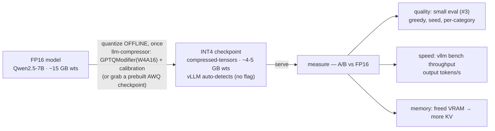

# Hands-On: Quantize Qwen2.5-7B to INT4, Serve in vLLM, Compare Quality & Throughput

!!! info "Baseline: **vLLM 0.26.0** · model `Qwen2.5-7B-Instruct` · single RTX 4090 (24 GB)"
    The tooling — **llm-compressor** (`oneshot` + `GPTQModifier(scheme="W4A16")`), vLLM auto-detection of the compressed checkpoint, `LLM.chat`, `kv_cache_dtype="fp8"`, and `vllm bench throughput` — is verified against vLLM 0.26.0 via Context7 (ADR-0004). **The author does not run any of this** (ADR-0004): every VRAM / tokens-per-second / accuracy number below is an **illustrative / order-of-magnitude reference**. The numbers you get on your own 4090 are the real ones — the point of the lab is that *you* measure them.

---

## 1 · Intuition & why it matters

Everything in Part 4 converges here: take `Qwen2.5-7B-Instruct`, make it INT4, serve it, and **prove two things** — it got smaller/faster, *and* it didn't get dumber. That second half is the part beginners skip and interviewers probe. Quantization fails **quietly**: the model still emits fluent text, so "it looks fine" is worthless. The professional move is an A/B: run a fixed eval on the FP16 baseline and the INT4 model with identical greedy settings, and compare a *number*. If quality holds, you've bought ~4× less weight memory and a faster decode for free; if it drops, you back off (higher bits, better method, per-group, different calibration).

The one workflow to internalize: **quantize once (offline), serve many, always A/B against FP16.** Quantization is a one-time offline cost; the checkpoint is reused for every request forever after. And because [decode is memory-bound](../part2/roofline-analysis.md), the INT4 weight read is where the speedup comes from — which also means the win shows up in *decode throughput*, not prefill FLOPs. → see the [Glossary](../glossary.md); this lesson operationalizes the [methods](quantization-methods.md) and [basics](quantization-basics.md) lessons.

## 2 · Mental model

The end-to-end path, and where each Part-4 idea plugs in (a *flow*, so Mermaid, per ADR-0005):



Two shapes to hold:

- **Two ways to get the INT4 checkpoint.** Fastest and cheapest: download a **prebuilt** community checkpoint (`Qwen/Qwen2.5-7B-Instruct-AWQ`) — zero quantization compute, do it in AutoDL 无卡 mode. Or **quantize yourself** with llm-compressor when you need a specific scheme/calibration. Either way, vLLM auto-detects the format from the checkpoint config — no `--quantization` flag required.
- **A quantization result is a table, not a feeling.** The deliverable is a before→after comparison: VRAM, decode throughput (output tokens/s), and eval accuracy per category. That table is what tells you whether INT4 was worth it — and it's exactly the "optimization before→after report" the Capstone asks for.

## 3 · Principle — the four steps

### 3.1 Get an INT4 checkpoint

**Path A (cheap, recommended to start):** use a prebuilt checkpoint. `Qwen/Qwen2.5-7B-Instruct-AWQ` is an official AWQ INT4 build; vLLM loads it directly. No GPU needed to *download* it — do it in 无卡 mode.

**Path B (self-quantize):** run llm-compressor's `oneshot` with a `W4A16` `GPTQModifier` on a small **calibration** set. This is the [methods lesson's](quantization-methods.md) GPTQ recipe made real: quantize weights to 4-bit per-group, correcting error layer-by-layer, and `ignore=["lm_head"]`. Save with `save_compressed=True` to get a compressed-tensors checkpoint vLLM understands.

### 3.2 Serve it in vLLM

Point vLLM at the checkpoint. It reads the quantization method from the config and picks the right INT4 kernel (Marlin on Ampere+); you don't pass a flag. Use `LLM.chat(...)` (not `generate`) so the Instruct chat template is applied — a `generate` call feeds a malformed prompt and tanks quality for the wrong reason.

### 3.3 Measure quality — the small eval set (#3)

Quantization's failure mode is silent quality loss, so you **measure**. Reuse the [small eval set](../eval/small.md): 20 items with deterministic programmatic checks. Run it on FP16 and INT4 with `temperature=0.0` + fixed `seed` (so a re-run can't differ by chance), and diff the per-category accuracy. A drop concentrated in one category (e.g. `math` or `format`) is your signal to back off.

### 3.4 Measure throughput & memory

Use `vllm bench throughput` (from `pip install vllm[bench]`) on each checkpoint and compare **output tokens/s** — the decode-throughput number quantization is meant to move. Also note the freed VRAM: INT4 weights (~4–5 GB vs ~15 GB) leave far more room for [KV cache](../part0/kv-cache.md), so you can raise concurrency — and optionally stack **FP8 KV cache** (`kv_cache_dtype="fp8"`) for even more.

## 4 · Complete runnable code + line-by-line

Three pieces: quantize (or skip to prebuilt), A/B the quality, benchmark the throughput. **Runnable by you on a 4090; not executed by the author** — numbers in comments are illustrative.

**Step 1 — quantize to INT4 with llm-compressor** (Path B; skip if using the prebuilt AWQ checkpoint):

```python title="quantize_int4.py"
"""Quantize Qwen2.5-7B-Instruct to INT4 (W4A16) with llm-compressor. Run once, offline.
API shape verified vs the vLLM 0.26.0 quantization docs; author does not execute (ADR-0004)."""
from datasets import load_dataset
from transformers import AutoModelForCausalLM, AutoTokenizer
from llmcompressor import oneshot
from llmcompressor.modifiers.quantization import GPTQModifier

MODEL_ID = "Qwen/Qwen2.5-7B-Instruct"
SAVE_DIR = "Qwen2.5-7B-Instruct-W4A16-G128"
NUM_CALIBRATION_SAMPLES, MAX_SEQ_LEN = 512, 2048

model = AutoModelForCausalLM.from_pretrained(MODEL_ID, torch_dtype="auto")
tokenizer = AutoTokenizer.from_pretrained(MODEL_ID)

# Calibration set: a few hundred REPRESENTATIVE prompts, chat-templated then tokenized.
# Off-distribution calibration picks the wrong ranges — use realistic text.
ds = load_dataset("HuggingFaceH4/ultrachat_200k", split="train_sft")
ds = ds.shuffle(seed=42).select(range(NUM_CALIBRATION_SAMPLES))
ds = ds.map(lambda ex: {"text": tokenizer.apply_chat_template(ex["messages"], tokenize=False)})
ds = ds.map(lambda s: tokenizer(s["text"], max_length=MAX_SEQ_LEN, truncation=True,
                                add_special_tokens=False), remove_columns=ds.column_names)

recipe = GPTQModifier(targets="Linear", scheme="W4A16", ignore=["lm_head"])   # 4-bit weights, per-group
oneshot(model=model, dataset=ds, recipe=recipe,
        max_seq_length=MAX_SEQ_LEN, num_calibration_samples=NUM_CALIBRATION_SAMPLES)

model.save_pretrained(SAVE_DIR, save_compressed=True)   # compressed-tensors checkpoint
tokenizer.save_pretrained(SAVE_DIR)
print(f"INT4 checkpoint saved to {SAVE_DIR}")           # ~4–5 GB on disk vs ~15 GB FP16 (illustrative)
```

**Line-by-line (step 1):** load the FP16 model + tokenizer normally. The **calibration set** is 512 chat-templated samples from `ultrachat_200k` (use text resembling your deployment traffic — its distribution matters, §6), tokenized via the two `ds.map` passes. `GPTQModifier(scheme="W4A16", ignore=["lm_head"])` is the [methods lesson's](quantization-methods.md) GPTQ placed on the axes: 4-bit weights, FP16 activations, per-group, and never quantize the output projection. `oneshot(...)` runs the layer-wise quantization + error correction; `save_pretrained(save_compressed=True)` writes a checkpoint vLLM auto-detects. To skip all of this, set `MODEL = "Qwen/Qwen2.5-7B-Instruct-AWQ"` in step 2.

**Step 2 — A/B the quality on the small eval set** (reuses `score.py` from the [small eval set](../eval/small.md)):

```python title="ab_quality.py"
"""Run the small eval set on FP16 vs INT4 with identical greedy settings; diff accuracy.
Reuses load_items/summarize from the small-eval-set lesson. Numbers are illustrative."""
import json
from vllm import LLM, SamplingParams
from score import load_items, summarize          # from the small eval set (#3)

CHECKPOINTS = {
    "fp16": "Qwen/Qwen2.5-7B-Instruct",
    "int4": "Qwen2.5-7B-Instruct-W4A16-G128",    # or "Qwen/Qwen2.5-7B-Instruct-AWQ"
}
items = load_items("small_eval.jsonl")
convos = [[{"role": "user", "content": it["prompt"]}] for it in items]
sp = SamplingParams(temperature=0.0, max_tokens=128, seed=0)   # greedy + seed => comparable

for tag, model in CHECKPOINTS.items():
    llm = LLM(model=model, max_model_len=4096)   # vLLM auto-detects INT4 from the config
    outs = [o.outputs[0].text for o in llm.chat(convos, sp)]   # chat() applies the template
    report = summarize(items, outs)
    print(tag, json.dumps(report["by_category"], ensure_ascii=False), "acc=", round(report["accuracy"], 3))
    del llm                                       # free VRAM before loading the next model
# illustrative:
#   fp16 {...} acc= 0.95
#   int4 {...} acc= 0.90   <- small, tolerable drop; a big category collapse means back off
```

**Line-by-line (step 2):** same 20 items, same **greedy** sampling (`temperature=0.0`, fixed `seed`) for both models — the only variable is the weights. `LLM.chat` applies the Instruct template; `summarize` gives overall + per-category accuracy. Load one model, eval, `del` it to free VRAM, then the next (two 7B models won't co-reside on 24 GB). Compare the two reports: a small overall drop is expected and fine; a *category* collapse (say `format` 1.0 → 0.3) is the signal to raise bits or change method.

**Step 3 — benchmark throughput & memory** (shell; `pip install vllm[bench]`):

```bash title="bench.sh"
# Compare decode throughput: output tokens/s, FP16 vs INT4. (verified: `vllm bench throughput`)
vllm bench throughput --model Qwen/Qwen2.5-7B-Instruct            --num-prompts 200 --input-len 256 --output-len 256
vllm bench throughput --model Qwen2.5-7B-Instruct-W4A16-G128      --num-prompts 200 --input-len 256 --output-len 256
# Output line looks like:
#   Throughput: 7.15 requests/s, 4656.00 total tokens/s, 1072.15 output tokens/s
# Compare the "output tokens/s" across the two runs (INT4 higher, illustrative ~1.5–3x on decode-heavy shapes).
#
# Optional: stack FP8 KV cache to fit more concurrent sequences (frees KV memory):
#   vllm serve Qwen2.5-7B-Instruct-W4A16-G128 --kv-cache-dtype fp8
```

**Line-by-line (step 3):** `vllm bench throughput` drives a batch of requests and reports requests/s and tokens/s. Run it on the FP16 and INT4 checkpoints with the *same* shape (`--input-len`/`--output-len`/`--num-prompts`) and compare **output tokens/s** — the decode number. Use a decode-heavy shape (long `--output-len`) to see the weight-read win; a prefill-heavy shape shows less, because INT4 weight-only doesn't cut prefill FLOPs. The optional `--kv-cache-dtype fp8` is the orthogonal KV lever from the [methods lesson](quantization-methods.md).

Putting it together, the deliverable is a before→after table (illustrative — **yours will differ**):

```text
                     FP16 baseline      INT4 (W4A16)      note
  weight memory      ~15 GB             ~4–5 GB           ~3–4x smaller
  output tokens/s    1.0x (ref)         ~1.5–3x           decode-heavy shape; memory-bound win
  small-eval acc     ~0.95              ~0.90             A/B with greedy+seed; watch per-category
  max concurrency    baseline           higher            freed VRAM → more KV cache (+ FP8 KV)
```

## 5 · Lab — run the before→after report yourself

!!! gpu "GPU Lab"
    - **Min VRAM:** 24 GB (FP16 `Qwen2.5-7B` needs ~15 GB weights + KV/overhead; the INT4 model fits easily). Self-quantizing (step 1) also fits on 24 GB.
    - **Suggested AutoDL card:** RTX 4090 (24 GB) — the ADR-0001 baseline.
    - **Est. time / cost:** download/quantize in **无卡 mode** (free); GPU run ~15–25 min for both A/B eval + both throughput benches · **≈ ¥2–4** of GPU time (**illustrative**; depends on card price/speed).
    - **Platform:** NVIDIA CUDA (default). INT4 Marlin kernels need Ampere+ (the 4090 is Ada — fine).
    - **Non-NVIDIA:** the scorer is pure Python and runs anywhere; the `LLM(...)`/`vllm bench` steps need a supported vLLM backend, and FP8 tensor-core paths need Hopper/Ada.

**Run order:** (1) in 无卡 mode, download the FP16 model and either download `Qwen/Qwen2.5-7B-Instruct-AWQ` or run `quantize_int4.py`; (2) open the GPU, run `ab_quality.py` and read the per-category diff; (3) run the two `vllm bench throughput` commands; (4) fill in your own before→after table. **Quality gate:** if overall accuracy holds and no category collapses, INT4 is a keeper. If a category tanks, that's your cue to try INT8/`W8A8`, a different method, or better calibration — you now have the framework from the [methods lesson](quantization-methods.md) to choose.

## 6 · Common pitfalls / counter-intuitive points

- **Not measuring quality at all.** Quantization degrades *silently* — fluent, wrong-er output. "Looks fine" is not a signal; the [small-eval](../eval/small.md) A/B is. This is the single most common mistake.
- **Non-greedy A/B.** With `temperature > 0`, a re-run differs by chance and you can't attribute a delta to the quantization. Use `temperature=0.0` + fixed `seed` for both models.
- **`generate` instead of `chat`.** Skipping the chat template feeds an Instruct model a malformed prompt; quality looks terrible for a reason unrelated to quantization.
- **Measuring throughput on the wrong shape.** INT4 weight-only speeds up **decode** (memory-bound weight read). Benchmark a decode-heavy shape (long `--output-len`); a prefill-heavy shape understates the win because prefill is compute-bound and weights are dequantized to FP16 anyway.
- **Quantizing `lm_head`.** Precision-sensitive and small — always `ignore=["lm_head"]`. Quantizing it is a needless accuracy hit.
- **Off-distribution calibration.** GPTQ/AWQ pick scales from the calibration set; garbage or off-domain calibration → wrong ranges → worse accuracy. Use a few hundred representative, chat-templated prompts.
- **Forgetting to spend the freed VRAM.** INT4 frees ~10 GB; if you don't raise `--max-num-seqs` / `--gpu-memory-utilization` (or add FP8 KV), you've bought memory you're not using — the concurrency gain is opt-in.
- **Passing `--quantization` when you don't need to.** vLLM auto-detects the method from a prebuilt/compressed checkpoint's config. Explicit flags are for in-flight quantization (e.g. `fp8`, `bitsandbytes`).

## 7 · Interview links

- [Quantizing & serving in practice: quantize → serve → validate](../interview/quantization-serving.md) — the high-frequency question this lesson prepares you for: *how do you quantize a model, serve it, and prove quality held; what do you measure, and with what settings?*

## 8 · Summary & further reading

**One line:** Quantize `Qwen2.5-7B` to INT4 once (llm-compressor `W4A16`, or grab a prebuilt AWQ checkpoint), serve it in vLLM (auto-detected, no flag), then **A/B against FP16** — quality via the small eval set (greedy + seed, per-category) and speed via `vllm bench throughput` (output tokens/s) — producing a before→after table that proves the ~4× smaller, faster-decode model didn't lose quality.

Further reading:

- The [Methods lesson](quantization-methods.md) — GPTQ/AWQ/SmoothQuant/FP8/LLM.int8() as points in the design space, so you know *what* to reach for when INT4 quality slips.
- The [Small eval set](../eval/small.md) — the quality harness this lab reuses; the [large set](../eval/large.md) for a trustworthy number once you have a signal.
- llm-compressor examples (W4A16, W8A8) and vLLM's quantization + `vllm bench` docs — the exact recipes and flags.
- Part 5 (serving & throughput) — where you spend the freed VRAM on concurrency, and the Capstone's before→after report.

## 9 · Self-check

??? question "You quantized Qwen2.5-7B to INT4 and it still produces fluent answers. Why isn't that enough, and what do you do?"
    Fluency is not correctness — quantization degrades **quietly**, so a model can sound fine while getting more answers wrong. You must **A/B against the FP16 baseline** with a fixed eval: run the [small eval set](../eval/small.md) on both models with identical **greedy** settings (`temperature=0.0`, fixed `seed`) so the only variable is the weights, and compare accuracy **per category**. A small overall drop is acceptable; a category collapse (e.g. `math` or `format`) means back off — more bits, a different method, per-group granularity, or better calibration. The deliverable is a number, not an impression.

??? question "After INT4 quantization, decode throughput barely improved in your benchmark. Give two plausible reasons."
    (1) **Prefill-heavy benchmark shape.** INT4 weight-only speeds up the *memory-bound decode* weight read; if you benchmarked with a short `--output-len` (mostly prefill), the win is muted because prefill is compute-bound and the INT4 weights are dequantized to FP16 for the matmul anyway. Use a decode-heavy shape (long output). (2) **You didn't use the freed VRAM / you're not memory-bound at that batch.** If concurrency is low, decode may not be saturating HBM bandwidth, so cutting weight bytes helps less; raising `--max-num-seqs` (using the ~10 GB INT4 freed) to push more concurrent decode is what turns the bandwidth saving into throughput. (Also check the INT4 Marlin kernel actually engaged and you're timing steady-state, not model load.)

??? question "Walk through the full workflow to ship an INT4 Qwen2.5-7B in vLLM, naming the tool and the checks."
    (1) **Get the checkpoint** — either download a prebuilt one (`Qwen/Qwen2.5-7B-Instruct-AWQ`) or self-quantize with **llm-compressor** `oneshot` + `GPTQModifier(scheme="W4A16", ignore=["lm_head"])` on a small representative calibration set, saving with `save_compressed=True`. (2) **Serve** in vLLM by pointing at the checkpoint — vLLM **auto-detects** the quantization from its config (no `--quantization` flag), using the INT4 Marlin kernel. (3) **Validate quality** — run the small eval set on FP16 vs INT4 with greedy + seed via `LLM.chat`, diff per-category accuracy. (4) **Measure speed/memory** — `vllm bench throughput` on both, compare output tokens/s (decode-heavy shape), and note the freed VRAM; optionally add `--kv-cache-dtype fp8` and raise concurrency. Deliverable: a before→after table (VRAM, output tokens/s, accuracy).
