# PagedAttention: Managing the KV Cache Like Virtual Memory

!!! info "Baseline: **vLLM 0.26.0** · model `Qwen2.5-7B-Instruct` · single RTX 4090 (24 GB)"
    This lesson is the **serving / memory-management** view of PagedAttention — the block manager, allocation, and *why paging raises throughput*. The **kernel-reading** view (the gather loop, cache layout, online softmax) is [Part 3's lesson](../part3/paged-attention-kernel.md); we cross-link rather than repeat it. The V1 internals named here — `BlockPool` (allocate/free/cache via a `free_block_queue` in eviction order), `KVCacheBlock` with a `ref_cnt`, `SingleTypeKVCacheManager` (`req_to_blocks`), and that `num_gpu_blocks` is derived from `gpu_memory_utilization` (default **0.92**) by memory profiling — are verified against vLLM 0.26.0 via Context7 (ADR-0004). The §4 allocator is a **capacity model, not a benchmark** (pure-Python, offline). Sequence counts are exact arithmetic; any throughput figure is an **illustrative / order-of-magnitude reference**.

---

## 1 · Intuition & why it matters

The [continuous-batching lesson](continuous-batching.md) ended on a cliffhanger: the batch grows only until it runs out of **[KV cache](../part0/kv-cache.md) room**, and that capacity — not compute — is what caps concurrency. This lesson is about *raising that ceiling*. PagedAttention is the single change that made vLLM's throughput possible, and it's the same trick your operating system uses to run more programs than fit in physical RAM: **virtual memory**.

Here's the problem it solves. A naive engine stores each sequence's KV cache as one **contiguous** region, sized for the *maximum* possible length — because it can't move the region once attention starts reading it, and it doesn't know in advance how long the sequence will get. So a request that *might* reach 512 tokens reserves 512 tokens' worth of KV up front, even if it only ever emits 40. That reserved-but-empty space is **internal fragmentation**, and it's brutal: on a 24 GB 4090, reserving max-length per sequence means you fit a *handful* of sequences even though their actual KV would fit dozens. Worse, freed regions of different sizes leave holes the allocator can't reuse — **external fragmentation**.

PagedAttention borrows the OS fix. Chop the KV cache into fixed-size **blocks** (pages, 16 tokens each), keep them in one shared **pool**, and give each sequence a **block table** mapping its logical blocks → physical blocks anywhere in the pool. A sequence now allocates **one block at a time as it grows** (waste ≤ one partial block, ever), blocks come from and return to a shared free list (no external fragmentation), and — because blocks are the unit of sharing — two sequences with a common prefix can point at the *same* physical blocks. Kill the fragmentation and far more sequences fit; more sequences fit and the [continuous batch](continuous-batching.md) grows larger; a larger batch amortizes the memory-bound decode better. **That chain is why paging is throughput.** → see the [Glossary](../glossary.md) for *PagedAttention, KV cache, Block table*.

## 2 · Mental model

The KV cache as physical memory, block tables as page tables (a spatial layout, so ASCII, per ADR-0005):

```text
CONTIGUOUS reservation (the naive engine)            PAGED allocation (vLLM)
  seq A ┃■■■□□□□□□□□□□□□□┃  reserved for MAX_LEN       shared block pool (16 tok/block):
  seq B ┃■■■■■■□□□□□□□□□□┃  (□ = reserved but EMPTY)     ┌──┬──┬──┬──┬──┬──┬──┬──┬──┐
  seq C ┃■□□□□□□□□□□□□□□□┃                               │0 │1 │2 │3 │4 │5 │6 │7 │… │
        └── only 3 fit; most of VRAM is □ waste ──┘      └──┴──┴──┴──┴──┴──┴──┴──┴──┘
                                                          A.table=[3,0]  B.table=[5,1,6]  C.table=[2]
  the region can't shrink or move, and can't be           each seq owns exactly the blocks it fills;
  split to lend space to another sequence.                a new token may grab one more free block;
                                                          on finish, blocks return to the pool.
                                                          → many more sequences fit the same VRAM
```

Each physical block moves through a small **state machine** as requests come and go — this is the block manager's whole job (a state/lifecycle, so Mermaid, per ADR-0005). The states below are exactly vLLM's V1 invariant (§3.5): a block is *free* (`ref_cnt==0`, no hash), *owned* by a request (`ref_cnt>0`), or *cached-reusable* (`ref_cnt==0` but keeps its `block_hash`, sitting in the free queue as an eviction candidate):

```mermaid
stateDiagram-v2
    [*] --> Free: BlockPool init<br/>(num_gpu_blocks blocks)
    Free --> Owned: get_new_blocks()<br/>pop free queue, ref_cnt=1
    Owned --> Owned: append token / grow;<br/>cache_full_blocks() when a block fills
    Owned --> Cached: free_blocks(), ref_cnt to 0<br/>block_hash kept (reusable)
    Owned --> Free: free_blocks(), ref_cnt to 0<br/>no block_hash
    Cached --> Owned: prefix hit -> touch()<br/>ref_cnt++, leave free queue
    Cached --> Free: evicted (LRU reuse)<br/>hash cleared
```



Three shapes to hold:

- **A block table is a page table for KV.** Physical placement is arbitrary; the table is the indirection that restores logical order. Growth = grab a free block; finish = return blocks; sharing = two tables reference one physical block.
- **The waste goes from `max_len − actual_len` to `< one block`.** Contiguous reservation wastes everything you *might* use but don't; paging wastes at most the unfilled tail of the last block. That reclaimed VRAM *is* the extra concurrency.
- **The block manager is the piece that makes continuous batching real.** "Admit a waiting request" (from the last lesson) literally means "can the block manager hand out enough free blocks?" Free-on-finish returns blocks to the pool so the next admit succeeds. Paging and continuous batching are two halves of one mechanism.

## 3 · Principle — the block manager

### 3.1 How many blocks exist — `num_gpu_blocks`

The pool isn't infinite; its size is computed at startup. vLLM runs a **memory-profiling** pass: it takes `gpu_memory_utilization × total_VRAM` (default **0.92**) as the budget, subtracts what the *non-KV* parts need (model weights + peak activations + CUDA-graph memory), and whatever's left becomes the KV pool. Divide by the bytes-per-block and you get **`num_gpu_blocks`** — the fixed number of pages the allocator manages. So:

$$
\texttt{num\_gpu\_blocks} \;=\; \left\lfloor \frac{\,\texttt{gpu\_mem\_util}\cdot \text{VRAM} \;-\; (\text{weights} + \text{activations} + \text{cudagraph})\,}{\text{bytes per block}} \right\rfloor
$$

This is why [quantization](../part4/index.md) raises throughput *indirectly*: shrinking the weights leaves more of the budget for the KV pool → more blocks → more sequences. Same reason [FP8 KV cache](../part4/quantization-methods.md) helps — it halves bytes-per-block, so the same pool holds twice the tokens.

### 3.2 The pool, the blocks, and the free list

In vLLM's V1 engine the pool is a **`BlockPool`** holding `num_gpu_blocks` **`KVCacheBlock`** objects. Two structures do the bookkeeping:

- A **`free_block_queue`** (a doubly-linked free list) holds available blocks **in eviction order**. Allocation pops from the front; freeing pushes back. O(1) both ways.
- A **`cached_block_hash_to_block`** map supports prefix caching: it finds an already-computed block by the hash of its contents (§3.4).

Each `KVCacheBlock` carries a **`ref_cnt`** (reference count). A per-request manager (**`SingleTypeKVCacheManager`**, one per attention type, holding `req_to_blocks`) draws blocks from the shared pool. The whole design is a textbook allocator: a free list, refcounted objects, allocate/free at the ends.

### 3.3 The lifecycle, tied to the scheduler

Each scheduler iteration (the admit→step→evict loop from the [batching lesson](continuous-batching.md)) drives the manager:

- **Admit / prefill:** pop enough free blocks to hold the new request's prompt; record them in the request's block table.
- **Decode step (grow):** each new token fills the current last block; when it's full, pop **one** more free block. This is the "one block at a time" growth — near-zero waste.
- **Finish (free):** the request hit EOS or `max_tokens` → push all its blocks back onto `free_block_queue` (decrement `ref_cnt`; a block truly frees when its count hits 0). Those blocks are available to the *next* admit, on the very next step.
- **Preempt (under pressure):** if the pool is exhausted and a high-priority request needs room, vLLM can evict a running sequence's blocks (recompute or swap them later) — the paging equivalent of the OS swapping a page out.

### 3.4 Block sharing → prefix caching (a consequence, tuned later)

Because a block is identified by the **hash of its tokens** (plus its parent block's hash, so position matters), two requests that begin with the *same* prefix produce the *same* block hashes — so the second request's block table can point at the **already-computed physical blocks** instead of recomputing them. On a hit, the manager calls `touch()` to bump the block's `ref_cnt` (it may have been sitting in the free queue as an eviction candidate). Only **full** blocks are cacheable, and the KV is byte-identical, so **outputs don't change**. When two sharers later diverge, a **copy-on-write** splits the shared block. This whole feature — automatic prefix caching — is *enabled by* paging; how to configure and exploit it (`enable_prefix_caching`, hit rates, KV-aware routing) is the [next Part 5 topic](prefix-caching.md). Here, just hold the shape: **blocks are the unit of sharing, and sharing is free reuse.**

### 3.5 Reading it in vLLM's source (v0.26.0)

The allocator is textbook, and short enough to read end-to-end (ADR-0002: read + reason, don't rewrite):

- **The pool** — [`vllm/v1/core/block_pool.py`](https://github.com/vllm-project/vllm/blob/v0.26.0/vllm/v1/core/block_pool.py) defines **`BlockPool`**, built with `num_gpu_blocks` and holding `self.free_block_queue = FreeKVCacheBlockQueue(self.blocks)` plus `self.cached_block_hash_to_block`. Its verbs map one-to-one to §3.3: **`get_new_blocks(n)`** (allocate — `popleft_n` from the free queue, `ref_cnt += 1`, evict any stale cache entry), **`free_blocks(...)`** (finish — push back), **`cache_full_blocks(...)`** (register a full block's hash), **`get_cached_block(...)`** (prefix lookup), and **`touch(...)`** (the exact hit path from §3.4).
- **The block** — [`vllm/v1/core/kv_cache_utils.py`](https://github.com/vllm-project/vllm/blob/v0.26.0/vllm/v1/core/kv_cache_utils.py) defines **`KVCacheBlock`** (a dataclass with `block_id`, `ref_cnt`, `_block_hash`, and the `prev_free_block`/`next_free_block` pointers that make the free list a doubly-linked queue) and **`FreeKVCacheBlockQueue`**. Its comments spell out the three-state invariant the §2 diagram draws: *cached-reusable* (`ref_cnt==0`, hash set, in the free queue), *request-owned* (`ref_cnt>0`, out of the queue), *truly free* (`ref_cnt==0`, no hash, in the queue).
- **The per-request view** — [`vllm/v1/core/single_type_kv_cache_manager.py`](https://github.com/vllm-project/vllm/blob/v0.26.0/vllm/v1/core/single_type_kv_cache_manager.py) defines **`SingleTypeKVCacheManager`** (one per KV-cache group), whose `req_to_blocks: defaultdict[str, list[KVCacheBlock]]` *is* the block table of §2 — the map from request id to its list of physical blocks.

Open `block_pool.py` first: `get_new_blocks` and `touch` together are the entire §3.3 lifecycle in ~40 lines of real Python.

## 4 · Complete runnable code + line-by-line

A pure-Python capacity model: fill one fixed KV pool under two policies — contiguous reservation vs paged allocation — and count how many sequences fit. It's the fragmentation argument as arithmetic, no GPU.

```python title="paged_allocator.py"
"""PagedAttention as a memory manager: contiguous reservation vs paged allocation.
Pure Python, offline — counts how many sequences fit in a fixed KV pool. Not a benchmark."""
import math

BLOCK = 16                 # tokens per KV block (vLLM's page granularity)
POOL_BLOCKS = 128          # the physical KV pool: 128 blocks x 16 = 2048 token-slots
MAX_LEN = 512              # length a *contiguous* engine must reserve for, per sequence

# 16 requests with realistic, varied actual lengths (prompt + output), all <= MAX_LEN:
ACTUAL_LENS = [40, 128, 300, 64, 210, 96, 180, 48, 150, 80, 60, 420, 33, 256, 90, 110]

def contiguous_admit(lens, pool, block, max_len):
    """Reserve max_len worth of blocks up front for every sequence (the naive engine)."""
    reserve = math.ceil(max_len / block)                 # worst-case blocks, same for all
    used = admitted = 0
    for L in lens:
        if used + reserve <= pool:
            used += reserve; admitted += 1
        else:
            break                                        # pool exhausted — request must wait
    return admitted, reserve, used

def paged_admit(lens, pool, block):
    """Allocate only ceil(actual_len / block) blocks — grow on demand (PagedAttention)."""
    used = admitted = 0
    for L in lens:
        need = math.ceil(L / block)                      # blocks this sequence actually needs
        if used + need <= pool:
            used += need; admitted += 1
        else:
            break
    return admitted, used

if __name__ == "__main__":
    ca, reserve, cused = contiguous_admit(ACTUAL_LENS, POOL_BLOCKS, BLOCK, MAX_LEN)
    pa, pused = paged_admit(ACTUAL_LENS, POOL_BLOCKS, BLOCK)
    really_used = sum(math.ceil(L / BLOCK) for L in ACTUAL_LENS[:ca])
    print(f"KV pool: {POOL_BLOCKS} blocks x {BLOCK} tok = {POOL_BLOCKS*BLOCK} token-slots")
    print(f"contiguous: reserve max_len={MAX_LEN} -> {reserve} blocks/seq -> admits {ca} seqs")
    print(f"            ({cused}/{POOL_BLOCKS} blocks reserved, only {really_used} actually used)")
    print(f"paged     : allocate actual length      -> admits {pa} seqs ({pused}/{POOL_BLOCKS} blocks)")
```

**Line-by-line:**

- `BLOCK`, `POOL_BLOCKS`, `MAX_LEN` — a 128-block pool (the `num_gpu_blocks` of §3.1) and a per-sequence `max_len` the contiguous engine must plan for. `ACTUAL_LENS` are what the sequences *really* use — always well under `max_len`, the normal case.
- `contiguous_admit` — every sequence reserves `ceil(max_len/block)` = 32 blocks regardless of its real length. It admits sequences until the pool can't fit another 32-block reservation. This is the internal fragmentation: reserving for the worst case.
- `paged_admit` — every sequence takes only `ceil(actual_len/block)` blocks — what it truly needs. Same pool, same requests, but no reservation waste. It admits far more.
- The `really_used` line quantifies the waste: how many blocks the contiguous policy *reserved* vs how many its admitted sequences would *actually* fill.

Expected output (exact arithmetic, not a benchmark):

```text
KV pool: 128 blocks x 16 tok = 2048 token-slots
contiguous: reserve max_len=512 -> 32 blocks/seq -> admits 4 seqs
            (128/128 blocks reserved, only 34 actually used)
paged     : allocate actual length      -> admits 13 seqs (118/128 blocks)
```

Same VRAM, same requests: contiguous reservation fits **4** sequences (and 128 reserved blocks hold just 34 blocks' worth of real KV — ~73% wasted); paged allocation fits **13** — over 3× the concurrency, purely by not reserving space nobody uses. Feed that bigger running set to [continuous batching](continuous-batching.md) and the throughput follows. That is the entire serving case for PagedAttention.

## 5 · Lab — watch the block pool breathe

!!! gpu "GPU Lab (optional verification)"
    - **Min VRAM:** none to read; ~16 GB to run `Qwen2.5-7B-Instruct` (INT4/AWQ) and watch KV-block usage
    - **Suggested AutoDL card:** RTX 4090 (24 GB)
    - **Est. time / cost:** reading ~20 min (free, no-card mode) · optional run ~10 min · ~¥1 (illustrative)
    - **Platform:** NVIDIA CUDA (default)
    - **Non-NVIDIA:** the paged-KV *design* is backend-independent (AMD ROCm, TPU, CPU builds all page the KV cache); only the attention kernel that gathers blocks differs (see [Part 3](../part3/paged-attention-kernel.md)).

Reading is free (no-card mode); the optional run shows the pool sizing and usage live.

```python title="observe_blocks.py"
# API verified against vLLM 0.26.0 (LLM, gpu_memory_utilization). Run in AutoDL with a GPU.
from vllm import LLM

llm = LLM(
    model="Qwen/Qwen2.5-7B-Instruct",
    quantization="awq",              # smaller weights -> more of the budget becomes KV blocks
    gpu_memory_utilization=0.90,     # the KV-pool budget knob (default 0.92); lower = fewer blocks
    # block_size defaults to 16 tokens/block — the page granularity from §2
)
# On startup vLLM logs a line like "GPU KV cache size: N tokens" / "# GPU blocks: M".
# That M is num_gpu_blocks from §3.1 — the size of the free_block_queue.
print(llm.generate(["Explain PagedAttention in one sentence."])[0].outputs[0].text[:80])
```

**What to observe:**

1. **Pool size vs the budget.** At startup vLLM prints the number of GPU KV blocks. Drop `gpu_memory_utilization` from 0.90 to 0.80 and rerun — the block count falls (less budget → fewer blocks → lower concurrency ceiling). Raise it (carefully) and it grows. This is §3.1 made visible.
2. **Quantization → more blocks.** Compare the block count for the AWQ (INT4) model vs an FP16 run (if it fits): the INT4 weights free budget, so more blocks. That's the [quantization → concurrency](../part4/index.md) link, concrete.
3. **Allocation on demand.** Serve with `vllm serve … --quantization awq`, send a long and a short request, and watch the metrics: blocks are handed out as sequences grow and returned when they finish — never reserved for `max_model_len` up front. (The gather that *reads* these scattered blocks is the [Part 3 kernel](../part3/paged-attention-kernel.md).)

## 6 · Common pitfalls / counter-intuitive points

- **Confusing this with the kernel lesson.** Two different layers: [Part 3](../part3/paged-attention-kernel.md) is *how the kernel reads* scattered KV (the gather + online softmax); this lesson is *how the manager allocates* the blocks (the free list, refcounts, admit/free). Interviews probe both — know which question you're being asked.
- **KV "block" vs thread "block".** vLLM's KV block is a 16-token page of the cache pool; the CUDA/Triton thread block (from the [execution-model lesson](../part3/cuda-execution-model.md)) is a scheduling unit. Same word, unrelated.
- **Thinking paging speeds up the math.** It doesn't — the attention result is identical to contiguous KV (proved in [Part 3 §4](../part3/paged-attention-kernel.md)). The win is *capacity*: less waste → more sequences → bigger batch → more throughput. Paging is a memory manager, not a faster kernel.
- **Assuming a bigger `block_size` is always better.** Larger blocks mean coarser allocation (more waste in the partial last block) but fewer block-table entries and cheaper bookkeeping; smaller blocks waste less but add overhead. 16 is vLLM's default balance — don't cargo-cult a change without measuring.
- **Setting `gpu_memory_utilization` to 1.0.** It leaves no headroom for activation spikes or fragmentation in the CUDA allocator and invites OOM. The default 0.92 exists for a reason; push it up in small steps and watch for OOM.
- **Expecting prefix caching to change outputs.** It reuses byte-identical KV for a shared prefix — the result is unchanged. If you see different outputs with caching on, that's a bug, not the feature. (Details are the [next lesson](prefix-caching.md).)
- **Treating fragmentation as a rounding error.** On real length distributions, contiguous reservation wastes the *majority* of VRAM (§4: 73%). It's not a minor inefficiency — it's the difference between 4 and 13 concurrent sequences.
- **Assuming "freed" means "gone."** When a sequence finishes, its blocks return to the free queue — but a block that was cached (still carries its `block_hash`) isn't wiped; it lingers as an *eviction candidate* (`ref_cnt==0` **with** a hash, the third state in §3.5's invariant), still holding valid KV, and is only overwritten when `get_new_blocks` actually reuses it. That window is exactly what lets [prefix caching](prefix-caching.md) hit a prefix left behind by an already-finished request. "Freed" means "reference dropped," not "zeroed."

## 7 · Interview links

- [KV cache as virtual memory: block manager & fragmentation](../interview/kv-cache-block-manager.md) — the high-frequency question this lesson prepares you for: *why contiguous KV fragments, what the block manager does, how `num_gpu_blocks` is set, and how paging turns into throughput.*
- Related, from the kernel side: [PagedAttention kernel & block tables](../interview/paged-attention-kernel.md) — the gather, the cache layout, why it equals dense attention.

## 8 · Summary & further reading

**One line:** A naive engine reserves each sequence's KV cache contiguously for the maximum length, wasting the majority of VRAM to internal fragmentation and capping concurrency; PagedAttention manages the KV cache like virtual memory — fixed-size blocks in a shared pool sized by profiling (`num_gpu_blocks` from `gpu_memory_utilization`), a per-sequence block table, allocate-one-block-on-demand growth, free-on-finish, and block sharing for prefixes — so waste drops to under one block per sequence, far more sequences fit, the continuous batch grows larger, and *that* is where vLLM's throughput comes from.

Further reading:

- Kwon et al. — *Efficient Memory Management for LLM Serving with PagedAttention* (SOSP '23, the vLLM paper) — the virtual-memory framing and the fragmentation measurements.
- The [continuous-batching lesson](continuous-batching.md) — the batch this capacity feeds; paging and batching are two halves of one mechanism.
- [Part 3: Reading vLLM's PagedAttention Kernel](../part3/paged-attention-kernel.md) — the other half: how the kernel gathers these scattered blocks and computes identical attention.
- vLLM source (v0.26.0): [`vllm/v1/core/block_pool.py`](https://github.com/vllm-project/vllm/blob/v0.26.0/vllm/v1/core/block_pool.py) (`BlockPool`), [`vllm/v1/core/kv_cache_utils.py`](https://github.com/vllm-project/vllm/blob/v0.26.0/vllm/v1/core/kv_cache_utils.py) (`KVCacheBlock`, `FreeKVCacheBlockQueue`), [`vllm/v1/core/single_type_kv_cache_manager.py`](https://github.com/vllm-project/vllm/blob/v0.26.0/vllm/v1/core/single_type_kv_cache_manager.py) (`SingleTypeKVCacheManager`) — the allocator from §3.5.
- vLLM `docs/design/prefix_caching.md` — the hash-based block sharing this lesson previews; the how-to-tune is the next Part 5 topic.

## 9 · Self-check

??? question "Why must a naive (contiguous-KV) engine reserve max-length per sequence, and what two kinds of fragmentation does that cause?"
    Because the KV region must be **contiguous** (the attention kernel reads it as one span) and the engine **can't know the final length in advance** (generation is autoregressive) nor move the region once reading starts — so it must reserve for the worst case, the maximum length, up front. That causes **internal fragmentation**: the reserved-but-empty space between a sequence's actual length and its max (often the majority of the region). And when sequences of different sizes finish, the variable-size holes they leave cause **external fragmentation**: free space exists but not in a contiguous chunk large enough for the next reservation. PagedAttention eliminates both — fixed-size blocks mean waste ≤ one partial block (internal) and any free block fits any need (no external).

??? question "Walk the block manager through admitting a request, generating tokens, and finishing. Where do the blocks come from and go?"
    **Admit/prefill:** the manager pops enough free blocks from the shared pool's `free_block_queue` to hold the prompt and records them in the request's block table. **Decode:** each new token fills the current last block; when it's full, the manager pops **one** more free block (grow on demand — waste stays under one block). **Finish (EOS or max_tokens):** the manager returns all the request's blocks to the free queue (decrementing each block's `ref_cnt`; a block frees when its count reaches 0), making them immediately available to the next admit on the following iteration. If a shared prefix block is involved, freeing just drops a reference — the block stays alive for the other sharer. This free-on-finish is exactly what lets [continuous batching](continuous-batching.md) admit a waiting request the moment room opens.

??? question "Your throughput is capped by KV capacity. Name three levers that increase `num_gpu_blocks` (or the tokens they hold), and tie each to the formula."
    From `num_gpu_blocks = ⌊(gpu_mem_util·VRAM − weights − activations − cudagraph) / bytes_per_block⌋`: (1) **Raise `gpu_memory_utilization`** (e.g. 0.90 → 0.94) — increases the numerator's budget directly (carefully, to avoid OOM). (2) **Quantize the weights** (INT4/AWQ) — shrinks the `weights` term, leaving more budget for KV blocks — the [quantization→concurrency](../part4/index.md) link. (3) **Quantize the KV cache** (FP8, `kv_cache_dtype="fp8"`) — halves `bytes_per_block`, so the same pool holds ~2× the tokens. (Bonus: reducing `max_model_len` or using GQA shrinks per-token KV, and a smaller `enforce_eager`/CUDA-graph footprint frees the `cudagraph` term.) All of them buy the same thing: more sequences in the running set, hence more throughput.
