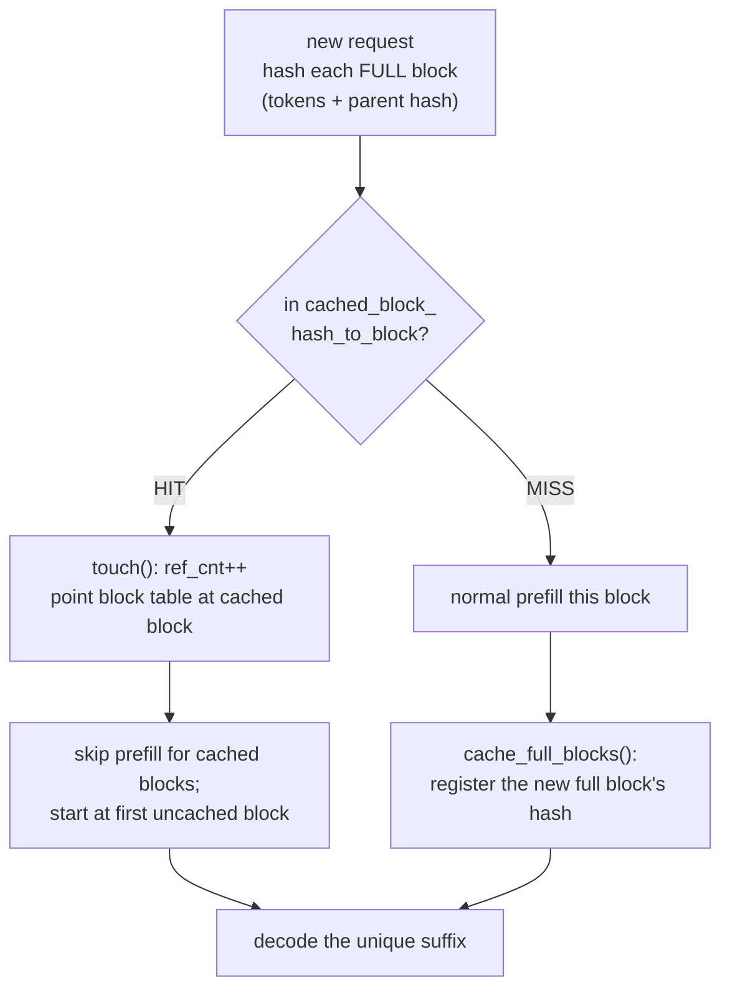

# Prefix Caching: Reuse the KV of a Shared Prefix

!!! info "Baseline: **vLLM 0.26.0** · model `Qwen2.5-7B-Instruct` · single RTX 4090 (24 GB)"
    Verified against vLLM 0.26.0 via Context7 (ADR-0004): automatic prefix caching keys each KV **block** by the hash of its tokens **plus its parent block's hash** (so position matters), **only full blocks are cacheable**, reuse **does not change outputs**, `prefix_caching_hash_algo` defaults to **`"sha256"`**, and it's controlled by `enable_prefix_caching` (**on by default in the V1 engine**). This is the serving payoff of the block sharing previewed in the [PagedAttention lesson](paged-attention.md). The §4 sim is a **work-savings model, not a benchmark**; speedups are **illustrative / order-of-magnitude references**.

---

## 1 · Intuition & why it matters

The [PagedAttention lesson](paged-attention.md) ended with a teaser: because a KV [block](../part0/kv-cache.md) is identified by the *content* it holds, two sequences that begin with the same tokens can point their block tables at the **same physical blocks**. Prefix caching is what that teaser becomes in production — and it's often the cheapest big throughput win you'll ever deploy, because so much real traffic **shares a prefix**.

Think about where the same tokens show up again and again:

- A **system prompt** ("You are a helpful assistant… [500 tokens of rules]") prepended to *every* request.
- **Few-shot examples** shared across a batch of classification calls.
- A **multi-turn chat**, where turn 3's prompt is turns 1–2 verbatim plus the new message.
- A long **document** that many questions ask about (RAG-style).

Without prefix caching, every one of those requests re-runs [prefill](../part0/inference-flow.md) over the *entire* shared prefix — recomputing identical KV, burning compute you already spent. Prefix caching computes the shared prefix's KV **once**, keeps those blocks in the pool, and lets every later request that starts with the same tokens **skip straight to its unique suffix**. The prefill work — and the TTFT — collapses to just the new part. Since the reused KV is byte-identical, the outputs are exactly the same; this is a pure "don't redo work" optimization. → see the [Glossary](../glossary.md) for *Prefix caching, KV-cache aware routing*.

## 2 · Mental model

Same prefix, computed once, reused by content hash (the request layout and hash chain are structural sketches, so ASCII, per ADR-0005):

```text
THREE requests, all starting with the same 512-token system prompt:
  req A: [ SYSTEM PROMPT (512 tok) ][ "translate: hello"        ]
  req B: [ SYSTEM PROMPT (512 tok) ][ "summarize: the cat sat…" ]
  req C: [ SYSTEM PROMPT (512 tok) ][ "code: fizzbuzz"          ]

WITHOUT prefix caching — each prefills the whole thing:
  A: prefill 512 + suffix   B: prefill 512 + suffix   C: prefill 512 + suffix
     └────────────── the 512-token prefix computed 3× (identical KV each time) ─────┘

WITH prefix caching — hash the blocks, reuse the match:
  A: prefill 512 + suffix  → its 32 prefix blocks CACHED (hash of tokens + parent hash)
  B: block hashes match A's → point block table at A's blocks (ref_cnt++), prefill ONLY suffix
  C: same → reuse A's prefix blocks, prefill ONLY suffix
     └── the 512-token prefix computed ONCE; B and C skip straight to their suffix ──┘

BLOCK HASH CHAIN (why position is safe):
  block0.hash = H(tokens[0:16])
  block1.hash = H(block0.hash, tokens[16:32])   ← includes parent → a block only matches
  block2.hash = H(block1.hash, tokens[32:48])     if the ENTIRE prefix up to it is identical
```

And the decision the engine makes for each new request's blocks — hit or miss (a control flow, so Mermaid, per ADR-0005):



Three shapes to hold:

- **The block is the unit of reuse, and it's keyed by content.** A block's hash folds in its tokens *and its parent block's hash*, so a cached block only matches when the whole prefix leading to it is identical — you can never accidentally reuse KV from a different context. **Only full blocks cache** (a half-filled last block is recomputed).
- **Reuse is free correctness.** The cached KV is exactly what prefill would have produced, so outputs are identical — prefix caching only removes redundant computation. If you ever see different results with caching on, that's a bug, not the feature.
- **The win scales with prefix length × sharing rate.** A 500-token system prompt shared by every request saves ~500 prefill tokens per request after the first; a 5-token shared prefix saves almost nothing. It's a traffic-shape optimization: high when prefixes are long and hit often.

## 3 · Principle

### 3.1 Hash-keyed blocks

vLLM's automatic prefix caching (from the verified design doc) "caches the KV cache blocks of processed requests and reuses them for subsequent requests that share the same prefix … without altering model outputs." Each block gets a hash computed from **its tokens, its parent block's hash**, and a little metadata (LoRA id, multimodal inputs). That parent-chaining is the key correctness trick: block *k* only matches if blocks 0…*k* are all identical, so a match guarantees the entire preceding context is the same. The hash algorithm is `prefix_caching_hash_algo` (default `"sha256"`). **Only full blocks** are eligible — the KV of a partially-filled trailing block depends on future tokens, so it can't be cached yet.

### 3.2 How a hit is served

Recall the [block manager](paged-attention.md): the pool keeps a `cached_block_hash_to_block` map. On a new request, the engine hashes the prompt's blocks and looks them up:

- **Hit:** the block already exists in the pool. The manager calls `touch()` to bump the block's `ref_cnt` (it may have been sitting in the free queue as an eviction candidate) and points the new request's block table at it — **no recomputation**. Prefill starts at the first *un*cached block.
- **Miss:** normal prefill; the resulting full blocks are registered in the hash map so *future* requests can hit them.

Cached blocks are reference-counted, so a block backing an active prefix isn't evicted; once no request references it, it becomes an eviction candidate (LRU-style, via the free queue's eviction order) and its VRAM can be reclaimed. So prefix caching costs **no extra memory** in the steady state — it reuses the same block pool, just keeps useful blocks around a bit longer.

### 3.3 Turning it on, and routing to hits

In the V1 engine prefix caching is **on by default** (`enable_prefix_caching`). The one systems corollary worth knowing: a cache hit only helps if the request lands on the **instance that already holds those blocks**. At multi-replica scale that motivates **KV-cache-aware routing** — route a request to the replica most likely to have its prefix cached (e.g. by hashing the system prompt), instead of round-robin. That's a production-topology topic (Part 7/8), but it's the natural extension of this lesson: caching creates the hit; routing makes sure you land on it.

### 3.4 Reading it in vLLM's source (v0.26.0)

Prefix caching reuses the exact block manager from the [PagedAttention lesson](paged-attention.md) — there's almost no new machinery, which is the point (ADR-0002: read + reason):

- **The design doc** — [`docs/design/prefix_caching.md`](https://github.com/vllm-project/vllm/blob/v0.26.0/docs/design/prefix_caching.md) (shipped at v0.26.0) is the narrative source of the parent-chained block hash and the full-blocks-only rule. Its *Hashing Algorithms* section is where the verified facts come from: the default is **`sha256`** (via Python `pickle`), `sha256_cbor` gives reproducible cross-language hashes, and `xxhash` is faster but not collision-safe — selectable with **`--prefix-caching-hash-algo`**.
- **The lookup and register** — the two verbs live on `BlockPool` in [`vllm/v1/core/block_pool.py`](https://github.com/vllm-project/vllm/blob/v0.26.0/vllm/v1/core/block_pool.py): **`get_cached_block(...)`** consults the `cached_block_hash_to_block` map for a hit (the §3.2 hit path), and **`cache_full_blocks(...)`** registers a freshly-computed *full* block so future requests can hit it (the §3.2 miss path). The hit's `touch()` — the same one from the [PagedAttention read-along](paged-attention.md) (§3.5) — is what rescues a block from the eviction queue.
- **The block hash** — the per-block hash (tokens + parent hash + metadata) is computed by the hashing helpers in [`vllm/v1/core/kv_cache_utils.py`](https://github.com/vllm-project/vllm/blob/v0.26.0/vllm/v1/core/kv_cache_utils.py), the same file that defines `KVCacheBlock._block_hash`. That parent-chaining is the §3.1 correctness guarantee, in code.

So the whole feature is: *hash the full blocks (kv_cache_utils) → look them up (`get_cached_block`) → on hit `touch` + skip, on miss prefill + `cache_full_blocks`* — riding entirely on the allocator you already read.

## 4 · Complete runnable code + line-by-line

A pure-Python model of prefill work with and without prefix caching, over a batch of requests sharing a system prompt. It counts prefill tokens computed — the quantity prefix caching shrinks. No GPU.

```python title="prefix_caching_sim.py"
"""Prefix caching: shared-prefix KV is computed once, reused by later requests.
A work-savings model, not a benchmark. Pure Python, offline."""
BLOCK = 16
PREFIX = 512                                   # shared system prompt / few-shot preamble (32 blocks)
SUFFIXES = [24, 40, 8, 32, 16, 48, 12, 20]     # each request's unique tail (varies)

def prefill_tokens(prefix, suffixes, block, cache):
    """Total prefill tokens computed across all requests, with or without prefix caching."""
    cached = 0                                  # tokens of the prefix currently cached (full blocks only)
    total = 0
    for s in suffixes:
        reused = cached if cache else 0         # a hit reuses the cached prefix blocks
        total += (prefix - reused) + s          # prefill the UN-cached prefix + this request's suffix
        if cache:
            cached = (prefix // block) * block  # after any request, the prefix's full blocks are cached
    return total

if __name__ == "__main__":
    no_cache   = prefill_tokens(PREFIX, SUFFIXES, BLOCK, cache=False)
    with_cache = prefill_tokens(PREFIX, SUFFIXES, BLOCK, cache=True)
    saved = 1 - with_cache / no_cache
    print(f"{len(SUFFIXES)} requests sharing a {PREFIX}-token prefix (block={BLOCK})")
    print(f"no prefix caching  : {no_cache} prefill tokens computed")
    print(f"with prefix caching: {with_cache} prefill tokens computed  ({saved:.1%} fewer)")
```

**Line-by-line:**

- `PREFIX` is a 512-token shared preamble (a system prompt / few-shot block = 32 blocks of 16); `SUFFIXES` are the per-request unique tails, deliberately varied.
- `prefill_tokens(..., cache=False)` — every request prefills the full `prefix + suffix`; `reused` is always 0. The prefix is recomputed for all N requests.
- `prefill_tokens(..., cache=True)` — after the *first* request populates the cache, `cached` becomes the prefix's full-block count; every subsequent request subtracts `reused` (skips the shared prefix) and prefills only `(prefix - reused) + suffix` — i.e. just its suffix once the prefix is fully cached. `(prefix // block) * block` models the **full-blocks-only** rule (a non-block-aligned prefix would leave a small remainder uncached).
- The two runs differ only in whether cached prefix tokens are subtracted — exactly what a prefix-cache hit does.

Expected output (a work-savings model, not a benchmark):

```text
8 requests sharing a 512-token prefix (block=16)
no prefix caching  : 4296 prefill tokens computed
with prefix caching: 712 prefill tokens computed  (83.4% fewer)
```

Eight requests, one shared 512-token system prompt: prefix caching computes the prefix **once** instead of eight times, cutting prefill work by **~83%**. That compute doesn't vanish into thin air — it becomes lower TTFT for the cached requests and freed capacity for [more concurrent sequences](continuous-batching.md). The savings track prefix-length × hit-rate: the longer and more-shared the prefix, the bigger the win. (A workload with no shared prefixes gets nothing — that's the honest boundary.)

## 5 · Lab — measure your hit rate

!!! gpu "GPU Lab (single-card, fully runnable)"
    - **Min VRAM:** none to read; ~16 GB to run `Qwen2.5-7B-Instruct` (INT4/AWQ) and observe cache hits
    - **Suggested AutoDL card:** RTX 4090 (24 GB)
    - **Est. time / cost:** reading ~15 min (free, no-card mode) · optional run ~10 min · ~¥1 (illustrative)
    - **Platform:** NVIDIA CUDA (default)
    - **Non-NVIDIA:** prefix caching is a block-manager feature, backend-independent — the hash-keyed block reuse works the same on any backend that uses the paged KV cache.

Prefix caching is on by default; the lab is about *seeing* it work.

```python title="observe_prefix_cache.py"
# API verified against vLLM 0.26.0 (LLM, enable_prefix_caching). Run in AutoDL with a GPU.
from vllm import LLM, SamplingParams

llm = LLM(
    model="Qwen/Qwen2.5-7B-Instruct",
    quantization="awq",
    enable_prefix_caching=True,       # on by default in V1; shown explicitly for clarity
)
SYSTEM = "You are a meticulous assistant. Follow the rules exactly.\n" * 20   # a long shared prefix
prompts = [SYSTEM + q for q in ["Translate 'hello' to French.",
                                "What is 2+2?",
                                "Name a primary color."]]
# First request populates the prefix blocks; the next two should HIT and skip the shared prefill.
out = llm.generate(prompts, SamplingParams(max_tokens=16))
print([o.outputs[0].text[:30] for o in out])
```

**What to observe / do:**

1. **Watch the hit rate.** vLLM exposes prefix-cache hit metrics (`gpu_prefix_cache_hit_rate` in the logs/metrics). Run the batch above: the first request misses (populates), the rest hit. Send the *same* system prompt again later — still a hit until those blocks are evicted.
2. **Break the prefix, lose the hit.** Change **one token near the start** of `SYSTEM` for one request and watch its hit disappear — the block-hash chain (parent-linked) means an early change invalidates every downstream block. This makes §3.1's "position matters" concrete.
3. **Contrast with no caching.** Rerun with `enable_prefix_caching=False` and compare TTFT for the repeated-prefix requests — the difference is the redundant prefill you were paying before.

## 6 · Common pitfalls / counter-intuitive points

- **Expecting a hit when the prefix isn't byte-identical.** A single differing token *anywhere* in the prefix — even a timestamp, a shuffled few-shot order, or trailing whitespace — changes the block hashes from that point on and kills the hit for everything downstream. Keep shared prefixes truly constant and put variable content *at the end*.
- **Putting variable content first.** If the unique part (user id, timestamp) leads the prompt and the shared system prompt follows, *nothing* caches — the first block already differs. Order matters: **stable prefix first, variable suffix last.**
- **Thinking it changes outputs.** It never does — reused KV is byte-identical to recomputed KV. Prefix caching is a pure work-saver; different outputs mean a bug.
- **Assuming it costs extra memory.** It reuses the same [block pool](paged-attention.md); cached-but-unreferenced blocks are just eviction candidates that get reclaimed under pressure. Steady-state memory is unchanged.
- **Over-crediting it on low-sharing traffic.** With unique prompts and no shared prefix, prefix caching does ~nothing. Its value is entirely a function of your traffic's prefix-sharing rate — measure the hit rate before claiming a win.
- **Ignoring routing at multi-replica scale.** A hit only helps on the replica that holds the blocks. Round-robin routing scatters requests and tanks the hit rate; [KV-cache-aware routing](../glossary.md) is what preserves it across replicas.
- **Swapping the hash algorithm without weighing the trade.** `--prefix-caching-hash-algo` defaults to `sha256` (serialized via Python `pickle`, so the raw hash bytes aren't guaranteed stable across processes/languages); `sha256_cbor` is the reproducible, cross-language choice; `xxhash`/`xxhash_cbor` are faster but **not collision-safe** — a theoretical hash collision could hand one tenant's KV to another (a data leak) in a shared deployment. Reach for `xxhash` for speed only once you accept that risk; don't assume the default's bytes are portable across hosts.

## 7 · Interview links

- [Prefix caching: reuse shared-prefix KV](../interview/prefix-caching.md) — the high-frequency question this lesson prepares you for: *how block hashing enables safe reuse, why only full blocks cache, when it helps, and why outputs are unchanged.*

## 8 · Summary & further reading

**One line:** Because a KV block is keyed by the hash of its tokens *and its parent block's hash*, requests that share a prefix (system prompts, few-shot, multi-turn chat, RAG documents) can reuse the same physical blocks — so vLLM computes the shared prefix's KV once and later requests skip straight to their unique suffix, cutting prefill work and TTFT with byte-identical outputs; the win scales with prefix length × hit rate, and at multi-replica scale KV-cache-aware routing is what keeps requests landing on their cached blocks.

Further reading:

- vLLM `docs/design/prefix_caching.md` — the hash-based block-identity scheme and the full-blocks-only rule quoted here.
- The [PagedAttention lesson](paged-attention.md) — the block manager and `ref_cnt`/`touch()` mechanics that prefix caching rides on.
- The [scheduler lesson](scheduler-chunked-prefill-pd.md) — chunked prefill (split one prefill) is the sibling lever; prefix caching (skip a shared prefill) often stacks with it.
- vLLM source (v0.26.0): [`docs/design/prefix_caching.md`](https://github.com/vllm-project/vllm/blob/v0.26.0/docs/design/prefix_caching.md) (the hash scheme + `--prefix-caching-hash-algo`) and [`vllm/v1/core/block_pool.py`](https://github.com/vllm-project/vllm/blob/v0.26.0/vllm/v1/core/block_pool.py) (`get_cached_block`, `cache_full_blocks`, `touch`) — the code behind §3.4.
- Parts 7–8 — KV-cache-aware routing and multi-replica serving, where hit rate becomes a fleet-level concern.

## 9 · Self-check

??? question "How does vLLM guarantee it never reuses the wrong KV when two prompts merely *look* similar?"
    Each KV block's hash is computed from **its own tokens plus its parent block's hash** (a chain), so a block only matches a cached block when *every* block before it — i.e. the entire prefix up to that point — is byte-identical. A single differing token early in the prompt changes that block's hash and, through the parent chain, every downstream block's hash too, so no false match can occur. On top of that, **only full blocks are cacheable** (a partially-filled trailing block depends on tokens not yet seen), and the reused KV is exactly what prefill would compute — so a hit is provably safe and outputs are unchanged.

??? question "Your workload is a chat API where every request carries a 600-token system prompt. Estimate the prefill savings and name the one thing that would silently destroy them."
    With a 600-token shared prefix, prefix caching computes it **once** instead of per request; after the first request, every subsequent one skips ~600 prefill tokens (minus any non-block-aligned remainder) and prefills only its unique user turn — often an **80–95% cut in prefill tokens** for prefix-heavy traffic (illustrative), which shows up as lower TTFT and freed capacity for more concurrency. The silent killer: putting **variable content before the system prompt** (or letting any token in the prefix vary — a timestamp, reordered few-shot, changed whitespace). Because the block-hash chain starts from token 0, any early variation changes all downstream hashes and drops the hit rate to ~0. Fix: keep the prefix constant and byte-identical, variable content last.

??? question "You enable prefix caching across 8 replicas behind a round-robin load balancer and see almost no hit-rate improvement. Why, and what's the fix?"
    A prefix-cache hit only helps on the **replica that actually holds those blocks**. Round-robin scatters requests with the same prefix across all 8 replicas, so each replica sees only ~1/8 of the repeats and its cache rarely gets a second hit before eviction — the aggregate hit rate stays low. The fix is **KV-cache-aware routing**: route requests to the replica most likely to already hold their prefix (e.g. hash the system prompt / conversation id to a sticky replica), so repeated prefixes concentrate on the same instance and actually hit. Caching creates the opportunity; routing is what realizes it at fleet scale.
