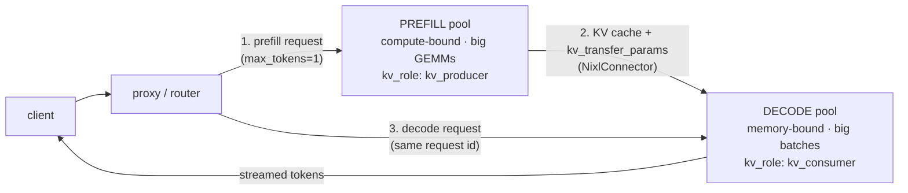

# The Scheduler: Chunked Prefill & PD Disaggregation

!!! info "Baseline: **vLLM 0.26.0** · model `Qwen2.5-7B-Instruct` · single RTX 4090 (24 GB) — PD section is multi-GPU"
    Verified against vLLM 0.26.0 via Context7 (ADR-0004): `enable_chunked_prefill` (default **True**), `max_num_batched_tokens` (default **2048**, engine auto-tunes), `long_prefill_token_threshold` (default **0** = off), and PD disaggregation via `--kv-transfer-config '{"kv_connector":"NixlConnector","kv_role":"kv_producer"|"kv_consumer"}'`. Chunked prefill runs on a single 4090; **PD disaggregation needs ≥2 GPUs/instances** (one prefiller + one decoder) so it's covered at the read-and-configure level (ADR-0002), not as a single-card lab. The §4 sim is a **scheduling model, not a benchmark**; any latency figure is an **illustrative / order-of-magnitude reference**.

---

## 1 · Intuition & why it matters

[Continuous batching](continuous-batching.md) decides *which requests* are in the running set; [PagedAttention](paged-attention.md) decides *where their KV lives*. This lesson is the next layer of control: **which tokens actually run in each forward step**, and — at scale — **which hardware runs prefill vs decode at all**. Both are about the same tension you met in Part 0: **[prefill is compute-bound, decode is memory-bound](../part0/inference-flow.md)**, and they fight for the same GPU.

Here's the concrete pain. A new request with a long prompt (say 8k tokens) needs a big **prefill** — a compute-heavy burst. If that prefill runs as one monolithic step, it monopolizes the GPU and every *already-running* sequence's **decode** stalls: their inter-token latency (ITL) spikes, users watching a stream see it freeze. **Chunked prefill** fixes this by slicing the long prefill into chunks and co-scheduling each chunk *alongside* the ongoing decodes in the same step — so decodes keep flowing and the compute-bound prefill fills the spare token budget. The cost is a slightly later first token for the new request; the win is smooth ITL for everyone else.

**PD disaggregation** takes the same "prefill and decode don't mix well" insight to its logical extreme: run prefill on one set of GPUs and decode on another, moving the [KV cache](../part0/kv-cache.md) between them. Now each pool is tuned for its own bottleneck — prefillers for compute throughput, decoders for memory bandwidth and large batches — instead of one GPU compromising between both. It's a multi-instance technique, so it belongs to the large-scale end of the spectrum, but the *reasoning* is identical to chunked prefill. → see the [Glossary](../glossary.md) for *Chunked prefill, PD disaggregation, Prefill, Decode*.

## 2 · Mental model

The token budget per step, and where prefill goes (per-step token timelines are temporal, so ASCII, per ADR-0005):

```text
ONE SCHEDULER STEP = a budget of `max_num_batched_tokens` tokens to spend.

WITHOUT chunked prefill — a long prefill runs alone, decodes starve:
  step k   : [ PREFILL 2000 tok ..................................... ]   ongoing decodes: ✗ stalled
  step k+1 : [ PREFILL 2000 tok ..................................... ]   ongoing decodes: ✗ stalled
  step k+2 : [ decode decode decode decode … ]                            (first token finally late too)
             └ ITL spike for every running user while the prefill hogs the GPU ┘

WITH chunked prefill — each step mixes a prefill chunk with the decodes:
  step k   : [ decode×D | prefill chunk (budget−D) ]   ongoing decodes: ✓ advanced
  step k+1 : [ decode×D | prefill chunk (budget−D) ]   ongoing decodes: ✓ advanced
  step k+2 : [ decode×D | prefill chunk (last)     ]   ongoing decodes: ✓ advanced
             └ decodes never stall; prefill finishes a bit later (TTFT trade) ┘
```

**PD disaggregation** takes the same idea across *hardware*: run prefill and decode on separate pools and stream the KV between them. That's a request flowing across nodes — a topology, so Mermaid, per ADR-0005:



Three shapes to hold:

- **A step has a token budget, not a request slot count.** `max_num_batched_tokens` is the tokens spent per forward pass. Prefill tokens and decode tokens draw from the *same* budget — chunked prefill is just "let a prefill take part of the budget instead of all of it."
- **The trade is TTFT vs ITL/throughput.** A bigger prefill chunk per step → the new request's first token comes sooner (better TTFT) but steals more budget from decodes (worse ITL). A smaller chunk → smoother ITL, later TTFT. `max_num_batched_tokens` is the dial. vLLM's default policy leans toward protecting decode ITL.
- **PD disaggregation is chunked prefill's logic across machines.** Instead of time-slicing one GPU between compute-bound prefill and memory-bound decode, give each phase its own GPUs. Same motivation, different axis (space, not time), and only worth it at scale.

## 3 · Principle

### 3.1 Chunked prefill — sharing the budget

By default vLLM sets `enable_chunked_prefill = True`. When a prefill's prompt is long, the scheduler doesn't run it whole; it takes a **chunk** sized to the budget left after the step's decodes are scheduled, and defers the rest to later steps. The official framing: chunked prefill "process[es] large prefill requests in smaller segments, allowing them to be batched alongside decode requests," balancing compute-bound prefill against memory-bound decode. By default the policy **prioritizes decode** to protect ITL.

The tuning knob is **`max_num_batched_tokens`**:

- **Smaller** → less prefill crammed into each step → **better ITL** (decodes suffer less interference), worse TTFT.
- **Larger** (the docs suggest **> 8192** for throughput on smaller models / big GPUs) → more prefill per step → **better TTFT**, more decode interference.
- `long_prefill_token_threshold` (default 0 = off) marks a prompt as "long" above a size, capping how much of it a step will take.
- Caveat: if you *disable* chunked prefill, `max_num_batched_tokens` must exceed `max_model_len` or the server won't start (a whole prompt must fit one step).

### 3.2 PD disaggregation — split the phases across GPUs

Prefill and decode have opposite appetites: prefill wants raw FLOPs (compute-bound, one big burst), decode wants memory bandwidth and a big batch (memory-bound, many small steps). On one GPU they interfere — chunked prefill *manages* that interference; **PD disaggregation removes it** by putting prefill on a "producer" pool and decode on a "consumer" pool, streaming the KV cache from one to the other.

In vLLM 0.26.0 this is wired with `--kv-transfer-config`: the prefill instance runs as `{"kv_connector":"NixlConnector","kv_role":"kv_producer"}` and the decode instance as `kv_role":"kv_consumer"`. A request prefills on the producer (`max_tokens=1` to force prefill-only, returning `kv_transfer_params`), then the same request ID decodes on the consumer using those params; a proxy coordinates the prefiller/decoder hosts. The prompt must exceed the block size (16 tokens) for the transfer to trigger.

Why bother? Because now you can **scale and tune the two pools independently** — more prefillers when prompts are long (TTFT-bound), more decoders when generations are long (throughput-bound) — and neither phase's bursts disturb the other. The cost is real: a KV-cache transfer over the network per request, plus operational complexity. It's a large-fleet optimization, not a single-4090 one.

### 3.3 The through-line

Both techniques answer "prefill and decode don't want the same thing." Chunked prefill **interleaves** them on one GPU (time-division); PD disaggregation **separates** them onto different GPUs (space-division). Recognizing that shared root is the interview-grade insight.

### 3.4 Reading it in vLLM's source (v0.26.0)

Chunked prefill isn't a separate code path — it falls out of how the V1 scheduler counts tokens. Open **`Scheduler.schedule()`** in [`vllm/v1/core/sched/scheduler.py`](https://github.com/vllm-project/vllm/blob/v0.26.0/vllm/v1/core/sched/scheduler.py) and read its own comment (verified at v0.26.0):

> *"There's no 'decoding phase' nor 'prefill phase' in the scheduler. Each request just has `num_computed_tokens` and `num_tokens_with_spec` … At each step, the scheduler tries to assign tokens … so that each request's `num_computed_tokens` can catch up [to] its `num_tokens_with_spec`. This is general enough to cover chunked prefills, prefix caching, speculative decoding …"*

That's the whole trick: a request with a 5000-token prompt just has `num_computed_tokens = 0` and `num_tokens_with_spec = 5000`. Each step, `schedule()` starts with `token_budget = self.max_num_scheduled_tokens` (which defaults to `max_num_batched_tokens`), lets running decodes take their one token each, and gives a prefill **only as many of its remaining tokens as still fit the budget** — that leftover slice *is* the chunk. The rest waits for the next step; no special "chunk this prefill" branch is needed. A per-request cap, **`long_prefill_token_threshold`**, additionally bounds how much of one long prompt a single step will take. So `enable_chunked_prefill` doesn't switch on an algorithm so much as *allow* a prefill to be scheduled partially instead of all-or-nothing. (The flag itself lives on `SchedulerConfig` in [`vllm/config/scheduler.py`](https://github.com/vllm-project/vllm/blob/v0.26.0/vllm/config/scheduler.py).)

## 4 · Complete runnable code + line-by-line

A pure-Python model of one scheduler step's token budget, comparing a monolithic prefill against a chunked one — measuring what each does to *ongoing decode* latency. No GPU.

```python title="chunked_prefill_sim.py"
"""Chunked prefill: does a long prefill stall ongoing decodes? A scheduling model, not a benchmark.
Pure Python, offline."""
BUDGET = 16   # max_num_batched_tokens: token budget per scheduler step
DECODES = 4   # ongoing decode sequences, each wants 1 token/step to stay smooth
PREFILL = 48  # a long prompt arrives (48 tokens to prefill)

def without_chunking(budget, decodes, prefill):
    """Prefill runs as whole-budget steps; ongoing decodes are starved until it's done."""
    steps = delayed = 0
    remaining = prefill
    while remaining > 0:
        remaining -= min(budget, remaining)       # a prefill-only step spends the whole budget
        steps += 1
        delayed += decodes                         # all `decodes` produced 0 tokens this step
    return steps, delayed

def with_chunking(budget, decodes, prefill):
    """Each step: `decodes` decode tokens + a prefill chunk of (budget - decodes). Decodes never stall."""
    steps = delayed = 0
    chunk = budget - decodes                        # budget left for prefill after decodes are scheduled
    remaining = prefill
    while remaining > 0:
        remaining -= min(chunk, remaining)          # decode tokens + one prefill chunk share the step
        steps += 1                                  # every decode advanced this step -> 0 delayed
    return steps, delayed

if __name__ == "__main__":
    for name, fn in [("no chunked prefill", without_chunking), ("chunked prefill", with_chunking)]:
        steps, delayed = fn(BUDGET, DECODES, PREFILL)
        print(f"{name:>19}: prefill done in {steps} steps | decode-tokens delayed = {delayed}")
```

**Line-by-line:**

- `BUDGET` is `max_num_batched_tokens` shrunk to 16 so the arithmetic is legible; `DECODES` sequences each need 1 token/step to keep their stream smooth; `PREFILL` is a long prompt that just arrived.
- `without_chunking` — the prefill runs in whole-budget steps (`min(budget, remaining)`), and because it hogs the step, every ongoing decode produces nothing → `delayed += decodes` per step. Fewer steps to finish the prefill, but the running users' ITL freezes.
- `with_chunking` — each step first schedules the `DECODES` decode tokens, then fills the *rest* of the budget (`chunk = budget - decodes`) with a prefill slice. Decodes advance every step, so `delayed` stays 0. The prefill takes a step or two longer (slightly higher TTFT for the new request).
- The two functions differ only in whether prefill may **share** a step with decode — exactly what the `enable_chunked_prefill` flag toggles.

Expected output (a scheduling model, not a benchmark):

```text
 no chunked prefill: prefill done in 3 steps | decode-tokens delayed = 12
    chunked prefill: prefill done in 4 steps | decode-tokens delayed = 0
```

Without chunking the prefill finishes one step sooner (3 vs 4) — but it **froze 12 decode-tokens** across the running sequences (the ITL spike users feel). Chunked prefill pays **one extra step of TTFT** for the newcomer and delivers **zero** decode stalls. That single trade — a touch of TTFT for smooth ITL and steady throughput — is the whole reason chunked prefill is on by default, and `max_num_batched_tokens` is how you slide along it.

## 5 · Lab — tune the budget, and understand PD

!!! gpu "GPU Lab (chunked prefill: single-card; PD: multi-GPU, conceptual)"
    - **Min VRAM:** none to read; ~16 GB to run `Qwen2.5-7B-Instruct` (INT4/AWQ) and sweep `max_num_batched_tokens`
    - **Suggested AutoDL card:** RTX 4090 (24 GB) for chunked prefill; PD disaggregation needs **≥2 GPUs / instances** (A100 "power-on-then-off" territory, ADR-0001) — read-and-configure only here
    - **Est. time / cost:** reading ~20 min (free, no-card mode) · optional chunked-prefill sweep ~15 min · ~¥2 (illustrative)
    - **Platform:** NVIDIA CUDA (default)
    - **Non-NVIDIA:** chunked prefill is a scheduler feature (backend-independent); PD's KV-transfer connectors (NixlConnector) assume NVIDIA networking (NVLink/RDMA) — other backends have their own transport.

Chunked prefill is fully runnable on one 4090:

```python title="tune_chunked_prefill.py"
# API verified against vLLM 0.26.0 (LLM, enable_chunked_prefill, max_num_batched_tokens).
from vllm import LLM, SamplingParams

llm = LLM(
    model="Qwen/Qwen2.5-7B-Instruct",
    quantization="awq",
    enable_chunked_prefill=True,      # default True — prefill may share a step with decode
    max_num_batched_tokens=2048,      # the TTFT<->ITL dial; raise (>8192) for throughput, lower for ITL
)
# Mix one long-prompt request with several short ones; watch the long prefill NOT freeze the others.
prompts = ["Summarize this:\n" + "context " * 1500] + ["Hi, who are you?"] * 4
print(len(llm.generate(prompts, SamplingParams(max_tokens=32))), "responses")
```

**What to observe / do:**

1. **Sweep the dial.** Serve with `vllm serve … --max-num-batched-tokens 2048` then `--max-num-batched-tokens 8192`, send a long prompt while several short generations stream, and compare TTFT vs ITL. Lower budget → smoother ITL for the running streams, later first token for the long prompt; higher → the reverse. This is §3.1 made tangible.
2. **Read the PD path (no GPU needed).** Study vLLM's disaggregated-prefill example: the prefiller runs `--kv-transfer-config '{"kv_connector":"NixlConnector","kv_role":"kv_producer"}'`, the decoder `"kv_role":"kv_consumer"`, and a proxy routes prefill→decode by request ID. Trace how `kv_transfer_params` flows from the prefill response into the decode request — that's the KV cache moving between pools.

## 6 · Common pitfalls / counter-intuitive points

- **Thinking chunked prefill speeds up prefill.** It doesn't — it may make a single prefill *slightly slower* (extra steps). It improves the *system*: ongoing decodes stop stalling, so ITL and aggregate throughput improve. Optimizing the wrong metric (one request's prefill time) misses the point.
- **Cranking `max_num_batched_tokens` blindly for "throughput."** Higher helps TTFT and small-model throughput but *hurts* the ITL of running streams (more prefill interference). It's a trade dial, not a "bigger is better" knob — set it to your SLO (TTFT-bound vs ITL-bound).
- **Disabling chunked prefill without raising the budget.** If `enable_chunked_prefill=False`, `max_num_batched_tokens` must exceed `max_model_len` (a whole prompt must fit one step) or the server crashes at startup.
- **Reaching for PD disaggregation on one GPU.** It fundamentally needs ≥2 instances (a producer and a consumer). On a single 4090 there's nothing to disaggregate; chunked prefill is your prefill/decode lever there.
- **Forgetting PD's transfer cost.** Moving the KV cache between pools costs bandwidth and latency per request; PD wins when independent scaling/tuning of the two pools outweighs that transfer — a large-fleet call, not a default.
- **Confusing chunked prefill with prefix caching.** Chunked prefill splits *one* prefill across steps; [prefix caching](prefix-caching.md) skips prefill entirely for a *shared* prefix. Different levers, often used together.
- **Hunting for a `chunk_size` knob.** There isn't one. As the V1 `schedule()` shows (§3.4), a prefill's chunk is just the `token_budget` left after the step's decodes are placed — you shape it *indirectly* through `max_num_batched_tokens`, and cap a single long prompt's per-step bite with `long_prefill_token_threshold`. Searching for `--chunk-size` and not finding it is the tell that you've misread the mechanism as a fixed slice rather than "whatever budget is left."

## 7 · Interview links

- [Chunked prefill & PD disaggregation: balancing TTFT and throughput](../interview/chunked-prefill-pd.md) — the high-frequency question this lesson prepares you for: *why prefill stalls decode, what chunked prefill trades, the `max_num_batched_tokens` dial, and when PD disaggregation is worth it.*

## 8 · Summary & further reading

**One line:** Prefill is compute-bound and decode is memory-bound, so a long prefill run whole freezes ongoing decodes (ITL spike); chunked prefill slices the prefill to share each step's `max_num_batched_tokens` budget with the decodes — trading a little TTFT for smooth ITL and steady throughput — while PD disaggregation applies the same "don't mix the phases" logic across GPUs, running prefill and decode on separate, independently-tuned pools with the KV cache streamed between them.

Further reading:

- vLLM `docs/configuration/optimization.md` — the chunked-prefill knobs (`enable_chunked_prefill`, `max_num_batched_tokens`) and the ITL/TTFT tuning guidance quoted here.
- The [continuous-batching lesson](continuous-batching.md) — the running set this scheduler shapes; chunked prefill decides the *token mix* within each step.
- The [inference-flow lesson](../part0/inference-flow.md) — why prefill is compute-bound and decode memory-bound, the premise both techniques exploit.
- vLLM disaggregated-prefill docs and the NixlConnector usage guide — the `--kv-transfer-config` producer/consumer setup for PD.
- vLLM source (v0.26.0): [`vllm/v1/core/sched/scheduler.py`](https://github.com/vllm-project/vllm/blob/v0.26.0/vllm/v1/core/sched/scheduler.py) (`Scheduler.schedule`, the `num_computed_tokens`/`token_budget` mechanism) and [`vllm/config/scheduler.py`](https://github.com/vllm-project/vllm/blob/v0.26.0/vllm/config/scheduler.py) (`SchedulerConfig.enable_chunked_prefill`) — the code behind §3.4.
- Next in Part 5: [prefix caching](prefix-caching.md) — skip prefill entirely when a prefix repeats.

## 9 · Self-check

??? question "A long prompt arrives while several users are mid-stream. What happens to their inter-token latency with and without chunked prefill, and why?"
    **Without** chunked prefill, the long prefill runs as one (or a few) whole-budget steps that monopolize the GPU; the ongoing decodes produce **no tokens** during those steps, so every streaming user's inter-token latency **spikes** (their output visibly freezes). **With** chunked prefill, the scheduler slices the long prefill into chunks and co-schedules each chunk *alongside* the decodes within the same `max_num_batched_tokens` budget — the decodes advance every step, so their **ITL stays smooth**. The prefill finishes a step or two later (slightly higher TTFT for the new request), which is the trade you accept to protect everyone else's stream. It works because prefill is compute-bound and decode memory-bound, so a step has spare budget to share.

??? question "You're TTFT-bound (users complain about slow first tokens) on a single GPU. Which way do you move `max_num_batched_tokens`, and what's the risk?"
    Move it **up** (e.g. toward 8192+). A larger per-step token budget lets more of a new request's prefill run each step, so the first token arrives sooner — better TTFT. The risk: a bigger prefill chunk steals more budget from the ongoing decodes, so their **ITL degrades** (running streams get choppier). It's a direct TTFT↔ITL trade; the right setting is whichever your SLO weights more. If instead you were ITL-bound, you'd move it *down*.

??? question "When does PD disaggregation beat chunked prefill, and what does it cost?"
    PD disaggregation wins **at scale, when you want to tune and scale prefill and decode independently** — e.g. long prompts make you prefill-heavy (add prefiller GPUs) while long generations make you decode-heavy (add decoder GPUs), and you don't want either phase's bursts disturbing the other. Chunked prefill only *time-shares* one GPU between the phases; PD gives each phase its own hardware tuned for its bottleneck (compute for prefill, bandwidth + big batches for decode). The cost is a **KV-cache transfer between pools per request** (network bandwidth + latency, via a connector like NixlConnector) plus the operational complexity of running producer/consumer instances and a routing proxy — so it's a multi-GPU-fleet optimization, not something you reach for on a single card.
