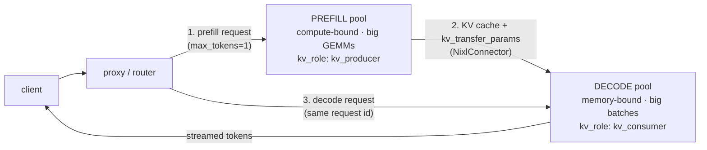

# 调度器：Chunked Prefill 与 PD 分离

!!! info "基线：**vLLM 0.26.0** · 模型 `Qwen2.5-7B-Instruct` · 单张 RTX 4090 (24 GB)——PD 段为多卡"
    经 Context7 针对 vLLM 0.26.0 核实（ADR-0004）：`enable_chunked_prefill`（默认 **True**）、`max_num_batched_tokens`（默认 **2048**，引擎自动调）、`long_prefill_token_threshold`（默认 **0** = 关）、以及 PD 分离经 `--kv-transfer-config '{"kv_connector":"NixlConnector","kv_role":"kv_producer"|"kv_consumer"}'`。Chunked prefill 在单张 4090 可跑；**PD 分离需 ≥2 GPU/实例**（一个 prefiller + 一个 decoder），故按读懂+会配层面覆盖（ADR-0002），不做单卡 Lab。§4 仿真是**调度模型，不是 benchmark**；任何延迟数字为**示例 / 量级参考**。

---

## 1 · 直觉 & 为什么重要

[Continuous batching](continuous-batching.md) 决定运行集里*有哪些请求*；[PagedAttention](paged-attention.md) 决定*它们的 KV 存在哪*。本课是下一层控制：**每一步 forward 里到底跑哪些 token**，以及——在规模上——**prefill 与 decode 究竟跑在哪块硬件上**。两者都关乎你在 Part 0 遇到的那对矛盾：**[prefill 受算力约束、decode 受带宽约束](../part0/inference-flow.md)**，而它们抢同一块 GPU。

具体痛点是这样。一个长 prompt（比如 8k token）的新请求需要一次大 **prefill**——一次算力密集的爆发。若这个 prefill 作为一整步跑，它就霸占 GPU，每个*已在运行*序列的 **decode** 都停摆：它们的 inter-token latency（ITL）飙升，正看着流式输出的用户会看到画面卡住。**Chunked prefill** 通过把长 prefill 切成块、在同一步里与正在进行的 decode *一起*调度来解决——于是 decode 继续流动，受算力约束的 prefill 填进剩余的 token 预算。代价是新请求的首 token 稍晚；收益是其他所有人 ITL 平滑。

**PD 分离**把同一个「prefill 与 decode 不合拍」的洞见推到极致：prefill 跑在一组 GPU、decode 跑在另一组，把 [KV cache](../part0/kv-cache.md) 在两者间搬运。现在每个池子都为自己的瓶颈调优——prefiller 为算力吞吐、decoder 为带宽与大批——而不是一块 GPU 在两者间折中。它是多实例技术，属于大规模那一端，但*推理逻辑*与 chunked prefill 完全一致。→ 术语见 [Glossary](../glossary.md) 的 *Chunked prefill、PD disaggregation、Prefill、Decode*。

## 2 · 心智模型

每步的 token 预算，以及 prefill 去哪（每步的 token 时间线是时序图，按 ADR-0005 用 ASCII）：

```text
一个调度器 STEP = 一份 `max_num_batched_tokens` token 的预算可花。

没有 chunked prefill —— 长 prefill 独占，decode 挨饿：
  step k   : [ PREFILL 2000 tok ..................................... ]   进行中的 decode：✗ 停摆
  step k+1 : [ PREFILL 2000 tok ..................................... ]   进行中的 decode：✗ 停摆
  step k+2 : [ decode decode decode decode … ]                            （首 token 最终也偏晚）
             └ prefill 霸占 GPU 期间，每个运行用户 ITL 飙升 ┘

有 chunked prefill —— 每步把一块 prefill 与 decode 混合：
  step k   : [ decode×D | prefill chunk (budget−D) ]   进行中的 decode：✓ 前进
  step k+1 : [ decode×D | prefill chunk (budget−D) ]   进行中的 decode：✓ 前进
  step k+2 : [ decode×D | prefill chunk (最后一块)  ]   进行中的 decode：✓ 前进
             └ decode 从不停摆；prefill 稍晚完成（TTFT 权衡） ┘
```

**PD 分离**把同一思路搬到*硬件*层：prefill 与 decode 跑在各自的池上，KV 在两者间流动。这是一个请求跨节点流动——拓扑图，按 ADR-0005 用 Mermaid：



三个要记的形状：

- **一步是 token 预算，不是请求槽位数。** `max_num_batched_tokens` 是每次 forward 花的 token 数。prefill token 与 decode token 从*同一*预算里取——chunked prefill 就是「让 prefill 拿走预算的一部分，而不是全部」。
- **权衡是 TTFT vs ITL/吞吐。** 每步 prefill 块更大 → 新请求首 token 更早（TTFT 更好）但从 decode 偷走更多预算（ITL 更差）。块更小 → ITL 更平滑、TTFT 更晚。`max_num_batched_tokens` 是那个旋钮。vLLM 默认策略偏向保护 decode 的 ITL。
- **PD 分离是 chunked prefill 逻辑跨机器版。** 与其在一块 GPU 上把算力受限的 prefill 与带宽受限的 decode 分时，不如给每个阶段各自的 GPU。同样动机、不同轴（空间而非时间），且只在规模上才值。

## 3 · 原理

### 3.1 Chunked prefill——共享预算

vLLM 默认 `enable_chunked_prefill = True`。当一个 prefill 的 prompt 很长时，调度器不整块跑它；它取一个大小为「这步 decode 调度完后剩余预算」的**块**，其余留给后续步。官方说法：chunked prefill「把大 prefill 请求分成更小的段处理，让它们能与 decode 请求一起 batch」，平衡受算力约束的 prefill 与受带宽约束的 decode。默认策略**优先 decode** 以保护 ITL。

调优旋钮是 **`max_num_batched_tokens`**：

- **更小** → 每步塞进的 prefill 更少 → **ITL 更好**（decode 受干扰更小）、TTFT 更差。
- **更大**（文档建议对小模型/大 GPU 用 **> 8192** 提吞吐）→ 每步更多 prefill → **TTFT 更好**、decode 干扰更多。
- `long_prefill_token_threshold`（默认 0 = 关）在某尺寸以上把 prompt 标为「长」，限制一步最多取它多少。
- 注意：若你*禁用* chunked prefill，`max_num_batched_tokens` 必须大于 `max_model_len`，否则服务起不来（整个 prompt 必须放进一步）。

### 3.2 PD 分离——把两阶段拆到不同 GPU

Prefill 与 decode 胃口相反：prefill 要裸 FLOPs（算力受限、一次大爆发），decode 要带宽与大批（带宽受限、许多小步）。在一块 GPU 上它们互相干扰——chunked prefill *管理*那种干扰，**PD 分离则消除它**，把 prefill 放到「producer」池、decode 放到「consumer」池，把 KV cache 从一边流到另一边。

在 vLLM 0.26.0 里这用 `--kv-transfer-config` 连起来：prefill 实例跑 `{"kv_connector":"NixlConnector","kv_role":"kv_producer"}`、decode 实例跑 `"kv_role":"kv_consumer"`。一个请求在 producer 上 prefill（`max_tokens=1` 强制只 prefill，返回 `kv_transfer_params`），然后同一 request ID 在 consumer 上用那些 params 做 decode；一个 proxy 协调 prefiller/decoder 主机。prompt 必须超过 block size（16 token）才会触发传输。

为什么值得？因为现在你能**独立扩缩与调优两个池**——prompt 长时（TTFT-bound）加 prefiller，生成长时（吞吐-bound）加 decoder——且任一阶段的爆发都不打扰另一个。代价真实：每请求一次跨网络的 KV-cache 传输，加上运维复杂度。它是大集群优化，不是单张 4090 的事。

### 3.3 贯穿主线

两种技术都在回答「prefill 与 decode 想要的不一样」。Chunked prefill 在一块 GPU 上**交织**它们（分时）；PD 分离把它们**分开**到不同 GPU（分空间）。认出这个共同根源就是面试级的洞见。

### 3.4 在 vLLM 源码里读它（v0.26.0）

Chunked prefill 不是一条单独的代码路径——它从 V1 调度器*数 token 的方式*里自然掉出来。打开 [`vllm/v1/core/sched/scheduler.py`](https://github.com/vllm-project/vllm/blob/v0.26.0/vllm/v1/core/sched/scheduler.py) 里的 **`Scheduler.schedule()`**，读它自己的注释（已在 v0.26.0 核实）：

> *「调度器里没有『decode 阶段』也没有『prefill 阶段』。每个请求只有 `num_computed_tokens` 与 `num_tokens_with_spec` …… 每一步，调度器都试图分配 token …… 让每个请求的 `num_computed_tokens` 追上它的 `num_tokens_with_spec`。这一般到足以覆盖 chunked prefill、prefix caching、speculative decoding ……」*

这就是全部诀窍：一个 5000-token prompt 的请求只是 `num_computed_tokens = 0`、`num_tokens_with_spec = 5000`。每一步，`schedule()` 先把 `token_budget = self.max_num_scheduled_tokens`（默认取 `max_num_batched_tokens`）初始化好，让 running decode 各取一个 token，再给某个 prefill **仅仅它剩余 token 里还塞得进预算的那么多**——那截剩料*就是* chunk。其余等下一步；不需要什么「切分这个 prefill」的特殊分支。一个每请求上限 **`long_prefill_token_threshold`** 还额外限制一步能吃掉一条长 prompt 多少。所以 `enable_chunked_prefill` 与其说是打开一套算法，不如说是*允许* prefill 被部分调度、而非全有或全无。（该 flag 本身在 [`vllm/config/scheduler.py`](https://github.com/vllm-project/vllm/blob/v0.26.0/vllm/config/scheduler.py) 的 `SchedulerConfig` 上。）

## 4 · 完整可跑代码 + 逐行讲解

一个纯 Python 模型，刻画一个调度器步的 token 预算，对比整块 prefill 与分块 prefill——量化各自对*进行中 decode* 延迟的影响。不用 GPU。

```python title="chunked_prefill_sim.py"
"""Chunked prefill：长 prefill 会不会拖停进行中的 decode？调度模型，不是 benchmark。
纯 Python、离线。"""
BUDGET = 16   # max_num_batched_tokens：每个调度步的 token 预算
DECODES = 4   # 进行中的 decode 序列，各要 1 token/step 才平滑
PREFILL = 48  # 来了个长 prompt（48 个 token 要 prefill）

def without_chunking(budget, decodes, prefill):
    """prefill 作为整预算步跑；进行中的 decode 一直挨饿到它跑完。"""
    steps = delayed = 0
    remaining = prefill
    while remaining > 0:
        remaining -= min(budget, remaining)       # 一个 prefill-only 步花掉整个预算
        steps += 1
        delayed += decodes                         # 所有 decode 这步产出 0 token
    return steps, delayed

def with_chunking(budget, decodes, prefill):
    """每步：decodes 个 decode token + 一块大小 (budget - decodes) 的 prefill。decode 从不停摆。"""
    steps = delayed = 0
    chunk = budget - decodes                        # decode 调度完后留给 prefill 的预算
    remaining = prefill
    while remaining > 0:
        remaining -= min(chunk, remaining)          # decode token 与一块 prefill 共享这步
        steps += 1                                  # 每个 decode 这步都前进 -> 0 delayed
    return steps, delayed

if __name__ == "__main__":
    for name, fn in [("no chunked prefill", without_chunking), ("chunked prefill", with_chunking)]:
        steps, delayed = fn(BUDGET, DECODES, PREFILL)
        print(f"{name:>19}: prefill done in {steps} steps | decode-tokens delayed = {delayed}")
```

**逐行讲解：**

- `BUDGET` 是缩到 16 的 `max_num_batched_tokens`，让算术清楚可读；`DECODES` 个序列各要 1 token/step 才能保持流式平滑；`PREFILL` 是刚到的长 prompt。
- `without_chunking`——prefill 以整预算步跑（`min(budget, remaining)`），因为它霸占了这步，每个进行中的 decode 什么都产不出 → 每步 `delayed += decodes`。prefill 完成步数更少，但运行用户的 ITL 冻住。
- `with_chunking`——每步先调度 `DECODES` 个 decode token，再用预算的*其余*（`chunk = budget - decodes`）填一块 prefill。decode 每步前进，所以 `delayed` 保持 0。prefill 多花一两步（新请求 TTFT 略高）。
- 两个函数只差在 prefill 是否可以与 decode **共享**一步——正是 `enable_chunked_prefill` flag 切换的东西。

预期输出（调度模型，不是 benchmark）：

```text
 no chunked prefill: prefill done in 3 steps | decode-tokens delayed = 12
    chunked prefill: prefill done in 4 steps | decode-tokens delayed = 0
```

没有分块时，prefill 早一步完成（3 vs 4）——但它**冻住了 12 个 decode-token**（用户能感到的 ITL 尖峰）。Chunked prefill 为新来者付**一步的 TTFT**，换来**零** decode 停摆。这一个权衡——用一点 TTFT 换平滑 ITL 与稳定吞吐——正是 chunked prefill 默认开启的原因，而 `max_num_batched_tokens` 就是你在它上面滑动的方式。

## 5 · Lab——调预算，并理解 PD

!!! gpu "GPU Lab（chunked prefill：单卡；PD：多卡，概念）"
    - **最低显存：** 读不需要；跑 `Qwen2.5-7B-Instruct`（INT4/AWQ）并 sweep `max_num_batched_tokens` 需 ~16 GB
    - **建议 AutoDL 卡型：** chunked prefill 用 RTX 4090 (24 GB)；PD 分离需 **≥2 GPU/实例**（A100「开机即关」范畴，ADR-0001）——此处仅读懂+会配
    - **预估耗时 / 花费：** 读 ~20 分钟（免费，无卡模式）· 可选 chunked-prefill sweep ~15 分钟 · ~¥2（示例）
    - **平台：** NVIDIA CUDA（默认）
    - **非 NVIDIA：** chunked prefill 是调度器特性（与后端无关）；PD 的 KV-transfer 连接器（NixlConnector）假设 NVIDIA 网络（NVLink/RDMA）——其他后端有各自传输。

Chunked prefill 在单张 4090 上完全可跑：

```python title="tune_chunked_prefill.py"
# API 针对 vLLM 0.26.0 核实（LLM、enable_chunked_prefill、max_num_batched_tokens）。
from vllm import LLM, SamplingParams

llm = LLM(
    model="Qwen/Qwen2.5-7B-Instruct",
    quantization="awq",
    enable_chunked_prefill=True,      # 默认 True——prefill 可与 decode 共享一步
    max_num_batched_tokens=2048,      # TTFT<->ITL 旋钮；提吞吐调高（>8192），护 ITL 调低
)
# 把一个长 prompt 请求与几个短的混在一起；看长 prefill 不会冻住其他的。
prompts = ["Summarize this:\n" + "context " * 1500] + ["Hi, who are you?"] * 4
print(len(llm.generate(prompts, SamplingParams(max_tokens=32))), "responses")
```

**观察/动手：**

1. **扫那个旋钮。** 用 `vllm serve … --max-num-batched-tokens 2048` 再 `--max-num-batched-tokens 8192`，在几个短生成流式时发一个长 prompt，对比 TTFT vs ITL。预算低 → 运行流 ITL 更平滑、长 prompt 首 token 更晚；高 → 反之。这是 §3.1 的具象化。
2. **读 PD 路径（无需 GPU）。** 研究 vLLM 的 disaggregated-prefill 例子：prefiller 跑 `--kv-transfer-config '{"kv_connector":"NixlConnector","kv_role":"kv_producer"}'`、decoder 跑 `"kv_role":"kv_consumer"`，一个 proxy 按 request ID 把 prefill→decode 路由。追踪 `kv_transfer_params` 如何从 prefill 响应流进 decode 请求——那就是 KV cache 在池间移动。

## 6 · 常见坑 / 反直觉点

- **以为 chunked prefill 加速 prefill。** 不——它可能让单个 prefill *略慢*（多几步）。它改善的是*系统*：进行中的 decode 不再停摆，于是 ITL 与总吞吐改善。优化错指标（单个请求的 prefill 时间）就抓错了重点。
- **为「吞吐」盲目拉高 `max_num_batched_tokens`。** 高值帮 TTFT 与小模型吞吐，但*伤*运行流的 ITL（prefill 干扰更多）。它是权衡旋钮，不是「越大越好」——按你的 SLO（TTFT-bound vs ITL-bound）设。
- **禁用 chunked prefill 却不提高预算。** 若 `enable_chunked_prefill=False`，`max_num_batched_tokens` 必须超过 `max_model_len`（整个 prompt 要放进一步），否则服务启动崩溃。
- **在一块 GPU 上上 PD 分离。** 它本质需要 ≥2 实例（一个 producer、一个 consumer）。单张 4090 上没什么可分离；那里 chunked prefill 才是你的 prefill/decode 杠杆。
- **忘了 PD 的传输代价。** 在池间搬 KV cache 每请求都耗带宽与延迟；PD 只在「独立扩缩/调优两池」的收益盖过传输时才赢——是大集群决策，不是默认。
- **把 chunked prefill 与 prefix caching 混淆。** Chunked prefill 把*一个* prefill 跨步切分；[prefix caching](prefix-caching.md) 为*共享*前缀完全跳过 prefill。不同杠杆，常一起用。
- **到处找 `chunk_size` 旋钮。** 没有这个东西。如 V1 `schedule()` 所示（§3.4），一个 prefill 的 chunk 就是本步 decode 排完后剩下的 `token_budget`——你*间接*地用 `max_num_batched_tokens` 塑形它，并用 `long_prefill_token_threshold` 限制单条长 prompt 每步咬多大。找 `--chunk-size` 找不到，正说明你把机制误读成了固定切片，而它其实是「剩多少预算就切多少」。

## 7 · 面试连线

- [Chunked prefill 与 PD 分离：平衡 TTFT 与吞吐](../interview/chunked-prefill-pd.md)——本课为你准备的高频题：*为何 prefill 拖停 decode、chunked prefill 换什么、`max_num_batched_tokens` 旋钮、以及 PD 分离何时值。*

## 8 · 小结 & 延伸阅读

**一句话：** Prefill 受算力约束、decode 受带宽约束，所以整块跑的长 prefill 会冻住进行中的 decode（ITL 尖峰）；chunked prefill 把 prefill 切片，让它与 decode 共享每步的 `max_num_batched_tokens` 预算——用一点 TTFT 换平滑 ITL 与稳定吞吐——而 PD 分离把同一个「别混两阶段」的逻辑跨 GPU 应用，把 prefill 与 decode 跑在各自、独立调优的池上，KV cache 在其间流动。

延伸阅读：

- vLLM `docs/configuration/optimization.md`——chunked-prefill 旋钮（`enable_chunked_prefill`、`max_num_batched_tokens`）与此处引用的 ITL/TTFT 调优指南。
- [continuous-batching 课](continuous-batching.md)——这个调度器塑形的运行集；chunked prefill 决定每步内的*token 组合*。
- [推理流程课](../part0/inference-flow.md)——为何 prefill 受算力约束、decode 受带宽约束，两种技术都利用的前提。
- vLLM disaggregated-prefill 文档与 NixlConnector 使用指南——PD 的 `--kv-transfer-config` producer/consumer 配置。
- vLLM 源码（v0.26.0）：[`vllm/v1/core/sched/scheduler.py`](https://github.com/vllm-project/vllm/blob/v0.26.0/vllm/v1/core/sched/scheduler.py)（`Scheduler.schedule`，`num_computed_tokens`/`token_budget` 机制）与 [`vllm/config/scheduler.py`](https://github.com/vllm-project/vllm/blob/v0.26.0/vllm/config/scheduler.py)（`SchedulerConfig.enable_chunked_prefill`）—— §3.4 背后的代码。
- Part 5 下一课：[prefix caching](prefix-caching.md)——当前缀重复时完全跳过 prefill。

## 9 · 自测小问

??? question "几个用户流式输出到一半，来了个长 prompt。有/无 chunked prefill 时他们的 inter-token latency 会怎样，为什么？"
    **没有** chunked prefill 时，长 prefill 以一个（或几个）整预算步跑、霸占 GPU；进行中的 decode 在那些步里**产不出 token**，所以每个流式用户的 inter-token latency **飙升**（输出明显冻住）。**有** chunked prefill 时，调度器把长 prefill 切成块、在同一个 `max_num_batched_tokens` 预算内与 decode *一起*调度——decode 每步前进，所以它们的 **ITL 保持平滑**。prefill 晚一两步完成（新请求 TTFT 略高），这就是你为保护其他人流而接受的权衡。它成立是因为 prefill 受算力约束、decode 受带宽约束，一步有余量可共享。

??? question "单 GPU 上你被 TTFT 卡住（用户抱怨首 token 慢）。你往哪个方向调 `max_num_batched_tokens`，风险是什么？"
    往**上**调（如朝 8192+）。更大的每步 token 预算让新请求的 prefill 每步跑更多，首 token 更早到——TTFT 更好。风险：更大的 prefill 块从进行中的 decode 偷走更多预算，它们的 **ITL 变差**（运行流更卡）。这是直接的 TTFT↔ITL 权衡；正确设置取决于你的 SLO 更看重哪个。若你反而是 ITL-bound，就往*下*调。

??? question "PD 分离何时胜过 chunked prefill？代价是什么？"
    PD 分离在**规模上、当你想独立调优与扩缩 prefill 与 decode** 时赢——例如长 prompt 让你 prefill-heavy（加 prefiller GPU）、长生成让你 decode-heavy（加 decoder GPU），且你不想任一阶段的爆发打扰另一个。Chunked prefill 只在一块 GPU 上*分时*两阶段；PD 给每个阶段各自、为其瓶颈调优的硬件（prefill 要算力，decode 要带宽 + 大批）。代价是**每请求一次跨池 KV-cache 传输**（网络带宽 + 延迟，经 NixlConnector 之类连接器）加上运行 producer/consumer 实例与路由 proxy 的运维复杂度——所以它是多 GPU 集群优化，不是你在单卡上会伸手去拿的东西。
