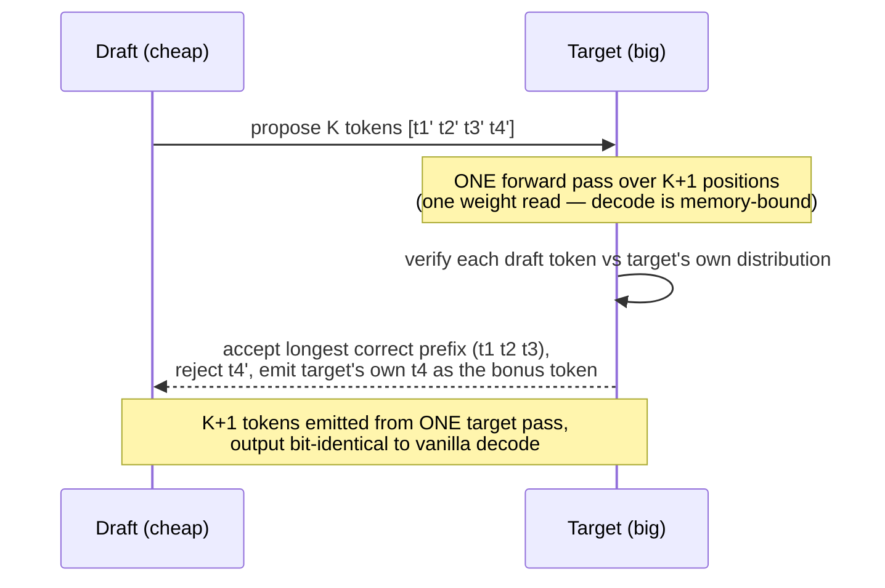

# Speculative Decoding: Guess Many, Verify Once

!!! info "Baseline: **vLLM 0.26.0** · model `Qwen2.5-7B-Instruct` · single RTX 4090 (24 GB)"
    Verified against vLLM 0.26.0 via Context7 (ADR-0004): speculative decoding is configured with `speculative_config` (Python dict) / `--speculative-config` (CLI JSON), with `method` ∈ {`"ngram"`, `"eagle"`/`"eagle3"`, `"draft_model"`}, `num_speculative_tokens` (K), and a `model` (draft/EAGLE checkpoint) where applicable — e.g. `{"method":"ngram","num_speculative_tokens":4,"prompt_lookup_min":2,"prompt_lookup_max":5}` or `{"method":"eagle","model":"…","num_speculative_tokens":2}`. The §4 model is **analytic (deterministic), not a benchmark**; acceptance rates and speedups are **illustrative / order-of-magnitude references** — real numbers depend on model, draft, and workload.

---

## 1 · Intuition & why it matters

Everything else in Part 5 raises *throughput* by packing more work onto the GPU ([continuous batching](continuous-batching.md), [PagedAttention](paged-attention.md)) or skipping redundant work ([prefix caching](prefix-caching.md)). Speculative decoding attacks a different axis: the **latency of a single sequence** — its per-token speed (TPOT/ITL). It's the lever for "make *this one* generation faster," which matters most at low batch sizes where you're not throughput-bound.

The idea rests on the [decode bottleneck](../part0/inference-flow.md) you know cold: decode is **memory-bound** — each step reads the whole model's weights from HBM to produce **one** token. That's the waste. What if a step could *verify several tokens* for roughly the same weight-read cost? That's exactly what speculative decoding does. A cheap **draft** (a small model, or even a heuristic) proposes the next K tokens; the big **target** model then runs **one** forward pass over all K+1 positions at once and checks them. Every draft token the target agrees with is accepted **for free** — you got multiple tokens out of a single expensive weight read. Because the target's forward over K+1 tokens costs almost the same as over 1 token (memory-bound: the weight read dominates, not the tiny extra compute), the accepted tokens are nearly free. And crucially, the verification is exact — **the output is identical to what the target would have generated alone.** → see the [Glossary](../glossary.md) for *Speculative decoding, Decode*.

## 2 · Mental model

Guess a run of tokens cheaply, verify them in one expensive pass (the vanilla-vs-speculative timeline is a temporal comparison, so ASCII, per ADR-0005):

```text
VANILLA decode — one target forward per token (each reads ALL weights):
  step1: target → tok1     step2: target → tok2     step3: target → tok3   …
         └ 3 full weight reads for 3 tokens; memory-bound, mostly idle compute ┘

SPECULATIVE decode — draft proposes K, target verifies K+1 in ONE pass:
  draft (cheap):  propose  [t1' t2' t3' t4']            ← K=4 guesses, tiny cost
  target (1 pass): verify  [t1  t2  t3  t4  t5]         ← ONE weight read, checks all
                    accept:  ✓   ✓   ✓   ✗
                            └ accept t1,t2,t3 (match), reject t4', take target's t4 as bonus ┘
  → 4 tokens emitted from ONE target forward instead of 4 forwards

WHY IT'S ~FREE: decode is memory-bound. A target forward over K+1 tokens reads the
  weights ONCE (same as over 1 token); the extra K positions add compute the GPU had
  idle anyway. You convert idle FLOPs into fewer weight reads.
```

The draft↔target hand-off, as one round (an interaction, so Mermaid `sequenceDiagram`, per ADR-0005):



Three shapes to hold:

- **Draft proposes, target verifies, output is exact.** The target checks each proposed token against what *it* would have produced; it accepts the longest correct prefix and emits its own token at the first mismatch. So the result is **bit-identical to vanilla target decoding** — speculative decoding is a speedup, never a quality trade.
- **The win comes from decode being memory-bound.** Verifying K+1 tokens in one pass costs ~one weight read — the same as producing one token vanilla. You're spending the GPU's *idle* compute (it was memory-bound) to cash in fewer HBM round-trips. On a compute-bound step (large batch), that idle compute isn't there, so the win shrinks.
- **Speedup is governed by the acceptance rate.** If the draft agrees with the target often (high α), you accept long runs and go fast; if the draft is bad, you reject early, waste the draft cost, and gain little. A good draft is one that's *cheap* **and** *agrees often* — those pull in opposite directions, which is the whole design problem.

## 3 · Principle

### 3.1 The accept/reject math

Model each proposed token as accepted with probability α (the per-token agreement rate between draft and target). Speculative sampling accepts the draft's tokens as a **prefix** — the first token with prob α, the first two with prob α², and so on — then the target contributes one guaranteed token at the first rejection. So the expected number of tokens emitted per target forward pass is:

$$
\mathbb{E}[\text{tokens per pass}] \;=\; \sum_{i=0}^{K} \alpha^{i} \;=\; \frac{1 - \alpha^{K+1}}{1 - \alpha}
$$

The $i=0$ term (=1) is the target's guaranteed token; the $\alpha^i$ terms are the drafted tokens that survive. Since vanilla decoding emits exactly 1 token per pass, this expectation **is** the speedup in target forward passes. At α=0.7, K=4 that's ≈2.77 — you do ~2.77× fewer expensive target passes. The formula also shows diminishing returns: past the point where α^i gets small, adding more draft tokens barely helps (and costs more draft compute).

### 3.2 Where the drafts come from

vLLM's `method` picks the draft source, each a different cheap/agreement trade-off:

- **`ngram`** — no draft *model* at all: propose tokens by matching the recent context against earlier text (prompt-lookup). Free to run, great when output repeats the input (summarization, code editing, RAG), useless on novel text. Knobs: `prompt_lookup_min`/`prompt_lookup_max`.
- **`eagle`/`eagle3`** — a tiny trained draft head that predicts the target's next tokens from its hidden states. High acceptance, small extra VRAM; the modern default when a checkpoint exists. Needs a matching EAGLE `model`.
- **`draft_model`** — a small standalone model (e.g. a 1B drafting for a 7B). General, but the draft's own forward passes cost more than ngram/EAGLE, so acceptance must be high to pay off.

`num_speculative_tokens` is K. There's even dynamic speculation (vary K by batch size) because the win fades as the batch grows compute-bound.

### 3.3 When it helps — and when it doesn't

Speculative decoding shines at **low batch size / latency-sensitive single streams**, where decode is squarely memory-bound and the GPU has idle compute to spend on verification. As the [batch grows](continuous-batching.md) and the step becomes compute-bound (past the [roofline ridge](../part2/roofline-analysis.md)), the "free" verification compute is no longer free — so the speedup shrinks, and can even go **negative** (the draft overhead isn't repaid). That's why it's a *latency* tool, not a throughput tool: use it when you're serving few concurrent requests and want each one fast, not when you're saturating the GPU with a big batch.

### 3.4 Reading it in vLLM's source (v0.26.0)

The guess-and-verify split maps to two V1 pieces (ADR-0002: read + reason, don't rewrite):

- **The proposers (guess)** live in `vllm/v1/spec_decode/`: [`ngram_proposer.py`](https://github.com/vllm-project/vllm/blob/v0.26.0/vllm/v1/spec_decode/ngram_proposer.py)'s **`NgramProposer`** matches the recent context to propose tokens with *no draft model at all*, while the EAGLE proposer (`eagle.py`) runs the tiny trained draft head. Which one runs is selected by `method` on **`SpeculativeConfig`** ([`vllm/config/speculative.py`](https://github.com/vllm-project/vllm/blob/v0.26.0/vllm/config/speculative.py)), whose `num_speculative_tokens` is the **K** of §3.1.
- **The verify step** is **`RejectionSampler`** in [`vllm/v1/sample/rejection_sampler.py`](https://github.com/vllm-project/vllm/blob/v0.26.0/vllm/v1/sample/rejection_sampler.py): it takes the drafted tokens plus the target's single forward-pass logits over all K+1 positions and applies the accept-longest-correct-prefix rule. The **exactness guarantee** (§3.1 — output identical to vanilla decode) lives right here, in how acceptance is defined.

Open `ngram_proposer.py` first — it's the K-token proposer with no model, the cheapest place to see the whole mechanism.

## 4 · Complete runnable code + line-by-line

A deterministic, analytic model of the expected tokens-per-target-pass as a function of acceptance rate α and draft length K — the exact quantity that sets the speedup. No GPU, no randomness.

```python title="speculative_decoding_model.py"
"""Speculative decoding: draft proposes K tokens, target verifies all in ONE forward pass.
Analytic model (deterministic), not a benchmark. Pure Python, offline."""
def tokens_per_target_pass(alpha, k):
    """Expected tokens emitted per target forward: accept draft token i w.p. alpha^i (prefix),
    plus 1 guaranteed token the target produces at the first mismatch (the i=0 term)."""
    return sum(alpha ** i for i in range(k + 1))   # 1 + a + a^2 + ... + a^k  ==  (1 - a^(k+1))/(1 - a)

if __name__ == "__main__":
    K = 4                                          # num_speculative_tokens the draft proposes
    print(f"proposing K={K} draft tokens per step; vanilla decode = 1.00 token per target pass\n")
    for alpha in (0.5, 0.7, 0.9):                  # per-token acceptance rate (draft/target agreement)
        toks = tokens_per_target_pass(alpha, K)
        print(f"acceptance alpha={alpha}: {toks:.2f} tokens / target pass  -> ~{toks:.2f}x fewer target forwards")
```

**Line-by-line:**

- `tokens_per_target_pass(alpha, k)` — the §3.1 sum $\sum_{i=0}^{k}\alpha^i$. The `i=0` term is the target's guaranteed token (always emitted); `i=1…k` are the drafted tokens that survive verification, each surviving with probability $\alpha^i$ (the whole prefix up to it must match). It equals the closed form $(1-\alpha^{k+1})/(1-\alpha)$.
- The loop sweeps three **acceptance rates**: a poor draft (α=0.5), a decent one (0.7), a strong one (0.9). Same K=4 each time, so you see how much the *draft quality* — not the token count — drives the speedup.
- Because vanilla decode emits exactly 1 token per target pass, the printed number **is** the speedup factor in expensive target forwards.

Expected output (analytic, deterministic — not a benchmark):

```text
proposing K=4 draft tokens per step; vanilla decode = 1.00 token per target pass

acceptance alpha=0.5: 1.94 tokens / target pass  -> ~1.94x fewer target forwards
acceptance alpha=0.7: 2.77 tokens / target pass  -> ~2.77x fewer target forwards
acceptance alpha=0.9: 4.10 tokens / target pass  -> ~4.10x fewer target forwards
```

The lesson is stark: at 90% agreement you nearly quarter your target passes; at 50% you barely break 2× — and that's *before* subtracting draft cost. This is why the entire game is **acceptance rate**: a draft that's cheap but rarely agrees (low α) wins little, while a draft that agrees often (EAGLE, or ngram on repetitive text) is what makes speculative decoding pay. Note these ignore the draft's own cost and any batch-induced compute pressure — real speedups are lower, which is why they're order-of-magnitude references, not promises.

## 5 · Lab — turn it on and watch the acceptance rate

!!! gpu "GPU Lab (single-card, runnable)"
    - **Min VRAM:** none to read; ~16 GB for `Qwen2.5-7B-Instruct` (INT4/AWQ) with `ngram` (no draft model); more if you add a `draft_model`/EAGLE checkpoint (it lives in VRAM too)
    - **Suggested AutoDL card:** RTX 4090 (24 GB)
    - **Est. time / cost:** reading ~20 min (free, no-card mode) · optional run ~15 min · ~¥2 (illustrative)
    - **Platform:** NVIDIA CUDA (default)
    - **Non-NVIDIA:** the algorithm is backend-independent; support/perf of the verification kernels varies by backend, and EAGLE/draft models need the same backend as the target.

`ngram` needs no extra model, so it's the easiest to try on one card:

```python title="try_speculative.py"
# API verified against vLLM 0.26.0 (speculative_config, method/num_speculative_tokens). Run on a GPU.
from vllm import LLM, SamplingParams

llm = LLM(
    model="Qwen/Qwen2.5-7B-Instruct",
    quantization="awq",
    speculative_config={              # ngram: propose from repeated context, no draft model
        "method": "ngram",
        "num_speculative_tokens": 4,  # K — how many tokens to guess per step
        "prompt_lookup_min": 2,
        "prompt_lookup_max": 5,
    },
)
# ngram shines when output echoes input — e.g. "repeat/normalize this text":
prompt = "Fix the grammar, keep wording identical:\n" + "the cat sat on the the mat and it were happy. " * 5
print(llm.generate([prompt], SamplingParams(max_tokens=64, temperature=0))[0].outputs[0].text[:80])
```

**What to observe / do:**

1. **Read the acceptance rate.** vLLM logs speculative-decoding metrics (draft acceptance / accepted-token counts). On the repetitive prompt above, ngram acceptance is high → fewer target passes → lower TPOT. Swap in a *novel* creative-writing prompt and watch acceptance (and the speedup) collapse — ngram has nothing to copy.
2. **Feel the batch effect.** Send one request vs a large concurrent batch and compare the speedup. At batch 1 (memory-bound) it helps; as the batch grows compute-bound, the gain shrinks — §3.3 made real.
3. **Try a draft model / EAGLE (if VRAM allows).** Swap `method` to `"eagle"` with a matching draft `model` and compare acceptance on general text — higher than ngram there, at the cost of extra VRAM for the draft.

## 6 · Common pitfalls / counter-intuitive points

- **Thinking it changes outputs.** It doesn't — verification makes the result **identical** to vanilla target decoding. Speculative decoding is pure latency, never a quality/accuracy trade. (If outputs differ, it's a bug.)
- **Believing bigger K is always faster.** The $\sum \alpha^i$ has diminishing returns; past a point extra draft tokens rarely survive but always cost draft compute. The right K depends on α — high acceptance justifies a larger K.
- **Using it to raise throughput on a saturated GPU.** It's a *latency* tool. At large batch (compute-bound), the verification compute isn't free and the draft overhead can make you *slower*. Reach for it at low concurrency, not to push a maxed-out batch.
- **Picking ngram for novel text.** ngram only proposes tokens it can find in the recent context — great for summarization/editing/RAG (output echoes input), near-useless for open-ended generation. Match the draft method to the workload.
- **Ignoring the draft's cost/quality trade.** A big accurate draft has high α but its own forwards are expensive; a tiny draft is cheap but low α. The sweet spot (why EAGLE exists) is a draft that's *both* cheap and well-aligned to the target.
- **Forgetting the draft eats VRAM (except ngram).** A `draft_model`/EAGLE checkpoint sits in the same GPU memory as the target, reducing the [KV-cache budget](paged-attention.md). ngram is the zero-VRAM option.
- **Assuming any draft config fits any target.** A `draft_model`/EAGLE checkpoint must match the target's family and tokenizer — a mismatched draft tanks acceptance (or fails to load). And `num_speculative_tokens` isn't free-form for every method: for MTP-style drafts vLLM requires it be **divisible by** the draft's `n_predict`, or `SpeculativeConfig` raises at startup. Pick a K the method supports, and a draft trained for *your* target.

## 7 · Interview links

- [Speculative decoding: guess-and-verify](../interview/speculative-decoding.md) — the high-frequency question this lesson prepares you for: *how guess-and-verify works, why it's free-lunch only because decode is memory-bound, what sets the speedup, and when it backfires.*

## 8 · Summary & further reading

**One line:** Speculative decoding uses a cheap draft to propose K tokens and the big target to verify all K+1 in a single forward pass, accepting the longest correct prefix — so you emit multiple tokens per expensive target weight-read with **bit-identical output**; the speedup is the expected accepted-run length $\sum_{i=0}^{K}\alpha^i$, it's nearly free only because decode is memory-bound (idle compute pays for verification), and it's a low-batch *latency* tool that fades — even backfires — as the batch grows compute-bound.

Further reading:

- Leviathan et al. / Chen et al. — the original *speculative decoding* / *speculative sampling* papers (the accept/reject rule and its exactness proof).
- vLLM `docs/features/speculative_decoding/` — the `ngram`, `eagle`/`eagle3`, and `draft_model` configs and their trade-offs.
- vLLM source (v0.26.0): [`vllm/v1/spec_decode/ngram_proposer.py`](https://github.com/vllm-project/vllm/blob/v0.26.0/vllm/v1/spec_decode/ngram_proposer.py) (`NgramProposer`), [`vllm/v1/sample/rejection_sampler.py`](https://github.com/vllm-project/vllm/blob/v0.26.0/vllm/v1/sample/rejection_sampler.py) (`RejectionSampler`), [`vllm/config/speculative.py`](https://github.com/vllm-project/vllm/blob/v0.26.0/vllm/config/speculative.py) (`SpeculativeConfig`) — the propose/verify/config code from §3.4.
- The [inference-flow lesson](../part0/inference-flow.md) and [roofline](../part2/roofline-analysis.md) — why decode is memory-bound (the premise) and where the batch turns compute-bound (where the win fades).
- The [continuous-batching lesson](continuous-batching.md) — the throughput axis speculative decoding does *not* address; the two are complementary.

## 9 · Self-check

??? question "Why is speculative decoding nearly free at batch size 1 but not at large batch?"
    Because at batch 1, decode is firmly **memory-bound**: each step's cost is dominated by reading the model's weights from HBM, and the GPU's compute sits mostly idle. A target forward that verifies K+1 tokens reads the weights **once** (the same as producing one token) and uses that idle compute for the extra positions — so the accepted tokens cost almost nothing. As the batch grows, the step becomes **compute-bound** (past the roofline ridge): now that "idle" compute is fully used serving the batch, so verifying extra tokens is *not* free — it competes with real work. The draft overhead may then exceed the benefit, so the speedup shrinks or goes negative. Hence it's a low-concurrency latency tool, not a throughput tool.

??? question "Does speculative decoding change the generated text? Justify your answer from the accept/reject rule."
    No — the output is **bit-identical** to what the target would generate alone. The draft only *proposes* tokens; the target then verifies each against its own distribution and accepts the drafted token only where it matches (speculative sampling makes this acceptance exact in distribution), emitting the target's own token at the first mismatch. So every emitted token is one the target itself would have produced — the draft merely lets several of them be confirmed in a single pass. Speculation affects *speed*, never *content*; differing output indicates a bug, not the algorithm.

??? question "Your draft accepts ~50% of tokens (α≈0.5) with K=4 and you see little speedup. Give two levers, and say which draft method you'd try for a summarization workload."
    From $\mathbb{E}=\sum_{i=0}^{4}\alpha^i$, α=0.5 gives only ~1.94 tokens/pass *before* draft cost — barely 2×, and the draft's own compute eats into it. Two levers: (1) **Raise acceptance α** with a better-aligned draft — the dominant factor; a well-trained **EAGLE** head typically agrees far more often than a generic small draft, lifting the whole $\sum\alpha^i$. (2) **Tune K to α** — with low α, a large K wastes draft compute on tokens that won't survive, so a *smaller* K may net more; with high α, raise K. For a **summarization** workload specifically, try **`ngram`**: the output heavily echoes the input document, so prompt-lookup drafting achieves high acceptance at *zero* draft-model cost and no extra VRAM — often the best choice for copy-heavy tasks.
