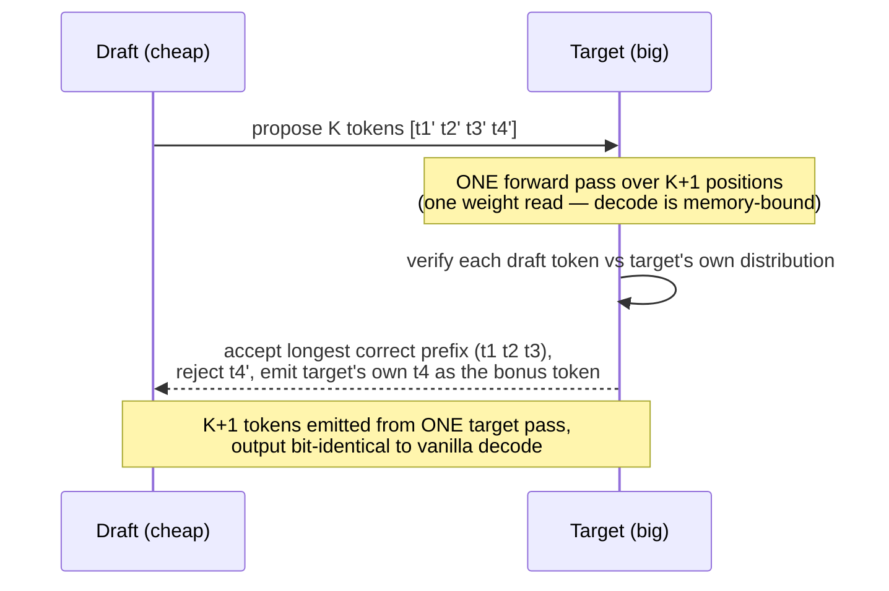

# Speculative Decoding：猜多个，验一次

!!! info "基线：**vLLM 0.26.0** · 模型 `Qwen2.5-7B-Instruct` · 单张 RTX 4090 (24 GB)"
    经 Context7 针对 vLLM 0.26.0 核实（ADR-0004）：speculative decoding 用 `speculative_config`（Python dict）/ `--speculative-config`（CLI JSON）配置，`method` ∈ {`"ngram"`、`"eagle"`/`"eagle3"`、`"draft_model"`}、`num_speculative_tokens`（K）、以及适用时的 `model`（draft/EAGLE 检查点）——如 `{"method":"ngram","num_speculative_tokens":4,"prompt_lookup_min":2,"prompt_lookup_max":5}` 或 `{"method":"eagle","model":"…","num_speculative_tokens":2}`。§4 模型是**解析式（确定性），不是 benchmark**；接受率与加速为**示例 / 量级参考**——真实数字取决于模型、draft 与负载。

---

## 1 · 直觉 & 为什么重要

Part 5 里其他一切都靠往 GPU 塞更多工作（[continuous batching](continuous-batching.md)、[PagedAttention](paged-attention.md)）或跳过冗余工作（[prefix caching](prefix-caching.md)）来提*吞吐*。Speculative decoding 攻的是另一个轴：**单条序列的延迟**——它的每 token 速度（TPOT/ITL）。它是「让*这一条*生成更快」的杠杆，在低批量、你不受吞吐约束时最要紧。

这个点子建立在你烂熟的[decode 瓶颈](../part0/inference-flow.md)上：decode 是 **memory-bound**——每步把整个模型权重从 HBM 读来产出**一个** token。那就是浪费。要是一步能*验证好几个 token*、代价却几乎等同一次权重读取呢？这正是 speculative decoding 做的。一个便宜的 **draft**（小模型，甚至一个启发式）提议接下来 K 个 token；大 **target** 模型随后对全部 K+1 个位置跑**一次** forward 一起校验。target 认同的每个 draft token 都被**免费**接受——你用一次昂贵的权重读取拿到了多个 token。因为 target 对 K+1 个 token 的 forward 与对 1 个 token 代价几乎相同（memory-bound：主导的是权重读取，不是那点额外计算），被接受的 token 近乎免费。而且关键地，校验是精确的——**输出与 target 单独生成的完全相同。** → 术语见 [Glossary](../glossary.md) 的 *Speculative decoding、Decode*。

## 2 · 心智模型

便宜地猜一串 token，用一次昂贵的 pass 校验它们（vanilla 对 speculative 的时间线是时序对比，按 ADR-0005 用 ASCII）：

```text
VANILLA decode —— 每 token 一次 target forward（每次读全部权重）：
  step1: target → tok1     step2: target → tok2     step3: target → tok3   …
         └ 3 个 token 读 3 次全权重；memory-bound，计算大多空闲 ┘

SPECULATIVE decode —— draft 提议 K 个，target 一次校验 K+1：
  draft（便宜）:   提议  [t1' t2' t3' t4']            ← K=4 个猜测，代价极小
  target（1 pass）: 校验 [t1  t2  t3  t4  t5]         ← 一次权重读取，全部检查
                    接受:  ✓   ✓   ✓   ✗
                          └ 接受 t1,t2,t3（匹配），拒 t4'，取 target 的 t4 作 bonus ┘
  → 一次 target forward 吐 4 个 token，而非 4 次 forward

为何近乎免费：decode 是 memory-bound。target 对 K+1 个 token 的 forward 只读
  权重一次（与 1 个 token 相同）；额外 K 个位置用的是 GPU 本来就空闲的计算。
  你把空闲 FLOPs 换成更少的权重读取。
```

draft 与 target 的一轮交接（一次交互，按 ADR-0005 用 Mermaid `sequenceDiagram`）：



三个要记的形状：

- **draft 提议、target 校验、输出精确。** target 用*它自己*会产出的东西核对每个提议 token；它接受最长的正确前缀、在第一个不匹配处吐出它自己的 token。所以结果与 vanilla target decoding **逐位相同**——speculative decoding 是加速，绝非质量权衡。
- **收益源自 decode 是 memory-bound。** 一次校验 K+1 个 token 代价约等于一次权重读取——与 vanilla 产一个 token 相同。你在花 GPU 的*空闲*计算（它本就 memory-bound）来兑换更少的 HBM 往返。在 compute-bound 的步上（大批），那空闲计算不存在，收益就缩水。
- **加速由接受率决定。** 若 draft 常与 target 一致（高 α），你接受长串、跑得快；若 draft 差，你早早拒绝、浪费 draft 代价、收益寥寥。好 draft 是*便宜***且***常一致*的——两者相互拉扯，这正是核心设计难题。

## 3 · 原理

### 3.1 接受/拒绝数学

把每个提议 token 建模为以概率 α 被接受（draft 与 target 的每 token 一致率）。Speculative sampling 把 draft 的 token 作为**前缀**接受——第一个以概率 α、前两个以概率 α²，以此类推——然后 target 在第一个拒绝处贡献一个保证的 token。于是每次 target forward 吐出的期望 token 数为：

$$
\mathbb{E}[\text{每 pass token 数}] \;=\; \sum_{i=0}^{K} \alpha^{i} \;=\; \frac{1 - \alpha^{K+1}}{1 - \alpha}
$$

$i=0$ 项（=1）是 target 保证的 token；$\alpha^i$ 项是存活的 draft token。因为 vanilla decoding 每 pass 恰吐 1 个 token，这个期望**就是** target forward 次数上的加速。α=0.7、K=4 时 ≈2.77——你少做约 2.77× 昂贵的 target pass。公式也显示递减收益：过了 α^i 变小的点，再加 draft token 几乎无益（且更费 draft 计算）。

### 3.2 draft 从哪来

vLLM 的 `method` 选 draft 来源，各是不同的便宜/一致权衡：

- **`ngram`**——完全没有 draft *模型*：靠把近期上下文与更早文本匹配来提议 token（prompt-lookup）。运行免费，输出重复输入时极好（摘要、代码编辑、RAG），在新文本上无用。旋钮：`prompt_lookup_min`/`prompt_lookup_max`。
- **`eagle`/`eagle3`**——一个训练过的小 draft 头，从 target 的 hidden states 预测其下几个 token。高接受率、额外 VRAM 小；有检查点时的现代默认。需匹配的 EAGLE `model`。
- **`draft_model`**——一个独立小模型（如 1B 为 7B 起草）。通用，但 draft 自己的 forward 比 ngram/EAGLE 贵，所以接受率必须高才划算。

`num_speculative_tokens` 是 K。甚至有动态推测（按批量变 K），因为批变大转 compute-bound 时收益消退。

### 3.3 何时有用——何时无用

Speculative decoding 在**低批量 / 延迟敏感的单流**上闪光，那里 decode 稳稳 memory-bound、GPU 有空闲计算可花在校验上。随着[批变大](continuous-batching.md)、步变 compute-bound（过了 [roofline 屋脊](../part2/roofline-analysis.md)），那「免费」的校验计算不再免费——所以加速缩水，甚至可能变**负**（draft 开销收不回）。这就是为什么它是*延迟*工具，不是吞吐工具：在你服务少量并发请求、想让每个都快时用，而非在用大批打满 GPU 时用。

### 3.4 在 vLLM 源码里读它（v0.26.0）

猜-验分工映射到两块 V1 代码（ADR-0002：读懂 + 会推理，不重写）：

- **proposer（猜）**在 `vllm/v1/spec_decode/`：[`ngram_proposer.py`](https://github.com/vllm-project/vllm/blob/v0.26.0/vllm/v1/spec_decode/ngram_proposer.py) 的 **`NgramProposer`** 靠匹配近期上下文来提议 token，*完全不用 draft 模型*；EAGLE proposer（`eagle.py`）跑那个小小的训练过的 draft 头。跑哪一个由 **`SpeculativeConfig`**（[`vllm/config/speculative.py`](https://github.com/vllm-project/vllm/blob/v0.26.0/vllm/config/speculative.py)）上的 `method` 选，其 `num_speculative_tokens` 就是 §3.1 的 **K**。
- **校验步**是 **`RejectionSampler`**，在 [`vllm/v1/sample/rejection_sampler.py`](https://github.com/vllm-project/vllm/blob/v0.26.0/vllm/v1/sample/rejection_sampler.py)：它拿 draft 提议的 token 加上 target 对全部 K+1 个位置的一次前向 logits，套用「接受最长正确前缀」规则。**精确性保证**（§3.1——输出与 vanilla decode 相同）就落在这里，落在接受规则的定义方式上。

先打开 `ngram_proposer.py`：它是无模型的 K-token proposer，看清整个机制最便宜的入口。

## 4 · 完整可跑代码 + 逐行讲解

一个确定性、解析式的模型，刻画每次 target pass 期望 token 数关于接受率 α 与 draft 长度 K 的函数——正是设定加速的量。无 GPU、无随机。

```python title="speculative_decoding_model.py"
"""Speculative decoding：draft 提议 K 个 token，target 用一次 forward 校验全部。
解析模型（确定性），不是 benchmark。纯 Python、离线。"""
def tokens_per_target_pass(alpha, k):
    """每次 target forward 吐出的期望 token 数：draft token i 以概率 alpha^i 被接受（前缀），
    加上 target 在第一个不匹配处产出的 1 个保证 token（i=0 项）。"""
    return sum(alpha ** i for i in range(k + 1))   # 1 + a + a^2 + ... + a^k  ==  (1 - a^(k+1))/(1 - a)

if __name__ == "__main__":
    K = 4                                          # draft 每步提议的 num_speculative_tokens
    print(f"proposing K={K} draft tokens per step; vanilla decode = 1.00 token per target pass\n")
    for alpha in (0.5, 0.7, 0.9):                  # 每 token 接受率（draft/target 一致度）
        toks = tokens_per_target_pass(alpha, K)
        print(f"acceptance alpha={alpha}: {toks:.2f} tokens / target pass  -> ~{toks:.2f}x fewer target forwards")
```

**逐行讲解：**

- `tokens_per_target_pass(alpha, k)`——§3.1 的和 $\sum_{i=0}^{k}\alpha^i$。`i=0` 项是 target 保证的 token（总吐出）；`i=1…k` 是通过校验存活的 draft token，各以概率 $\alpha^i$ 存活（到它为止的整个前缀必须匹配）。它等于闭式 $(1-\alpha^{k+1})/(1-\alpha)$。
- 循环扫三个**接受率**：差 draft（α=0.5）、尚可（0.7）、强（0.9）。每次同样 K=4，于是你看到是 *draft 质量*——而非 token 数——驱动加速。
- 因为 vanilla decode 每 target pass 恰吐 1 个 token，打印的数字**就是**昂贵 target forward 上的加速倍数。

预期输出（解析、确定性——不是 benchmark）：

```text
proposing K=4 draft tokens per step; vanilla decode = 1.00 token per target pass

acceptance alpha=0.5: 1.94 tokens / target pass  -> ~1.94x fewer target forwards
acceptance alpha=0.7: 2.77 tokens / target pass  -> ~2.77x fewer target forwards
acceptance alpha=0.9: 4.10 tokens / target pass  -> ~4.10x fewer target forwards
```

教训鲜明：90% 一致时你几乎把 target pass 减到四分之一；50% 时勉强过 2×——而且这还是*减去 draft 代价之前*。这就是为什么整个游戏是**接受率**：便宜但少一致（低 α）的 draft 收益寥寥，而常一致（EAGLE，或重复文本上的 ngram）的 draft 才让 speculative decoding 划算。注意这些忽略了 draft 自身代价与任何批量带来的计算压力——真实加速更低，所以它们是量级参考、不是承诺。

## 5 · Lab——开启它，看接受率

!!! gpu "GPU Lab（单卡，可跑）"
    - **最低显存：** 读不需要；用 `ngram`（无 draft 模型）跑 `Qwen2.5-7B-Instruct`（INT4/AWQ）需 ~16 GB；若加 `draft_model`/EAGLE 检查点（它也占 VRAM）需更多
    - **建议 AutoDL 卡型：** RTX 4090 (24 GB)
    - **预估耗时 / 花费：** 读 ~20 分钟（免费，无卡模式）· 可选运行 ~15 分钟 · ~¥2（示例）
    - **平台：** NVIDIA CUDA（默认）
    - **非 NVIDIA：** 算法与后端无关；校验 kernel 的支持/性能随后端而异，EAGLE/draft 模型需与 target 同后端。

`ngram` 无需额外模型，是单卡上最易试的：

```python title="try_speculative.py"
# API 针对 vLLM 0.26.0 核实（speculative_config、method/num_speculative_tokens）。在 GPU 上跑。
from vllm import LLM, SamplingParams

llm = LLM(
    model="Qwen/Qwen2.5-7B-Instruct",
    quantization="awq",
    speculative_config={              # ngram：从重复上下文提议，无 draft 模型
        "method": "ngram",
        "num_speculative_tokens": 4,  # K —— 每步猜几个 token
        "prompt_lookup_min": 2,
        "prompt_lookup_max": 5,
    },
)
# ngram 在输出回响输入时闪光——如「重复/规范化这段文本」：
prompt = "Fix the grammar, keep wording identical:\n" + "the cat sat on the the mat and it were happy. " * 5
print(llm.generate([prompt], SamplingParams(max_tokens=64, temperature=0))[0].outputs[0].text[:80])
```

**观察/动手：**

1. **读接受率。** vLLM 记录 speculative-decoding 指标（draft 接受 / 已接受 token 数）。在上面的重复 prompt 上，ngram 接受率高 → target pass 更少 → TPOT 更低。换个*新颖*的创意写作 prompt，看接受率（与加速）崩塌——ngram 没东西可抄。
2. **感受批量效应。** 发一个请求 vs 一个大并发批，对比加速。批为 1（memory-bound）时它帮忙；批变大转 compute-bound 时增益缩水——§3.3 的具象化。
3. **试 draft 模型 / EAGLE（若 VRAM 允许）。** 把 `method` 换成 `"eagle"` + 匹配的 draft `model`，对比一般文本上的接受率——那里比 ngram 高，代价是 draft 的额外 VRAM。

## 6 · 常见坑 / 反直觉点

- **以为它改变输出。** 不——校验使结果与 vanilla target decoding **相同**。Speculative decoding 是纯延迟，绝非质量/精度权衡。（若输出不同，那是 bug。）
- **相信 K 越大越快。** $\sum \alpha^i$ 有递减收益；过了某点，额外 draft token 很少存活却总耗 draft 计算。正确的 K 取决于 α——高接受率才配大 K。
- **用它在打满的 GPU 上提吞吐。** 它是*延迟*工具。大批（compute-bound）时校验计算不免费、draft 开销可能让你*更慢*。在低并发时伸手，别用来推一个已满的批。
- **对新文本选 ngram。** ngram 只提议它能在近期上下文里找到的 token——摘要/编辑/RAG（输出回响输入）极好，开放式生成几乎无用。让 draft 方法匹配负载。
- **忽略 draft 的代价/质量权衡。** 大而准的 draft 有高 α 但自身 forward 贵；极小的 draft 便宜但 α 低。甜点（EAGLE 存在的原因）是一个*既*便宜*又*与 target 良好对齐的 draft。
- **忘了 draft 吃 VRAM（ngram 除外）。** `draft_model`/EAGLE 检查点与 target 同占 GPU 显存，减少 [KV-cache 预算](paged-attention.md)。ngram 是零 VRAM 选项。
- **以为任意 draft 配置都配任意 target。** `draft_model`/EAGLE 检查点必须与 target 同族、同 tokenizer——不匹配的 draft 会拉垮接受率（或干脆加载失败）。而 `num_speculative_tokens` 并非对每种 method 都可随意取：对 MTP 式 draft，vLLM 要求它能**整除** draft 的 `n_predict`，否则 `SpeculativeConfig` 会在启动时报错。选一个该 method 支持的 K，以及一个为*你的* target 训练的 draft。

## 7 · 面试连线

- [Speculative decoding：猜测-校验](../interview/speculative-decoding.md)——本课为你准备的高频题：*猜测-校验如何运作、为何只因 decode memory-bound 才是免费午餐、什么设定加速、以及何时反噬。*

## 8 · 小结 & 延伸阅读

**一句话：** Speculative decoding 用便宜的 draft 提议 K 个 token、用大 target 在一次 forward 里校验全部 K+1、接受最长的正确前缀——于是每次昂贵的 target 权重读取吐出多个 token 且**输出逐位相同**；加速是期望接受串长 $\sum_{i=0}^{K}\alpha^i$，它近乎免费只因 decode 是 memory-bound（空闲计算付校验的账），且它是低批量*延迟*工具，随批变 compute-bound 而消退——甚至反噬。

延伸阅读：

- Leviathan 等 / Chen 等——原始 *speculative decoding* / *speculative sampling* 论文（接受/拒绝规则及其精确性证明）。
- vLLM `docs/features/speculative_decoding/`——`ngram`、`eagle`/`eagle3`、`draft_model` 配置及其权衡。
- vLLM 源码（v0.26.0）：[`vllm/v1/spec_decode/ngram_proposer.py`](https://github.com/vllm-project/vllm/blob/v0.26.0/vllm/v1/spec_decode/ngram_proposer.py)（`NgramProposer`）、[`vllm/v1/sample/rejection_sampler.py`](https://github.com/vllm-project/vllm/blob/v0.26.0/vllm/v1/sample/rejection_sampler.py)（`RejectionSampler`）、[`vllm/config/speculative.py`](https://github.com/vllm-project/vllm/blob/v0.26.0/vllm/config/speculative.py)（`SpeculativeConfig`）—— §3.4 的提议/校验/配置代码。
- [推理流程课](../part0/inference-flow.md) 与 [roofline](../part2/roofline-analysis.md)——为何 decode memory-bound（前提）、批在哪转 compute-bound（收益在哪消退）。
- [continuous-batching 课](continuous-batching.md)——speculative decoding *不*触及的吞吐轴；两者互补。

## 9 · 自测小问

??? question "为什么 speculative decoding 在 batch=1 近乎免费，大批时却不是？"
    因为 batch=1 时 decode 稳稳 **memory-bound**：每步代价由从 HBM 读模型权重主导，GPU 计算大多空闲。校验 K+1 个 token 的 target forward 只读权重**一次**（与产一个 token 相同），并用那空闲计算处理额外位置——所以被接受的 token 几乎不花钱。随批变大，步变 **compute-bound**（过了 roofline 屋脊）：现在那「空闲」计算已被服务批用满，校验额外 token 就*不*免费了——它与真实工作竞争。draft 开销可能超过收益，于是加速缩水甚至变负。故它是低并发延迟工具，不是吞吐工具。

??? question "Speculative decoding 会改变生成文本吗？用接受/拒绝规则论证。"
    不——输出与 target 单独生成的**逐位相同**。draft 只*提议* token；target 随后用自己的分布校验每个、只在匹配处接受 draft token（speculative sampling 让这种接受在分布上精确），在第一个不匹配处吐出 target 自己的 token。所以每个吐出的 token 都是 target 自己本会产出的——draft 只是让其中几个在一次 pass 里被确认。推测影响*速度*，绝不影响*内容*；输出不同意味着 bug，不是算法。

??? question "你的 draft 接受约 50% token（α≈0.5）、K=4，却几乎没加速。给两个杠杆，并说对摘要负载你会试哪种 draft 方法。"
    由 $\mathbb{E}=\sum_{i=0}^{4}\alpha^i$，α=0.5 只给约 1.94 token/pass——*减去 draft 代价之前*——勉强 2×，draft 自身计算还要吃掉一部分。两个杠杆：（1）用更对齐的 draft **提高接受率 α**——主导因素；训练良好的 **EAGLE** 头通常比通用小 draft 一致得多，抬升整个 $\sum\alpha^i$。（2）**按 α 调 K**——低 α 时大 K 把 draft 计算浪费在不会存活的 token 上，所以*更小*的 K 可能净收益更多；高 α 时才提高 K。对**摘要**负载具体地，试 **`ngram`**：输出大量回响输入文档，所以 prompt-lookup 起草以*零* draft 模型代价、无额外 VRAM 达成高接受率——对复制重的任务常是最佳选择。
