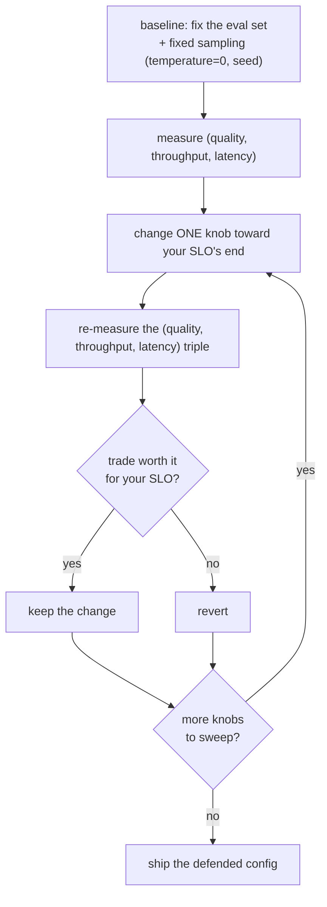

# 调参旋钮：扫过吞吐/延迟曲线

!!! info "基线：**vLLM 0.26.0** · 模型 `Qwen2.5-7B-Instruct` · 单张 RTX 4090 (24 GB)"
    这里的每个旋钮都经 Context7 针对 vLLM 0.26.0 核实（ADR-0004）：`gpu_memory_utilization`（默认 **0.92**）、`max_num_seqs`（**128**）、`max_num_batched_tokens`（**2048**，自动调）、`enable_chunked_prefill`（**True**）、`enable_prefix_caching`（**V1 默认开**）、`quantization`、`kv_cache_dtype="fp8"`、`enforce_eager`（关 CUDA graphs）、`tensor_parallel_size`、`max_model_len`。§4 的地图是**方向地图，不是 benchmark**——它说每个旋钮把曲线往*哪个方向*推，从不给量级。§5 的 sweep 会产出数字，但**那是你的**：按 ADR-0004 作者不执行；每个数字都是你在自己机器上对着[评测集](../eval/index.md)测出的**示例 / 量级参考**。

---

## 1 · 直觉 & 为什么重要

你见过了每个机制（[batching](continuous-batching.md)、[paging](paged-attention.md)、[chunked prefill](scheduler-chunked-prefill-pd.md)、[prefix caching](prefix-caching.md)、[spec decoding](speculative-decoding.md)）以及它们住在哪的[地图](vllm-architecture-map.md)。这是收官课：**暴露这些机制的旋钮，以及如何为真实 SLO 拧它们。**「你在 4090 上服务 Qwen，TTFT 太高——你改什么？」正是整个 Part 5 铺垫的问题，答案从不是单个旋钮——而是知道哪个旋钮移动吞吐↔延迟曲线的哪一端，并去*测量*那个移动。

一个心态转变：**没有普遍意义上「快」的配置——只有为某个目标调出的配置。** 每个旋钮都拿一样东西换另一样（吞吐换延迟、VRAM 换质量、TTFT 换 ITL）。所以专业工作流不是「设好魔法值」；而是**sweep**：固定一个[评测集](../eval/index.md)、改*一个*旋钮、测（质量、吞吐、延迟）三元组、只在这个换值划算时保留。本课给你每个旋钮的方向（好让你 sweep *对的*那个）与测量量级的 harness（因为量级永远与机器相关）。→ 度量术语（TTFT、TPOT/ITL、throughput、goodput）见 [Glossary](../glossary.md)。

## 2 · 心智模型

一条曲线、两端、以及哪个旋钮往哪推（旋钮落在光谱上的这张图是概念性布局，按 ADR-0005 用 ASCII）：

```text
        吞吐  ◄─────────────────────────────────────►  延迟
        (tokens/s, 多并发)                  (低 TTFT / ITL, 少并发)

  推向吞吐 →                         推向延迟 →
    gpu_memory_utilization ↑            max_num_batched_tokens ↓（更平滑 ITL）
    max_num_seqs ↑                      enforce_eager = False（保留 CUDA graphs）
    max_num_batched_tokens ↑            speculative decoding（单流）
    quantization (INT4) → 更多 KV        更少并发请求
    kv_cache_dtype fp8 → 更多 KV        （所有「容量」旋钮也削减排队延迟）

  免费的赢（两端都帮、几乎无代价）：
    enable_prefix_caching（共享前缀上）   quantization（腾 VRAM 且加速 decode）
```

以及把这张图变成一个设置的方法——**sweep（扫）**（一个控制回路，按 ADR-0005 用 Mermaid）：



三个要记的形状：

- **旋钮都在一条曲线上；你选一个点，不是「最优」。** 推向吞吐（更大批、更多 KV 容量）在饱和时通常代价是每请求延迟；推向延迟（更小 token 预算、spec decoding）通常代价是总吞吐。先命名你的 SLO，再拧移动那一端的旋钮。
- **容量旋钮是总闸，其中一些近乎免费。** 任何能装*更多 KV* 的——`gpu_memory_utilization ↑`、[量化](../part4/index.md)、[FP8 KV cache](../part4/quantization-methods.md)——都抬高并发天花板，既提吞吐*又*削减排队延迟。量化与 prefix caching 最接近免费午餐（帮忙却无对称代价，除了一点质量）。
- **你从不盲调——你对着评测集 sweep。** [测量循环](../eval/index.md) 就是方法：基线 → 改一个旋钮 → 重测（质量、吞吐、延迟）三元组 → 留或退。一次一个旋钮、固定采样。数字永远是你的。

## 3 · 原理——旋钮，按它移动什么分组

### 3.1 容量旋钮（抬高并发天花板 → 吞吐）

它们都扩大 [KV-cache 预算](paged-attention.md)，装下更大的 [continuous batch](continuous-batching.md)：

- **`gpu_memory_utilization`**（0.92）——引擎可用的 VRAM 占比；↑ → 更多 KV block → 更大批。太高 → 启动 OOM。
- **`quantization`**（INT4/AWQ）——缩小权重 → 给 KV 腾预算*且*加速 memory-bound decode。代价是一点质量（去测）。
- **`kv_cache_dtype="fp8"`**——KV 字节减半 → ~2× KV 容量 → 更多序列。代价是一点 KV 精度。
- **`max_model_len`**——限每序列 KV；调低让更多（更短上下文）序列装下。

### 3.2 批形状旋钮（吞吐 vs 延迟平衡）

- **`max_num_seqs`**（128）——运行集宽度天花板；↑ → 更多并发，但打满算力后每请求延迟上升。
- **`max_num_batched_tokens`**（2048，自动）——[chunked-prefill](scheduler-chunked-prefill-pd.md) 旋钮：↑ → 更好 TTFT 与吞吐但更差 ITL；↓ → 更平滑 ITL。文档建议对小模型/大 GPU 用 >8192 提吞吐。
- **`enable_chunked_prefill`**（True）——让 prefill 与 decode 共享一步；长 prompt 下保持 ITL 平滑。

### 3.3 复用与延迟旋钮

- **`enable_prefix_caching`**（开）——为[共享前缀](prefix-caching.md)跳过 prefill；命中重的流量上近乎免费的吞吐 + TTFT。
- **speculative decoding**（[`speculative_config`](speculative-decoding.md)）——低批量下削单流 TPOT；高批量消退/反噬。
- **`enforce_eager`**（False）——保持 False 以保留 [CUDA graphs](../part2/kernel-fusion-cuda-graphs.md)（更低 decode 延迟）；只在需省 VRAM/启动时设 True，代价是 decode 变慢。

### 3.4 扩展旋钮

- **`tensor_parallel_size`**（[TP](../part2/index.md)）——把模型切到多卡；装下更大模型/增加余量并削减计算延迟，代价是跨 GPU 通信。多卡（按 ADR-0001 属 A100 范畴）；单张 4090 上就是 1。

### 3.5 方法：sweep，别猜

没有一张「推荐值」表能在你的模型、硬件、流量面前存活。耐久的技能是 **sweep**：挑移动你目标端的旋钮（§2），在几个值上变化它，对着固定的[评测集](../eval/index.md)测（质量、吞吐、延迟）三元组——一次改*一个*旋钮、固定采样（`temperature=0`、固定 `seed`）。保留那个你能为其权衡辩护的设置。

### 3.6 在 vLLM 源码里读它（v0.26.0）

这里每个旋钮都是某个 config dataclass 上的带类型字段——读源码才是弄清*你这个版本*真实默认值与取值范围的办法，而不是信博客（ADR-0002：读懂 + 会推理）：

- **容量 / KV 旋钮**在 **`CacheConfig`**（[`vllm/config/cache.py`](https://github.com/vllm-project/vllm/blob/v0.26.0/vllm/config/cache.py)）：`gpu_memory_utilization` 在那儿字面就是 `Field(default=0.92, gt=0, le=1)`，同处还有 `kv_cache_dtype`、`enable_prefix_caching`、`block_size`。
- **批形状旋钮**在 **`SchedulerConfig`**（[`vllm/config/scheduler.py`](https://github.com/vllm-project/vllm/blob/v0.26.0/vllm/config/scheduler.py)）：`max_num_seqs`、`max_num_batched_tokens`、`enable_chunked_prefill`、`long_prefill_token_threshold`。
- **CLI/`LLM(...)` 粘合层**是 **`EngineArgs`**（[`vllm/engine/arg_utils.py`](https://github.com/vllm-project/vllm/blob/v0.26.0/vllm/engine/arg_utils.py)）：它在 `create_engine_config` 里把 `--gpu-memory-utilization`、`--max-num-seqs` 等映射到那些 dataclass。所以一个 flag、它的 `LLM(...)` kwarg、以及 config 字段，是同一个值的三种视图——而字段的声明才是其默认值的权威来源。

打开 `cache.py` 与 `scheduler.py` 直接读字段默认值；那才是「X 的默认值是多少？」的诚实版本。

## 4 · 完整可跑代码 + 逐行讲解

一个纯 Python **方向地图**：每个旋钮、它往哪推吞吐与延迟、换什么、以及针对给定目标的推荐器。它把 §3 编码，让你 sweep *对的*旋钮——离线、无 GPU，且刻意**不给捏造的量级**（那是 §5 sweep 去测的）。

```python title="tuning_knobs_map.py"
"""每个 vLLM 旋钮及它把吞吐/延迟曲线往哪推。
纯 Python、离线——方向地图，不是测出的量级（量级是你去测的）。"""

# 旋钮: (吞吐, 延迟, 换什么, 默认)
KNOBS = {
    "gpu_memory_utilization ↑": ("↑ more KV blocks",   "≈ (risk OOM)",   "VRAM headroom",            "0.92"),
    "max_num_seqs ↑":           ("↑ wider batch",      "↑ at saturation","batch width",              "128"),
    "max_num_batched_tokens ↑": ("↑ + better TTFT",    "↑ ITL",          "TTFT vs ITL",              "2048"),
    "quantization INT4/AWQ":    ("↑ frees VRAM",       "↓ per-token",    "some output quality",      "off"),
    "kv_cache_dtype fp8":       ("↑ ~2x KV capacity",  "≈",              "some KV precision",        "auto"),
    "enable_prefix_caching":    ("↑ on shared prefix", "↓ TTFT on hits", "~nothing (V1 default on)", "on"),
    "enforce_eager=True":       ("↓ no CUDA graphs",   "↑ decode",       "saves VRAM/startup",       "off"),
    "tensor_parallel_size ↑":   ("↑ bigger models fit","↓ (+comm cost)", "multi-GPU + comm",         "1"),
}

def recommend(goal):
    """把某目标（'throughput' 或 'latency'）往好方向推的旋钮（忽略其代价）。"""
    out = []
    for knob, (thru, lat, *_rest) in KNOBS.items():
        if goal == "throughput" and thru.startswith("↑"): out.append(knob)
        if goal == "latency"    and lat.startswith("↓"):  out.append(knob)
    return out

if __name__ == "__main__":
    print(f"{'knob':<26}{'throughput':<21}{'latency':<17}trades")
    for knob, (thru, lat, trade, _d) in KNOBS.items():
        print(f"{knob:<26}{thru:<21}{lat:<17}{trade}")
    print("\nfor throughput:", recommend("throughput"))
    print("for latency   :", recommend("latency"))
```

**逐行讲解：**

- `KNOBS`——每个旋钮作 `(吞吐方向, 延迟方向, 权衡, 默认)`。值是**方向**（↑/↓/≈），不是数字——因为*方向*是机制的属性（可验证的推理），而*量级*是你机器的属性（必须测）。这是调参诚实的那一半。
- `recommend(goal)`——按旋钮往哪端推的好方向筛选。注意它*忽略权衡*——它告诉你要 sweep 的候选、不是答案；权衡（与评测集测量）决定你实际留哪个。
- `__main__`——打印表，然后是提吞吐者与提延迟者。有些旋钮（量化、prefix caching、TP）出现在*两个*列表——那些最接近免费的赢。

预期输出（方向地图，不是 benchmark）：

```text
knob                      throughput           latency          trades
gpu_memory_utilization ↑  ↑ more KV blocks     ≈ (risk OOM)     VRAM headroom
max_num_seqs ↑            ↑ wider batch        ↑ at saturation  batch width
max_num_batched_tokens ↑  ↑ + better TTFT      ↑ ITL            TTFT vs ITL
quantization INT4/AWQ     ↑ frees VRAM         ↓ per-token      some output quality
kv_cache_dtype fp8        ↑ ~2x KV capacity    ≈                some KV precision
enable_prefix_caching     ↑ on shared prefix   ↓ TTFT on hits   ~nothing (V1 default on)
enforce_eager=True        ↓ no CUDA graphs     ↑ decode         saves VRAM/startup
tensor_parallel_size ↑    ↑ bigger models fit  ↓ (+comm cost)   multi-GPU + comm

for throughput: ['gpu_memory_utilization ↑', 'max_num_seqs ↑', 'max_num_batched_tokens ↑', 'quantization INT4/AWQ', 'kv_cache_dtype fp8', 'enable_prefix_caching', 'tensor_parallel_size ↑']
for latency   : ['quantization INT4/AWQ', 'enable_prefix_caching', 'tensor_parallel_size ↑']
```

仔细读 `latency` 那行：**量化、prefix caching、TP 出现在两个列表**——它们既提吞吐*又*削延迟，这就是为什么它们是最先该伸手的。其余都是你必须测的真实权衡。地图告诉你 sweep *哪个*旋钮；只有 sweep 告诉你*推多远*。

## 5 · Lab——对着评测集跑一次真实 sweep

!!! gpu "GPU Lab（单卡 sweep，可跑）"
    - **最低显存：** 读地图不需要；用 `Qwen2.5-7B-Instruct`（AWQ）跑 sweep 需 ~16 GB
    - **建议 AutoDL 卡型：** RTX 4090 (24 GB)；`tensor_parallel_size` sweep 需 ≥2 GPU（A100，ADR-0001）
    - **预估耗时 / 花费：** 读 ~20 分钟（免费，无卡模式）· 小 sweep ~20–40 分钟 · 几 ¥（示例）
    - **平台：** NVIDIA CUDA（默认）
    - **非 NVIDIA：** sweep 逻辑与后端无关；`kv_cache_dtype` / CUDA-graph 支持与启动时间随后端而异。

sweep 复用[评测集测量循环](../eval/index.md)：固定输入、改一个旋钮、记三元组。这个 driver 是诚实的核心——它*编排*运行并打印 delta；数字来自你的 GPU，不是本页。

```python title="knob_sweep.py"
# API 针对 vLLM 0.26.0 核实（LLM、SamplingParams）。在 GPU 上跑；数字是你的。
import time
from vllm import LLM, SamplingParams
from score import load_items, summarize      # 来自评测集小集页

items = load_items("small_eval.jsonl")        # 固定输入（评测集）
convos = [[{"role": "user", "content": it["prompt"]}] for it in items]
sp = SamplingParams(temperature=0.0, max_tokens=128, seed=0)   # 固定采样 -> 可比

def measure(**engine_kwargs):
    """一个 sweep 点：用这些旋钮建引擎、跑评测、返回（质量, tok/s）。"""
    llm = LLM(model="Qwen/Qwen2.5-7B-Instruct-AWQ", max_model_len=4096, **engine_kwargs)
    t0 = time.perf_counter()
    outs = llm.chat(convos, sp)                # chat() 应用模板（见评测集）
    dt = time.perf_counter() - t0
    quality = summarize(items, [o.outputs[0].text for o in outs])["accuracy"]
    tok_s = sum(len(o.outputs[0].token_ids) for o in outs) / dt
    return quality, tok_s

# sweep 一个旋钮（gpu_memory_utilization）——两点间别改任何别的。
for gmu in (0.80, 0.90, 0.94):
    q, tps = measure(gpu_memory_utilization=gmu)
    print(f"gpu_memory_utilization={gmu}: accuracy={q:.2%}  throughput={tps:.0f} tok/s (illustrative)")
```

**观察/动手：**

1. **一个旋钮，三个点。** 往上 sweep `gpu_memory_utilization` 应装下更多 KV block（看启动的 "# GPU blocks" 行升高）并提吞吐——直到 OOM。accuracy 应*持平*（这个旋钮不碰质量）；若不然，说明别的东西变了。
2. **换旋钮。** 把循环换成 `quantization` 开/关、或用共享前缀负载的 `enable_prefix_caching`、或 `max_num_batched_tokens` 在 (2048, 8192) 之间并盯 TTFT vs ITL。每个都复现 §4 地图的一行——作为*你的*数字。
3. **守纪律。** 每次 sweep 一个旋钮、`temperature=0` + 固定 `seed`、前后同一评测集——正是[评测集循环](../eval/index.md)。一个你无法归因到单个旋钮的质量 delta 是浪费的实验。

## 6 · 常见坑 / 反直觉点

- **一次改好几个旋钮。** 那你没法归因——质量掉了，是 INT4 还是更高的 `gpu_memory_utilization`？每次 sweep **一个**旋钮；慢，但这是学你曲线的唯一办法。
- **追某博客的「最优」值。** 别人的 `max_num_batched_tokens=16384` 是为*他们的*模型/GPU/流量调的。复制量级跳过了让它有意义的测量。复制*方法*（sweep），不是数字。
- **`gpu_memory_utilization=1.0`。** 给激活尖峰/分配器碎片不留余地 → OOM。小步往上推并盯着。
- **延迟受限时却优化吞吐（反之亦然）。** 提高 `max_num_seqs` 提吞吐但在饱和时*恶化*每请求延迟——用户抱怨响应慢时这是错招。先命名 SLO。
- **忘了三元组里的质量。** 吞吐与延迟不是全部——一个加速却拉垮 accuracy 的旋钮（激进量化、把 prompt 截断的过小 `max_model_len`）是回归。永远对着评测集测（质量、吞吐、延迟）*三元组*。
- **非确定性 sweep。** `temperature>0` 让重跑随机不同，一个「回归」可能是噪声。每次对比固定采样（`temperature=0`、`seed`）。
- **生产里留着 `enforce_eager=True`。** 它是调试/省内存 flag；它关掉 CUDA graphs 并*抬高* decode 延迟。除非真需要那点 VRAM，别上线它。
- **信记忆里的默认值，而非配置源码。** 默认值会跨 vLLM 版本漂移，而一个旋钮的*默认值*决定了你的 sweep 以什么为基准。权威来源是 dataclass 字段——例如 0.26.0 里 `gpu_memory_utilization` 是 `CacheConfig` 上的 `Field(default=0.92)`（§3.6）；引用默认值或设基线前，先在 [`vllm/config/`](https://github.com/vllm-project/vllm/blob/v0.26.0/vllm/config/cache.py) 里确认*你这个版本*的默认值/范围。

## 7 · 面试连线

- [调参旋钮：哪个对哪个 SLO](../interview/tuning-knobs.md)——本课为你准备的高频题：*给定 TTFT / 吞吐 / OOM 问题，说出旋钮、它在曲线上的方向、它的权衡——并描述你会跑的 sweep。*
- [采样参数：temperature、top-p/top-k 与吞吐](../interview/sampling-parameters.md)——近乎必问的开胃题：说清采样旋钮与 greedy 解码，并解释它们为何几乎不动吞吐、而钉死 `temperature=0` 才让 sweep 可复现。

## 8 · 小结 & 延伸阅读

**一句话：** 没有普遍意义上快的配置——只有为某个 SLO 调出的，所以耐久的技能是 **sweep**：知道每个旋钮移动吞吐↔延迟曲线的哪一端（`gpu_memory_utilization`/量化/FP8-KV 这类容量旋钮抬高并发天花板；`max_num_batched_tokens` 拿 TTFT 换 ITL；`enforce_eager` 与 spec decoding 碰 decode 延迟；TP 跨 GPU 扩展），然后固定评测集、改**一个**旋钮、测（质量、吞吐、延迟）三元组——只在权衡划算时保留，每个数字都在你自己机器上测。

延伸阅读：

- vLLM `docs/configuration/optimization.md`——官方旋钮参考与调优指南（chunked prefill、`max_num_batched_tokens`）。
- vLLM 源码（v0.26.0）：[`vllm/config/cache.py`](https://github.com/vllm-project/vllm/blob/v0.26.0/vllm/config/cache.py)（`CacheConfig`）、[`vllm/config/scheduler.py`](https://github.com/vllm-project/vllm/blob/v0.26.0/vllm/config/scheduler.py)（`SchedulerConfig`）、[`vllm/engine/arg_utils.py`](https://github.com/vllm-project/vllm/blob/v0.26.0/vllm/engine/arg_utils.py)（`EngineArgs`）—— §3.6 里每个旋钮真实默认值的所在。
- [评测集](../eval/index.md)——本 sweep 复用的测量循环与 harness；[Capstone](../capstone/index.md) 就是一次大的 before→after sweep。
- 之前每节 Part 5 课——每个旋钮暴露一个机制：[batching](continuous-batching.md)、[paging](paged-attention.md)、[chunked prefill](scheduler-chunked-prefill-pd.md)、[prefix caching](prefix-caching.md)、[spec decoding](speculative-decoding.md)；[架构地图](vllm-architecture-map.md) 说每个旋钮拧的是哪个盒子。
- [Part 4 量化](../part4/index.md)——最大的容量旋钮（权重 → KV 预算）与 [FP8 KV cache](../part4/quantization-methods.md)。

## 9 · 自测小问

??? question "单张 4090 服务 Qwen2.5-7B，TTFT 太高。说出你会考虑的旋钮、它们的方向、以及你会跑的 sweep。"
    首先，TTFT 由 prefill 主导。候选：（1）**`max_num_batched_tokens ↑`**——让每步跑更多 prompt 的 prefill → 更低 TTFT（权衡：运行流的 ITL 更差）。（2）**`enable_prefix_caching`**——若 prompt 共享前缀（system prompt / few-shot），命中就完全跳过那段 prefill → TTFT 大降，近乎免费。（3）**容量旋钮**（`gpu_memory_utilization ↑`、量化、FP8 KV）——若 TTFT 高是因为请求在*排队*等 KV 空间（准入），更多容量削减排队延迟。**sweep**：固定[评测集](../eval/index.md)与固定采样配置，一次改**一个**、在几个值上变化，记（accuracy、TTFT、吞吐）。保留那个 TTFT 收益值其 ITL/质量代价的设置——在你机器上测，不是假设。

??? question "哪些旋钮*同时*帮吞吐与延迟？为何它们特殊？"
    **量化**（INT4/AWQ）、**prefix caching**、以及可用时的 **FP8 KV cache** 与 **TP**。它们特殊，因为它们不坐在吞吐↔延迟的*权衡*上：量化腾 VRAM（→ 更大批 → 吞吐）*且*缩小权重读取（→ 更快 memory-bound decode → 延迟）；prefix caching 跳过冗余 prefill（→ 更高吞吐*且*命中时更低 TTFT）；FP8 KV 抬高容量（→ 吞吐）而延迟代价可忽略；TP 把计算切到多卡（→ 更低延迟）同时增加余量（→ 吞吐）。它们换的是别的东西——一点输出/KV 质量，或通信/硬件——而不是曲线的*另一*端。这就是为什么它们是最先该伸手的旋钮，纯权衡旋钮（`max_num_seqs`、`max_num_batched_tokens`）排在后面。

??? question "为什么「设这些最优值」是坏建议？正确的工作流是什么？"
    因为最优是你**模型、硬件、流量**的函数——在别人长 prompt 的 A100 上理想的 `max_num_batched_tokens` 或 `gpu_memory_utilization`，在你短 prompt 的 4090 上可能是错的，还可能悄悄损质量。量级不迁移；只有*方向*迁移。正确工作流是**对固定评测集 sweep**：用固定采样（`temperature=0`、`seed`）建立基线（质量、吞吐、延迟），一次改**一个**旋钮、在几个值上、重测三元组、只在其权衡对你 SLO 可辩护时保留——然后换下一个旋钮。你复制*方法*、从不复制数字；每个数字都在你自己的环境测（[ADR-0004](../eval/index.md)：作者不把任何数字当事实陈述）。
