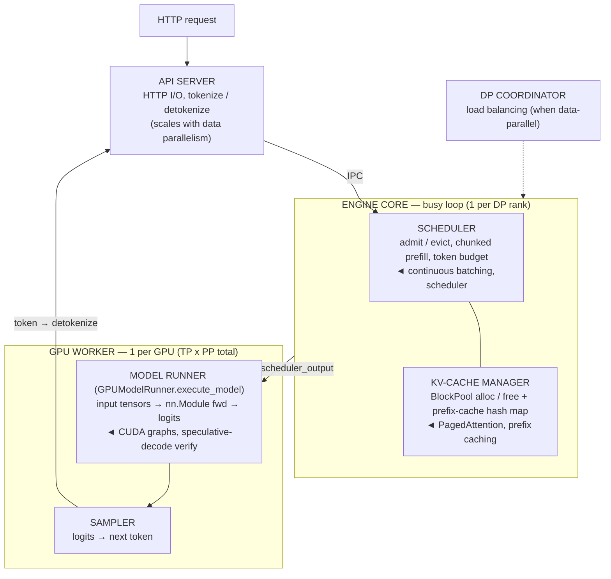

# The vLLM Architecture Map: Where Everything You Learned Lives

!!! info "Baseline: **vLLM 0.26.0** (V1 engine) · model `Qwen2.5-7B-Instruct` · single RTX 4090 (24 GB)"
    The component names and responsibilities here are quoted from vLLM's **V1** `docs/design/arch_overview.md` and source, verified via Context7 (ADR-0004): the multi-process split (**API server → engine core → GPU workers → DP coordinator**), the **engine core** busy loop owning the **scheduler + KV cache manager** (one per data-parallel rank), the **worker** (one per GPU, `TP×PP` of them) owning weights + forward pass, and the **model runner** (`GPUModelRunner.execute_model`) doing input-tensor prep + CUDA-graph capture, then the **sampler**. V1 redesigned the scheduler, KV-cache manager, worker, sampler, and API server; it kept V0's models, GPU kernels, and utilities. This is a **read-and-navigate** lesson (ADR-0002) — the §4 map is a pure-Python classification, not a running engine.

---

## 1 · Intuition & why it matters

You've spent Part 5 learning *mechanisms* — [continuous batching](continuous-batching.md), [PagedAttention](paged-attention.md), [chunked prefill](scheduler-chunked-prefill-pd.md), [prefix caching](prefix-caching.md), [speculative decoding](speculative-decoding.md). This lesson is the **map that says where each one physically lives** in vLLM, so that when a real system misbehaves — TTFT spikes, throughput plateaus, OOM at startup — you know *which box* to open. "Walk me through vLLM's architecture and trace a request" is a staple senior-infra interview question precisely because it proves you can navigate the system, not just recite features.

The one thing to internalize: **vLLM V1 is a multi-process pipeline, and the concerns are cleanly separated.** An **API server** handles HTTP and tokenization. An **engine core** runs the busy loop that *schedules* and *manages KV cache*. **GPU workers** (one per GPU) *execute the model*. That separation is not incidental — it's why the scheduler can keep deciding the next step's batch while the previous step's tokens are still in flight on the GPU, and it's the frame every optimization slots into. Once you can place "continuous batching = the scheduler," "PagedAttention = the KV-cache manager / block pool," "CUDA graphs = the model runner," a confusing symptom becomes a directed search. → see the [Glossary](../glossary.md) for the component vocabulary.

## 2 · Mental model

The V1 process pipeline, and where each Part 5 concept lives (a process/component topology, so Mermaid, per ADR-0005):



Three shapes to hold:

- **Three concerns, three process types.** *Talk* (API server) / *decide* (engine core: schedule + manage KV) / *compute* (GPU workers). Every Part 5 optimization is a change to one of these boxes — and knowing which box tells you which knob and which symptom.
- **The engine core is the brain, and it owns the two things you studied most.** The **scheduler** (continuous batching, chunked prefill) and the **KV-cache manager / block pool** (PagedAttention, prefix caching) both live here, in one busy loop, one per data-parallel rank. When people say "vLLM's magic," this loop is most of it.
- **Workers just execute; the model runner is the innermost box.** A worker owns one GPU (`TP×PP` workers total); inside it the **model runner** preps input tensors, captures/replays CUDA graphs, runs the `nn.Module` forward, and hands logits to the **sampler**. Speculative-decoding verification and `enforce_eager` act here.

## 3 · Principle — the components and a request's path

### 3.1 The five components

- **API server** — accepts HTTP (OpenAI-compatible), tokenizes input and detokenizes output, does input processing. Scales out with data parallelism. It does *no* scheduling or GPU work.
- **Engine core** — the heart. Runs a **busy loop** that, each iteration, asks the scheduler what to run, has the KV-cache manager allocate blocks, dispatches the step to the workers, and collects outputs. **One engine-core process per data-parallel rank.** It owns:
    - **Scheduler** — decides each step's batch: admit waiting requests, evict finished ones ([continuous batching](continuous-batching.md)), chunk long prefills, and spend the `max_num_batched_tokens` budget ([chunked prefill](scheduler-chunked-prefill-pd.md)).
    - **KV-cache manager** — hands out and reclaims KV blocks from the shared **BlockPool** ([PagedAttention](paged-attention.md)) and holds the `cached_block_hash_to_block` map ([prefix caching](prefix-caching.md)).
- **GPU worker** — one process **per GPU**; there are `tensor_parallel_size × pipeline_parallel_size` of them per engine core. Loads model weights, runs forward passes, manages that GPU's memory.
- **Model runner** (`GPUModelRunner`) — inside each worker. Prepares input tensors, captures and replays **CUDA graphs**, runs the model's `nn.Module` forward to get logits. `enforce_eager=True` disables its CUDA-graph capture.
- **Sampler** — turns logits into the next token (greedy or sampled), applying logits processors.

### 3.2 A request's path (one decode step)

```text
HTTP → API server (tokenize) → engine core busy loop:
   scheduler.schedule()  → pick this step's requests + token budget
   kv_cache_manager      → ensure blocks exist for them (allocate / prefix-hit)
   dispatch to worker(s) → model runner: build input tensors, run fwd (CUDA graph) → logits
   sampler               → next token(s)
   ← output back to engine core → API server (detokenize) → HTTP response chunk
```

The subtlety that makes it fast: the engine core can schedule the *next* step while the *previous* step's tokens are still being processed on the GPU (the scheduler tracks in-flight "output placeholders"). That CPU/GPU overlap is why the GPU rarely waits on the scheduler.

### 3.3 Reading it in vLLM's source (v0.26.0)

The map tells you *which box to open* — you never read top-to-bottom (ADR-0002: read + reason, don't rewrite). Start with the narrative, [`docs/design/arch_overview.md`](https://github.com/vllm-project/vllm/blob/v0.26.0/docs/design/arch_overview.md), then jump to the box a symptom points at:

- **Engine core / busy loop** → [`vllm/v1/engine/core.py`](https://github.com/vllm-project/vllm/blob/v0.26.0/vllm/v1/engine/core.py): `EngineCore.step()` drives one *schedule → execute → collect* iteration (and `run_busy_loop` repeats it).
- **Scheduler** → [`vllm/v1/core/sched/scheduler.py`](https://github.com/vllm-project/vllm/blob/v0.26.0/vllm/v1/core/sched/scheduler.py): `Scheduler.schedule()` — continuous batching + chunked prefill (the token budget).
- **KV-cache manager / block pool** → [`vllm/v1/core/block_pool.py`](https://github.com/vllm-project/vllm/blob/v0.26.0/vllm/v1/core/block_pool.py): `BlockPool.get_new_blocks`/`free_blocks` + the `cached_block_hash_to_block` map (PagedAttention, prefix caching).
- **Worker + model runner** → [`vllm/v1/worker/gpu_worker.py`](https://github.com/vllm-project/vllm/blob/v0.26.0/vllm/v1/worker/gpu_worker.py) (`Worker`, one per GPU) and [`vllm/v1/worker/gpu_model_runner.py`](https://github.com/vllm-project/vllm/blob/v0.26.0/vllm/v1/worker/gpu_model_runner.py): **`GPUModelRunner.execute_model`** preps input tensors, runs the `nn.Module` forward (CUDA graph), then calls the sampler inline.
- **Sampler** → [`vllm/v1/sample/sampler.py`](https://github.com/vllm-project/vllm/blob/v0.26.0/vllm/v1/sample/sampler.py): `Sampler.forward` turns logits into the next token (applying logits processors).

Symptom → box: TTFT → `scheduler.py`; OOM at startup → block-pool profiling; slow decode → `gpu_model_runner.py` (CUDA graphs). Open the one file, not the tree.

## 4 · Complete runnable code + line-by-line

A pure-Python **map-as-code**: the components, their responsibilities, a request's path through them, and which Part 5 lesson governs each box. It's the mental model you can regenerate — offline, no GPU, no vLLM.

```python title="vllm_architecture_map.py"
"""vLLM V1 architecture as a map: which component owns what, and a request's path.
Pure Python, offline — a classification, not a running engine."""

# component: (responsibility, which Part-5 lesson covers its behavior)
COMPONENTS = {
    "APIServer":     ("HTTP in/out, tokenize & detokenize, input processing",        "—"),
    "EngineCore":    ("busy loop; owns the Scheduler + KVCacheManager, one per DP rank", "—"),
    "Scheduler":     ("admit/evict each step, chunked prefill, token budget",         "continuous-batching, scheduler"),
    "KVCacheManager":("KV blocks: allocate/free from BlockPool, prefix-cache hashes", "paged-attention, prefix-caching"),
    "Worker":        ("owns ONE GPU: weights, forward pass, GPU memory (TP*PP of them)", "tuning-knobs (TP)"),
    "ModelRunner":   ("input tensors, CUDA-graph capture, runs the nn.Module",         "tuning-knobs (enforce_eager)"),
    "Sampler":       ("logits -> next token (greedy / sampling)",                      "—"),
}

# a request's path through the V1 pipeline (one decode step)
PATH = ["APIServer", "EngineCore", "Scheduler", "KVCacheManager",
        "Worker", "ModelRunner", "Sampler", "APIServer"]

if __name__ == "__main__":
    print("component owners:")
    for name, (role, _lesson) in COMPONENTS.items():
        print(f"  {name:<15} {role}")
    print("\nrequest path (one step):")
    print("  " + " -> ".join(PATH))
    print("\nwhere each Part-5 optimization lives:")
    for name, (_role, lesson) in COMPONENTS.items():
        if lesson != "—":
            print(f"  {name:<15} <- {lesson}")
```

**Line-by-line:**

- `COMPONENTS` — the seven rows are the five components (§3.1) with the engine core's two sub-boxes broken out: *Scheduler* and *KVCacheManager* are listed separately because that's where the mechanisms attach. Reading a row places a concept: the *Scheduler* row is where continuous batching and chunked prefill live; the *KVCacheManager* row is PagedAttention + prefix caching. This is the whole Part 5 index, refactored by *component* instead of by *feature*.
- `PATH` — the ordered pipeline a request traverses in one step: in through the API server, through the engine core's scheduler and KV-cache manager, out to a worker's model runner and sampler, back. Narrating this list *is* the interview answer.
- `__main__` — prints the ownership table, the path, then the reverse index (component → the lesson that explains its behavior), so you can jump from a symptom's component to the mechanism.

Expected output (a classification, not a running engine):

```text
component owners:
  APIServer       HTTP in/out, tokenize & detokenize, input processing
  EngineCore      busy loop; owns the Scheduler + KVCacheManager, one per DP rank
  Scheduler       admit/evict each step, chunked prefill, token budget
  KVCacheManager  KV blocks: allocate/free from BlockPool, prefix-cache hashes
  Worker          owns ONE GPU: weights, forward pass, GPU memory (TP*PP of them)
  ModelRunner     input tensors, CUDA-graph capture, runs the nn.Module
  Sampler         logits -> next token (greedy / sampling)

request path (one step):
  APIServer -> EngineCore -> Scheduler -> KVCacheManager -> Worker -> ModelRunner -> Sampler -> APIServer

where each Part-5 optimization lives:
  Scheduler       <- continuous-batching, scheduler
  KVCacheManager  <- paged-attention, prefix-caching
  Worker          <- tuning-knobs (TP)
  ModelRunner     <- tuning-knobs (enforce_eager)
```

The value isn't the print-out — it's that you can now answer "where does X happen?" for any Part 5 concept, and turn a symptom into a component to open. That mapping is the entire point of an architecture map.

## 5 · Lab — trace it in a live engine's logs

!!! gpu "GPU Lab (mostly reading; optional single-card run)"
    - **Min VRAM:** none to read the map / source; ~16 GB to launch vLLM and watch the components log
    - **Suggested AutoDL card:** RTX 4090 (24 GB)
    - **Est. time / cost:** reading ~25 min (free, no-card mode) · optional run ~10 min · ~¥1 (illustrative)
    - **Platform:** NVIDIA CUDA (default)
    - **Non-NVIDIA:** the process architecture is backend-independent; the GPU worker/model runner is where the backend (ROCm/CPU) differs.

The core lab is reading + tracing, free in no-card mode:

```text
Reading checklist — map source to the §4 boxes:
1. docs/design/arch_overview.md — read "V1 Process Architecture": API server / engine core / workers / DP coordinator.
2. vllm/v1/core/sched/  — find the scheduler's schedule(): admit/evict + token budget (continuous batching).
3. vllm/v1/core/block_pool.py — find BlockPool.get_new_blocks / free_blocks (PagedAttention) and the hash map (prefix caching).
4. vllm/v1/worker/gpu_model_runner.py — find GPUModelRunner.execute_model: input tensors → fwd → Sampler.
5. Draw the arrow from each symptom you care about (TTFT / OOM / low throughput) to the box that owns it.
```

Optional GPU run — start the server and watch the components announce themselves:

```python title="observe_engine.py"
# API verified against vLLM 0.26.0 (LLM). Run on a GPU; read the startup logs.
from vllm import LLM
llm = LLM(model="Qwen/Qwen2.5-7B-Instruct", quantization="awq")
# Startup logs show the pieces from §3: the engine core init, the KV-cache profiling
# ("# GPU blocks: N" — the BlockPool size), CUDA-graph capture (the model runner),
# and per-step "Running/Waiting" counts (the scheduler). Match each log line to a §4 box.
print(llm.generate(["Name the parts of a car engine in one line."])[0].outputs[0].text[:80])
```

**What to observe:** the startup sequence *is* the architecture — engine-core init, then KV-cache profiling (the [`num_gpu_blocks`](paged-attention.md) number = BlockPool size), then CUDA-graph capture (the model runner, absent if `enforce_eager=True`), then the serving loop's Running/Waiting counts (the scheduler). Each line maps to a box in §2.

## 6 · Common pitfalls / counter-intuitive points

- **Thinking it's one process.** V1 is *multi-process* — API server, engine core(s), and GPU workers are separate processes communicating over IPC. That separation is what enables the CPU/GPU overlap; conflating them will confuse your mental model of where latency comes from.
- **Putting the scheduler in the worker.** The scheduler and KV-cache manager live in the **engine core**, not the GPU worker. The worker just executes what it's handed. Continuous batching is a *scheduling* decision, not a kernel.
- **Confusing worker count with GPUs you own.** There are `tensor_parallel_size × pipeline_parallel_size` workers **per engine core**; on a single 4090 that's one worker. Multi-GPU changes the worker count, not the pipeline shape.
- **Assuming V1 == V0.** V1 re-architected the scheduler, KV-cache manager, worker, sampler, and API server. Old blog posts describing V0's single-process `LLMEngine.step()` don't match the code you'll read. Confirm you're reading the V1 tree.
- **Reading the source top-to-bottom.** The map exists so you *don't*. Start from the symptom's component (TTFT → scheduler; OOM at startup → KV-cache profiling / block pool; slow decode → model runner / CUDA graphs) and open that box.
- **Forgetting the model runner captures CUDA graphs.** If decode is mysteriously slow, check whether `enforce_eager` is on (no graphs) — that's a *model runner* setting, covered in the [tuning-knobs lesson](tuning-knobs-sweep.md).
- **Thinking the sampler is its own process/stage.** It isn't — the `Sampler` runs **inside** the model runner: `GPUModelRunner.execute_model` calls `self.sampler(logits, …)` in the same GPU-worker process, right after the forward, and logits processors run there too. There's no separate "sampling service" to look at; token-selection latency lives in the worker, next to the forward pass.

## 7 · Interview links

- [Trace a request through vLLM's architecture](../interview/vllm-architecture.md) — the high-frequency question this lesson prepares you for: *name the components, trace a request end-to-end, and say which optimization lives in which box.*

## 8 · Summary & further reading

**One line:** vLLM V1 is a multi-process pipeline — an **API server** (HTTP + tokenization), one or more **engine cores** running a busy loop that owns the **scheduler** (continuous batching, chunked prefill) and the **KV-cache manager / block pool** (PagedAttention, prefix caching), and **GPU workers** (one per GPU, `TP×PP` total) whose **model runner** preps tensors, replays CUDA graphs, runs the `nn.Module`, and samples — so every optimization you learned maps to exactly one box, and any symptom points at the box to open.

Further reading:

- vLLM `docs/design/arch_overview.md` — the V1 process architecture this lesson maps (read it with §2 open).
- The [continuous-batching](continuous-batching.md) and [PagedAttention](paged-attention.md) lessons — the two boxes inside the engine core, in depth.
- The [tuning-knobs lesson](tuning-knobs-sweep.md) — how a knob on each box moves the throughput/latency curve (the natural next step).
- vLLM `docs/usage/v1_guide.md` — what V1 redesigned vs. kept from V0, so you read the right code.
- vLLM source (v0.26.0): [`vllm/v1/engine/core.py`](https://github.com/vllm-project/vllm/blob/v0.26.0/vllm/v1/engine/core.py) (`EngineCore`), [`vllm/v1/worker/gpu_model_runner.py`](https://github.com/vllm-project/vllm/blob/v0.26.0/vllm/v1/worker/gpu_model_runner.py) (`GPUModelRunner.execute_model`), [`vllm/v1/sample/sampler.py`](https://github.com/vllm-project/vllm/blob/v0.26.0/vllm/v1/sample/sampler.py) (`Sampler`) — the boxes from §3.3.
- The [PagedAttention kernel](../part3/paged-attention-kernel.md) lesson (Part 3) — the code inside the KV-cache-manager box.
- The [OpenAI server](../part8/openai-server.md) lesson (Part 8) — the API-server box exposed as a production endpoint.

## 9 · Self-check

??? question "Trace an HTTP request through vLLM V1 and name the component doing each step."
    (1) The **API server** process receives the HTTP request, tokenizes the prompt, and does input processing. (2) It hands the request (over IPC) to an **engine core** process, whose busy loop drives the rest. (3) The **scheduler** (in the engine core) decides whether to admit it and how many of its tokens run this step (chunked prefill, token budget). (4) The **KV-cache manager** (also in the engine core) allocates KV blocks from the BlockPool for it — or reuses cached blocks on a prefix hit. (5) The engine core dispatches the step to a **GPU worker**, whose **model runner** builds input tensors, runs the `nn.Module` forward (replaying a CUDA graph unless `enforce_eager`), and produces logits. (6) The **sampler** turns logits into the next token. (7) The token flows back to the engine core and out through the API server (detokenized) as an HTTP response chunk. The scheduler can begin the next step while these tokens are still in flight — the CPU/GPU overlap.

??? question "A colleague says 'continuous batching is a kernel optimization in the GPU worker.' What's wrong, and where does it actually live?"
    Continuous batching is a **scheduling** decision, not a kernel, and it lives in the **scheduler** inside the **engine core** — not the GPU worker. Each engine-core loop iteration the scheduler decides the step's batch membership (admit waiting requests, evict finished ones, chunk long prefills, spend the token budget); the GPU worker merely *executes* whatever batch it's handed. The worker's kernels (attention, GEMM) are the same whether or not batching is continuous — what changed is *who is in the batch each step*, decided upstream in the engine core. Placing it in the worker would miss that the win comes from CPU-side scheduling overlapping GPU execution.

??? question "You get an OOM at startup (before any request), and separately, decode is slower than expected. Which component/box do you open for each?"
    **OOM at startup** → the **KV-cache manager / BlockPool profiling** in the engine core: at launch vLLM profiles memory and sizes `num_gpu_blocks` from `gpu_memory_utilization` (default 0.92) minus weights/activations/CUDA-graph. An OOM here means the budget doesn't fit — lower `gpu_memory_utilization`, quantize weights, or shrink `max_model_len`/CUDA-graph memory. **Slow decode** → the **model runner** in the GPU worker: check whether CUDA-graph capture is disabled (`enforce_eager=True` loses the launch-overhead amortization that matters most in memory-bound decode). Both are located by the map: startup memory sizing is a KV-cache-manager concern; per-step execution speed is a model-runner concern. (Details of both knobs are in the [tuning-knobs lesson](tuning-knobs-sweep.md).)
