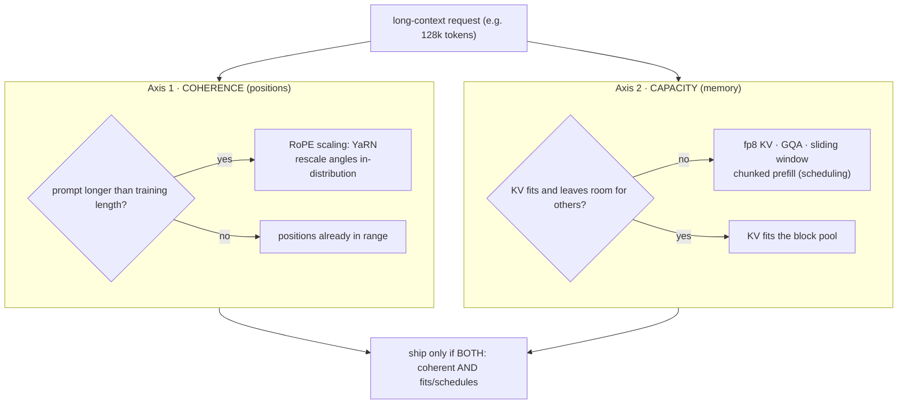

# Long-Context Inference: RoPE Scaling, Attention Sink & the KV Wall

!!! info "Baseline: **vLLM 0.26.0** · model `Qwen2.5-7B-Instruct` · single RTX 4090 (24 GB)"
    Verified against vLLM 0.26.0 via Context7 (ADR-0004): context extension uses **`--hf-overrides`** with a `rope_parameters` dict (`rope_type: "yarn"`, `factor`, `original_max_position_embeddings`) plus **`--max-model-len`** — the older **`--rope-scaling` flag is deprecated**; KV-cache quantization uses **`kv_cache_dtype="fp8"`** (=`fp8_e4m3`; also `fp8_e5m2`) with optional `calculate_kv_scales`; long prefills are sliced by [chunked prefill](../part5/scheduler-chunked-prefill-pd.md) (`enable_chunked_prefill`, on by default). This lesson builds on the [KV cache](../part0/kv-cache.md) growth problem and the [PagedAttention block pool](../part5/paged-attention.md). The §4 model is a **memory model, not a benchmark**; all sizes are **illustrative / order-of-magnitude references**.

---

## 1 · Intuition & why it matters

Context windows exploded: 2K → 8K → 128K → 1M tokens in a couple of years. "Just feed the model the whole codebase / the whole book / the 200-page contract" is the pitch. But serving long context is where two very different walls hit at once, and interviewers love that it's *two* problems wearing one coat:

1. **The quality wall — the model breaks past its training length.** A model trained on 32K tokens has literally never seen position 100,000. Its positional encoding produces rotations it was never trained on, attention scatters, and output degrades into repetition or nonsense — often *well before* the advertised limit. Making the model stay coherent past its training length is the job of **RoPE scaling** (position interpolation / NTK / YaRN) and the **attention-sink** insight behind streaming.
2. **The memory & scheduling wall — the [KV cache](../part0/kv-cache.md) grows linearly with length.** KV grows with every token, so one 128K-token request can need *gigabytes* of KV — dwarfing a normal request and starving the [block pool](../part5/paged-attention.md) that other sequences need for [concurrency](../part5/continuous-batching.md). And its prefill is enormous, freezing decodes unless you slice it. Making long sequences *fit and schedule* is the job of **KV quantization** (fp8), **sliding-window / attention-sink** eviction, and **[chunked prefill](../part5/scheduler-chunked-prefill-pd.md)**.

So "long-context inference" is really: *make it stay coherent at length* (positions) **and** *make it fit and schedule at length* (memory). A method that fixes one and ignores the other doesn't ship. → see the [Glossary](../glossary.md) for *Long-context inference, RoPE*.

## 2 · Mental model

Two independent axes — coherence and capacity — each with its own failure and its own lever:

```text
AXIS 1 — COHERENCE (positions):  "does the model still make sense at token 100k?"
  RoPE gives each position a rotation angle θ per frequency:
    trained region        │ extrapolation (UNSEEN) → attention breaks
    0 ─────────── 32k      ┊       100k ────────────► 1M
                    └ training-length wall ┘
  Position Interpolation: SQUEEZE 0..100k into 0..32k of angle  (stay in-distribution)
    0 ───────────────────────────────► 100k   scaled by s = L_train / L_target
    └───── mapped into the trained 0..32k angle range ─────┘   (YaRN does this per-frequency + temp)

AXIS 2 — CAPACITY (memory):  "does the KV cache even fit, and can others still run?"
  KV bytes = 2 · layers · kv_heads · head_dim · LENGTH · bytes_per_elem      (LINEAR in length)
    4k ctx : ▓                          one 128k request eats the pool:
   32k ctx : ▓▓▓▓▓▓▓▓                    128k : ▓▓▓▓▓▓▓▓▓▓▓▓▓▓▓▓▓▓▓▓▓▓▓▓▓▓▓▓▓▓  ← starves others
  levers:  fp8 KV (halve bytes) · GQA (fewer kv_heads) · sliding window (cap LENGTH)
           chunked prefill (don't let one 128k prefill freeze every decode)

ATTENTION SINK (why naive sliding windows crash):
  softmax must put its weight SOMEWHERE → the first few tokens absorb the "leftover" → they are SINKS
  keep [sink tokens] + [recent window] ──► stream to unbounded length at BOUNDED memory
  drop the sinks ──► quality collapses (the model has nowhere to dump attention)
```

The KV-wall bars above are quantitative, so ASCII per ADR-0005. The *two-axis lever selection* is a decision topology, so Mermaid `flowchart`:



Three shapes to hold:

- **Coherence and capacity are orthogonal.** RoPE scaling makes the model *understand* position 100K; it does *nothing* for the memory that 100K tokens of KV costs. fp8 KV makes it *fit*; it does nothing for whether the model *understands* the position. You almost always need both.
- **KV cost is linear in length, and it's the real ceiling.** Doubling context doubles KV. Long-context serving is dominated by this line, not by FLOPs.
- **Attention needs a sink.** You can't just keep "the last N tokens" — the model relies on the first few tokens as an attention dump. Keep the sinks *and* the recent window.

## 3 · Principle

### 3.1 RoPE and why it breaks past training length

Rotary Position Embedding (RoPE) encodes position by *rotating* query/key vectors. For dimension pair $i$ (of head dim $d$), the rotation frequency is

$$
\theta_i = \text{base}^{-2i/d}, \qquad i = 0, 1, \dots, d/2-1
$$

and a token at position $m$ has its $i$-th pair rotated by angle $m\theta_i$. Attention then depends only on the *relative* angle $(m-n)\theta_i$ — elegant, and why RoPE generalizes across positions **within the trained range**. The catch: a model trained to length $L_\text{train}$ has only ever seen angles up to $L_\text{train}\cdot\theta_i$. Ask for position $m \gg L_\text{train}$ and the low-frequency pairs produce rotation magnitudes the model has **never seen** — out-of-distribution — and attention degrades. That's the quality wall: it's not a hard cutoff, it's angles going off the trained manifold.

**Fixes rescale position so the angles stay in-distribution:**

- **Position Interpolation (PI):** scale every position by $s = L_\text{train}/L_\text{target}$ so $m\theta_i \to (m/s)\theta_i$ — position $L_\text{target}$ now lands at the angle the model knew as $L_\text{train}$. Simple, but compresses resolution and usually needs a short fine-tune.
- **NTK-aware:** instead of scaling positions uniformly, increase the RoPE `base` (a.k.a. `rope_theta`), which stretches low frequencies more than high ones — preserving local resolution better.
- **YaRN:** the method vLLM configures — a per-frequency interpolation (interpolate low frequencies, extrapolate high ones) plus an attention-temperature tweak. It's the strong default for extending context, set via `rope_type: "yarn"` with a `factor`.

In vLLM 0.26.0 you enable this at serve time with **`--hf-overrides`** (the `--rope-scaling` flag is deprecated):

```text
--hf-overrides '{"rope_parameters": {"factor": 4.0, "original_max_position_embeddings": 32768,
                                     "rope_theta": 1000000, "rope_type": "yarn"}}'
--max-model-len 131072
```

`factor` is the extension multiple ($4.0 \times 32\text{K} = 128\text{K}$), `original_max_position_embeddings` is the model's trained length, and `--max-model-len` sets the new served ceiling. Crucially, this only works if the model can actually use the extension — YaRN buys usable length, not magic comprehension.

### 3.2 The attention sink (and streaming to unbounded length)

You'd think "keep only the last $N$ tokens' KV" would give infinite context at fixed memory. It doesn't — quality collapses. The **StreamingLLM** insight explains why: softmax over attention scores must sum to 1, so it has to put weight *somewhere* even when no past token is truly relevant. The model learns to dump that excess onto the **first few tokens** — they become **attention sinks**. Evict them and the softmax has nowhere to park its leftover mass, so the distribution distorts and output degrades.

The fix is cheap: keep a handful of **sink tokens** (often just the first 4) **plus** a recent sliding window. That gives bounded memory *and* stable quality for effectively unbounded streams. vLLM realizes the memory side of this through **sliding-window attention** and its **hybrid KV-cache manager**: sliding-window layers reserve blocks only for the most recent tokens (the window size), while full-attention layers reserve for all tokens — so the block pool for a windowed model stays bounded no matter how long the stream runs.

### 3.3 The memory wall and the levers that move it

The KV cache size is (see the [KV-cache math lesson](../part2/kv-cache-math.md)):

$$
\text{KV bytes} = 2 \times L_\text{layers} \times H_\text{kv} \times d_\text{head} \times \text{seq\_len} \times b
$$

The only length-dependent factor is `seq_len`, and it's **linear** — 128K tokens costs 32× the KV of 4K. On a 24 GB card that single request can consume most of the [block pool](../part5/paged-attention.md), so *concurrency for everyone else drops toward 1*. The levers:

- **fp8 KV cache** (`kv_cache_dtype="fp8"`) — store KV in 1 byte instead of 2, roughly halving the length term. The vLLM validator notes it "reduces the GPU memory footprint and boosts performance" but "may cause accuracy drop without a proper scaling factor" — hence `calculate_kv_scales`. This is the most direct capacity lever for long context.
- **GQA** (fewer $H_\text{kv}$, from the [attention-variants](../interview/attention-variants.md) material) — the architectural cut that made long context affordable in the first place.
- **Sliding window** (cap effective `seq_len`) — §3.2, for streaming workloads.
- **[Chunked prefill](../part5/scheduler-chunked-prefill-pd.md)** — the *scheduling* lever. A 128K prefill is a giant compute block that would freeze every ongoing decode; chunked prefill (on by default) slices it against the `max_num_batched_tokens` budget so decodes keep flowing. `long_prefill_token_threshold` marks when a prefill counts as "long."

### 3.4 Reading it in vLLM's source (v0.26.0)

Both axes are concrete code (ADR-0002: read + reason, don't rewrite):

- **Coherence — YaRN.** `get_rope()` in [`vllm/model_executor/layers/rotary_embedding/__init__.py`](https://github.com/vllm-project/vllm/blob/v0.26.0/vllm/model_executor/layers/rotary_embedding/__init__.py) branches on `rope_type`; `scaling_type == "yarn"` constructs **`YaRNScalingRotaryEmbedding`** ([`yarn_scaling_rope.py`](https://github.com/vllm-project/vllm/blob/v0.26.0/vllm/model_executor/layers/rotary_embedding/yarn_scaling_rope.py)), whose `mscale` (the attention-temperature tweak) and `yarn_find_correction_range` / `yarn_linear_ramp_mask` (from `common.py`) *are* §3.1's per-frequency interpolation.
- **Capacity — fp8 KV.** The `kv_cache_dtype` you pass lands on **`CacheConfig.cache_dtype`** ([`vllm/config/cache.py`](https://github.com/vllm-project/vllm/blob/v0.26.0/vllm/config/cache.py)); the `CacheDType` literal there enumerates the exact values from the callout — `"fp8"` (= `fp8_e4m3`), `"fp8_e5m2"`, etc.
- **Capacity — sliding window (hybrid pool).** [`vllm/v1/core/single_type_kv_cache_manager.py`](https://github.com/vllm-project/vllm/blob/v0.26.0/vllm/v1/core/single_type_kv_cache_manager.py) has both **`FullAttentionManager`** and **`SlidingWindowManager`**: the windowed one reserves blocks only for the recent window, so the pool stays bounded no matter how long the stream runs (§3.2).
- **Capacity — chunked prefill (scheduling).** `Scheduler.schedule` in [`vllm/v1/core/sched/scheduler.py`](https://github.com/vllm-project/vllm/blob/v0.26.0/vllm/v1/core/sched/scheduler.py) slices a long prefill with `if 0 < long_prefill_token_threshold < num_new_tokens: num_new_tokens = long_prefill_token_threshold` then `num_new_tokens = min(num_new_tokens, token_budget)` — the exact "don't let one 128K prefill freeze every decode" cut. `enable_chunked_prefill` defaults to `True` on **`SchedulerConfig`** ([`vllm/config/scheduler.py`](https://github.com/vllm-project/vllm/blob/v0.26.0/vllm/config/scheduler.py)).

Open `scheduler.py`'s `schedule` first — those two `num_new_tokens` lines are the whole "slice the giant prefill against a token budget" idea.

## 4 · Complete runnable code + line-by-line

A pure-Python model of the capacity wall: KV bytes vs context length, and how far concurrency falls — plus what fp8 KV buys back. No GPU; this is the arithmetic that decides whether a long-context request even fits.

```python title="long_context_kv_wall.py"
"""Long-context KV memory wall: KV grows linearly with length and crushes concurrency.
A memory model, not a benchmark. Pure Python, offline. Shapes ~ Qwen2.5-7B (GQA)."""
LAYERS, KV_HEADS, HEAD_DIM = 28, 4, 128     # Qwen2.5-7B: 28 layers, 4 KV heads (GQA), head_dim 128
KV_BUDGET_GB = 16                            # KV space left on a 24GB card after weights (illustrative)

def kv_bytes_per_token(bytes_per_elem):
    # 2 (K and V) * layers * kv_heads * head_dim * bytes  — per token, all layers
    return 2 * LAYERS * KV_HEADS * HEAD_DIM * bytes_per_elem

def max_concurrent(seq_len, bytes_per_elem):
    per_req = kv_bytes_per_token(bytes_per_elem) * seq_len
    return (KV_BUDGET_GB * 1024**3) // per_req      # how many such requests fit in the KV budget

for seq_len in [4_096, 32_768, 131_072]:
    fp16_per_req = kv_bytes_per_token(2) * seq_len / 1024**3     # GB per request, FP16 KV
    fp16_conc    = max_concurrent(seq_len, 2)                    # concurrency, FP16 KV
    fp8_conc     = max_concurrent(seq_len, 1)                    # concurrency, fp8 KV (1 byte)
    print(f"ctx={seq_len:>7}: {fp16_per_req:6.2f} GB/req (FP16 KV)  "
          f"→ max concurrency {fp16_conc:>3} (FP16) | {fp8_conc:>3} (fp8, ~2x)")
```

**Line-by-line:**

- `LAYERS, KV_HEADS, HEAD_DIM` are `Qwen2.5-7B`'s real shapes; note `KV_HEADS=4` (GQA), not 28 — GQA already shrank the KV term massively, which is *why* long context is feasible at all.
- `kv_bytes_per_token()` is the [KV-cache formula](../part2/kv-cache-math.md) minus `seq_len` — the per-token cost across all layers, for K and V.
- `max_concurrent(seq_len, ...)` divides the KV budget by one request's KV footprint — literally "how many sequences of this length fit." This is the concurrency ceiling long context pushes on.
- The loop sweeps 4K → 32K → 128K and prints GB/request and the max concurrency under **FP16 vs fp8** KV. fp8 halves bytes-per-elem, so it roughly doubles how many long requests fit — the §3.3 lever made numeric.

Expected output (a memory model, illustrative):

```text
ctx=   4096:   0.22 GB/req (FP16 KV)  → max concurrency  73 (FP16) | 146 (fp8, ~2x)
ctx=  32768:   1.75 GB/req (FP16 KV)  → max concurrency   9 (FP16) |  18 (fp8, ~2x)
ctx= 131072:   7.00 GB/req (FP16 KV)  → max concurrency   2 (FP16) |   4 (fp8, ~2x)
```

The wall is stark: at 4K you fit ~73 concurrent sequences; at 128K only ~2 — a **32× drop** (128K is 32× the length of 4K), exactly linear in length. fp8 KV roughly doubles each row (the honest boundary: it's a memory win with a possible accuracy cost). This is why long context is a *capacity* problem first: RoPE scaling can make the model understand position 128K, but if only ~2 such requests fit, your throughput per GPU collapses. The serving answer is the lever stack in §3.3 — and knowing this arithmetic cold is the interview.

## 5 · Lab — extend context (YaRN) and shrink KV (fp8)

!!! gpu "GPU Lab (single-card, fully runnable)"
    - **Min VRAM:** ~16 GB for `Qwen2.5-7B-Instruct` (INT4/AWQ) at moderate context; a true 128K run needs the KV budget from §4 — drop `--max-model-len` (e.g. 32K) if you hit OOM.
    - **Suggested AutoDL card:** RTX 4090 (24 GB); very long context (128K+) may need an A100 (open-then-close per ADR-0001).
    - **Est. time / cost:** reading ~20 min (free, no-card mode) · optional run ~15 min · ~¥1–3 (illustrative)
    - **Platform:** NVIDIA CUDA (default). **Non-NVIDIA:** RoPE/YaRN is architecture-level (backend-agnostic); fp8 KV needs CUDA 11.8+ for `fp8_e4m3`/`fp8_e5m2`, ROCm supports `fp8_e4m3` — check your backend.

Extend the served context with YaRN and shrink the KV cache with fp8:

```bash title="serve with YaRN context extension + fp8 KV (verified 0.26.0 flags)"
vllm serve Qwen/Qwen2.5-7B-Instruct \
    --hf-overrides '{"rope_parameters": {"factor": 4.0, "original_max_position_embeddings": 32768, "rope_type": "yarn"}}' \
    --max-model-len 131072 \
    --kv-cache-dtype fp8            # store KV in 1 byte — roughly doubles how much context fits
# NOTE: --rope-scaling is DEPRECATED; use --hf-overrides with rope_parameters as above.
```

```python title="offline equivalent + fp8 KV"
from vllm import LLM, SamplingParams
llm = LLM(
    model="Qwen/Qwen2.5-7B-Instruct",
    hf_overrides={"rope_parameters": {"factor": 4.0, "original_max_position_embeddings": 32768,
                                      "rope_type": "yarn"}},
    max_model_len=131072,
    kv_cache_dtype="fp8",          # =fp8_e4m3; may need calculate_kv_scales for accuracy
)
long_prompt = "Summarize the following document.\n" + ("lorem ipsum " * 20000)
print(llm.generate(long_prompt, SamplingParams(max_tokens=128))[0].outputs[0].text[:200])
```

**What to observe / do:**

1. **Confirm the extended length.** Without the override, a >32K prompt is rejected (`--max-model-len` exceeds the model default); with YaRN + `--max-model-len 131072` it's accepted. That's RoPE scaling doing its job.
2. **Watch KV memory halve.** Compare startup logs for `num_gpu_blocks` (the [block pool](../part5/paged-attention.md) size) with and without `--kv-cache-dtype fp8` — fp8 roughly doubles the blocks, i.e. the concurrency from §4.
3. **Feel the concurrency cliff.** Fire several 100K-token requests at once and watch how few run concurrently vs many short ones — the §4 arithmetic, live.
4. **Quality check.** Run a "needle in a haystack" retrieval at 4K vs 128K; note that usable recall past the training length depends on the extension actually holding — YaRN buys length, not guaranteed comprehension.

## 6 · Common pitfalls / counter-intuitive points

- **Using the deprecated `--rope-scaling`.** In 0.26.0 it's superseded by `--hf-overrides` with `rope_parameters` (`rope_type: "yarn"`, `factor`, …). Copy-pasting an old `--rope-scaling '{...}'` command is the #1 breakage.
- **Assuming `--max-model-len` alone extends context.** Raising the length ceiling without a RoPE scaling override just makes the model run past its trained positions and emit garbage. You need *both* the scaling config *and* the length.
- **Thinking long context is a compute problem.** It's a **memory** problem — KV is linear in length and crushes [concurrency](../part5/continuous-batching.md) long before FLOPs matter. Size the KV budget first (§4).
- **Naive sliding windows that drop the sink tokens.** Keeping only the last $N$ tokens collapses quality because the first few tokens are **attention sinks**. Keep sinks + recent window (StreamingLLM).
- **Enabling fp8 KV and expecting free accuracy.** fp8 KV "may cause accuracy drop without a proper scaling factor" — use `calculate_kv_scales` / a calibrated scale, and validate on your task, especially at long context where errors compound over more tokens.
- **Letting one long request freeze the server.** A 128K prefill is a giant compute block; without [chunked prefill](../part5/scheduler-chunked-prefill-pd.md) (on by default) it stalls every decode. Keep chunked prefill on and tune `max_num_batched_tokens`.
- **Trusting "supports 1M tokens" as "reasons over 1M tokens."** Advertised context ≠ effective context. Passing a needle-in-haystack test isn't the same as multi-hop reasoning across the whole window; benchmark your actual task.
- **Assuming `long_prefill_token_threshold` is on by default.** In `SchedulerConfig` (`vllm/config/scheduler.py`) it's `Field(default=0)`, and the scheduler's guard is `if 0 < long_prefill_token_threshold < num_new_tokens` (`scheduler.py`) — so at the default **0 it's disabled**. Chunked prefill still slices against `max_num_batched_tokens` (that's `enable_chunked_prefill=True`), but the *explicit* per-step long-prefill cap does nothing until you set a positive value. If one giant prefill is still starving decodes, set this threshold — don't assume the default already caps it.

## 7 · Interview links

- [Long-context inference: positions, sinks & the KV wall](../interview/long-context-inference.md) — the high-frequency question this lesson prepares you for: *why models break past training length and how RoPE scaling (PI/NTK/YaRN) fixes it, what the attention sink is, and why the KV cache — not compute — is the long-context ceiling.*

## 8 · Summary & further reading

**One line:** Long-context inference is two orthogonal problems — **coherence** (RoPE gives each position an angle $m\theta_i$ that goes out-of-distribution past training length, fixed by rescaling position via Position Interpolation / NTK / **YaRN**, set in vLLM through `--hf-overrides` `rope_parameters` + `--max-model-len`; the `--rope-scaling` flag is deprecated) and **capacity** (the [KV cache](../part0/kv-cache.md) is *linear* in length, so one 128K request crushes concurrency — mitigated by **fp8 KV** (`kv_cache_dtype="fp8"`), GQA, sliding-window + **attention-sink** eviction, and **[chunked prefill](../part5/scheduler-chunked-prefill-pd.md)** so a huge prefill doesn't freeze decode) — and a real system needs both halves.

Further reading:

- *RoFormer* (Su et al., 2021) — the original RoPE formulation, $\theta_i = \text{base}^{-2i/d}$.
- *Extending Context Window via Position Interpolation* (Chen et al., 2023) and *YaRN* (Peng et al., 2023) — the scaling methods; YaRN is what `rope_type: "yarn"` configures.
- *StreamingLLM* (Xiao et al., 2023) — the attention-sink phenomenon and sink + sliding-window streaming.
- vLLM `docs/features/context_extension.md` and `docs/features/quantization/quantized_kvcache.md` — the `--hf-overrides`/`rope_parameters` and `kv_cache_dtype` mechanics quoted here.
- The [KV-cache math lesson](../part2/kv-cache-math.md) and [PagedAttention lesson](../part5/paged-attention.md) — the memory formula and block pool the capacity wall pushes on.
- vLLM source (v0.26.0): [`rotary_embedding/yarn_scaling_rope.py`](https://github.com/vllm-project/vllm/blob/v0.26.0/vllm/model_executor/layers/rotary_embedding/yarn_scaling_rope.py) (`YaRNScalingRotaryEmbedding`), [`vllm/config/cache.py`](https://github.com/vllm-project/vllm/blob/v0.26.0/vllm/config/cache.py) (`CacheConfig.cache_dtype`), [`vllm/v1/core/single_type_kv_cache_manager.py`](https://github.com/vllm-project/vllm/blob/v0.26.0/vllm/v1/core/single_type_kv_cache_manager.py) (`SlidingWindowManager`), [`vllm/v1/core/sched/scheduler.py`](https://github.com/vllm-project/vllm/blob/v0.26.0/vllm/v1/core/sched/scheduler.py) (`Scheduler.schedule`) — the YaRN / fp8 / sliding-window / chunked-prefill code from §3.4.

## 9 · Self-check

??? question "A model is trained to 32K tokens. You set `--max-model-len 128000` and nothing else, and outputs turn to garbage past ~32K. Why, and what's the correct fix in vLLM 0.26.0?"
    RoPE encodes position as a rotation angle $m\theta_i$ per frequency pair. The model has only ever seen angles up to $32\text{K}\cdot\theta_i$; asking for position 128K produces low-frequency rotations **out of the trained distribution**, so attention scatters and output degrades — raising `--max-model-len` alone just *lets* the model run into unseen positions, it doesn't teach it those positions. The fix is a **RoPE scaling** config that rescales positions back into the trained angle range — in vLLM 0.26.0 via **`--hf-overrides`** with `rope_parameters` (`rope_type: "yarn"`, `factor: 4.0`, `original_max_position_embeddings: 32768`) **together with** `--max-model-len 131072`. (The old `--rope-scaling` flag is deprecated.) Even then, YaRN buys *usable length*, not guaranteed comprehension — validate on your task.

??? question "Why can't you serve 'infinite' context by simply keeping the KV of only the most recent N tokens? What's the minimal fix?"
    Because of **attention sinks**. Softmax over attention scores must sum to 1, so the model has to place weight somewhere even when nothing in the recent window is truly relevant — it learns to dump that surplus onto the **first few tokens**. If a naive sliding window evicts those initial tokens, the softmax loses its "sink," the attention distribution distorts, and quality collapses (the StreamingLLM finding). The minimal fix is to keep a few **sink tokens** (e.g. the first 4) **plus** the recent sliding window — bounded memory, stable quality, unbounded stream length. vLLM's sliding-window / hybrid KV-cache manager reserves blocks only for the recent window on windowed layers, keeping the pool bounded.

??? question "You extend a 7B model to 128K context. A teammate wants to raise `max_num_seqs` to keep concurrency high. Why will that likely fail, and what actually moves the needle?"
    Because the [KV cache](../part2/kv-cache-math.md) is **linear in sequence length**, and at 128K a single request's KV can be *gigabytes* — from §4, ~7.0 GB/req vs ~0.22 GB at 4K, so a 16 GB KV budget fits only ~2 such requests regardless of what `max_num_seqs` is set to. Raising `max_num_seqs` above the KV budget just causes preemption/OOM, not more real concurrency — the [block pool](../part5/paged-attention.md), not the sequence cap, is the binding constraint. What actually moves the needle at long context: **fp8 KV** (`kv_cache_dtype="fp8"`, ~2× the requests), **GQA** (already baked in), **sliding window** if the workload allows capping effective length, and **[chunked prefill](../part5/scheduler-chunked-prefill-pd.md)** so the huge prefill doesn't freeze decodes. Fix the memory line first; concurrency follows from it.
