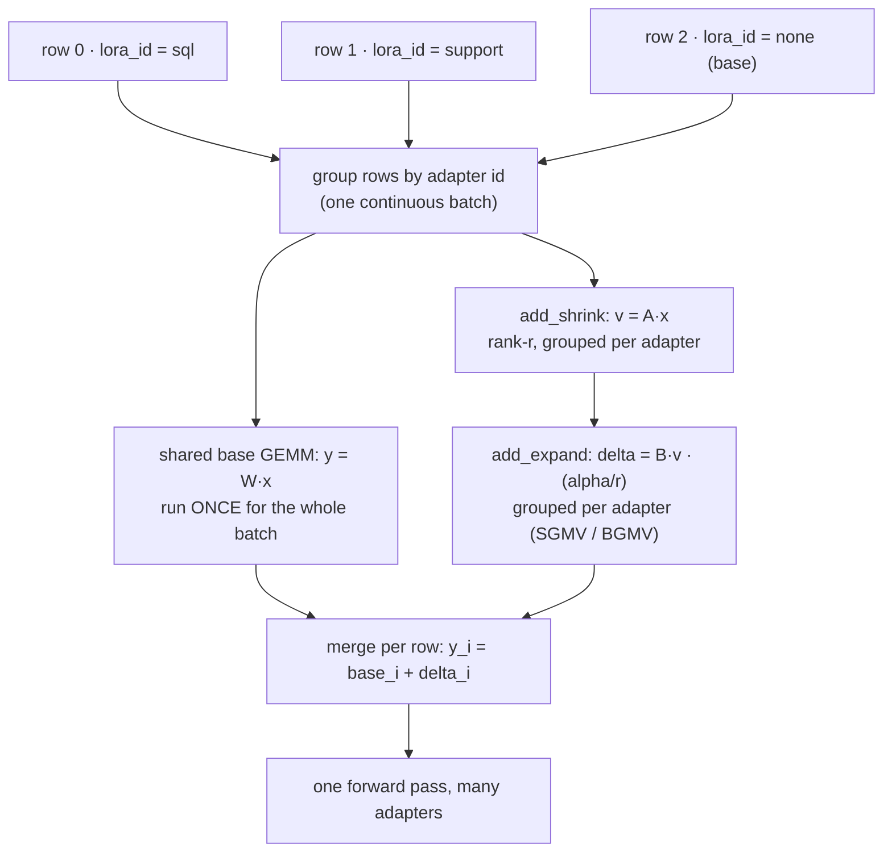

# Multi-LoRA Serving: One Base, Many Adapters

!!! info "Baseline: **vLLM 0.26.0** · base model `Qwen2.5-7B-Instruct` · single RTX 4090 (24 GB)"
    Verified against vLLM 0.26.0 via Context7 (ADR-0004): offline LoRA uses `from vllm.lora.request import LoRARequest`, `LLM(model=..., enable_lora=True)`, and `llm.generate(prompts, sampling_params, lora_request=LoRARequest(name, int_id, path))`; the server uses `vllm serve <base> --enable-lora --lora-modules <name>=<path>` with `--max-lora-rank`; runtime add/remove uses `VLLM_ALLOW_RUNTIME_LORA_UPDATING=True` + `POST /v1/load_lora_adapter`. This layers on the [PagedAttention block pool](../part5/paged-attention.md) and [continuous batching](../part5/continuous-batching.md) from Part 5. The §4 sim is a **memory-model, not a benchmark**; all sizes/speedups are **illustrative / order-of-magnitude references**.

---

## 1 · Intuition & why it matters

You've fine-tuned `Qwen2.5-7B` three ways: one for SQL generation, one for a customer-support tone, one for medical summarization. Naively, serving all three means loading **three full 7B models** — at ~15 GB each in FP16, that's ~45 GB, which doesn't fit on one 24 GB [card](../part0/gpu-hardware.md), let alone leave room for the [KV cache](../part0/kv-cache.md). Buy three GPUs? For a dozen fine-tunes you'd need a dozen cards, most of them idle most of the time. That's the problem multi-LoRA serving kills.

The insight: a fine-tune usually doesn't rewrite the whole model — it nudges it. **[LoRA](../glossary.md)** (Low-Rank Adaptation) captures that nudge as a tiny low-rank matrix pair added on top of the frozen base weights. A 7B LoRA adapter is often **a few to tens of MB**, not 15 GB. So instead of N full models, you keep **one** base model resident and a *shelf* of small adapters, and you pick which adapter to apply **per request** — swapping a 20 MB tensor is cheap where swapping a 15 GB model is not.

The serving punchline — the part interviewers care about — is that vLLM can apply a **different adapter to different requests *in the same batch***. Request A (SQL adapter), request B (support adapter), and request C (raw base, no adapter) all ride the *same* [continuous batch](../part5/continuous-batching.md) through the *same* base-model GEMMs, with each row's adapter delta added by a specialized grouped kernel. You keep Part 5's throughput and get multi-tenant fine-tune serving for almost free. → see the [Glossary](../glossary.md) for *LoRA / Multi-LoRA serving*.

## 2 · Mental model

One frozen base in VRAM; a shelf of tiny adapters; per-row selection inside one batch:

```text
VRAM layout (one 24 GB card):
  ┌─────────────────────────────────────────────┐
  │  BASE MODEL  Qwen2.5-7B  (frozen, ~15 GB)     │   ← loaded ONCE
  ├─────────────────────────────────────────────┤
  │  adapter shelf (each a few–tens of MB):       │
  │    [sql]  [support]  [medical]  [json-fmt] …  │   ← swapped in/out cheaply
  ├─────────────────────────────────────────────┤
  │  KV cache / PagedAttention block pool         │   ← the rest → concurrency
  └─────────────────────────────────────────────┘

ONE continuous batch, HETEROGENEOUS adapters (the serving trick):
  row 0  prompt "SELECT …"     → base ⊕ Δ_sql       ┐
  row 1  prompt "sorry to hear"→ base ⊕ Δ_support   │  same base GEMM,
  row 2  prompt "patient note" → base ⊕ Δ_medical   │  per-row adapter delta
  row 3  prompt "hello"        → base ⊕ (no adapter)┘  via grouped kernel

Per layer, per row i:   y_i = W x_i  +  (B_{a(i)} A_{a(i)}) x_i · (α/r)
                              └ shared ┘   └ this row's adapter a(i) ┘
```

The VRAM layout above is a spatial sketch (ASCII, per ADR-0005). The *serving trick* itself is a data-flow — one batched forward where rows carry different adapter ids but share the base GEMM — so it's a Mermaid `flowchart`:



Three shapes to hold:

- **The base is shared; the adapter is the per-request delta.** The expensive weights ($W$) are computed once for the whole batch; each row adds only its own small $BA$ correction. That's why heterogeneous batching is cheap — you're not re-running the model per adapter.
- **An adapter is *small* because it's *low-rank*.** It's not a compressed full model; it's a rank-$r$ ($r \ll d$) update. That's the whole reason dozens fit alongside the base.
- **Selection is data, not a reload.** Which adapter a row uses is just an integer id in the request. Adding a new fine-tune to the menu is loading one small file, not standing up a new server.

## 3 · Principle

### 3.1 The LoRA math (why an adapter is tiny)

A linear layer computes $y = Wx$ with $W \in \mathbb{R}^{d \times k}$. LoRA freezes $W$ and learns a **low-rank** update:

$$
\Delta W = B A, \qquad B \in \mathbb{R}^{d \times r},\; A \in \mathbb{R}^{r \times k},\; r \ll \min(d,k)
$$

so the adapted layer is

$$
y = Wx + \Delta W\, x \cdot \frac{\alpha}{r} = Wx + B(Ax)\cdot\frac{\alpha}{r}
$$

where $\alpha$ is a fixed scaling factor. The parameter count drops from $d\cdot k$ (full) to $r(d + k)$ (adapter). For a $d=k=4096$ projection at rank $r=16$: full $= 4096^2 \approx 16.8\text{M}$ params; adapter $= 16(4096+4096) \approx 131\text{K}$ — a **~128× shrink** *per matrix*. Summed over the handful of projections LoRA targets (typically the attention $q,k,v,o$ and sometimes the MLP), a whole-model adapter lands in the **single-digit-to-tens of MB** range (illustrative). Note $\Delta W\,x = B(Ax)$ is computed as two small GEMMs, never by materializing the $d\times k$ matrix $\Delta W$.

### 3.2 Serving many adapters at once

At inference the adapters live in GPU memory (with an optional CPU-side cache for ones not currently hot). The batched forward pass is where vLLM earns its keep:

- The **base GEMM** $Wx$ runs once for the entire batch — full Part 5 batching, unchanged.
- The **adapter deltas** are applied by a *grouped* kernel: rows are grouped by which adapter they use, and each group does its small $B(Ax)$ multiply. This is the SGMV/BGMV-style "segmented" GEMM idea (from S-LoRA / Punica) — it lets one batch carry many adapters without looping over them serially.

Two engine knobs size this:

- **`--max-lora-rank`** — the largest adapter rank the engine reserves slots for. Set it to the **highest rank among your adapters**: overshoot wastes memory (the vLLM docs' own example warns `--max-lora-rank 256` when 64 suffices is "unnecessarily high, wastes memory"); undershoot rejects a higher-rank adapter.
- **`max_loras` / `max_cpu_loras`** — how many *distinct* adapters may be active in a single batch (GPU) and cached on the CPU. If a batch references more distinct adapters than `max_loras`, the scheduler can't co-run them all in one step. (Check exact defaults against the vLLM LoRA docs for your build.)

### 3.3 Static vs dynamic loading

Adapters can be declared **at startup** (`--lora-modules name=path …`) or added/removed **at runtime**. Runtime updating is gated behind `VLLM_ALLOW_RUNTIME_LORA_UPDATING=True` and exposed as `POST /v1/load_lora_adapter` (and an unload endpoint). The vLLM docs flag this as a security-sensitive feature — loading an adapter from an arbitrary path is code/data you're trusting — so it's "for isolated and fully trusted production environments" only. Once loaded, a client selects an adapter simply by putting its **name in the `model` field** of an OpenAI-style request.

### 3.4 Reading it in vLLM's source (v0.26.0)

The "shared base + per-row delta" story maps directly to code (ADR-0002: read + reason, don't rewrite):

- **The request tag** is **`LoRARequest`** in [`vllm/lora/request.py`](https://github.com/vllm-project/vllm/blob/v0.26.0/vllm/lora/request.py) — the `(lora_name, lora_int_id, lora_path)` triple from §4. The **integer id** is the key vLLM groups rows by inside a batch.
- **The delta application** is where §3.1's $B(Ax)$ becomes two grouped GEMMs. `BaseLinearLayerWithLoRA._apply_lora_to_output` in [`vllm/lora/layers/base_linear.py`](https://github.com/vllm-project/vllm/blob/v0.26.0/vllm/lora/layers/base_linear.py) calls `self.punica_wrapper.add_lora_linear(...)`; that lands in **`PunicaWrapperGPU`** ([`vllm/lora/punica_wrapper/punica_gpu.py`](https://github.com/vllm-project/vllm/blob/v0.26.0/vllm/lora/punica_wrapper/punica_gpu.py)), whose `add_lora_linear` runs **`add_shrink`** (the rank-$r$ $v = Ax$) then **`add_expand`** (the $B v$) — each *grouped by adapter* so one call serves the whole heterogeneous batch. That grouping **is** the SGMV/BGMV kernel of §3.2; there is no per-adapter Python loop.
- **The knobs** are dataclass fields on **`LoRAConfig`** ([`vllm/config/lora.py`](https://github.com/vllm-project/vllm/blob/v0.26.0/vllm/config/lora.py)): `max_lora_rank` (default `16`), `max_loras` (default `1`), `max_cpu_loras`. `LoRAModelManager.max_loras` ([`vllm/lora/model_manager.py`](https://github.com/vllm-project/vllm/blob/v0.26.0/vllm/lora/model_manager.py)) just returns `self.lora_config.max_loras` — the §3.2 cap on distinct adapters per step.

Open `punica_gpu.py` first: `add_shrink` → `add_expand` is the whole "$W$ once, tiny $BA$ per row" idea in ~30 lines.

## 4 · Complete runnable code + line-by-line

Offline multi-LoRA: download two adapters, load one base with LoRA enabled, and route each prompt to a different adapter (including one to the raw base) in a single `generate` call. Uses the exact vLLM 0.26.0 API.

!!! note "Why this snippet runs on Llama, not the Qwen baseline"
    The course baseline is `Qwen2.5-7B-Instruct` (see the callout up top and the §5 Lab). This §4 snippet instead uses **vLLM's own documented pair** — base `Llama-3.2-3B-Instruct` + the public SQL adapter `jeeejeee/llama32-3b-text2sql-spider` — because it's a *real, matching, downloadable* base+adapter combo, so the code runs exactly as written with no adapter to train first. On the Qwen baseline, keep everything identical and swap in a Qwen2.5-7B adapter — **base and adapter must come from the same base model** (§6). ADR-0001 permits Llama as an English-ecosystem cross-reference.

```python title="multi_lora_offline.py"
# APIs verified against vLLM 0.26.0 (LoRARequest, enable_lora, lora_request). Run in AutoDL with a GPU.
from huggingface_hub import snapshot_download
from vllm import LLM, SamplingParams
from vllm.lora.request import LoRARequest

# 1) Fetch two adapters trained on the SAME base to local paths.
sql_path  = snapshot_download(repo_id="jeeejeee/llama32-3b-text2sql-spider")  # example SQL adapter
# (use your own Qwen2.5-7B adapters in practice; base and adapter MUST match)

# 2) One base model, LoRA enabled. max_lora_rank must be ≥ the highest adapter rank.
llm = LLM(
    model="meta-llama/Llama-3.2-3B-Instruct",   # the frozen base, loaded ONCE
    enable_lora=True,                            # turn on the LoRA machinery
    max_lora_rank=64,                            # size the adapter slots to your max rank
    max_loras=2,                                 # distinct adapters allowed per batch
)

sp = SamplingParams(temperature=0, max_tokens=64)

# 3) Route different prompts to different adapters IN ONE batch.
#    LoRARequest(human_name, unique_int_id, local_path); int id must be unique per adapter.
prompts   = ["[user] Write a SQL query: list all airports in Malawi [/user] [assistant]",
             "Explain what a KV cache is in one sentence."]
requests  = [LoRARequest("sql_adapter", 1, sql_path),   # row 0 → SQL adapter
             None]                                       # row 1 → raw base, NO adapter

outs = llm.generate(prompts, sp, lora_request=requests)  # heterogeneous batch
for p, o in zip(prompts, outs):
    print(o.outputs[0].text.strip()[:80])
```

**Line-by-line:**

- `snapshot_download(repo_id=…)` pulls the adapter's weights to a local directory — that path is what `LoRARequest` points at. The base and adapter **must come from the same base model**; a Qwen adapter on a Llama base is meaningless.
- `LLM(..., enable_lora=True)` loads the frozen base **once** and stands up the LoRA machinery. `max_lora_rank=64` reserves adapter slots for rank ≤ 64; `max_loras=2` says up to two distinct adapters may co-exist in one batch.
- `SamplingParams(temperature=0, …)` — greedy, so the demo is deterministic; adapter choice is orthogonal to sampling.
- `LoRARequest("sql_adapter", 1, sql_path)` is the verified 3-arg form: a human-readable name, a **unique integer id** (vLLM keys the adapter by this id internally), and the local path. Reusing an int id for a different adapter is a bug.
- `lora_request=[LoRARequest(...), None]` passes **one entry per prompt** — row 0 gets the SQL adapter, row 1 gets `None` = the raw base. vLLM runs both in the *same* batch: shared base GEMM, per-row delta. Passing a single `LoRARequest` (not a list) would apply it to all prompts.

Conceptual output (illustrative — the base answers generically, the adapter answers in its specialty):

```text
SELECT name FROM airports WHERE country = 'Malawi'
A KV cache stores the key/value tensors of past tokens so attention isn't recomputed each step.
```

The single 3B base serves both a specialized SQL request and a general one in one pass. Add a fourth fine-tune tomorrow? Drop in one more small file and one more `LoRARequest` — no new GPU, no new server.

## 5 · Lab — serve many adapters behind one OpenAI endpoint

!!! gpu "GPU Lab (single-card, fully runnable)"
    - **Min VRAM:** ~16 GB to run `Qwen2.5-7B-Instruct` (INT4/AWQ) + a couple of adapters; the base dominates, adapters add MBs.
    - **Suggested AutoDL card:** RTX 4090 (24 GB)
    - **Est. time / cost:** reading ~15 min (free, no-card mode) · optional run ~15 min · ~¥1–2 (illustrative)
    - **Platform:** NVIDIA CUDA (default)
    - **Non-NVIDIA:** LoRA is a weights-level feature independent of the attention backend; it works on any backend vLLM supports, though the grouped-GEMM LoRA kernels are most optimized on CUDA.

Serve one base with two named adapters, then pick per request by name:

```bash title="serve with static adapters"
# --lora-modules declares adapters at startup: <served-name>=<path-or-hf-repo>
vllm serve Qwen/Qwen2.5-7B-Instruct \
    --enable-lora \
    --max-lora-rank 64 \
    --lora-modules sql=./adapters/qwen-sql support=./adapters/qwen-support
```

```bash title="a client selects an adapter by putting its NAME in `model`"
curl http://localhost:8000/v1/completions -H "Content-Type: application/json" -d '{
    "model": "sql",                         # ← the adapter name, not the base
    "prompt": "List all airports in Malawi",
    "max_tokens": 64, "temperature": 0
}'
# switch "model" to "support" to hit the other adapter, or to the base model id for no adapter.
```

```bash title="add an adapter at runtime (trusted environments only)"
# Start the server with runtime updating enabled:
VLLM_ALLOW_RUNTIME_LORA_UPDATING=True vllm serve Qwen/Qwen2.5-7B-Instruct --enable-lora --max-lora-rank 64
# Then hot-load without a restart:
curl http://localhost:8000/v1/load_lora_adapter -H "Content-Type: application/json" -d '{
    "lora_name": "medical", "lora_path": "./adapters/qwen-medical"
}'
# "medical" is now selectable via the "model" field, just like the static ones.
```

**What to observe / do:**

1. **One base, many menus.** `GET /v1/models` lists the base *and* each adapter as selectable models. Fire requests alternating `"model": "sql"` and `"model": "support"` — they interleave in the same running batch.
2. **Rank sizing.** Start with `--max-lora-rank 8` and try to load a rank-64 adapter; watch it get rejected. Bump to 64. Then set 256 with rank-16 adapters and note the wasted reservation — matching §3.2.
3. **Dynamic churn.** Hot-load `medical`, use it, then unload it; confirm the base and other adapters keep serving throughout — no restart, no dropped requests.

## 6 · Common pitfalls / counter-intuitive points

- **Setting `--max-lora-rank` by guesswork.** Too low → higher-rank adapters are rejected at load. Too high → you reserve adapter slots you never use and waste VRAM that could have been [KV cache](../part5/paged-attention.md). Set it to the **max rank you actually serve**, no higher.
- **Too many distinct adapters per batch.** `max_loras` caps how many adapters co-run in one step. If your traffic sprays across 50 adapters but `max_loras` is small, the scheduler can't pack them together and effective throughput drops — a fleet with a few hot adapters batches far better than one with a long tail of cold ones.
- **Mismatched base/adapter.** An adapter is a delta *on a specific base*. Loading a Llama adapter onto a Qwen base (or a different Qwen version) produces garbage or errors — the shapes and semantics don't line up.
- **Assuming a LoRA is as good as a full fine-tune.** Low rank is a *capacity* limit; for tasks that need to move the model a lot, a rank-8 adapter may underperform a full fine-tune. Rank is a quality/size dial, not free.
- **Merging when you should keep it runtime (and vice versa).** You *can* merge an adapter into the base weights for a single dedicated model (zero per-request delta cost) — but then you've given up multi-tenancy. Keep adapters runtime precisely when you want *many* on one base; merge only when you'll serve exactly one.
- **Leaving runtime loading open.** `VLLM_ALLOW_RUNTIME_LORA_UPDATING` lets any caller load weights from a path — treat it as privileged. Don't expose `/v1/load_lora_adapter` to untrusted clients; the vLLM docs restrict it to fully trusted environments.
- **Forgetting `max_loras` defaults to 1.** In `LoRAConfig` (`vllm/config/lora.py`) `max_loras` is `Field(default=1)` — so if you enable LoRA but never set it, **only one adapter is active per step** and your "heterogeneous batch" silently serializes: rows for other adapters wait their turn instead of co-running. The whole §2 trick needs `max_loras ≥` the number of distinct adapters you want in one batch. Trust the dataclass default, not your memory of it.

## 7 · Interview links

- [Multi-LoRA serving: one base, many adapters](../interview/multi-lora-serving.md) — the high-frequency question this lesson prepares you for: *why LoRA makes an adapter tiny, how vLLM batches heterogeneous adapters, and which knobs (`max_lora_rank`, `max_loras`, dynamic loading) gate how many you can co-serve.*

## 8 · Summary & further reading

**One line:** A fine-tune is usually a low-rank nudge, so LoRA stores it as $\Delta W = BA$ ($r \ll d$) — a few-MB adapter instead of a 15 GB copy — which lets vLLM keep one frozen base plus a shelf of adapters and apply a *different* adapter to each row of the *same* continuous batch via grouped GEMM kernels; `--max-lora-rank` sizes the slots, `max_loras` caps distinct adapters per batch, and adapters can be declared at startup (`--lora-modules`) or hot-loaded (`/v1/load_lora_adapter`, trusted envs only) and selected per request by name.

Further reading:

- vLLM `docs/features/lora.md` — the `--enable-lora` / `--lora-modules` / `--max-lora-rank` flags and the dynamic-loading endpoints quoted here.
- *LoRA: Low-Rank Adaptation of Large Language Models* (Hu et al., 2021) — the $\Delta W = BA$ formulation and the rank/quality trade.
- *S-LoRA* and *Punica* — the segmented/grouped GEMM (SGMV/BGMV) kernels that make heterogeneous-adapter batching cheap.
- vLLM source (v0.26.0): [`vllm/lora/punica_wrapper/punica_gpu.py`](https://github.com/vllm-project/vllm/blob/v0.26.0/vllm/lora/punica_wrapper/punica_gpu.py) (`PunicaWrapperGPU.add_shrink`/`add_expand`), [`vllm/lora/layers/base_linear.py`](https://github.com/vllm-project/vllm/blob/v0.26.0/vllm/lora/layers/base_linear.py) (`_apply_lora_to_output`), [`vllm/lora/request.py`](https://github.com/vllm-project/vllm/blob/v0.26.0/vllm/lora/request.py) (`LoRARequest`), [`vllm/config/lora.py`](https://github.com/vllm-project/vllm/blob/v0.26.0/vllm/config/lora.py) (`LoRAConfig`) — the grouped-GEMM + config code from §3.4.
- The [PagedAttention lesson](../part5/paged-attention.md) — the block pool whose free VRAM you're now sharing between KV cache and adapter slots.

## 9 · Self-check

??? question "Why can you serve 30 LoRA fine-tunes of a 7B model on one 24 GB card, but not 30 full fine-tunes — and what makes an adapter small?"
    A full fine-tune is a complete 7B model (~15 GB in FP16); 30 of them is ~450 GB — impossible on one card. A LoRA adapter is a **low-rank update** $\Delta W = BA$ with rank $r \ll d$: instead of $d\cdot k$ parameters per matrix it stores $r(d+k)$, a ~100× shrink, so a whole-model adapter is single-digit-to-tens of MB. You load the 7B **base once** (~15 GB) and keep 30 tiny adapters on the shelf; total is base + 30×(MBs), which fits with room left for the [KV cache](../part5/paged-attention.md). Smallness comes entirely from *low rank* — the adapter captures the fine-tune's nudge, not a fresh copy of the model.

??? question "Two requests in the same batch need different adapters (SQL vs support). How does vLLM run them together without re-executing the model per adapter, and what limits how many adapters a batch can hold?"
    The **base GEMM** $Wx$ runs **once** for the whole batch — all rows share it, so there's no per-adapter model replay. The adapters are applied as **per-row deltas** by a *grouped* kernel (SGMV/BGMV-style segmented GEMM): rows are grouped by adapter id and each group does its small $B(Ax)$ multiply, then it's added to the shared base output. So one batch carries many adapters at roughly the cost of the base pass plus cheap low-rank corrections. The cap is **`max_loras`** — the number of *distinct* adapters allowed active in a single step (plus `--max-lora-rank` sizing the slots, and `max_cpu_loras` for the CPU-side cache). Traffic concentrated on a few hot adapters batches far better than a long tail of cold ones.

??? question "You set `--max-lora-rank 256` for adapters that are all rank 16, and separately you expose `/v1/load_lora_adapter` on a public endpoint. What's wrong with each?"
    **`--max-lora-rank 256`** reserves adapter slots big enough for rank-256 adapters, but yours are rank 16 — the extra reservation is wasted VRAM (the vLLM docs call this exact case "unnecessarily high, wastes memory"). That memory could have been [KV-cache blocks](../part5/paged-attention.md) = more concurrency. Set it to your true max rank (16 here, or 64 if a future adapter needs it). **Public `/v1/load_lora_adapter`** lets any caller make the server load weights from a path — that's loading arbitrary code/data you're implicitly trusting; it requires `VLLM_ALLOW_RUNTIME_LORA_UPDATING=True` and the docs restrict it to *isolated, fully trusted* environments. Exposing it to untrusted clients is a security hole; keep dynamic loading behind your trust boundary.
