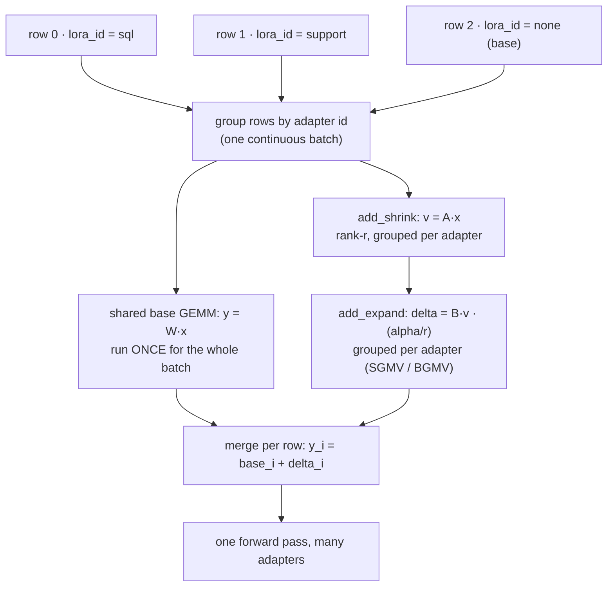

# Multi-LoRA Serving：一基座，多 adapter

!!! info "基线：**vLLM 0.26.0** · 基座模型 `Qwen2.5-7B-Instruct` · 单张 RTX 4090 (24 GB)"
    经 Context7 对 vLLM 0.26.0 核实（ADR-0004）：离线 LoRA 用 `from vllm.lora.request import LoRARequest`、`LLM(model=..., enable_lora=True)`、`llm.generate(prompts, sampling_params, lora_request=LoRARequest(name, int_id, path))`；服务端用 `vllm serve <base> --enable-lora --lora-modules <name>=<path>` 配 `--max-lora-rank`；运行时增删用 `VLLM_ALLOW_RUNTIME_LORA_UPDATING=True` + `POST /v1/load_lora_adapter`。它叠加在 Part 5 的 [PagedAttention block 池](../part5/paged-attention.md)与 [continuous batching](../part5/continuous-batching.md) 之上。§4 的模拟是**显存模型，不是 benchmark**；一切大小/加速比均为**示例 / 量级参考**。

---

## 1 · 直觉 & 为什么重要

你把 `Qwen2.5-7B` 微调了三份：一份做 SQL 生成、一份做客服语气、一份做医疗摘要。朴素地看，要同时服务这三份就得加载**三个完整的 7B 模型**——FP16 下每个约 15 GB，合计约 45 GB，一张 24 GB 的[卡](../part0/gpu-hardware.md)根本装不下，更别说给 [KV 缓存](../part0/kv-cache.md)留空间了。买三张 GPU？那十几个微调就得十几张卡，且大多数时候大多数卡都在闲置。这正是 multi-LoRA serving 要干掉的问题。

关键洞察：一次微调通常并不重写整个模型——它只是*轻推*一下。**[LoRA](../glossary.md)**（Low-Rank Adaptation，低秩适配）把这个「轻推」表示成一对很小的低秩矩阵，加在冻结的基座权重之上。一个 7B 的 LoRA adapter 往往只有**几到几十 MB**，而不是 15 GB。于是你不再存 N 个完整模型，而是常驻**一份**基座 + 一*排*小 adapter，**按请求**挑用哪个 adapter——换一个 20 MB 的张量很便宜，换一个 15 GB 的模型则不然。

服务化的点睛之笔（也是面试官在意的地方）：vLLM 能在**同一个 batch 里**给**不同请求应用不同的 adapter**。请求 A（SQL adapter）、请求 B（客服 adapter）、请求 C（裸基座，无 adapter）全都跑在*同一个* [continuous batch](../part5/continuous-batching.md)、穿过*同一套*基座 GEMM，每一行的 adapter 增量由一个专门的 grouped kernel 加上。你保住了 Part 5 的吞吐，又几乎免费地拿到了多租户微调服务。→ 见[术语表](../glossary.md)中 *LoRA / Multi-LoRA serving*。

## 2 · 心智模型

显存里一份冻结基座；一排很小的 adapter；同一个 batch 内按行选择：

```text
显存布局（一张 24 GB 卡）：
  ┌─────────────────────────────────────────────┐
  │  基座模型  Qwen2.5-7B  (冻结, ~15 GB)          │   ← 只加载一次
  ├─────────────────────────────────────────────┤
  │  adapter 货架（每个几~几十 MB）：              │
  │    [sql]  [support]  [medical]  [json-fmt] …  │   ← 便宜地换入换出
  ├─────────────────────────────────────────────┤
  │  KV 缓存 / PagedAttention block 池             │   ← 剩下的 → 并发
  └─────────────────────────────────────────────┘

一个 continuous batch，异构 adapter（服务化的诀窍）：
  行 0  prompt "SELECT …"     → base ⊕ Δ_sql       ┐
  行 1  prompt "sorry to hear"→ base ⊕ Δ_support   │  同一个 base GEMM，
  行 2  prompt "patient note" → base ⊕ Δ_medical   │  逐行加 adapter 增量
  行 3  prompt "hello"        → base ⊕ (无 adapter)┘  由 grouped kernel 完成

每层、每行 i：   y_i = W x_i  +  (B_{a(i)} A_{a(i)}) x_i · (α/r)
                      └ 共享 ┘   └ 本行 adapter a(i) ┘
```

上面的显存布局是空间草图（ASCII，按 ADR-0005）。*服务化诀窍*本身是一条数据流——一次 batched 前向里各行带不同 adapter id 却共享基座 GEMM——所以用 Mermaid `flowchart`（图内标签按 ADR-0005 保持英文）：



三个要记住的形状：

- **基座共享；adapter 是每请求的增量。** 昂贵的权重（$W$）对整个 batch 只算一次；每行只加上自己那一小块 $BA$ 修正。这就是为什么异构 batching 很便宜——你不是每个 adapter 重跑一遍模型。
- **adapter *小* 是因为它*低秩*。** 它不是压缩过的完整模型，而是一个秩为 $r$（$r \ll d$）的更新。这正是几十个能和基座并存的根本原因。
- **选择是数据，不是重载。** 一行用哪个 adapter，只是请求里的一个整数 id。往菜单里加一个新微调，是加载一个小文件，而不是新起一台服务。

## 3 · 原理

### 3.1 LoRA 的数学（为什么 adapter 很小）

一个线性层算 $y = Wx$，$W \in \mathbb{R}^{d \times k}$。LoRA 冻结 $W$，学一个**低秩**更新：

$$
\Delta W = B A, \qquad B \in \mathbb{R}^{d \times r},\; A \in \mathbb{R}^{r \times k},\; r \ll \min(d,k)
$$

于是适配后的层是

$$
y = Wx + \Delta W\, x \cdot \frac{\alpha}{r} = Wx + B(Ax)\cdot\frac{\alpha}{r}
$$

其中 $\alpha$ 是固定缩放系数。参数量从 $d\cdot k$（全量）降到 $r(d + k)$（adapter）。以 $d=k=4096$ 的投影、秩 $r=16$ 为例：全量 $= 4096^2 \approx 16.8\text{M}$ 参数；adapter $= 16(4096+4096) \approx 131\text{K}$——*每个矩阵* **缩小约 128×**。对 LoRA 通常作用的那几个投影（一般是注意力的 $q,k,v,o$，有时加上 MLP）求和，一个整模型的 adapter 落在 **几 MB 到几十 MB** 量级（示例）。注意 $\Delta W\,x = B(Ax)$ 是两次小 GEMM 算出来的，从不真正物化那个 $d\times k$ 的 $\Delta W$。

### 3.2 同时服务多个 adapter

推理时 adapter 常驻 GPU 显存（另有一个可选的 CPU 侧缓存放当下不热的）。batched 前向就是 vLLM 发力的地方：

- **基座 GEMM** $Wx$ 对整个 batch 只跑一次——完整的 Part 5 batching，不变。
- **adapter 增量**由一个 *grouped* kernel 应用：按各行所用的 adapter 分组，每组做自己那小小的 $B(Ax)$ 乘。这就是 SGMV/BGMV 式的「分段」GEMM 思路（来自 S-LoRA / Punica）——它让一个 batch 携带多个 adapter，而不必串行地逐个循环。

两个引擎旋钮给它定尺寸：

- **`--max-lora-rank`** — 引擎为之预留槽位的最大 adapter 秩。设成你**所有 adapter 中的最高秩**：设高了浪费显存（vLLM 文档自己的例子就警告，秩 64 够用时写 `--max-lora-rank 256` 是「不必要地高、浪费显存」）；设低了会拒绝更高秩的 adapter。
- **`max_loras` / `max_cpu_loras`** — 单个 batch 内（GPU）可同时活跃的*不同* adapter 数、以及 CPU 上缓存的数目。若一个 batch 引用的不同 adapter 超过 `max_loras`，调度器就无法把它们在一步里一起跑。（具体默认值请对你的构建版本查 vLLM LoRA 文档。）

### 3.3 静态 vs 动态加载

adapter 可以**在启动时**声明（`--lora-modules name=path …`），也可以**在运行时**增删。运行时更新受 `VLLM_ALLOW_RUNTIME_LORA_UPDATING=True` 门控，通过 `POST /v1/load_lora_adapter`（及一个 unload 端点）暴露。vLLM 文档标注这是一个安全敏感特性——从任意路径加载 adapter 等于你在信任那份代码/数据——所以它「仅用于隔离且完全可信的生产环境」。加载后，客户端只需把 adapter 的**名字放进 OpenAI 风格请求的 `model` 字段**即可选中它。

### 3.4 在 vLLM 源码里读它（v0.26.0）

「基座共享 + 逐行增量」这套故事直接对应到代码（ADR-0002：读懂 + 会推，不重写）：

- **请求标签**是 [`vllm/lora/request.py`](https://github.com/vllm-project/vllm/blob/v0.26.0/vllm/lora/request.py) 里的 **`LoRARequest`**——即 §4 的 `(lora_name, lora_int_id, lora_path)` 三元组。那个**整数 id** 就是 vLLM 在 batch 内按之分组的键。
- **增量的应用**正是 §3.1 的 $B(Ax)$ 变成两次分组 GEMM 的地方。[`vllm/lora/layers/base_linear.py`](https://github.com/vllm-project/vllm/blob/v0.26.0/vllm/lora/layers/base_linear.py) 里的 `BaseLinearLayerWithLoRA._apply_lora_to_output` 调 `self.punica_wrapper.add_lora_linear(...)`；落到 **`PunicaWrapperGPU`**（[`vllm/lora/punica_wrapper/punica_gpu.py`](https://github.com/vllm-project/vllm/blob/v0.26.0/vllm/lora/punica_wrapper/punica_gpu.py)），其 `add_lora_linear` 先跑 **`add_shrink`**（秩-$r$ 的 $v = Ax$）再跑 **`add_expand`**（$B v$）——每一步都*按 adapter 分组*，所以一次调用就服务整个异构 batch。那个分组**就是** §3.2 的 SGMV/BGMV kernel；没有逐 adapter 的 Python 循环。
- **旋钮**是 **`LoRAConfig`**（[`vllm/config/lora.py`](https://github.com/vllm-project/vllm/blob/v0.26.0/vllm/config/lora.py)）上的 dataclass 字段：`max_lora_rank`（默认 `16`）、`max_loras`（默认 `1`）、`max_cpu_loras`。`LoRAModelManager.max_loras`（[`vllm/lora/model_manager.py`](https://github.com/vllm-project/vllm/blob/v0.26.0/vllm/lora/model_manager.py)）只是返回 `self.lora_config.max_loras`——即 §3.2 里每步不同 adapter 数的上限。

先打开 `punica_gpu.py`：`add_shrink` → `add_expand` 就是「$W$ 只算一次、每行加一小块 $BA$」整套思路，约 30 行。

## 4 · 完整可跑代码 + 逐行讲解

离线 multi-LoRA：下载两个 adapter，加载一份开了 LoRA 的基座，在**一次** `generate` 调用里把每个 prompt 路由到不同 adapter（含一行走裸基座）。用的是 vLLM 0.26.0 的确切 API。

!!! note "为什么这段跑在 Llama 而非 Qwen 基线上"
    课程基线是 `Qwen2.5-7B-Instruct`（见页顶 callout 与 §5 Lab）。本 §4 代码改用 **vLLM 官方文档自己的组合**——基座 `Llama-3.2-3B-Instruct` + 公开 SQL adapter `jeeejeee/llama32-3b-text2sql-spider`——因为它是一对*真实、匹配、可下载*的 base+adapter，代码无需先训 adapter 即可原样跑通。在 Qwen 基线上，其余保持不变、换成一个 Qwen2.5-7B 的 adapter 即可——**基座与 adapter 必须来自同一基座模型**（§6）。ADR-0001 允许 Llama 作为英文生态交叉引用。

```python title="multi_lora_offline.py"
# API 经 vLLM 0.26.0 核实（LoRARequest、enable_lora、lora_request）。在 AutoDL 带 GPU 环境跑。
from huggingface_hub import snapshot_download
from vllm import LLM, SamplingParams
from vllm.lora.request import LoRARequest

# 1) 把两个基于「同一基座」训练的 adapter 拉到本地路径。
sql_path  = snapshot_download(repo_id="jeeejeee/llama32-3b-text2sql-spider")  # 示例 SQL adapter
# （实际请用你自己的 Qwen2.5-7B adapter；基座与 adapter 必须匹配）

# 2) 一份基座，开启 LoRA。max_lora_rank 必须 ≥ 最高的 adapter 秩。
llm = LLM(
    model="meta-llama/Llama-3.2-3B-Instruct",   # 冻结基座，只加载一次
    enable_lora=True,                            # 打开 LoRA 机制
    max_lora_rank=64,                            # 按你的最大秩给 adapter 槽位定尺寸
    max_loras=2,                                 # 单 batch 内允许的不同 adapter 数
)

sp = SamplingParams(temperature=0, max_tokens=64)

# 3) 在一个 batch 里把不同 prompt 路由到不同 adapter。
#    LoRARequest(可读名, 唯一整数 id, 本地路径)；每个 adapter 的整数 id 必须唯一。
prompts   = ["[user] Write a SQL query: list all airports in Malawi [/user] [assistant]",
             "Explain what a KV cache is in one sentence."]
requests  = [LoRARequest("sql_adapter", 1, sql_path),   # 行 0 → SQL adapter
             None]                                       # 行 1 → 裸基座，无 adapter

outs = llm.generate(prompts, sp, lora_request=requests)  # 异构 batch
for p, o in zip(prompts, outs):
    print(o.outputs[0].text.strip()[:80])
```

**逐行讲解：**

- `snapshot_download(repo_id=…)` 把 adapter 权重拉到本地目录——那个路径就是 `LoRARequest` 指向的东西。基座与 adapter **必须来自同一基座模型**；把 Qwen 的 adapter 套在 Llama 基座上毫无意义。
- `LLM(..., enable_lora=True)` **只加载一次**冻结基座并搭起 LoRA 机制。`max_lora_rank=64` 为秩 ≤ 64 的 adapter 预留槽位；`max_loras=2` 表示一个 batch 里最多两个不同 adapter 并存。
- `SamplingParams(temperature=0, …)` — 贪心，让演示确定；adapter 的选择与采样正交。
- `LoRARequest("sql_adapter", 1, sql_path)` 是核实过的三参形式：一个可读名、一个**唯一整数 id**（vLLM 内部按此 id 索引 adapter）、以及本地路径。给不同 adapter 复用同一个整数 id 是 bug。
- `lora_request=[LoRARequest(...), None]` 传的是**每个 prompt 一项**——行 0 拿 SQL adapter，行 1 拿 `None` = 裸基座。vLLM 在*同一个* batch 里跑两者：共享基座 GEMM、逐行增量。若传单个 `LoRARequest`（不是列表），则会应用到所有 prompt。

概念性输出（示例——基座泛泛作答，adapter 用其专长作答）：

```text
SELECT name FROM airports WHERE country = 'Malawi'
A KV cache stores the key/value tensors of past tokens so attention isn't recomputed each step.
```

单份 3B 基座在一次前向里同时服务一个专门的 SQL 请求和一个通用请求。明天要加第四个微调？丢进一个小文件、再加一个 `LoRARequest`——不用新 GPU、不用新服务。

## 5 · Lab —— 在一个 OpenAI 端点后服务多个 adapter

!!! gpu "GPU Lab（单卡，完全可跑）"
    - **最低显存：** ~16 GB 跑 `Qwen2.5-7B-Instruct`（INT4/AWQ）+ 几个 adapter；基座是大头，adapter 只加几 MB。
    - **建议 AutoDL 卡型：** RTX 4090 (24 GB)
    - **预估耗时 / 花费：** 阅读 ~15 分钟（免费，无卡模式）· 选做运行 ~15 分钟 · ~¥1–2（示例）
    - **平台：** NVIDIA CUDA（默认）
    - **非 NVIDIA：** LoRA 是权重层面的特性，与注意力后端无关，在 vLLM 支持的任何后端上都能用；不过 grouped-GEMM 的 LoRA kernel 在 CUDA 上最优化。

用一份基座服务两个具名 adapter，然后按名字逐请求选择：

```bash title="用静态 adapter 启动服务"
# --lora-modules 在启动时声明 adapter：<对外名>=<路径或 hf 仓库>
vllm serve Qwen/Qwen2.5-7B-Instruct \
    --enable-lora \
    --max-lora-rank 64 \
    --lora-modules sql=./adapters/qwen-sql support=./adapters/qwen-support
```

```bash title="客户端把 adapter 名字放进 `model` 来选它"
curl http://localhost:8000/v1/completions -H "Content-Type: application/json" -d '{
    "model": "sql",                         # ← adapter 名字，不是基座
    "prompt": "List all airports in Malawi",
    "max_tokens": 64, "temperature": 0
}'
# 把 "model" 换成 "support" 命中另一个 adapter，或换成基座模型 id 表示不用 adapter。
```

```bash title="运行时加一个 adapter（仅限可信环境）"
# 启动时开启运行时更新：
VLLM_ALLOW_RUNTIME_LORA_UPDATING=True vllm serve Qwen/Qwen2.5-7B-Instruct --enable-lora --max-lora-rank 64
# 然后不重启热加载：
curl http://localhost:8000/v1/load_lora_adapter -H "Content-Type: application/json" -d '{
    "lora_name": "medical", "lora_path": "./adapters/qwen-medical"
}'
# 现在 "medical" 就能像静态 adapter 一样通过 "model" 字段选中了。
```

**观察 / 动手：**

1. **一份基座，多个菜单。** `GET /v1/models` 会把基座*和*每个 adapter 都列成可选模型。交替发 `"model": "sql"` 和 `"model": "support"` 的请求——它们会在同一个运行中的 batch 里交织。
2. **秩定尺寸。** 先用 `--max-lora-rank 8` 去加载一个秩 64 的 adapter，看它被拒；调到 64。再对秩 16 的 adapter 设 256，注意那份被浪费的预留——对应 §3.2。
3. **动态更替。** 热加载 `medical`、用它、再卸载它；确认全程基座和其他 adapter 持续服务——不重启、不掉请求。

## 6 · 常见坑 / 反直觉点

- **靠猜设 `--max-lora-rank`。** 设太低 → 更高秩的 adapter 在加载时被拒。设太高 → 预留了永远用不到的 adapter 槽位，浪费本可给 [KV 缓存](../part5/paged-attention.md)的显存。设成你**实际服务的最大秩**，不要更高。
- **单 batch 内 adapter 太多太杂。** `max_loras` 限制一步内并跑多少 adapter。若你的流量撒在 50 个 adapter 上而 `max_loras` 很小，调度器无法把它们打包在一起，有效吞吐就掉——少数几个热门 adapter 的车队比一条长尾冷 adapter 好 batch 得多。
- **基座/adapter 不匹配。** adapter 是*针对某个特定基座*的增量。把 Llama 的 adapter 套到 Qwen 基座（或不同 Qwen 版本）上会产出乱码或报错——形状和语义对不上。
- **以为 LoRA 就等于全量微调。** 低秩是一种*容量*限制；对那些需要把模型挪动很多的任务，秩 8 的 adapter 可能不如全量微调。秩是质量/大小旋钮，不是白来的。
- **该运行时却合并、该合并却运行时。** 你*可以*把 adapter 合并进基座权重、得到一个专用单模型（每请求零增量开销）——但那样就放弃了多租户。正因为你想在一个基座上放*很多*个，才保持 adapter 运行时；只有当你只服务恰好一个时才合并。
- **让运行时加载敞着。** `VLLM_ALLOW_RUNTIME_LORA_UPDATING` 让任意调用者从路径加载权重——把它当作特权。别把 `/v1/load_lora_adapter` 暴露给不可信客户端；vLLM 文档把它限定在完全可信的环境。
- **忘了 `max_loras` 默认是 1。** 在 `LoRAConfig`（`vllm/config/lora.py`）里 `max_loras` 是 `Field(default=1)`——所以你若开了 LoRA 却从不设它，**每步只有一个 adapter 活跃**，你的「异构 batch」就悄悄串行化了：别的 adapter 的行只能排队等，而非并跑。§2 的整套诀窍需要 `max_loras ≥` 你想在一个 batch 里同放的不同 adapter 数。相信 dataclass 的默认值，别信你记忆里的它。

## 7 · 面试连线

- [Multi-LoRA serving：一基座，多 adapter](../interview/multi-lora-serving.md) — 本课为你准备的高频题：*为什么 LoRA 让 adapter 很小、vLLM 如何 batch 异构 adapter、以及哪些旋钮（`max_lora_rank`、`max_loras`、动态加载）决定你能同服多少个。*

## 8 · 小结 & 延伸阅读

**一句话：** 一次微调通常是个低秩的轻推，于是 LoRA 把它存成 $\Delta W = BA$（$r \ll d$）——一个几 MB 的 adapter 而非 15 GB 的副本——这让 vLLM 保持一份冻结基座 + 一排 adapter，并通过 grouped GEMM kernel 给*同一个* continuous batch 的每一行应用*不同*的 adapter；`--max-lora-rank` 给槽位定尺寸，`max_loras` 限制单 batch 的不同 adapter 数，adapter 可在启动时声明（`--lora-modules`）或热加载（`/v1/load_lora_adapter`，仅可信环境）、并按名字逐请求选中。

延伸阅读：

- vLLM `docs/features/lora.md` — 这里引用的 `--enable-lora` / `--lora-modules` / `--max-lora-rank` 各 flag 与动态加载端点。
- *LoRA: Low-Rank Adaptation of Large Language Models*（Hu 等，2021）— $\Delta W = BA$ 的表述与秩/质量权衡。
- *S-LoRA* 与 *Punica* — 让异构 adapter batching 变便宜的分段/分组 GEMM（SGMV/BGMV）kernel。
- vLLM 源码（v0.26.0）：[`vllm/lora/punica_wrapper/punica_gpu.py`](https://github.com/vllm-project/vllm/blob/v0.26.0/vllm/lora/punica_wrapper/punica_gpu.py)（`PunicaWrapperGPU.add_shrink`/`add_expand`）、[`vllm/lora/layers/base_linear.py`](https://github.com/vllm-project/vllm/blob/v0.26.0/vllm/lora/layers/base_linear.py)（`_apply_lora_to_output`）、[`vllm/lora/request.py`](https://github.com/vllm-project/vllm/blob/v0.26.0/vllm/lora/request.py)（`LoRARequest`）、[`vllm/config/lora.py`](https://github.com/vllm-project/vllm/blob/v0.26.0/vllm/config/lora.py)（`LoRAConfig`）——§3.4 的分组 GEMM + 配置代码。
- [PagedAttention 课](../part5/paged-attention.md) — 你现在正在 KV 缓存与 adapter 槽位之间分享其空闲显存的那个 block 池。

## 9 · 自测小问

??? question "为什么一张 24 GB 卡能服务一个 7B 模型的 30 个 LoRA 微调，却装不下 30 个全量微调——是什么让 adapter 变小？"
    一个全量微调是完整的 7B 模型（FP16 下 ~15 GB）；30 个就是 ~450 GB——一张卡不可能。一个 LoRA adapter 是**低秩更新** $\Delta W = BA$，秩 $r \ll d$：每个矩阵不再存 $d\cdot k$ 个参数，而是 $r(d+k)$，缩小约 100×，所以整模型的 adapter 只有几到几十 MB。你**只加载一次** 7B 基座（~15 GB），再把 30 个小 adapter 放货架上；总量是 基座 + 30×（几 MB），装得下且还给 [KV 缓存](../part5/paged-attention.md)留了余量。小完全来自*低秩*——adapter 捕捉的是微调的那一推，而非模型的新副本。

??? question "同一 batch 里两个请求要不同 adapter（SQL vs 客服）。vLLM 如何在不为每个 adapter 重跑模型的前提下把它们一起跑，又是什么限制了一个 batch 能装多少 adapter？"
    **基座 GEMM** $Wx$ 对整个 batch **只跑一次**——所有行共享它，因此没有逐 adapter 的模型重放。adapter 作为**逐行增量**由一个 *grouped* kernel 应用（SGMV/BGMV 式分段 GEMM）：按 adapter id 分组，每组做自己那小小的 $B(Ax)$ 乘，再加到共享的基座输出上。于是一个 batch 携带多个 adapter，代价大致是基座那一趟 + 便宜的低秩修正。上限是 **`max_loras`**——单步内允许活跃的*不同* adapter 数（加上 `--max-lora-rank` 定槽位尺寸、`max_cpu_loras` 管 CPU 侧缓存）。流量集中在少数热门 adapter 比长尾冷 adapter 好 batch 得多。

??? question "你给一堆秩都是 16 的 adapter 设了 `--max-lora-rank 256`，另外又把 `/v1/load_lora_adapter` 暴露在了公网端点。两件事各错在哪？"
    **`--max-lora-rank 256`** 预留了够放秩 256 adapter 的槽位，但你的都是秩 16——多出来的预留是浪费的显存（vLLM 文档把这一模一样的情况叫「不必要地高、浪费显存」）。那些显存本可作 [KV 缓存 block](../part5/paged-attention.md) = 更多并发。设成你真正的最大秩（这里 16，或若将来某 adapter 需要则 64）。**公网 `/v1/load_lora_adapter`** 让任意调用者令服务从路径加载权重——那是在加载你隐式信任的任意代码/数据；它需要 `VLLM_ALLOW_RUNTIME_LORA_UPDATING=True`，文档把它限定在*隔离、完全可信*的环境。把它暴露给不可信客户端是安全漏洞；把动态加载留在你的信任边界之内。
