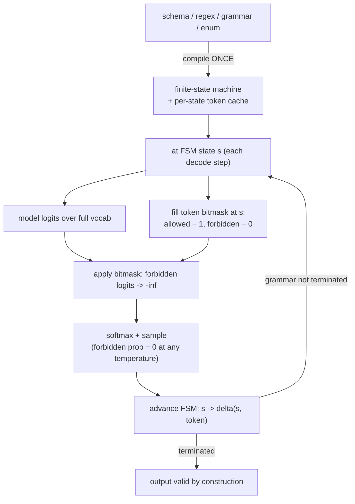

# Guided / Structured Decoding: Make Invalid Tokens Impossible

!!! info "Baseline: **vLLM 0.26.0** · model `Qwen2.5-7B-Instruct` · single RTX 4090 (24 GB)"
    Verified against vLLM 0.26.0 via Context7 (ADR-0004): offline uses `from vllm.sampling_params import StructuredOutputsParams` with options **`json`, `regex`, `choice`, `grammar`, `structural_tag`**, passed as `SamplingParams(structured_outputs=StructuredOutputsParams(...))`; the OpenAI server uses `response_format={"type":"json_schema",...}` or `extra_body={"structured_outputs": {...}}`; backends are **`xgrammar` (default via auto)** or **`guidance`**, selected with `--structured-outputs-config.backend`. **The old `guided_json`/`guided_regex` fields were deprecated and removed in vLLM 0.12.0 — use `structured_outputs`.** The §4 code shows the current API; any latency figures are **illustrative / order-of-magnitude references**.

---

## 1 · Intuition & why it matters

Your service needs the model to return **valid JSON** matching a schema — `{"sentiment": "positive", "score": 0.9}` — so downstream code can parse it. You write a careful prompt: "Reply with ONLY JSON in this format…". It works most of the time. Then the model prepends "Sure! Here's the JSON:", or emits a trailing comma, or writes `"score": high`, or wraps it in ```` ```json ````. At scale, that "most of the time" failure rate becomes a stream of parse errors, retries, and 3 a.m. pages. Prompt-and-pray is not a contract.

Structured decoding makes the contract **mechanical** instead of hopeful. The model still generates one token at a time; at *every* step, it first computes a probability over the whole vocabulary — but before sampling, we **mask out every token that would make the output violate the schema**, setting their probability to zero. If the grammar says the next character must be `{` or whitespace, then every token that isn't `{` or whitespace is forbidden this step. The model *cannot* emit invalid JSON, because the invalid tokens were never on the table. The output is schema-valid **by construction**, not by luck.

This is the difference between "please output JSON" and "you are physically incapable of outputting non-JSON." The same idea extends from JSON schemas to **regexes** (phone numbers, dates), **enums** (`"positive" | "negative"`), and full **context-free grammars** (a SQL subset, a DSL). It's one of the most reliable things you can add to a production LLM endpoint — and the one sharp edge every interviewer probes: it guarantees the *shape*, never the *truth*. → see the [Glossary](../glossary.md) for *Guided / Structured decoding*.

## 2 · Mental model

Schema → automaton → per-step token mask → sample only from what's allowed:

```text
COMPILE ONCE:   JSON schema / regex / grammar  ──►  finite-state machine (FSM)
                {sentiment: enum, score: number}      states + allowed transitions

EACH DECODE STEP (at FSM state s):
  model logits over the FULL vocab:   [ the ]=2.1  [ { ]=1.8  [ Sure ]=3.0  [ " ]=0.4 …
                                                              └ highest, but INVALID here
  grammar mask at state s:            [ the ]= 0   [ { ]= 1   [ Sure ]= 0   [ " ]= 1  …
                                          └ forbidden      └ allowed        └ allowed
  masked logits (add log mask):       [ the ]=-∞   [ { ]=1.8  [ Sure ]=-∞   [ " ]=0.4 …
  softmax + sample  ───────────────►  picks "{"  (a valid next token; "Sure" was impossible)
  advance FSM:  state s ──"{"──► state s'   (now expecting a key or "}")

RESULT: every sampled token keeps the output on a path the grammar accepts →
        the final string is guaranteed to match the schema. Shape is enforced;
        WHICH valid value (positive vs negative, 0.9 vs 0.1) is still the model's call.
```

The arithmetic above (the $-\infty$ masking) is a spatial sketch, so ASCII per ADR-0005. The compile-once-then-mask-every-step *control flow* is a process, so Mermaid `flowchart`:



Three shapes to hold:

- **The constraint acts on logits, not on text after the fact.** There's no "generate then validate then retry" — invalid tokens are removed *before* sampling, every step. That's why the guarantee is hard, not statistical.
- **The schema is compiled once into a state machine.** Each state knows its set of allowed next tokens. Decoding walks the machine; the mask is just "which tokens keep us on an accepted path from here."
- **It constrains form, not content.** Masking guarantees the output *parses* and *matches the schema*. It cannot make `score` correct or `sentiment` truthful — the model still chooses among the *valid* options. Garbage-but-valid is still possible.

## 3 · Principle

### 3.1 From schema to a token mask

A regex or grammar defines a language — the set of accepted strings. Any regex compiles to a **finite-state automaton**; a context-free grammar (what a JSON schema becomes) compiles to a **pushdown automaton**. Either way, at any point in generation the automaton is in some state $s$, and only a subset of the vocabulary $V$ can legally come next without leaving an accepted path.

Encode that as a binary **mask** $m^{(s)} \in \{0,1\}^{|V|}$: $m^{(s)}_i = 1$ if token $i$ is allowed from state $s$, else $0$. At each step the model produces logits $z \in \mathbb{R}^{|V|}$; we apply the mask **before** softmax:

$$
z'_i = z_i + \log m^{(s)}_i \;=\;
\begin{cases}
z_i & \text{if token } i \text{ is allowed } (m^{(s)}_i = 1)\\
-\infty & \text{if forbidden } (m^{(s)}_i = 0)
\end{cases}
$$

$$
p_i = \operatorname{softmax}(z')_i = \frac{e^{z'_i}}{\sum_j e^{z'_j}}
$$

Because $e^{-\infty} = 0$, every forbidden token gets probability exactly **0** — it can never be sampled, at any temperature, top-p, or top-k. After sampling token $t$, the automaton **advances** $s \to \delta(s, t)$, and the next step uses that state's mask. The final string is therefore a walk the automaton accepts — schema-valid by construction.

### 3.2 What the backend actually does (and its cost)

The hard engineering is making the mask **cheap enough to compute every step** without stalling the GPU. That's what the backend does:

- **`xgrammar`** (vLLM's default, chosen by the `auto` setting) precomputes, per grammar state, the set of allowed tokens, so the per-step mask is a fast lookup that overlaps with GPU compute — designed to add near-zero latency in the common case.
- **`guidance`** is the alternative backend, with different grammar/feature coverage.

Two costs to know: (1) a **one-time compile** of the schema/grammar into the automaton (amortized across all requests using that schema, but it can show up as first-token latency for a brand-new schema); (2) per-step masking, which the good backends drive toward negligible. This is why you *set the schema*, not re-derive it per token.

### 3.3 The four constraint types (and the deprecation you must know)

vLLM exposes structured outputs through `StructuredOutputsParams` (offline) / the `structured_outputs` request field (online), with these options:

- **`json`** — a JSON Schema (or a Pydantic model's `.model_json_schema()`); the workhorse for tool calls and structured extraction.
- **`regex`** — a regular expression (phone number, date, a fixed template). Note the regex *flavor* depends on the backend — xgrammar/guidance use Rust-style regex.
- **`choice`** — a fixed list of allowed strings, i.e. a classification/enum constraint.
- **`grammar`** — a full EBNF context-free grammar, for DSLs and SQL subsets.
- **`structural_tag`** — for constraining tagged regions (e.g. tool-call blocks).

!!! warning "API rename — don't use the old fields"
    The older `guided_json` / `guided_regex` / `guided_choice` / `guided_grammar` fields were **deprecated and removed in vLLM 0.12.0**. On the 0.26.0 baseline you **must** use `structured_outputs` (online) / `StructuredOutputsParams` (offline). Interview and code-reading tip: seeing `guided_*` means the code predates 0.12.0.

### 3.4 Reading it in vLLM's source (v0.26.0)

§3.1's mask $m^{(s)}$ is a real object in the V1 code (ADR-0002: read + reason, don't rewrite):

- **The request field** is **`StructuredOutputsParams`** in [`vllm/sampling_params.py`](https://github.com/vllm-project/vllm/blob/v0.26.0/vllm/sampling_params.py) — the dataclass with `json` / `regex` / `choice` / `grammar` / `structural_tag` fields from §3.3.
- **The per-step mask** is built by **`StructuredOutputManager.grammar_bitmask()`** in [`vllm/v1/structured_output/__init__.py`](https://github.com/vllm-project/vllm/blob/v0.26.0/vllm/v1/structured_output/__init__.py): it walks the batch and, for each constrained request, fills that request's slice of a shared bitmask buffer. The actual per-state fill is **`XgrammarGrammar.fill_next_token_bitmask`** in [`vllm/v1/structured_output/backend_xgrammar.py`](https://github.com/vllm-project/vllm/blob/v0.26.0/vllm/v1/structured_output/backend_xgrammar.py), backed by `xgr.allocate_token_bitmask` — a **compact bitmask** of shape `(max_num_seqs, ⌈vocab/32⌉)`, *not* a dense per-state array. Applying it sets forbidden logits to $-\infty$ — exactly §3.1's $z_i + \log m^{(s)}_i$, realized as a bit test.
- **The backend choice** lives on **`StructuredOutputsConfig`** ([`vllm/config/structured_outputs.py`](https://github.com/vllm-project/vllm/blob/v0.26.0/vllm/config/structured_outputs.py)): `backend="auto"` resolves to `xgrammar` (with `guidance` the alternative), matching the `--structured-outputs-config.backend` flag in §5.

Open `backend_xgrammar.py` first — `fill_next_token_bitmask` → apply-to-logits is the whole "mask then sample" idea in one method.

## 4 · Complete runnable code + line-by-line

Offline structured decoding, all four common constraints, using the exact vLLM 0.26.0 API. A Pydantic model gives the JSON schema; the others are inline.

```python title="structured_decoding_offline.py"
# APIs verified against vLLM 0.26.0 (StructuredOutputsParams, SamplingParams.structured_outputs).
from enum import Enum
from pydantic import BaseModel
from vllm import LLM, SamplingParams
from vllm.sampling_params import StructuredOutputsParams

llm = LLM(model="Qwen/Qwen2.5-7B-Instruct")          # any base; structured outputs is decode-side

# (a) JSON constrained by a Pydantic schema -----------------------------------
class Sentiment(str, Enum):
    positive = "positive"; negative = "negative"; neutral = "neutral"
class Review(BaseModel):
    sentiment: Sentiment
    score: float
json_so = StructuredOutputsParams(json=Review.model_json_schema())   # schema → grammar
out = llm.generate("Rate: 'vLLM is wonderful!'",
                   SamplingParams(temperature=0, max_tokens=64, structured_outputs=json_so))
print(out[0].outputs[0].text)     # e.g. {"sentiment": "positive", "score": 0.95}

# (b) choice — a fixed enum (classification) ----------------------------------
choice_so = StructuredOutputsParams(choice=["Positive", "Negative"])
out = llm.generate("Classify this sentiment: vLLM is wonderful!",
                   SamplingParams(structured_outputs=choice_so))
print(out[0].outputs[0].text)     # exactly "Positive" or "Negative" — nothing else possible

# (c) regex — a fixed template ------------------------------------------------
regex_so = StructuredOutputsParams(regex=r"\d{3}-\d{3}-\d{4}")
out = llm.generate("Give me a fake US phone number:",
                   SamplingParams(structured_outputs=regex_so))
print(out[0].outputs[0].text)     # matches \d{3}-\d{3}-\d{4}, e.g. 415-555-0132

# (d) grammar — an EBNF context-free grammar ----------------------------------
sql = r'''
root        ::= "SELECT " column " FROM " table
column      ::= "name " | "id "
table       ::= "users " | "airports "
'''
grammar_so = StructuredOutputsParams(grammar=sql)
out = llm.generate("Show all airport names.",
                   SamplingParams(structured_outputs=grammar_so))
print(out[0].outputs[0].text)     # a string this grammar accepts, e.g. SELECT name FROM airports
```

**Line-by-line:**

- `StructuredOutputsParams(json=Review.model_json_schema())` — Pydantic's `.model_json_schema()` turns the `Review` class into a JSON Schema dict; the backend compiles it to a grammar. The output is guaranteed to have `sentiment` ∈ the enum and `score` a number — it *cannot* be missing a field or misspell the key.
- `SamplingParams(..., structured_outputs=json_so)` — this is the 0.26.0 wiring: the constraint rides *inside* `SamplingParams`, not as a top-level `guided_json=` argument (that's the removed API).
- **(b) `choice=[...]`** compiles to "the whole output must be exactly one of these strings" — the model can only walk to `Positive` or `Negative`; there is no path to anything else, so no post-parsing is needed.
- **(c) `regex=r"\d{3}-\d{3}-\d{4}"`** forces the digit-dash template. Each step only allows a digit (or the literal `-` at the right positions); the model can't wander off-format. (Backend regex flavor is Rust-style.)
- **(d) `grammar=sql`** is an EBNF grammar: `root` must be `SELECT <column> FROM <table>` with `column`/`table` from fixed sets. The output is always a well-formed query in *this* mini-language — the model picks *which* columns/tables, the grammar guarantees the *form*.
- `temperature=0` in (a) makes the JSON demo deterministic; the constraint is independent of sampling — even at high temperature, forbidden tokens stay at probability 0.

Conceptual output (illustrative):

```text
{"sentiment": "positive", "score": 0.95}
Positive
415-555-0132
SELECT name FROM airports
```

Every line parses/matches on the first try — no "Sure, here's…" preamble, no trailing comma, no code fence. That reliability is the product.

## 5 · Lab — enforce a schema over the OpenAI endpoint

!!! gpu "GPU Lab (single-card, fully runnable)"
    - **Min VRAM:** ~16 GB to run `Qwen2.5-7B-Instruct` (INT4/AWQ); structured decoding adds only the (small) mask compute.
    - **Suggested AutoDL card:** RTX 4090 (24 GB)
    - **Est. time / cost:** reading ~15 min (free, no-card mode) · optional run ~10 min · ~¥1 (illustrative)
    - **Platform:** NVIDIA CUDA (default)
    - **Non-NVIDIA:** structured decoding is a logits-masking layer on top of sampling; it's backend-agnostic. The mask-compute cost is CPU/host-side (grammar engine), so it behaves similarly across GPU vendors.

Serve normally, then constrain from the client — two ways: the OpenAI-native `response_format`, and vLLM's `extra_body`.

```bash title="start the server (optionally pick a backend)"
vllm serve Qwen/Qwen2.5-7B-Instruct --structured-outputs-config.backend xgrammar
# backend defaults to auto (→ xgrammar); "guidance" is the alternative.
```

```python title="two ways to constrain from the OpenAI client"
from openai import OpenAI
from pydantic import BaseModel
client = OpenAI(base_url="http://localhost:8000/v1", api_key="-")
model = client.models.list().data[0].id

# 1) OpenAI-native JSON schema via response_format
class Car(BaseModel):
    brand: str; model: str; year: int
resp = client.chat.completions.create(
    model=model,
    messages=[{"role": "user", "content": "The most iconic 90s car, as JSON."}],
    response_format={"type": "json_schema",
                     "json_schema": {"name": "car", "schema": Car.model_json_schema()}},
)
print(resp.choices[0].message.content)   # valid JSON matching Car

# 2) vLLM extra_body: choice / regex / grammar
resp = client.chat.completions.create(
    model=model,
    messages=[{"role": "user", "content": "Classify: vLLM is wonderful!"}],
    extra_body={"structured_outputs": {"choice": ["positive", "negative"]}},
)
print(resp.choices[0].message.content)   # exactly "positive" or "negative"
```

**What to observe / do:**

1. **It becomes unbreakable.** Ask the model to "ignore the format and just chat" while the constraint is on — it still returns schema-valid output. The mask wins over the prompt.
2. **Shape ≠ truth.** Give a JSON schema with a `score: number` and a nonsense prompt — you'll get *valid* JSON with a *meaningless* score. This is §2's third shape, made concrete: the constraint fixed the form, not the content.
3. **Backend swap.** Restart with `--structured-outputs-config.backend guidance` and rerun a complex grammar; note any feature/behavior differences (grammar coverage differs by backend).
4. **First-token cost.** Send a brand-new large schema and watch the first request's latency vs a repeat — the one-time grammar compile shows up once, then amortizes.

## 6 · Common pitfalls / counter-intuitive points

- **Using the removed `guided_*` fields.** `guided_json=` / `guided_regex=` were **deleted in 0.12.0**. On 0.26.0 they're gone — use `structured_outputs` / `StructuredOutputsParams`. Copy-pasting an old snippet is the #1 way this breaks.
- **Believing it improves correctness.** It constrains *form*, not *content*. A schema-valid `{"score": 0.5}` can still be a wrong answer; a `choice` constraint picks *a* label, not the *right* label. Structured decoding removes parse errors, not reasoning errors.
- **Over-loose schemas.** `{"answer": "string"}` with an unbounded string barely constrains anything — the model can still emit rambling text inside the quotes. Tighten with enums, regex, `maxLength`, required fields; a schema is only as strong as its tightest field.
- **Forgetting the compile cost on cold schemas.** A huge, never-seen grammar pays a one-time compile that can spike first-token latency. Reuse schemas so the compile amortizes; don't generate a unique giant schema per request.
- **Regex-flavor surprises.** The backend's regex engine (Rust-style for xgrammar/guidance) isn't identical to Python's `re`. Fancy lookarounds or backreferences may be unsupported — test your pattern against the actual backend.
- **Unbounded numbers/strings that don't terminate cleanly.** A `number` with no bound or a greedy string can let generation run to `max_tokens` instead of closing the object. Constrain ranges/lengths and rely on the schema's structure to force the closing tokens.
- **Assuming the mask is pure-GPU and always free.** The bitmask is *filled on the host each step* by the grammar engine (`XgrammarGrammar.fill_next_token_bitmask`, `backend_xgrammar.py`) — near-free when most tokens are decided at compile time, but a grammar with many **context-dependent** tokens (deep recursion, huge alternations) forces per-step stack/PDA checks that can become a CPU-side bottleneck the GPU then waits on. "Near-zero overhead" is the common case, not a guarantee — profile a complex grammar rather than assuming it's costless.

## 7 · Interview links

- [Guided / structured decoding: masking tokens to a schema](../interview/structured-decoding.md) — the high-frequency question this lesson prepares you for: *how a schema becomes a per-step logit mask, why the guarantee is hard rather than statistical, the cost model, and why it fixes shape but never truth.*

## 8 · Summary & further reading

**One line:** Structured decoding compiles a JSON schema / regex / grammar / enum into a state machine that, at every decode step, produces a token mask; vLLM adds $\log m$ to the logits so forbidden tokens get probability exactly 0 ($-\infty$ logit) and only schema-valid tokens can be sampled — making the output valid **by construction** via the `structured_outputs` field (`StructuredOutputsParams`, backends `xgrammar`/`guidance`; the old `guided_*` API was removed in 0.12.0) — but it guarantees *shape*, never *truth*.

Further reading:

- vLLM `docs/features/structured_outputs.md` — the `StructuredOutputsParams` options, `response_format`, and `--structured-outputs-config.backend` flag quoted here.
- **xgrammar** — the default backend; its per-state token-mask precomputation is what keeps masking near-free.
- **Outlines** / **Guidance** — the broader constrained-generation ecosystem and the FSM/regex-to-mask idea.
- vLLM source (v0.26.0): [`vllm/sampling_params.py`](https://github.com/vllm-project/vllm/blob/v0.26.0/vllm/sampling_params.py) (`StructuredOutputsParams`), [`vllm/v1/structured_output/__init__.py`](https://github.com/vllm-project/vllm/blob/v0.26.0/vllm/v1/structured_output/__init__.py) (`StructuredOutputManager.grammar_bitmask`), [`vllm/v1/structured_output/backend_xgrammar.py`](https://github.com/vllm-project/vllm/blob/v0.26.0/vllm/v1/structured_output/backend_xgrammar.py) (`XgrammarGrammar.fill_next_token_bitmask`) — the schema→bitmask→logits code from §3.4.
- The [continuous batching lesson](../part5/continuous-batching.md) — structured decoding runs *inside* each sequence's decode step, so it composes with everything in Part 5.

## 9 · Self-check

??? question "You prompt a model to 'reply only with JSON' and it works 97% of the time. Structured decoding claims 100%. What is it doing differently at the token level that makes the guarantee hard rather than statistical?"
    Prompting only *biases* the distribution — the model still *can* emit "Sure!" or a trailing comma, just with lower probability, so at scale a few percent slip through. Structured decoding changes what's *possible*, not just what's *likely*. It compiles the schema into a state machine and, at **every decode step**, builds a mask $m^{(s)}$ of tokens allowed from the current state, then sets forbidden tokens' logits to $-\infty$ **before** softmax. Since $e^{-\infty}=0$, a forbidden token has probability *exactly* 0 — it cannot be sampled at any temperature/top-p. The model literally has no path to invalid output, so validity is guaranteed by construction, not by a high-probability nudge.

??? question "A teammate says 'we turned on JSON schema decoding, so the model's answers are correct now.' What's the conceptual error, and give a concrete failure it won't prevent."
    The error is conflating **form** with **truth**. Structured decoding constrains the *shape* of the output — it guarantees valid JSON matching the schema — but it does nothing to the model's *reasoning* or *knowledge*. The mask only removes tokens that would break the grammar; among the schema-valid tokens, the model still chooses freely. Concrete failure: with a schema `{"capital": "string", "population": number}`, asking for France's capital could yield the perfectly valid, perfectly wrong `{"capital": "Lyon", "population": 999}`. It parses, matches the schema, and is false. Structured decoding eliminates *parse* errors, not *content* errors — validate values separately.

??? question "On the vLLM 0.26.0 baseline, a copied snippet does `SamplingParams(guided_json=schema)` and errors. Why? Give the correct call and name the backend that runs it."
    `guided_json` (and `guided_regex`/`guided_choice`/`guided_grammar`) were **deprecated and removed in vLLM 0.12.0** — on 0.26.0 that field no longer exists, so the call errors. The current API puts the constraint inside a `StructuredOutputsParams` and passes it via `SamplingParams.structured_outputs`:
    ```python
    from vllm.sampling_params import StructuredOutputsParams
    sp = SamplingParams(structured_outputs=StructuredOutputsParams(json=schema))
    ```
    (online: `extra_body={"structured_outputs": {"json": schema}}` or `response_format={"type":"json_schema", ...}`). The default backend is **`xgrammar`** (selected by the `auto` setting; `guidance` is the alternative, set via `--structured-outputs-config.backend`). Seeing `guided_*` in code is a reliable sign it predates 0.12.0.
