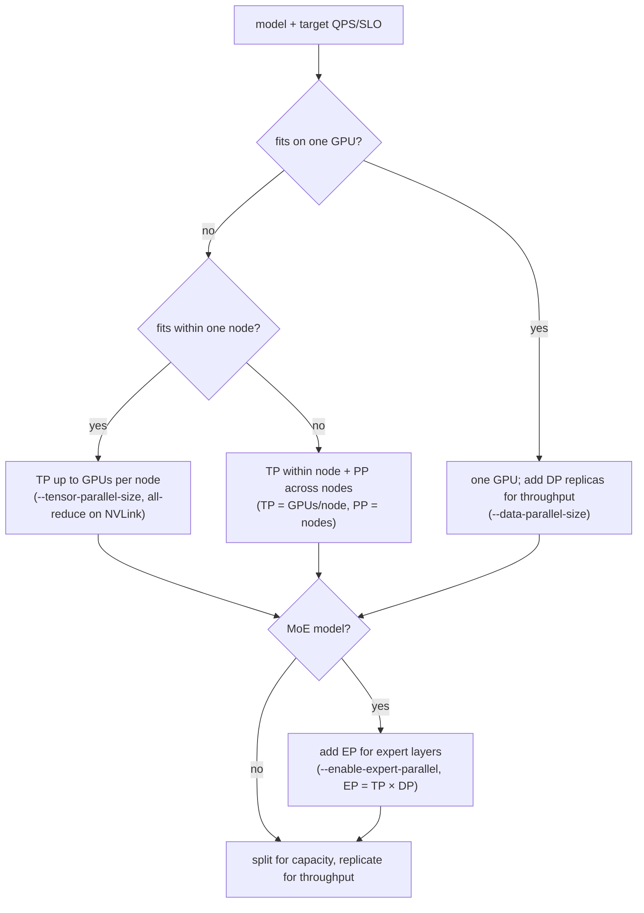

# Why Parallelize, and How: Tensor / Pipeline / Data / Expert Parallelism

!!! info "Baseline: **vLLM 0.26.0** · model `Qwen2.5-7B-Instruct` · single RTX 4090 (24 GB)"
    Verified against vLLM 0.26.0 via Context7 (ADR-0004): tensor parallelism uses **`tensor_parallel_size`** / **`--tensor-parallel-size`** (shard a model *within one node*), pipeline parallelism uses **`pipeline_parallel_size`** / **`--pipeline-parallel-size`** (split *layers*, the strategy for going *across nodes*), data parallelism uses **`--data-parallel-size`** (replicas), and expert parallelism for MoE uses **`--enable-expert-parallel`** (experimental; EP size is auto-computed as `tensor_parallel_size × data_parallel_size`). This lesson is the *why & which* — the hands-on multi-GPU run (NCCL + actually launching TP/PP on an A100) is the [next lesson](nccl-and-launching-tp-pp.md). It builds on the [GPU hardware model](../part0/gpu-hardware.md), [KV cache](../part0/kv-cache.md), and [attention variants](../interview/attention-variants.md). The §4 model is a **memory/communication model, not a benchmark**; all sizes are **illustrative / order-of-magnitude references**.

---

## 1 · Intuition & why it matters

Everything up to Part 6 assumed one GPU. That assumption breaks for exactly two reasons, and an interviewer will make you name which one you're solving:

1. **It won't fit.** A 70B model in FP16 is ~130 GB of weights; a 24 GB card can't hold it, full stop. Even after INT4 quantization (~33 GB) it still doesn't fit on one 4090. When weights **+** [KV cache](../part0/kv-cache.md) **+** activations exceed one GPU's VRAM, you have *no choice* — the model must be **split across GPUs**. This is a **capacity** problem.
2. **It's too slow / low-throughput.** The model fits, but one GPU can't serve your QPS, or its latency is too high. Here you don't split the model — you **replicate** it and spread requests, or (for the biggest models) split it *and* pipeline it to raise aggregate tokens/second. This is a **throughput** problem.

These two triggers map onto **four** ways to cut the work, and the whole interview is knowing *what each one splits, what it costs to communicate, and when it's the right tool*:

- **Tensor Parallelism (TP)** — split *each layer's matrices* across GPUs (intra-layer). Shrinks memory per GPU; costs an **all-reduce every layer**, so it's chatty and wants fast interconnect (NVLink) — hence *within one node*.
- **Pipeline Parallelism (PP)** — split *the layers themselves* across GPUs (inter-layer). Each GPU owns a contiguous stage; costs a **pipeline bubble** but only cheap point-to-point handoffs — hence *across nodes*.
- **Data Parallelism (DP)** — *replicate* the whole model, split the *requests*. Raises throughput; requires the model to already fit on one GPU.
- **Expert Parallelism (EP)** — for **MoE** models only: split the *experts* across GPUs. Costs an **all-to-all** to route each token to its expert's GPU.

Get this wrong and you either OOM at launch (chose DP for a model that doesn't fit) or throttle yourself on the wire (chose TP across a slow network). → see the [Glossary](../glossary.md) for *Tensor/Pipeline/Data/Expert Parallelism*.

## 2 · Mental model

Two triggers, four splits. Hold the picture of *what axis each one cuts*:

```text
WHY PARALLELIZE — two triggers, and they pick different tools:
  (1) WON'T FIT      weights + KV + activations > one GPU's VRAM   → you MUST split the model (TP / PP / EP)
  (2) TOO SLOW       model fits, but one GPU can't hit your QPS/SLO → REPLICATE (DP), or split+pipeline for scale

THE FOUR SPLITS — what gets cut, and what it costs to stitch back:

TENSOR PARALLEL (TP) — split each layer's matrices ACROSS GPUs  (intra-layer)
    W = [ W0 | W1 | W2 | W3 ]     every GPU holds a SLICE of EVERY layer
    ── every layer, every token: ALL-REDUCE to sum partial outputs ──►  chatty ⇒ wants NVLink ⇒ within 1 node
    memory/GPU: ÷N        latency: helped (more compute/GPU)     cost: 2 all-reduces per layer

PIPELINE PARALLEL (PP) — split the LAYERS across GPUs  (inter-layer)
    layers 0–13 → GPU0  ─►  layers 14–27 → GPU1  ─►  ...    each GPU owns a contiguous STAGE
    handoff = cheap point-to-point (activations only)  ⇒  survives across NODES
    memory/GPU: ÷stages   cost: PIPELINE BUBBLE (stages idle at fill/drain) → feed microbatches to hide it

DATA PARALLEL (DP) — REPLICATE the whole model, split the REQUESTS
    [full model @ GPU0]   [full model @ GPU1]   ...    each replica serves different requests
    memory/GPU: ×1 (full copy)   throughput: ×replicas   REQUIRES: model already fits on 1 GPU

EXPERT PARALLEL (EP) — MoE only: split the EXPERTS across GPUs
    experts {0..7}→GPU0   experts {8..15}→GPU1    each token routed to the GPU holding its expert
    cost: ALL-TO-ALL token routing   EP size = TP × DP (auto)   (experimental in 0.26.0)
```

The "what each split cuts" picture above is a conceptual layout (ASCII per ADR-0005). The §3.5 *decision procedure* — fit first, then replicate — is a topology, so Mermaid `flowchart`:



Three shapes to keep:

- **Capacity vs throughput are different problems with different tools.** "Won't fit" → TP/PP/EP (split the model). "Too slow but fits" → DP (replicate). Reaching for the wrong family is the classic mistake.
- **Every split has a communication tax, and the tax dictates the topology.** TP all-reduces *every layer, every token* → bandwidth-hungry → keep it inside a node on NVLink. PP only hands off activations between stages → cheap → fine across nodes. The interconnect decides which you can afford.
- **They compose.** Real large-scale serving is TP **within** a node × PP **across** nodes, optionally × DP for replicas, × EP for MoE. They're orthogonal axes, not competitors.

## 3 · Principle

### 3.1 The fit wall (why "won't fit" is non-negotiable)

Model weights alone cost:

$$
M_\text{weights} = P \times b
$$

where $P$ is the parameter count and $b$ the bytes per parameter (FP16 → 2, INT4 → 0.5). A 70B model is $70\times10^9 \times 2 \approx 130\ \text{GB}$ in FP16 — and that's *before* the [KV cache](../part0/kv-cache.md) and activations, which need their own headroom. One 24 GB GPU is off the table by ~6×. Quantizing to INT4 gets you to ~33 GB — still over one card. So the model *must* live on several GPUs: the only question is *how you cut it*. If instead the model **does** fit (e.g. Qwen2.5-7B at ~14 GB FP16), you never split for capacity — you only replicate for throughput.

### 3.2 Tensor Parallelism (TP) — split inside every layer

TP shards the **matrices within a layer** across GPUs. The standard Megatron pattern: a linear layer $Y = XW$ splits $W$ **by columns**, $W = [W_1 \mid W_2 \mid \dots \mid W_N]$, so GPU $k$ computes $Y_k = XW_k$ — a slice of the output. The *next* linear layer is split **by rows** so it consumes those slices and produces a partial sum, and a single **all-reduce** sums the partials back into the full activation. In a transformer block this lands as **two all-reduces per layer** (one after attention, one after the FFN). Attention heads split cleanly across GPUs, which is why **TP degree is almost always a power of 2** and must divide the **query**-head count. KV heads are the subtlety: with [GQA](../part0/transformer-infra.md) there are far fewer of them (Llama-3.1 has just **8**), so once the TP degree *exceeds* `num_kv_heads`, vLLM **replicates** the KV heads across ranks instead of splitting them — per-GPU KV cache stops shrinking past that point, but the shard stays valid. The honest rule is therefore *TP must divide the query-head count; KV heads split until `num_kv_heads`, then replicate.*

The cost is communication. Each all-reduce moves roughly (using ring all-reduce, $\frac{2(N-1)}{N}$× the message size per GPU):

$$
\text{bytes per all-reduce} \approx \text{tokens} \times d_\text{hidden} \times b
$$

and it happens **every layer, on every token** — including every single decode step. That's a lot of small, latency-sensitive transfers, so TP is **bandwidth-bound on the interconnect** and wants **NVLink** (~hundreds of GB/s) rather than PCIe. This is the concrete reason vLLM's guidance is: *"Use tensor parallelism for models that exceed a single GPU but fit within a single node"* — TP degree ≤ GPUs per node. In vLLM:

```python
from vllm import LLM
llm = LLM(model="meta-llama/Llama-3.1-70B-Instruct", tensor_parallel_size=4)  # shard within one node
```

TP helps **latency** too (more GPUs crunch each token), which is why even a model that *fits* is sometimes served with TP>1 to cut TTFT/TPOT — at the cost of that all-reduce traffic.

### 3.3 Pipeline Parallelism (PP) — split the layers into stages

PP cuts along the **depth** axis: GPU 0 holds layers 0–13, GPU 1 holds 14–27, and so on. A token's activations flow GPU0 → GPU1 → … as a **relay**. The only communication is a **point-to-point send of the activation tensor** at each stage boundary — tiny compared to TP's per-layer all-reduce — which is why **PP survives across nodes** where the interconnect is slow.

Its characteristic cost is the **pipeline bubble**: while stage 0 processes the first microbatch, stages 1..N sit idle; they only fill up as work flows down the pipe, and drain empty at the end. With $p$ stages and $m$ microbatches the idle fraction is

$$
\text{bubble} = \frac{p-1}{m + p - 1}
$$

So you hide the bubble by feeding **many microbatches** ($m \gg p$). PP is the tool for *"even TP across the whole node isn't enough"* or *"multi-node."* vLLM's rule of thumb: set **TP = GPUs per node** and **PP = number of nodes**:

```python
llm = LLM(model="meta-llama/Llama-3.1-70B-Instruct",
          tensor_parallel_size=4, pipeline_parallel_size=2)  # 4 GPUs/node × 2 nodes = 8 GPUs
```

### 3.4 Data Parallelism (DP) and Expert Parallelism (EP)

**DP replicates.** Each GPU (or each TP/PP group) holds a **full copy** of the model and serves a **different stream of requests**. It adds *zero* per-GPU memory savings — every replica is a whole model — so DP is purely a **throughput** lever and **requires the model to already fit**. In vLLM you can run DP alongside TP:

```bash
vllm serve $MODEL --data-parallel-size 4 --tensor-parallel-size 2   # 4 replicas, each sharded over 2 GPUs
```

**EP is for MoE.** A [Mixture-of-Experts](../glossary.md) layer has many expert FFNs but routes each token to only a few. EP places **different experts on different GPUs**; since a token's chosen expert may live elsewhere, the layer needs an **all-to-all** to ship tokens to the right GPU and back. It's enabled with `--enable-expert-parallel`, is **experimental** in 0.26.0, and its size is **auto-computed** as `tensor_parallel_size × data_parallel_size` — you size TP and DP, and EP falls out:

```bash
vllm serve deepseek-ai/DeepSeek-V3-0324 \
    --tensor-parallel-size 1 --data-parallel-size 8 --enable-expert-parallel   # EP size = 1 × 8 = 8
```

### 3.5 How to choose (the decision tree)

vLLM's own strategy for a single model replica, in order:

1. **Fits on one GPU?** → use one GPU. Add **DP** replicas if you need more throughput.
2. **Exceeds one GPU but fits within one node?** → **TP** up to the GPUs in that node.
3. **Exceeds one node?** → **TP within each node + PP across nodes** (TP = GPUs/node, PP = nodes).
4. **MoE model?** → add **EP** (via TP×DP) for the expert layers.

The through-line: **split only as much as you must for capacity (TP → PP → multi-node), then replicate (DP) for throughput** — and let the **interconnect** (NVLink inside a node, network across nodes) decide where each cut goes.

### 3.6 Reading it in vLLM's source (v0.26.0)

The four splits are config + a handful of layer/coordinator classes (ADR-0002: read + reason, don't rewrite):

- **TP is realized per linear layer**, not by a global switch. The Megatron column/row split of §3.2 is exactly `ColumnParallelLinear` and `RowParallelLinear` in [`vllm/model_executor/layers/linear.py`](https://github.com/vllm-project/vllm/blob/v0.26.0/vllm/model_executor/layers/linear.py): the row-parallel layer's `forward` ends with `tensor_model_parallel_all_reduce(output_parallel)` — that call **is** the "one all-reduce per matmul, two per block" of §3.2. `QKVParallelLinear` shards attention heads, which is why the TP degree must divide the head count.
- **The collective + the groups** live in [`vllm/distributed/parallel_state.py`](https://github.com/vllm-project/vllm/blob/v0.26.0/vllm/distributed/parallel_state.py): `tensor_model_parallel_all_reduce`, and the `GroupCoordinator` you fetch with `get_tp_group()` / `get_pp_group()` — the TP and PP process groups the [next lesson](nccl-and-launching-tp-pp.md) launches.
- **The knobs** are dataclass fields on **`ParallelConfig`** ([`vllm/config/parallel.py`](https://github.com/vllm-project/vllm/blob/v0.26.0/vllm/config/parallel.py)): `tensor_parallel_size`, `pipeline_parallel_size`, `data_parallel_size` (all default `1`), `enable_expert_parallel` (default `False`), and `distributed_executor_backend` (`mp` / `ray`).

Open `linear.py` and jump to `RowParallelLinear.forward` first — the all-reduce is right there at the bottom of the method.

## 4 · Complete runnable code + line-by-line

A pure-Python model of the two decisions this lesson is about: **does the model fit on one 24 GB GPU** (and if not, the minimum TP degree), and **how much all-reduce traffic TP pays per token** (the tax that makes it want NVLink). No GPU — this is the arithmetic you should be able to do on a whiteboard.

```python title="fit_or_parallelize.py"
"""Fit-or-parallelize: does the model fit on one 24GB GPU? If not, the minimum TP degree —
plus the per-token all-reduce traffic that makes TP want NVLink.
A memory/communication model, not a benchmark. Pure Python, offline."""
GPU_VRAM_GB, KV_RESERVE_GB = 24, 6          # one RTX 4090; leave ~6GB for KV + activations (illustrative)
AVAIL_GB = GPU_VRAM_GB - KV_RESERVE_GB      # VRAM left for weights

def weight_gb(params_b, bytes_per_param):   # params_b = params in billions
    return params_b * 1e9 * bytes_per_param / 1024**3

def min_tp(params_b, bytes_per_param):      # smallest power-of-2 TP so the weight shard fits per GPU
    need, tp = weight_gb(params_b, bytes_per_param), 1
    while need / tp > AVAIL_GB:
        tp *= 2                             # TP degree is a power of 2 → splits attention heads evenly
    return tp

def tp_allreduce_kb_per_token(hidden, layers, bytes_per_elem=2):
    # decode = 1 token/step; TP does 2 all-reduces per layer, each ~ hidden elements wide
    return 2 * layers * hidden * bytes_per_elem / 1024

MODELS = [("Qwen2.5-7B",    7.6,  3584,  28),   # (name, params_B, hidden, layers)
          ("Llama-3.1-70B", 70,   8192,  80),
          ("Llama-3.1-405B", 405, 16384, 126)]
for name, params_b, hidden, layers in MODELS:
    w16, tp = weight_gb(params_b, 2), min_tp(params_b, 2)
    ar = tp_allreduce_kb_per_token(hidden, layers)
    verdict = "fits on 1 GPU" if tp == 1 else f"needs TP>={tp}"
    print(f"{name:15} FP16 {w16:6.1f} GB -> {verdict:14}  "
          f"TP all-reduce ~ {ar:6.1f} KB/token (every layer, every token -> wants NVLink)")
```

**Line-by-line:**

- `AVAIL_GB` is the VRAM left for weights after reserving headroom for the [KV cache](../part0/kv-cache.md) and activations — the real budget a weight shard must fit into.
- `weight_gb()` is the §3.1 fit wall, $M_\text{weights}=P\times b$, in GB. Swap `bytes_per_param` (2 for FP16, 0.5 for INT4) to see quantization move the line.
- `min_tp()` doubles the TP degree until one shard fits in `AVAIL_GB`. Powers of 2 aren't arbitrary — TP splits attention heads, so the degree must divide the head count evenly (§3.2).
- `tp_allreduce_kb_per_token()` is the §3.2 tax: **2 all-reduces per layer**, each moving ~`hidden` elements per token. It's a deliberate simplification (ignores batch and the ring $\frac{2(N-1)}{N}$ factor) — the point is the *shape*: it scales with `layers × hidden` and fires on **every decode token**, so it's small, frequent, latency-sensitive traffic → NVLink.
- The loop prints, per model: FP16 weight size, the fit verdict / minimum TP, and the per-token all-reduce volume.

Expected output (a memory/communication model, illustrative):

```text
Qwen2.5-7B      FP16   14.2 GB -> fits on 1 GPU   TP all-reduce ~  392.0 KB/token (every layer, every token -> wants NVLink)
Llama-3.1-70B   FP16  130.4 GB -> needs TP>=8     TP all-reduce ~ 2560.0 KB/token (every layer, every token -> wants NVLink)
Llama-3.1-405B  FP16  754.4 GB -> needs TP>=64    TP all-reduce ~ 8064.0 KB/token (every layer, every token -> wants NVLink)
```

The story in three rows: **Qwen2.5-7B fits** (TP=1 — you'd only add DP replicas for throughput); **70B needs TP≥8** (more than one node's worth of 4090s — in practice TP-within-node × PP-across-nodes, §3.3); **405B needs TP≥64** — unambiguously multi-node, so PP joins TP. And the all-reduce column climbs with depth×width: at 405B you're moving ~8 MB *per generated token, per pass through the pipe* — which is exactly why that traffic must ride NVLink and why TP is capped at a node. This arithmetic — fit first, then count the communication — is the parallelism interview.

## 5 · Lab — reason about the split (real multi-GPU run is next lesson)

!!! gpu "GPU Lab (conceptual on one card; real TP/PP needs multiple GPUs)"
    - **Min VRAM:** none for the §4 arithmetic (pure Python). Running Qwen2.5-7B at `tensor_parallel_size=1` needs ~16 GB (INT4/AWQ) on your single 4090.
    - **Suggested AutoDL card:** RTX 4090 (24 GB) for the single-GPU sanity check. **Actual multi-GPU TP/PP** (2×/4× A100) is the [next lesson: NCCL & launching TP/PP](nccl-and-launching-tp-pp.md), on a "power-on-then-off" A100 per ADR-0001 — don't rent multi-GPU just for this page.
    - **Est. time / cost:** §4 + reasoning ~20 min (free, no-card mode) · optional single-GPU run ~10 min · ~¥1–2 (illustrative)
    - **Platform:** NVIDIA CUDA (default). TP/PP communication rides **NCCL** on NVIDIA; **non-NVIDIA:** AMD ROCm uses RCCL, and the *concepts* (all-reduce/point-to-point/all-to-all) are backend-agnostic — the collective-comms mechanics are the next lesson.

Reason your way through the split before you ever rent a second GPU:

1. **Run the §4 model.** Confirm the three verdicts. Change `bytes_per_param` to `0.5` (INT4) and watch `min_tp` for 70B drop — quantization can turn "needs TP≥8" into "needs TP≥2", i.e. one node instead of two. This is the *first* lever before you add GPUs.
2. **Sanity-check single-GPU on your 4090.** `vllm serve Qwen/Qwen2.5-7B-Instruct` (default `tensor_parallel_size=1`) confirms the "fits on 1 GPU" verdict — no split needed; you'd scale it with DP replicas.
3. **Predict the failure.** If you set `--tensor-parallel-size 2` on a box with **one** GPU, vLLM can't place 2 shards → it errors at startup. Predict that *before* running it; understanding *why* (there's no second device for the second shard) is the point.
4. **Map a topology.** For a hypothetical 2-node × 4-GPU cluster serving Llama-3.1-70B, write the flags: `--tensor-parallel-size 4 --pipeline-parallel-size 2` (TP within each 4-GPU node, PP across the 2 nodes) — the §3.5 tree applied. The real launch is the [next lesson: NCCL & launching TP/PP](nccl-and-launching-tp-pp.md).

## 6 · Common pitfalls / counter-intuitive points

- **Confusing "won't fit" with "too slow."** They need *different* families: capacity → split the model (TP/PP/EP); throughput on a model that fits → *replicate* (DP). Reaching for DP on a model that doesn't fit just OOMs every replica; reaching for TP when one GPU already fits just adds all-reduce tax for nothing.
- **Running TP across PCIe or across nodes.** TP all-reduces *every layer, every token* — on a slow link it becomes the bottleneck and your GPUs starve waiting on the wire. Keep TP **within a node on NVLink**; use **PP** to cross node boundaries.
- **Setting a TP degree that doesn't divide the heads.** TP splits attention heads, so the degree must evenly divide the **query**-head count — that's why it's a power of 2. **KV heads are the exception:** with GQA there are far fewer (Llama-3.1 has 8), so when the TP degree *exceeds* `num_kv_heads` vLLM **replicates** them across ranks rather than splitting — which is why the §4 table's `TP≥8` / `TP≥64` for Llama-3.1 is fine even though 64 ∤ 8 (the KV heads replicate; per-GPU KV cache simply stops shrinking past `num_kv_heads`). A degree that doesn't divide the *query* heads, though, still fails or wastes GPUs.
- **Forgetting the pipeline bubble.** PP with too few microbatches leaves stages idle at fill/drain — the bubble fraction $\frac{p-1}{m+p-1}$ can dominate. Feed **many microbatches** ($m \gg p$) or the extra GPUs buy little.
- **Thinking DP saves memory.** DP is a *full copy* per replica — zero per-GPU savings. It's a throughput tool that *requires* the model to already fit.
- **Treating the four as competitors.** They compose on orthogonal axes: TP×PP×DP×EP. Production serving of a huge MoE uses all four at once.
- **Using EP for a dense model.** Expert parallelism only means anything for **MoE** — there are no experts to split in a dense model. And in 0.26.0 it's **experimental**, sized as TP×DP, not set directly.
- **Expecting a monolithic "TP mode" in the code.** There's no single tensor-parallel switch in the forward pass — TP is realized *per layer* by base classes: `ColumnParallelLinear` shards columns, `RowParallelLinear.forward` ends with `tensor_model_parallel_all_reduce` (`linear.py`). A custom layer that subclasses plain `nn.Linear` instead of these gets **no** sharding and silently replicates full weights on every GPU — the all-reduce lives *in* the layer, so the layer must opt in.

## 7 · Interview links

- [Parallelism: TP/PP/DP/EP & when to use each](../interview/parallelism-strategies.md) — the high-frequency question this lesson prepares you for: *the two reasons to parallelize, what each of TP/PP/DP/EP splits and what it costs to communicate, why TP stays within a node while PP crosses them, and how to pick a strategy from model size and topology.*
- [MoE inference: active vs total params & expert routing](../interview/moe-inference.md) — the MoE follow-up: active-vs-total params, how the router picks experts per token, and why EP (not TP) is the multi-GPU answer for the experts' memory.

## 8 · Summary & further reading

**One line:** You parallelize for one of two reasons — **the model won't fit** (split it) or **one GPU is too slow** (replicate it) — and there are four cuts: **TP** shards each layer's matrices ($W=[W_1|\dots|W_N]$, **two all-reduces per layer**, bandwidth-hungry → NVLink → *within a node*, `tensor_parallel_size`), **PP** splits the layers into stages (cheap point-to-point handoff → *across nodes*, at the cost of the **bubble** $\frac{p-1}{m+p-1}$, `pipeline_parallel_size`), **DP** replicates the whole model to raise throughput (needs it to fit; `--data-parallel-size`), and **EP** splits **MoE** experts with an all-to-all (`--enable-expert-parallel`, experimental, size = TP×DP) — and the decision tree is *fit first (single → TP → TP+PP across nodes), then replicate with DP*, letting the interconnect place each cut.

Further reading:

- *Megatron-LM* (Shoeybi et al., 2019) — the column/row tensor-parallel split and the two-all-reduce transformer block quoted in §3.2.
- *GPipe* (Huang et al., 2018) and *PipeDream* (Narayanan et al., 2019) — pipeline parallelism and the microbatch/bubble trade-off.
- *Switch Transformer* (Fedus et al., 2021) — MoE and expert routing, the setting EP exists for.
- vLLM `docs/serving/parallelism_scaling.md`, `docs/configuration/optimization.md`, `docs/serving/data_parallel_deployment.md`, `docs/serving/expert_parallel_deployment.md` — the `--tensor-parallel-size` / `--pipeline-parallel-size` / `--data-parallel-size` / `--enable-expert-parallel` mechanics and the decision tree quoted here.
- vLLM source (v0.26.0): [`vllm/model_executor/layers/linear.py`](https://github.com/vllm-project/vllm/blob/v0.26.0/vllm/model_executor/layers/linear.py) (`ColumnParallelLinear` / `RowParallelLinear` + `tensor_model_parallel_all_reduce`), [`vllm/distributed/parallel_state.py`](https://github.com/vllm-project/vllm/blob/v0.26.0/vllm/distributed/parallel_state.py) (`GroupCoordinator`, `get_tp_group`/`get_pp_group`), [`vllm/config/parallel.py`](https://github.com/vllm-project/vllm/blob/v0.26.0/vllm/config/parallel.py) (`ParallelConfig`) — the TP split + config from §3.6.
- The [next lesson — NCCL Collective Communication & Launching TP/PP](nccl-and-launching-tp-pp.md) — the collective primitives under TP's per-layer all-reduce, and actually launching TP/PP single- vs multi-node.

## 9 · Self-check

??? question "A 70B model in FP16 won't fit on your 24 GB card. Your teammate suggests `--data-parallel-size 4`. Why is that the wrong tool, and what actually helps?"
    DP **replicates** the whole model — every replica is a *full copy*, so it saves **zero** per-GPU memory. If 70B (~130 GB FP16) doesn't fit on one GPU, four DP replicas each still don't fit; they all OOM. DP is a *throughput* lever and *requires* the model to already fit. The "won't fit" problem needs the model **split**: **Tensor Parallelism** (`--tensor-parallel-size`) shards each layer's matrices across GPUs within a node — 70B needs TP≥8 at FP16 (§4), so in practice TP within each node × **Pipeline Parallelism** across nodes. (Quantizing to INT4 first shrinks it to ~33 GB, which can drop the required TP degree — always try that lever before adding GPUs.)

??? question "Why is tensor parallelism kept *within* a single node while pipeline parallelism can span nodes? Tie it to what each one communicates."
    It's the **communication pattern vs the interconnect**. TP does an **all-reduce after attention and after the FFN — two per layer — on every token**, including every decode step; that's a stream of small, frequent, latency-sensitive transfers whose volume scales with `layers × hidden`. It's bandwidth-bound, so it needs **NVLink** (hundreds of GB/s) and falls apart on PCIe or a network — hence TP degree ≤ GPUs per node. PP only sends the **activation tensor point-to-point at each stage boundary** — far less traffic, and tolerant of higher latency — so it **survives across nodes** where the link is slow. The rule of thumb that falls out: **TP = GPUs per node, PP = number of nodes.**

??? question "You're serving a dense 7B model that comfortably fits on one 4090, but QPS is too low. Walk through the right scaling move — and name one thing you would *not* do."
    The model **fits**, so this is a **throughput** problem, not capacity — the tool is **Data Parallelism**: run **replicas** (`--data-parallel-size N`, or just N independent servers behind a load balancer), each a full copy serving a different request stream; throughput scales ~linearly with replicas. What you would **not** do: reach for **TP** to "go faster." TP>1 on a model that already fits adds an all-reduce *every layer, every token* — pure communication tax that can *lower* throughput — and its real job is capacity, not replication. (TP can cut *latency* per request, so you'd only consider it if TTFT/TPOT, not QPS, were the failing SLO.) And **EP** is irrelevant here — there are no experts in a dense model.
