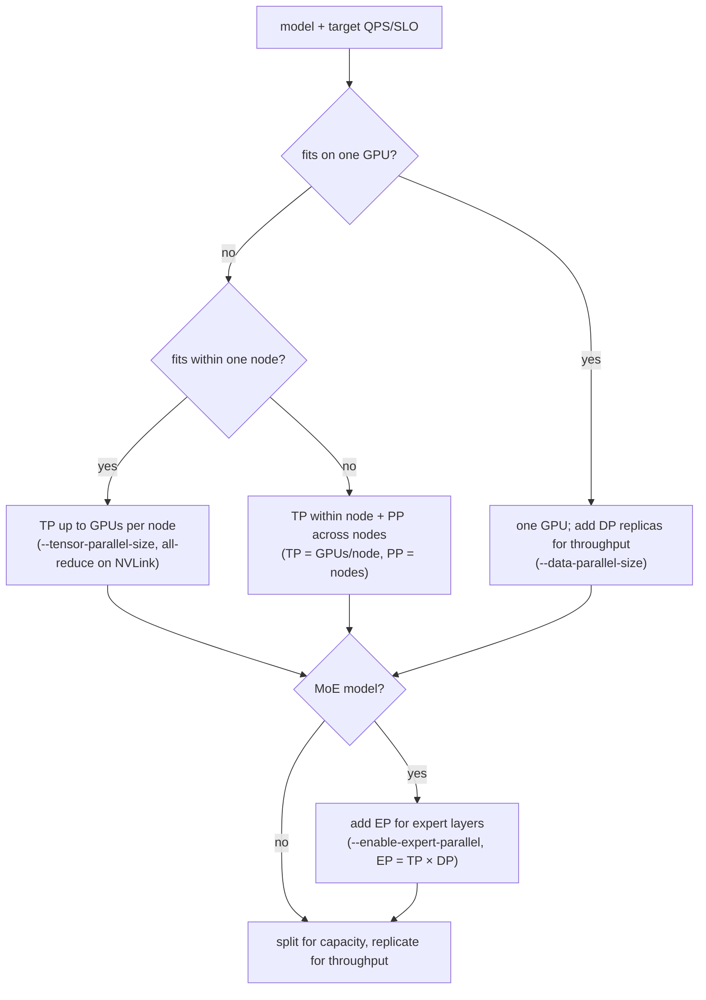

# 为什么要并行，以及怎么并行：张量 / 流水线 / 数据 / 专家并行

!!! info "基线：**vLLM 0.26.0** · 模型 `Qwen2.5-7B-Instruct` · 单张 RTX 4090 (24 GB)"
    已按 ADR-0004 用 Context7 对照 vLLM 0.26.0 核实：张量并行用 **`tensor_parallel_size`** / **`--tensor-parallel-size`**（把一个模型切在*同一节点内*），流水线并行用 **`pipeline_parallel_size`** / **`--pipeline-parallel-size`**（切*层*，是*跨节点*的手段），数据并行用 **`--data-parallel-size`**（副本），MoE 的专家并行用 **`--enable-expert-parallel`**（实验特性；EP 度数自动算为 `tensor_parallel_size × data_parallel_size`）。本节课讲*为什么并行、选哪种*——真正上手多卡（NCCL + 在 A100 上跑起 TP/PP）见 [下一节课](nccl-and-launching-tp-pp.md)。它建立在 [GPU 硬件模型](../part0/gpu-hardware.md)、[KV 缓存](../part0/kv-cache.md) 与 [注意力变体](../interview/attention-variants.md) 之上。§4 的模型是**显存/通信模型，不是 benchmark**；所有数字均为**示例 / 量级参考**。

---

## 1 · 直觉 & 为什么重要

Part 6 之前一切都假设只有一张卡。这个假设恰好在两种情况下失效，而面试官会逼你说清楚你在解决哪一个：

1. **装不下。** 70B 模型 FP16 的权重约 130 GB；24 GB 的卡根本放不下。即便量化到 INT4（约 33 GB），单张 4090 仍然装不下。当权重 **+** [KV 缓存](../part0/kv-cache.md) **+** 激活超过单卡显存时，你*别无选择*——模型必须**切到多卡上**。这是**容量**问题。
2. **太慢 / 吞吐不够。** 模型能装下，但一张卡撑不住你的 QPS，或者延迟太高。这时你不切模型——你**复制**它并把请求摊开，或者（对最大的模型）既切又流水，把总 token/s 抬起来。这是**吞吐**问题。

这两个触发条件对应到**四种**切分工作的方式，而整个面试就在于你知道*每一种切了什么、通信代价多大、什么时候是对的工具*：

- **张量并行 (TP)** —— 把*每一层的矩阵*切到多卡上（层内）。降低每卡显存；代价是**每层一次 all-reduce**，很聒噪、要高速互联（NVLink）——所以只在*一个节点内*。
- **流水线并行 (PP)** —— 把*层本身*切到多卡上（层间）。每张卡拥有一段连续的 stage；代价是**流水线气泡**，但只有便宜的点对点交接——所以能*跨节点*。
- **数据并行 (DP)** —— *复制*整个模型，切分*请求*。抬吞吐；要求模型本来就能装进单卡。
- **专家并行 (EP)** —— 只对 **MoE** 模型：把*专家*切到多卡上。代价是把每个 token 路由到其专家所在卡的 **all-to-all**。

选错了，你要么在启动时 OOM（对装不下的模型用了 DP），要么被卡在网线上（在慢网络上用了 TP）。→ 术语见 [术语表](../glossary.md) 的 *张量 / 流水线 / 数据 / 专家并行*。

## 2 · 心智模型

两个触发条件，四种切分。记住*每一种切的是哪根轴*：

```text
为什么并行 —— 两个触发条件，各自选不同的工具：
  (1) 装不下      权重 + KV + 激活 > 单卡显存        → 你必须切模型（TP / PP / EP）
  (2) 太慢        模型装得下，但单卡打不到 QPS/SLO   → 复制（DP），或对大模型切+流水

四种切分 —— 切什么，以及缝回来要付什么：

张量并行 (TP) —— 把每层的矩阵切到多卡上（层内）
    W = [ W0 | W1 | W2 | W3 ]     每张卡都持有「每一层」的一个切片
    ── 每层、每个 token：ALL-REDUCE 把部分输出加起来 ──►  聒噪 ⇒ 要 NVLink ⇒ 单节点内
    每卡显存：÷N       延迟：有帮助（每卡更多算力）     代价：每层 2 次 all-reduce

流水线并行 (PP) —— 把「层」切到多卡上（层间）
    层 0–13 → GPU0  ─►  层 14–27 → GPU1  ─►  ...    每张卡拥有一段连续的 STAGE
    交接 = 便宜的点对点（只传激活）  ⇒  能跨「节点」
    每卡显存：÷stage 数   代价：流水线气泡（fill/drain 时 stage 空转）→ 喂 microbatch 掩盖

数据并行 (DP) —— 复制整个模型，切分请求
    [完整模型 @ GPU0]   [完整模型 @ GPU1]   ...    每个副本服务不同的请求
    每卡显存：×1（完整副本）   吞吐：×副本数   前提：模型本来就能装进单卡

专家并行 (EP) —— 只对 MoE：把专家切到多卡上
    专家 {0..7}→GPU0   专家 {8..15}→GPU1    每个 token 路由到持有其专家的卡
    代价：ALL-TO-ALL token 路由   EP 度 = TP × DP（自动）   （0.26.0 中为实验特性）
```

上面「每种切分切的是什么」是概念布局（ASCII，按 ADR-0005）。而 §3.5 的*决策流程*——先装下、再复制——是一张拓扑，故用 Mermaid `flowchart`（图内标签按 ADR-0005 保持英文）：



三个要记住的形状：

- **容量与吞吐是不同的问题，用不同的工具。**「装不下」→ TP/PP/EP（切模型）。「太慢但装得下」→ DP（复制）。抓错工具族是经典错误。
- **每种切分都有通信税，而这个税决定了拓扑。** TP *每层、每个 token* 都 all-reduce → 吃带宽 → 让它待在节点内的 NVLink 上。PP 只在 stage 之间交接激活 → 便宜 → 跨节点也行。互联决定了你付得起哪一种。
- **它们可以组合。** 真正的大规模服务是 TP *节点内* × PP *跨节点*，可选 × DP 做副本、× EP 做 MoE。它们是正交的轴，不是竞争者。

## 3 · 原理

### 3.1 容量墙（为什么「装不下」没得商量）

光是模型权重就要：

$$
M_\text{weights} = P \times b
$$

其中 $P$ 是参数量，$b$ 是每参数字节数（FP16 → 2，INT4 → 0.5）。70B 模型 FP16 是 $70\times10^9 \times 2 \approx 130\ \text{GB}$——而这还是在 [KV 缓存](../part0/kv-cache.md) 和激活之前，它们还要各自的余量。单张 24 GB GPU 差了约 6 倍。量化到 INT4 能到约 33 GB——仍然超过一张卡。所以模型*必须*住在多张卡上：唯一的问题是*你怎么切*。反过来，如果模型**确实**装得下（例如 Qwen2.5-7B FP16 约 14 GB），你就永远不为容量切它——只为吞吐复制它。

### 3.2 张量并行 (TP) —— 切进每一层内部

TP 把**层内的矩阵**切到多卡上。标准的 Megatron 模式：线性层 $Y = XW$ 把 $W$ **按列**切，$W = [W_1 \mid W_2 \mid \dots \mid W_N]$，于是 GPU $k$ 算 $Y_k = XW_k$——输出的一个切片。*下一个*线性层**按行**切，从而吃进这些切片、产出一个部分和，再用一次 **all-reduce** 把部分和加成完整激活。在一个 transformer block 里这落成**每层两次 all-reduce**（attention 后一次、FFN 后一次）。注意力头能整齐地切到多卡上，这就是为什么 **TP 度几乎总是 2 的幂**、且必须整除头数。

代价是通信。每次 all-reduce 大约搬运（用 ring all-reduce，每卡是消息大小的 $\frac{2(N-1)}{N}$ 倍）：

$$
\text{每次 all-reduce 字节数} \approx \text{tokens} \times d_\text{hidden} \times b
$$

而且它**每层、每个 token** 都发生——包括每一个 decode 步。这是大量小而对延迟敏感的传输，所以 TP 在互联上**受带宽限制**，要 **NVLink**（约几百 GB/s）而不是 PCIe。这正是 vLLM 指南所说的具体原因：*「对超过单卡但能装进单节点的模型用张量并行」*——TP 度 ≤ 节点内 GPU 数。在 vLLM 中：

```python
from vllm import LLM
llm = LLM(model="meta-llama/Llama-3.1-70B-Instruct", tensor_parallel_size=4)  # 在一个节点内切分
```

TP 对**延迟**也有帮助（更多卡一起算每个 token），所以哪怕一个*装得下*的模型有时也用 TP>1 来压 TTFT/TPOT——代价就是那笔 all-reduce 流量。

### 3.3 流水线并行 (PP) —— 把层切成 stage

PP 沿**深度**轴切：GPU 0 持有层 0–13，GPU 1 持有 14–27，以此类推。一个 token 的激活像**接力**一样 GPU0 → GPU1 → … 流下去。唯一的通信是每个 stage 边界上一次**激活张量的点对点发送**——比起 TP 的每层 all-reduce 小得多——这就是为什么 **PP 能跨节点**、哪怕那里互联很慢。

它的标志性代价是**流水线气泡**：当 stage 0 处理第一个 microbatch 时，stage 1..N 都空转；它们只随工作往下流才逐渐填满，并在末尾排空。$p$ 个 stage、$m$ 个 microbatch 时，空转比例是

$$
\text{bubble} = \frac{p-1}{m + p - 1}
$$

所以你靠喂**很多 microbatch**（$m \gg p$）来掩盖气泡。PP 是*「整个节点用满 TP 还不够」*或*「多节点」*时的工具。vLLM 的经验法则：设 **TP = 节点内 GPU 数**、**PP = 节点数**：

```python
llm = LLM(model="meta-llama/Llama-3.1-70B-Instruct",
          tensor_parallel_size=4, pipeline_parallel_size=2)  # 4 卡/节点 × 2 节点 = 8 卡
```

### 3.4 数据并行 (DP) 与专家并行 (EP)

**DP 是复制。** 每张卡（或每个 TP/PP 组）持有模型的**完整副本**、服务**不同的请求流**。它带来的每卡显存节省是*零*——每个副本都是一整个模型——所以 DP 纯粹是**吞吐**杠杆、且**要求模型本来就装得下**。vLLM 里可以把 DP 和 TP 一起跑：

```bash
vllm serve $MODEL --data-parallel-size 4 --tensor-parallel-size 2   # 4 个副本，每个切在 2 张卡上
```

**EP 是给 MoE 的。** 一个 [专家混合 (MoE)](../glossary.md) 层有很多专家 FFN，但每个 token 只路由到少数几个。EP 把**不同专家放到不同卡上**；由于一个 token 选中的专家可能在别处，这层需要一次 **all-to-all** 把 token 送到正确的卡再送回。它用 `--enable-expert-parallel` 开启，在 0.26.0 中是**实验特性**，其度数**自动算**为 `tensor_parallel_size × data_parallel_size`——你定 TP 和 DP，EP 随之而出：

```bash
vllm serve deepseek-ai/DeepSeek-V3-0324 \
    --tensor-parallel-size 1 --data-parallel-size 8 --enable-expert-parallel   # EP 度 = 1 × 8 = 8
```

### 3.5 怎么选（决策树）

vLLM 自己对单个模型副本的策略，按顺序：

1. **单卡装得下？** → 用一张卡。需要更多吞吐就加 **DP** 副本。
2. **超过单卡但装进单节点？** → 在该节点内用 **TP**，度数至多为节点内 GPU 数。
3. **超过单节点？** → **每节点内 TP + 跨节点 PP**（TP = 节点内 GPU 数，PP = 节点数）。
4. **MoE 模型？** → 给专家层加 **EP**（经由 TP×DP）。

主线：**只为容量切到不得不切为止（TP → PP → 多节点），然后为吞吐复制 (DP)**——并让**互联**（节点内 NVLink、跨节点网络）决定每一刀切在哪。

### 3.6 在 vLLM 源码里读它（v0.26.0）

四种切分就是配置 + 少量层/协调器类（ADR-0002：读懂 + 会推，不重写）：

- **TP 是逐线性层实现的**，而非一个全局开关。§3.2 的 Megatron 列/行切分正是 [`vllm/model_executor/layers/linear.py`](https://github.com/vllm-project/vllm/blob/v0.26.0/vllm/model_executor/layers/linear.py) 里的 `ColumnParallelLinear` 与 `RowParallelLinear`：行并行层的 `forward` 以 `tensor_model_parallel_all_reduce(output_parallel)` 收尾——那次调用**就是** §3.2 的「每个 matmul 一次 all-reduce、每块两次」。`QKVParallelLinear` 切分注意力头，这正是 TP 度必须整除头数的原因。
- **collective 与 group** 在 [`vllm/distributed/parallel_state.py`](https://github.com/vllm-project/vllm/blob/v0.26.0/vllm/distributed/parallel_state.py)：`tensor_model_parallel_all_reduce`，以及你用 `get_tp_group()` / `get_pp_group()` 取到的 `GroupCoordinator`——即[下一课](nccl-and-launching-tp-pp.md)启动的 TP、PP 进程组。
- **旋钮**是 **`ParallelConfig`**（[`vllm/config/parallel.py`](https://github.com/vllm-project/vllm/blob/v0.26.0/vllm/config/parallel.py)）上的 dataclass 字段：`tensor_parallel_size`、`pipeline_parallel_size`、`data_parallel_size`（都默认 `1`）、`enable_expert_parallel`（默认 `False`）、以及 `distributed_executor_backend`（`mp` / `ray`）。

先打开 `linear.py` 跳到 `RowParallelLinear.forward`：那次 all-reduce 就在方法末尾。

## 4 · 完整可跑代码 + 逐行讲解

一段纯 Python 模型，刻画本节课的两个决策：**模型是否装得进单张 24 GB GPU**（若不能，最小 TP 度是多少），以及 **TP 每个 token 付多少 all-reduce 流量**（让它要 NVLink 的那笔税）。不用 GPU——这是你应当能在白板上算出来的算术。

```python title="fit_or_parallelize.py"
"""装得下还是要并行：模型装得进单张 24GB GPU 吗？装不下的话，最小 TP 度是多少——
再加上让 TP 要 NVLink 的、每 token 的 all-reduce 流量。
这是显存/通信模型，不是 benchmark。纯 Python，离线。"""
GPU_VRAM_GB, KV_RESERVE_GB = 24, 6          # 一张 RTX 4090；留约 6GB 给 KV + 激活（示例）
AVAIL_GB = GPU_VRAM_GB - KV_RESERVE_GB      # 留给权重的显存

def weight_gb(params_b, bytes_per_param):   # params_b = 参数量（单位：十亿）
    return params_b * 1e9 * bytes_per_param / 1024**3

def min_tp(params_b, bytes_per_param):      # 让每卡权重切片装得下的最小 2 的幂 TP 度
    need, tp = weight_gb(params_b, bytes_per_param), 1
    while need / tp > AVAIL_GB:
        tp *= 2                             # TP 度是 2 的幂 → 让注意力头整除均分
    return tp

def tp_allreduce_kb_per_token(hidden, layers, bytes_per_elem=2):
    # decode = 1 token/步；TP 每层 2 次 all-reduce，每次约 hidden 个元素宽
    return 2 * layers * hidden * bytes_per_elem / 1024

MODELS = [("Qwen2.5-7B",    7.6,  3584,  28),   # (名称, 参数量_B, hidden, 层数)
          ("Llama-3.1-70B", 70,   8192,  80),
          ("Llama-3.1-405B", 405, 16384, 126)]
for name, params_b, hidden, layers in MODELS:
    w16, tp = weight_gb(params_b, 2), min_tp(params_b, 2)
    ar = tp_allreduce_kb_per_token(hidden, layers)
    verdict = "fits on 1 GPU" if tp == 1 else f"needs TP>={tp}"
    print(f"{name:15} FP16 {w16:6.1f} GB -> {verdict:14}  "
          f"TP all-reduce ~ {ar:6.1f} KB/token (every layer, every token -> wants NVLink)")
```

**逐行讲解：**

- `AVAIL_GB` 是给 [KV 缓存](../part0/kv-cache.md) 和激活留出余量后，剩给权重的显存——一个权重切片真正要塞进的预算。
- `weight_gb()` 就是 §3.1 的容量墙 $M_\text{weights}=P\times b$，以 GB 计。换 `bytes_per_param`（FP16 是 2，INT4 是 0.5）就能看到量化把这条线往下挪。
- `min_tp()` 把 TP 度翻倍直到一个切片能装进 `AVAIL_GB`。2 的幂不是随意的——TP 切注意力头，所以度数必须整除头数（§3.2）。
- `tp_allreduce_kb_per_token()` 是 §3.2 的税：**每层 2 次 all-reduce**，每次每 token 搬约 `hidden` 个元素。这是刻意的简化（忽略了 batch 和 ring 的 $\frac{2(N-1)}{N}$ 因子）——重点是那个*形状*：它随 `layers × hidden` 增长、且在**每个 decode token** 上发生，所以是小而频繁、对延迟敏感的流量 → NVLink。
- 循环逐模型打印：FP16 权重大小、装得下判定 / 最小 TP、以及每 token 的 all-reduce 量。

预期输出（显存/通信模型，示例）：

```text
Qwen2.5-7B      FP16   14.2 GB -> fits on 1 GPU   TP all-reduce ~  392.0 KB/token (every layer, every token -> wants NVLink)
Llama-3.1-70B   FP16  130.4 GB -> needs TP>=8     TP all-reduce ~ 2560.0 KB/token (every layer, every token -> wants NVLink)
Llama-3.1-405B  FP16  754.4 GB -> needs TP>=64    TP all-reduce ~ 8064.0 KB/token (every layer, every token -> wants NVLink)
```

三行讲一个故事：**Qwen2.5-7B 装得下**（TP=1——你只会加 DP 副本来提吞吐）；**70B 需要 TP≥8**（超过一个节点的 4090 数量——实践中是 TP 节点内 × PP 跨节点，§3.3）；**405B 需要 TP≥64**——毫无疑问跨节点，于是 PP 加入 TP。而 all-reduce 那一列随深度×宽度爬升：到 405B 你每生成一个 token、每过一遍流水就搬约 8 MB——这正是那笔流量必须走 NVLink、以及 TP 被限制在一个节点内的原因。这套算术——先算装得下、再数通信——就是并行的面试。

## 5 · Lab —— 想清楚这一刀（真正的多卡跑在下一节课）

!!! gpu "GPU Lab（单卡上做推演；真正的 TP/PP 需要多卡）"
    - **最低显存：** §4 的算术不用显存（纯 Python）。以 `tensor_parallel_size=1` 跑 Qwen2.5-7B 在你的单张 4090 上约需 16 GB（INT4/AWQ）。
    - **建议 AutoDL 卡型：** RTX 4090 (24 GB) 做单卡自检。**真正的多卡 TP/PP**（2×/4× A100）是 [下一节课：NCCL 与启动 TP/PP](nccl-and-launching-tp-pp.md)，按 ADR-0001 用「开机即关」的 A100——别只为这一页去租多卡。
    - **预估耗时 / 花费：** §4 + 推演约 20 分钟（免费、无卡模式）· 可选单卡跑约 10 分钟 · 约 ¥1–2（示例）
    - **平台：** NVIDIA CUDA（默认）。TP/PP 通信在 NVIDIA 上走 **NCCL**；**非 NVIDIA：** AMD ROCm 用 RCCL，而那些*概念*（all-reduce / 点对点 / all-to-all）与后端无关——集合通信的机制是下一节课。

在租第二张卡之前，先把这一刀想清楚：

1. **跑 §4 的模型。** 确认三条判定。把 `bytes_per_param` 改成 `0.5`（INT4），看 70B 的 `min_tp` 掉下来——量化能把「需要 TP≥8」变成「需要 TP≥2」，也就是一个节点而非两个。这是加卡之前的*第一个*杠杆。
2. **在你的 4090 上做单卡自检。** `vllm serve Qwen/Qwen2.5-7B-Instruct`（默认 `tensor_parallel_size=1`）确认「fits on 1 GPU」判定——不用切；你会用 DP 副本来扩它。
3. **预测失败。** 如果你在只有**一张** GPU 的机器上设 `--tensor-parallel-size 2`，vLLM 放不下 2 个切片 → 启动即报错。在跑*之前*就预测到；理解*为什么*（第二个切片没有第二块设备可放）才是重点。
4. **画一个拓扑。** 对一个假想的 2 节点 × 4 卡集群服务 Llama-3.1-70B，写出 flag：`--tensor-parallel-size 4 --pipeline-parallel-size 2`（每个 4 卡节点内 TP，跨 2 节点 PP）——即 §3.5 决策树的落地。真正的启动是 [下一节课：NCCL 与启动 TP/PP](nccl-and-launching-tp-pp.md)。

## 6 · 常见坑 / 反直觉点

- **把「装不下」和「太慢」搞混。** 它们要*不同*的工具族：容量 → 切模型（TP/PP/EP）；装得下但太慢 → *复制*（DP）。对装不下的模型上 DP 只会让每个副本都 OOM；对已装得下的模型上 TP 只是白付 all-reduce 税。
- **在 PCIe 上或跨节点跑 TP。** TP *每层、每个 token* 都 all-reduce——在慢链路上它就成了瓶颈、你的 GPU 都在等网线上挨饿。把 TP 留在**节点内的 NVLink** 上；用 **PP** 跨节点。
- **设一个不整除头数的 TP 度。** TP 切注意力头，所以度数必须整除头数（和 KV 头数）——这就是它是 2 的幂的原因。任意度数会失败或浪费卡。
- **忘了流水线气泡。** microbatch 太少的 PP 会让 stage 在 fill/drain 时空转——气泡比例 $\frac{p-1}{m+p-1}$ 会占主导。喂**很多 microbatch**（$m \gg p$），否则多加的卡收益甚微。
- **以为 DP 省显存。** DP 是每副本一份*完整副本*——每卡零节省。它是吞吐工具，且*要求*模型本来就装得下。
- **把这四种当竞争者。** 它们在正交的轴上组合：TP×PP×DP×EP。服务一个巨大 MoE 的生产系统会四种同时用。
- **对稠密模型用 EP。** 专家并行只对 **MoE** 有意义——稠密模型里没有专家可切。而且 0.26.0 里它是**实验特性**，度数是 TP×DP、不是直接设的。
- **以为代码里有个单一的「TP 模式」。** 前向里没有单一的张量并行开关——TP 是由基类*逐层*实现的：`ColumnParallelLinear` 切列，`RowParallelLinear.forward` 以 `tensor_model_parallel_all_reduce` 收尾（`linear.py`）。一个继承普通 `nn.Linear` 而非这些基类的自定义层会**完全不**被切分、在每张卡上悄悄复制完整权重——all-reduce 就*在*层里，所以层必须主动接入。

## 7 · 面试连线

- [并行策略：TP/PP/DP/EP 及各自适用场景](../interview/parallelism-strategies.md) —— 本节课为你准备的高频题：*并行的两个理由、TP/PP/DP/EP 各切什么与通信代价、为什么 TP 待在节点内而 PP 跨节点、以及如何从模型大小和拓扑选出策略。*

## 8 · 小结 & 延伸阅读

**一句话：** 你为两个理由之一而并行——**模型装不下**（切它）或**单卡太慢**（复制它）——共四种刀法：**TP** 切每层的矩阵（$W=[W_1|\dots|W_N]$，**每层两次 all-reduce**，吃带宽 → NVLink → *节点内*，`tensor_parallel_size`），**PP** 把层切成 stage（便宜的点对点交接 → *跨节点*，代价是**气泡** $\frac{p-1}{m+p-1}$，`pipeline_parallel_size`），**DP** 复制整个模型来抬吞吐（要求装得下；`--data-parallel-size`），**EP** 切 **MoE** 专家、用 all-to-all（`--enable-expert-parallel`，实验特性，度数 = TP×DP）——决策树是*先装下（单卡 → TP → 跨节点 TP+PP），再用 DP 复制*，让互联决定每一刀切在哪。

延伸阅读：

- *Megatron-LM*（Shoeybi 等，2019）—— §3.2 引用的按列/按行张量并行切分与「两次 all-reduce」的 transformer block。
- *GPipe*（Huang 等，2018）与 *PipeDream*（Narayanan 等，2019）—— 流水线并行与 microbatch/气泡权衡。
- *Switch Transformer*（Fedus 等，2021）—— MoE 与专家路由，EP 存在的场景。
- vLLM `docs/serving/parallelism_scaling.md`、`docs/configuration/optimization.md`、`docs/serving/data_parallel_deployment.md`、`docs/serving/expert_parallel_deployment.md` —— 此处引用的 `--tensor-parallel-size` / `--pipeline-parallel-size` / `--data-parallel-size` / `--enable-expert-parallel` 机制与决策树。
- vLLM 源码（v0.26.0）：[`vllm/model_executor/layers/linear.py`](https://github.com/vllm-project/vllm/blob/v0.26.0/vllm/model_executor/layers/linear.py)（`ColumnParallelLinear` / `RowParallelLinear` + `tensor_model_parallel_all_reduce`）、[`vllm/distributed/parallel_state.py`](https://github.com/vllm-project/vllm/blob/v0.26.0/vllm/distributed/parallel_state.py)（`GroupCoordinator`、`get_tp_group`/`get_pp_group`）、[`vllm/config/parallel.py`](https://github.com/vllm-project/vllm/blob/v0.26.0/vllm/config/parallel.py)（`ParallelConfig`）——§3.6 的 TP 切分 + 配置。
- [下一节课 —— NCCL 集合通信与启动 TP/PP](nccl-and-launching-tp-pp.md) —— TP 每层 all-reduce 之下的集合通信原语，以及真正单机 vs 多机启动 TP/PP。

## 9 · 自测小问

??? question "70B 模型 FP16 装不进你的 24 GB 卡。同事建议 `--data-parallel-size 4`。为什么这是错的工具，真正管用的是什么？"
    DP 是**复制**整个模型——每个副本都是*完整副本*，所以每卡节省**为零**。如果 70B（FP16 约 130 GB）装不进一张卡，四个 DP 副本每个仍然装不下；它们全部 OOM。DP 是*吞吐*杠杆、且*要求*模型本来就装得下。「装不下」的问题需要把模型**切开**：**张量并行**（`--tensor-parallel-size`）在节点内把每层的矩阵切到多卡上——70B FP16 需要 TP≥8（§4），所以实践中是每节点内 TP × **流水线并行**跨节点。（先量化到 INT4 会缩到约 33 GB，可能降低所需的 TP 度——加卡之前永远先试这个杠杆。）

??? question "为什么张量并行留在*单个节点内*、而流水线并行能跨节点？把它和各自通信什么挂上钩。"
    是**通信模式 vs 互联**。TP 在 attention 后和 FFN 后各一次 all-reduce——**每层两次、每个 token**，包括每个 decode 步；那是一串小而频繁、对延迟敏感的传输，其量随 `layers × hidden` 增长。它受带宽限制，所以要 **NVLink**（几百 GB/s），在 PCIe 或网络上就崩——因此 TP 度 ≤ 节点内 GPU 数。PP 只在每个 stage 边界**点对点发送激活张量**——流量小得多、也容忍更高延迟——所以它**能跨节点**、哪怕链路慢。由此得出经验法则：**TP = 节点内 GPU 数，PP = 节点数。**

??? question "你在服务一个稠密的 7B 模型，单张 4090 轻松装下，但 QPS 太低。走一遍正确的扩容动作——并说出一件你*不会*做的事。"
    模型**装得下**，所以这是**吞吐**问题、不是容量——工具是**数据并行**：跑**副本**（`--data-parallel-size N`，或就是负载均衡后面 N 个独立 server），每个是完整副本、服务不同请求流；吞吐随副本数近似线性增长。你**不会**做的事：抓 **TP** 来「跑更快」。对已经装得下的模型上 TP>1，会*每层、每个 token* 加一次 all-reduce——纯通信税，反而可能*降低*吞吐——而且它真正的活是容量、不是复制。（TP 能压单请求*延迟*，所以只有当失守的 SLO 是 TTFT/TPOT 而非 QPS 时你才会考虑它。）而 **EP** 在这里无关——稠密模型里没有专家。
