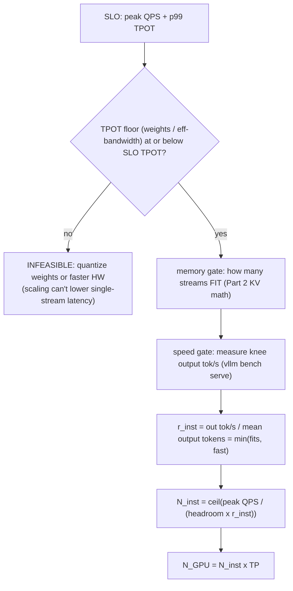

# 容量规划：从一张卡的吞吐到一个集群

!!! info "基线：**vLLM 0.26.0** · 模型 `Qwen2.5-7B-Instruct` · 单张 RTX 4090（24 GB）"
    经 Context7 在 vLLM 0.26.0 上核实（ADR-0004）：单实例容量用 **`vllm bench serve`** 测，它打印 **`Request throughput (req/s)`**、**`Output token throughput (tok/s)`**、**`Total token throughput (tok/s)`** 与 Mean/Median/**P99** TTFT/TPOT/ITL；横向扩用 **`--tensor-parallel-size`**（`-tp`，默认 1）与 **`--pipeline-parallel-size`**（`-pp`，默认 1）；显存旋钮（`--gpu-memory-utilization`、`--max-model-len`、`--quantization`、`--kv-cache-dtype`）就是你在 [KV 缓存显存数学](../part2/kv-cache-math.md) 里见过的那些。本页每个延迟/吞吐数字都是**示例 / 量级参考**——算术（一次除法、一次向上取整）是精确的，但*输入*要你自己去测。

---

## 1 · 直觉与为什么重要

几乎每道生产与系统设计面试都用同一道草稿纸题开场：**「为 X QPS、p99 延迟 Y 设计一套推理服务。」** 在你画第一个方框之前，得先回答*这到底要多少硬件*——而诚实的答案是算术，在租 GPU 之前就能算出来。

[Part 2 的 KV 缓存显存数学](../part2/kv-cache-math.md) 回答了一半：一张卡上**能装下多少并发序列**（一个*显存*问题——并发是 VRAM 的余量）。本课回答另一半，并把两半拼成一个集群：

1. **一个实例有多快？** 不是把「吞吐」当成一个数字——没有延迟预算它毫无意义——而是*你 SLO 下的 req/s*，也就是你已经会测的 [knee](load-testing-knee.md)。
2. **延迟 SLO 究竟可行吗？** decode 是 [memory-bound](../part2/roofline-analysis.md) 的，所以单条流有一个由 HBM 带宽决定的硬 **TPOT 地板**。如果你的 SLO 在地板之下，再怎么扩都没用——你得换更小/量化的模型或更快的芯片。
3. **要多少实例、多少 GPU？** 峰值 QPS 除以单实例 goodput，留出余量让常态负载停在 knee 左侧——再乘以每实例的 [TP degree](../glossary.md)。

算对了，你带着一个站得住脚的 GPU 数和一张账单走进设计题；算错了，要么过量供给（烧预算），要么供给不足（峰值时队列爆炸）。→ 术语见 [Glossary](../glossary.md)：*SLO、Knee、Goodput、TP degree*。

## 2 · 心智模型

一个实例有**两个相互独立的天花板**；它的真实容量是两者中的*较低者*。然后集群 = 峰值负载除以它。

```text
  一个实例 = min(装得下, 跑得快)                    集群 = 负载 ÷ 单实例 goodput

  ┌─ 显存闸 (Part 2) ─────────────────┐            峰值 QPS  λ
  │  N_seq = (u·V − W − A − O) / (κ·S) │                │
  │  "能装下多少条流"                   │                ▼
  └────────────────────────────────────┘        ┌──────────────┐   r_inst = SLO 下 req/s
                    │  min                        │  ÷ (ρ·r_inst)│   （测出的 KNEE）
  ┌─ 速度闸 (roofline) ───────────────┐          └──────────────┘   ρ = 余量 < 1
  │  TPOT_floor = bytes/token ÷ BW    │                │
  │  聚合 tok/s 随 batch 上升          │                ▼
  │  "多快把这个 batch 抽干"            │        N_inst = ⌈ λ / (ρ·r_inst) ⌉
  └────────────────────────────────────┘                │
                    │                                    ▼
                    ▼                             N_GPU = N_inst × TP
        r_inst = (output tok/s) / (每请求平均 output token 数)
```

上面的两门槛公式是空间 + 定量图（ASCII，按 ADR-0005）。而*定容流程*——先可行性、再两门槛、再一次除法——是一条流程，故用 Mermaid `flowchart`（图内标签按 ADR-0005 保持英文）：



三个要记住的形状：

- **实例容量是 `min(装得下, 跑得快)`。** [显存闸](../part2/kv-cache-math.md) 说能装多少序列；速度闸说 GPU 抽干这个 batch 有多快。只看一边就会撒谎：一个能*装下* 66 条流、但在你的 TPOT 下只*解码*得动 30 条的配置，就是个 30 条流的实例。绑定的那个才是真实容量。
- **延迟和吞吐是两个问题、两个地板。** 单条流的 **TPOT 地板**（带宽）决定*SLO 究竟可不可达*；**聚合吞吐**（批量、在 knee 处）决定*一个盒子扛多少流量*。continuous batching 把两者解耦——这正是聚合 tok/s ≫ 单流 tok/s 的原因。
- **集群是个天花板，按峰值 + 余量来定。** 你用*峰值* QPS（不是均值）除以单实例 goodput，并留一个利用率余量 $\rho<1$ 让常态负载停在 *knee 左侧*——给突发、副本失效、滚动发布留空间。按 knee 的 100% 来定，第一波流量尖峰就排队。

## 3 · 原理与数学

### 3.1 速度闸：decode 的 TPOT 地板

decode 每步生成一个 token，是 **[memory-bound](../part2/roofline-analysis.md)** 的：每步都要从 HBM 读模型权重（以及活跃的 KV）。因此*单条*流吐一个 token 的最快速度受带宽而非 FLOPs 约束：

$$
\text{TPOT}_{\text{floor}} \;\approx\; \frac{W + \kappa S}{\beta_{\text{eff}}}
\qquad
\beta_{\text{eff}} = \eta\,\beta_{\text{peak}}
$$

其中 $W$ = 每步读的权重字节，$\kappa S$ = 这条流的 KV 字节（见 [Part 0](../part0/kv-cache.md)，短上下文下通常 $\ll W$），$\beta_{\text{peak}}$ = HBM 峰值带宽（RTX 4090 ≈ 1008 GB/s），$\eta$ = 实际达成率（~0.6–0.8 示例）。对 `Qwen2.5-7B` BF16（$W\approx15.2$ GB）、短上下文：

$$
\text{TPOT}_{\text{floor}} \approx \frac{15.2}{0.7\times1008} \approx 21.5\ \text{ms} \;\Rightarrow\; \sim46\ \text{单流 tok/s。}
$$

**这就是可行性检查。** 若 SLO 要求 7B BF16 模型在 4090 上 p99 TPOT ≤ 15 ms，那在单流上*物理不可能*——你必须量化权重（缩小 $W$，如 AWQ 4-bit → $W\approx5.5$ GB → 地板 ~7.8 ms）或换更快的硬件。任何 batching 或路由都救不了一个低于地板的延迟 SLO。

### 3.2 吞吐闸：聚合 tok/s 与 req/s

[Continuous batching](../part5/continuous-batching.md) 把那一次权重读**摊薄**到 batch 里的**每一条**流上，所以聚合 output 吞吐随 batch 增大而爬升，直到 GPU 在 **[knee](load-testing-knee.md)** 处饱和。你不去估这个峰值——你用 `vllm bench serve` *测*它，在 p99 仍满足 SLO 的负载档读 **`Output token throughput (tok/s)`**。把它换成 req/s：

$$
r_{\text{inst}} \;=\; \frac{T_{\text{out}}}{\bar{o}}
$$

其中 $T_{\text{out}}$ = knee 处单实例 output tok/s（示例：`Qwen2.5-7B-AWQ` 在 4090 上 ~2000 tok/s），$\bar{o}$ = 每请求平均 output token 数。取 $\bar{o}=256$：$r_{\text{inst}}\approx 2000/256 \approx 7.8$ req/s——这就是该 SLO 与长度分布下实例的诚实容量。

### 3.3 集群公式

按**峰值**负载 $\lambda_{\text{peak}}$ 定，带一个利用率余量 $\rho$（让常态负载停在 knee 左侧——如 $\rho=0.7$）：

$$
\boxed{\;N_{\text{inst}} = \left\lceil \frac{\lambda_{\text{peak}}}{\rho\,r_{\text{inst}}} \right\rceil\;}
\qquad
\boxed{\;N_{\text{GPU}} = N_{\text{inst}} \times \text{TP}\;}
$$

TP（tensor-parallel 度，`--tensor-parallel-size`）只有在模型*装不下*一张卡、或你需要 TP 才够到 TPOT 地板时才 >1；7B 在 4090 上，TP = 1。**草稿纸演算**——峰值 50 QPS，$\bar{o}=256$，$r_{\text{inst}}\approx7.8$，$\rho=0.7$：

$$
N_{\text{inst}} = \left\lceil \frac{50}{0.7\times7.8} \right\rceil = \lceil 9.2 \rceil = 10 \ \text{实例} = 10\ \text{GPU（TP=1）。}
$$

注意每个数字的作用：量化权重把*两个*闸都抬高（腾出 VRAM → 装得下更大 batch，且缩小 $W$ → 更高 $T_{\text{out}}$、更低 TPOT 地板），这正是它在 [Part 2](../part2/kv-cache-math.md) *和*这里都是第一杠杆的原因。$\bar{o}$ 减半（更短输出）会让 $r_{\text{inst}}$ 翻倍、集群减半。所有数字为示例——在你的 workload 上测 $T_{\text{out}}$ 和 $\bar{o}$。

### 3.4 在 vLLM 源码里读它（v0.26.0）

*显存门槛*不是你算一次的公式——vLLM 在启动时**实测**它，读那个比纸面估计更值（ADR-0002：读懂 + 会推，不重写）：

- **「能装几个」是测出来的，不是推出来的。** [`vllm/v1/worker/gpu_worker.py`](https://github.com/vllm-project/vllm/blob/v0.26.0/vllm/v1/worker/gpu_worker.py) 里的 `GPUWorker.determine_available_memory` 跑一次 profiling 前向，扣掉权重 + 激活峰值，（遵守 `gpu_memory_utilization`）设出 `available_kv_cache_memory_bytes`。它喂给 [`vllm/v1/core/kv_cache_utils.py`](https://github.com/vllm-project/vllm/blob/v0.26.0/vllm/v1/core/kv_cache_utils.py) 的 `check_enough_kv_cache_memory` / `get_num_blocks` / `get_kv_cache_configs`，产出 **`num_gpu_blocks`**——vLLM 启动日志里的 block 数。那个日志数*就是* §3 的显存门槛，且已扣掉纸面数学略过的激活/碎片。
- **fleet 的乘子是配置。** $N_{\text{GPU}}=N_{\text{inst}}\times\text{TP}$ 里的 `× TP` 是 **`ParallelConfig`**（[`vllm/config/parallel.py`](https://github.com/vllm-project/vllm/blob/v0.26.0/vllm/config/parallel.py)）上的 `tensor_parallel_size`；速度门槛（knee tok/s）是用 `vllm bench serve` *测*出来的，不是从某个符号读的。

先打开 `gpu_worker.py` 的 `determine_available_memory`——它就是把「24 GB 卡」变成「这么多 KV block」的 profiling 步骤，你的 planner 该消费的 ground truth。

## 4 · 完整可跑代码 + 逐行讲解

一个集群规划器——**纯 CPU、可离线跑**、不需要 GPU。它在一趟里做完可行性检查（§3.1）、req/s 换算（§3.2）与集群定容（§3.3）。

```python title="fleet_planner.py"
"""集群容量规划器：TPOT 地板可行性 + 实例数 + GPU 数（纯 CPU、离线）。
输入要你自己去 MEASURE（带宽达成率、knee 吞吐、输出长度）；算术是精确的。
所有默认值均为示例 / 量级参考。"""
from dataclasses import dataclass
from math import ceil

@dataclass
class Plan:
    weight_gb: float = 15.2       # Qwen2.5-7B BF16 每 decode 步读的权重（AWQ 4-bit 约 5.5）
    hbm_gbps: float = 1008.0      # RTX 4090 峰值 HBM 带宽（GB/s）
    hbm_eff: float = 0.70         # 峰值的实际达成率（示例；测你自己的）
    out_tok_s_at_knee: float = 2000.0   # SLO knee 处单实例 OUTPUT tok/s（用 vllm bench serve MEASURE）
    mean_output_tokens: float = 256.0   # 每请求平均生成 token 数（来自你的流量）
    tp: int = 1                   # --tensor-parallel-size（模型装得下一张卡就填 1）

    def tpot_floor_ms(self) -> float:                       # §3.1 单流延迟地板
        return self.weight_gb / (self.hbm_eff * self.hbm_gbps) * 1000.0

    def req_per_s(self) -> float:                           # §3.2 knee 吞吐 → req/s
        return self.out_tok_s_at_knee / self.mean_output_tokens

    def fleet(self, peak_qps: float, headroom: float = 0.70) -> tuple[int, int]:
        r = headroom * self.req_per_s()                     # 可用 req/s，停在 knee 左侧
        n_inst = ceil(peak_qps / r)                         # §3.3 向上取整——买不到半个盒子
        return n_inst, n_inst * self.tp                     # 实例数，再 GPU 数 = 实例数 × TP

def feasible(plan: Plan, slo_tpot_ms: float) -> bool:
    return plan.tpot_floor_ms() <= slo_tpot_ms              # 在地板之下 => 该模型/硬件上不可能

if __name__ == "__main__":
    peak_qps, slo_tpot = 50.0, 50.0                         # SLO：峰值 50 QPS，p99 TPOT <= 50 ms
    for label, w in [("BF16 weights", 15.2), ("AWQ 4-bit weights", 5.5)]:
        p = Plan(weight_gb=w)
        n_inst, n_gpu = p.fleet(peak_qps)
        ok = "OK" if feasible(p, slo_tpot) else "INFEASIBLE (below TPOT floor)"
        print(f"{label:>18}: TPOT floor {p.tpot_floor_ms():4.1f} ms [{ok}] | "
              f"{p.req_per_s():4.1f} req/s/inst | fleet {n_inst} inst = {n_gpu} GPU")
```

**逐行：**

- **`tpot_floor_ms`** —— §3.1：权重字节 ÷ 有效带宽。这是一条流能 decode 的*最快*速度；SLO 的 p99 TPOT 必须在它*之上*，否则设计一出生就死了。KV 略去（短上下文下 ≪ 权重）；长上下文规划时加上 $\kappa S$。
- **`req_per_s`** —— §3.2：测出的 knee **output** 吞吐除以平均输出长度。`out_tok_s_at_knee` 是唯一你在纸上推不出的输入——它来自 `vllm bench serve`（[压测课](load-testing-knee.md)）。
- **`fleet`** —— §3.3：套上余量（`0.70` → 常态负载停在 knee 的 70%），对峰值 QPS 向上取整，再乘 TP 得 GPU 数。**向上取整**很关键：9.2 个实例意味着你买 10 个。
- **`feasible`** —— 省下一次白费设计的闸门：低于 TPOT 地板的 SLO 靠加盒子满足不了；报告它、换模型/硬件。
- **`__main__`** —— 用同一个 SLO 分别跑 BF16 和 AWQ 权重，让最大杠杆的效果在一张表里可见。

预期输出（精确算术，不是 benchmark）：

```text
      BF16 weights: TPOT floor 21.5 ms [OK] |  7.8 req/s/inst | fleet 10 inst = 10 GPU
 AWQ 4-bit weights: TPOT floor  7.8 ms [OK] |  7.8 req/s/inst | fleet 10 inst = 10 GPU
```

这里两者都满足 50 ms 的 TPOT SLO（地板只有在 SLO 很紧时才*失败*），而且在*相同的*示例 knee 吞吐下都定到 10 GPU——但现实中 AWQ 腾出的 VRAM 会抬高 `out_tok_s_at_knee`（装得下更大 batch），所以重测它，AWQ 集群会缩小。把 `slo_tpot` 改成 `15`，看着 BF16 翻成 **INFEASIBLE** 而 AWQ 仍通过——可行性检查在这里就物有所值。

## 5 · Lab —— 测那个你猜不出来的输入

!!! gpu "GPU Lab（单卡）"
    - **最低显存：** `Qwen2.5-7B-Instruct`（或 `-AWQ`）跑在 **24 GB RTX 4090** 上。规划器纯 CPU；唯一的 GPU 步骤是测 knee 吞吐。
    - **建议 AutoDL 卡型：** 单张 **RTX 4090（24 GB）**（ADR-0001）。
    - **预估耗时 / 花费：** 短 rate 扫 ~15–25 分钟 · **~¥1–3**（示例）。你只需要一个数：SLO knee 处的 output tok/s。
    - **平台：** NVIDIA CUDA（默认）。**非 NVIDIA：** 算术与硬件无关；只有测出的 knee 和 HBM 带宽不同（ROCm/TPU/Neuron 有各自的 $\beta_{\text{peak}}$）。

步骤：

1. **服务化并扫。** 启动 [OpenAI server](openai-server.md)，用 `vllm bench serve --request-rate` 往上扫负载（[knee 课](load-testing-knee.md)）。每档读 `Output token throughput (tok/s)` 与 `P99 TPOT`。
2. **在你的 SLO 处找 knee。** p99 仍满足 SLO 的最后一档就是你的 knee；它的 output tok/s 就是 `out_tok_s_at_knee`。
3. **喂给规划器。** 把这个数和你真实的 `mean_output_tokens` 填进 `fleet_planner.py`。读出实例数与 GPU 数。
4. **核对地板。** 确认报告的 P99 TPOT 在算出的 `tpot_floor_ms` 之上——它总应如此；若*单*流 TPOT 低于你估的地板，说明你的 `hbm_eff` 猜低了。**关机。**

## 6 · 常见坑 / 反直觉点

- **把吞吐报成一个数字。** 「4090 能跑 2000 tok/s」离开 SLO 与长度分布就没意义——p99 更紧时同一个盒子跑得远少。永远按 **SLO 下的 goodput**（knee）来定容，绝不按峰值吞吐。
- **按 knee 的 100% 定容。** 让常态负载停在 knee 的 ~60–80%。100% 处没有余量给突发、副本失效或滚动发布——第一波尖峰队列就爆。这就是 $\rho$ 余量。
- **用均值 QPS 而非峰值。** 流量是突发的；按日均值定容的集群每个忙时都排队。按你必须扛住的峰值（加余量）定容，再让 [autoscaling](routing-autoscaling.md) 在低谷削成本。
- **以为 2× GPU = 2× 吞吐。** tensor parallelism 每层加一次 all-reduce（[Part 7](../part7/nccl-and-launching-tp-pp.md)）；TP=2 的 tok/s <2× 两个独立 TP=1 副本。用 TP 去*装下*模型或*够到 TPOT 地板*，不是当吞吐倍增器——7B 用 TP=1 副本扩得更高效。
- **算了速度闸却忘了显存闸。** 纸上 decode 得飞快的 batch 仍得*装进* [KV 预算](../part2/kv-cache-math.md)。真实单实例容量是 `min(装得下, 跑得快)`；两个都查。
- **忽略 prefill。** 这些估算是 decode 为中心的。prefill 重的 workload（长 prompt、短答）是 TTFT/compute-bound，不是 decode-bound——它的 knee 由 prefill 决定，[chunked prefill](../part5/scheduler-chunked-prefill-pd.md) / prefix caching 会移动它。按你真实的输入/输出配比定容。
- **对可变输出长度做点估计。** $\bar{o}$ 是个均值；长尾的长生成会吃 KV、拉低有效 $r_{\text{inst}}$。用分布（或 p90 长度）来规划，别只用平均。
- **手推显存门槛而不看日志。** §4 的 planner 估「能装几个」，但 vLLM 已经*实测*了它：`determine_available_memory`（`gpu_worker.py`）→ `num_gpu_blocks`（`kv_cache_utils.py`），启动时打日志。那个实测数扣掉了你公式略过的激活峰值与碎片，所以通常**低于**纸面值。拿你 planner 的显存门槛对着 server 实际日志的 `num_gpu_blocks` 校验；差得多就信日志。

## 7 · 面试连线

- [系统设计：给推理服务定容与设计](../interview/system-design.md) —— 本课为之准备的高频**长题**：*给定模型、硬件、SLO 与峰值 QPS，先做草稿纸（可行性 → 单实例 goodput → 集群），再设计整套服务——路由、自动扩缩、KV 感知缓存、量化、多租户——并为取舍辩护。* 内含多道完整的带解设计题。

## 8 · 小结与延伸阅读

**一句话：** 容量规划就是两个闸和一次除法——单实例容量是 $\min(\text{装得下}, \text{跑得快})$（VRAM 并发见 [Part 2](../part2/kv-cache-math.md)；decode 由带宽决定的 TPOT 地板与它测出的 knee 吞吐见本课），req/s = output-tok/s ÷ 平均输出长度，集群是 $N_{\text{inst}}=\lceil \lambda_{\text{peak}}/(\rho\,r_{\text{inst}})\rceil$、$N_{\text{GPU}}=N_{\text{inst}}\times\text{TP}$——永远按峰值 + 余量定，且先由「SLO 是否越过 TPOT 地板」把关。

延伸阅读：

- [KV 缓存显存数学](../part2/kv-cache-math.md) —— 本课与之配对的*显存*闸（并发即 VRAM 余量）。
- [压测课](load-testing-knee.md) —— 如何*测出*规划器要吃的单实例 knee 吞吐（$T_{\text{out}}$、$r_{\text{inst}}$）。
- [roofline 课](../part2/roofline-analysis.md) —— 为何 decode 是 memory-bound，TPOT 地板的前提。
- [路由与自动扩缩课](routing-autoscaling.md) —— 你在这里定容的集群是怎么真正跑起来的（router、前缀感知路由、按队列自动扩缩）。
- vLLM `docs/serving/parallelism_scaling.md` —— 单卡 → TP（节点内）→ TP×PP（跨节点），$N_{\text{GPU}}=N_{\text{inst}}\times\text{TP}$ 背后的规则。
- vLLM 源码（v0.26.0）：[`vllm/v1/worker/gpu_worker.py`](https://github.com/vllm-project/vllm/blob/v0.26.0/vllm/v1/worker/gpu_worker.py)（`determine_available_memory`——profiling 步骤）、[`vllm/v1/core/kv_cache_utils.py`](https://github.com/vllm-project/vllm/blob/v0.26.0/vllm/v1/core/kv_cache_utils.py)（`get_num_blocks` → 日志里的 `num_gpu_blocks` 显存门槛）、[`vllm/config/parallel.py`](https://github.com/vllm-project/vllm/blob/v0.26.0/vllm/config/parallel.py)（`tensor_parallel_size`）——§3.4 的门槛 + fleet 乘子。

## 9 · 自测小问

??? question "你的 SLO 是 Qwen2.5-7B 在单张 RTX 4090 上 p99 TPOT ≤ 15 ms。可行吗？你先查什么？"
    先于一切查 **TPOT 地板**。decode 是 memory-bound 的，所以单条流吐 token 的速度不可能快过 $W/\beta_{\text{eff}}$。BF16 权重（$W\approx15.2$ GB）、$\eta\approx0.7$、$\beta_{\text{peak}}\approx1008$ GB/s：地板 $\approx 15.2/(0.7\times1008)\approx21.5$ ms——**高于** 15 ms 的 SLO，所以 BF16 **不可行**，怎么扩都不行（batching 与路由不降单流延迟）。解法是缩小 $W$：**AWQ 4-bit** 把它降到 ~5.5 GB → 地板 ~7.8 ms，越过 15 ms。只有*在*地板通过*之后*，你才去定吞吐与集群。

??? question "一张 4090 在你的 SLO 下稳定 ~2000 output tok/s，平均输出 256 token，峰值流量 50 req/s。要多少 GPU？为什么不能更少？"
    单实例容量 $r_{\text{inst}} = 2000/256 \approx 7.8$ req/s **在 knee 处**。按 knee 的 100% 定容不安全（没有突发/失效/发布余量），所以套余量 $\rho\approx0.7$：可用 $\approx5.5$ req/s。集群 $N_{\text{inst}}=\lceil 50/5.5\rceil = 10$ 实例 $= 10$ GPU（TP=1，因为 7B 装得下一张卡）。更少（比如 9）会把常态负载顶*到* knee，第一波尖峰就排队——你恰好在流量最高时违反 p99。余量与向上取整，正是让这个估算成为一个*安全*数、而不只是一个*可能*数的东西。

??? question "市场部想在不动 SLO 的前提下把 GPU 账单砍半。给两个杠杆并说明各自为何有效。"
    **（1）量化权重（AWQ/GPTQ 4-bit）。** 它把*两个*闸都抬高：腾出 ~8 GiB VRAM 让更大 batch 装得下（显存闸），并缩小 $W$ 让聚合 tok/s 升、TPOT 地板降（速度闸）——单实例 $r_{\text{inst}}$ 更高就意味着同样 QPS 用更少实例。**（2）缩短输出。** $r_{\text{inst}}=T_{\text{out}}/\bar{o}$，所以平均输出长度减半（靠 `max_tokens` 上限、更好的 prompt 或 stop 序列）会让单实例 req/s 翻倍、集群减半——而且免费。次级杠杆：若 prompt 共享系统前缀则用 **prefix caching**（跳过重复 prefill → 更高有效吞吐）；以及 **autoscaling** 在低谷削减实例，让你按一天的均值而非峰值付费。每一个都是 $r_{\text{inst}}$ 上的旋钮、或*何时*为容量付费——正是集群公式里的两项。
