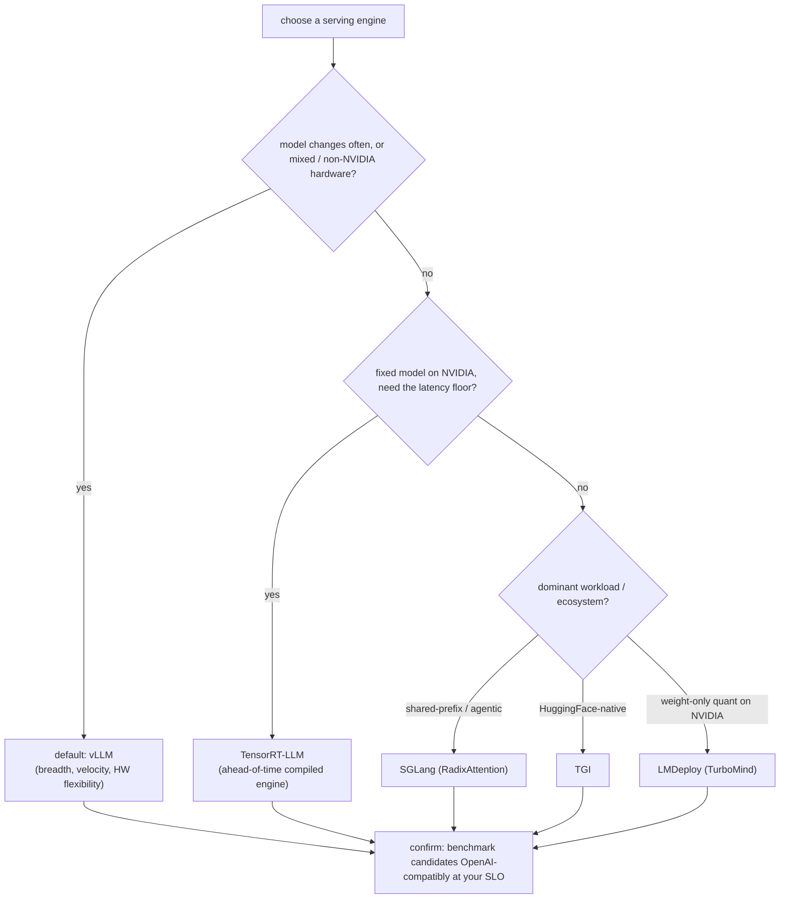

# The Serving Ecosystem: vLLM vs TensorRT-LLM / TGI / SGLang / LMDeploy

!!! info "Baseline: **vLLM 0.26.0** · comparison is *positioning*, not a feature checklist"
    Verified against vLLM 0.26.0 via Context7 (ADR-0004): the one API-level fact this lesson leans on is that these engines almost all expose **OpenAI-compatible** HTTP endpoints, so a single client — including **`vllm bench serve --backend openai --base-url …`** — can benchmark any of them on the *same* workload. vLLM's own differentiators (PagedAttention, continuous batching, prefix caching, broad model + hardware support) are covered in Parts 5–7. Cross-framework capabilities (TensorRT-LLM's ahead-of-time engine build, SGLang's RadixAttention, TGI's HF integration, LMDeploy's TurboMind engine) are **positioning that shifts release-to-release — verify each against its own current docs before you commit.** All numbers here are **illustrative / order-of-magnitude references**.

---

## 1 · Intuition & why it matters

"Why vLLM and not TensorRT-LLM / TGI / SGLang / LMDeploy?" is a near-guaranteed selection question, and the wrong answer is a ranked list ("vLLM is #1"). There is no global #1 — these are **overlapping tools with different sweet spots**, and a strong answer names the axis that decides between them for *a given workload and constraint*.

The trap is arguing from a benchmark blog post. Published numbers are measured on someone else's model, hardware, prompt mix, and (often) a version from six months ago. The frameworks also **converge fast**: continuous batching, paged KV cache, prefix caching, quantization, and OpenAI-compatible endpoints are now table stakes almost everywhere. So the interview-grade skill is two things:

1. **Know the *axes* that actually separate them** — portability vs peak, ease vs control, and which workload each is tuned for — not a stale feature grid.
2. **Know that the honest tiebreaker is measuring them on *your* workload** — and that because they're OpenAI-compatible, one harness (`vllm bench serve`) benchmarks all of them at your SLO.

So: the shared baseline they all reach, the few axes where they diverge, a defensible default and its exceptions, and the measure-it-yourself method. → see the [Glossary](../glossary.md) for *SLO, Goodput*.

## 2 · Mental model

They mostly agree on the fundamentals; they differ on a few axes. Place each by *what it optimizes for*, not by a scalar rank.

```text
   SHARED BASELINE (table stakes almost everywhere):
     continuous batching · paged KV cache · prefix caching · quantization · OpenAI-compatible API

   THE AXES THAT ACTUALLY DIVERGE:

   portability / velocity  ◀───────────────────────────────────▶  peak NVIDIA latency
   (Python, broad HW,                                              (ahead-of-time compiled
    any model, fast-moving)                                         engine, NVIDIA-only)
        vLLM ─────────── SGLang ──── TGI ───────────────── LMDeploy ──── TensorRT-LLM

   WHAT EACH LEANS INTO:
     vLLM         breadth + velocity: newest models fast, wide HW, huge community, easy default
     TensorRT-LLM peak on NVIDIA: compiles a per-model/per-GPU engine → top latency, less flexibility
     TGI          HuggingFace-native production server; tight HF ecosystem/Endpoints integration
     SGLang       shared-prefix / structured / agentic workloads (RadixAttention prefix-cache tree)
     LMDeploy     high-perf TurboMind (C++/CUDA) engine + strong weight-only (INT4/AWQ) serving

   CHOOSE BY CONSTRAINT, NOT BY RANK — then confirm by benchmarking on YOUR workload.
```

The portability↔peak axis above is a positioning layout (ASCII per ADR-0005). The *selection decision* — default X, switch to Y when constraint Z — is a decision tree, so Mermaid `flowchart`:



Three shapes to keep:

- **The baseline is shared; fight over the edges.** If a candidate can't articulate what's *table stakes* (continuous batching, paged KV, OpenAI API), they'll over-credit a framework for a feature everyone has. The real differences are at the edges: compile-ahead vs run-dynamic, prefix-cache strategy, quantization depth, hardware.
- **Portability ↔ peak is the master axis.** vLLM optimizes for *breadth and velocity* (run any new model on many GPUs today, in Python); TensorRT-LLM optimizes for *peak on NVIDIA* by compiling a fixed engine per model/GPU. Most other trade-offs are downstream of where a tool sits on this axis.
- **The tiebreaker is your own benchmark.** Because they're OpenAI-compatible, you don't argue — you serve the same model on each and run the *same* `vllm bench serve` at your SLO. Goodput on your workload settles it.

## 3 · Principle

### 3.1 The shared baseline

By 2025 the winning ideas from this course have diffused across the ecosystem: **continuous batching** (Part 5), a **paged KV cache** (Part 5), **prefix caching** (Part 5), **quantization** (Part 4), tensor/pipeline **parallelism** (Part 7), and an **OpenAI-compatible** server (this Part). So "does it have continuous batching?" no longer separates them. What separates them is *how far* they push a particular axis.

### 3.2 The divergence axes

- **Portability & velocity (vLLM).** Python-first, the widest model coverage (new architectures land fast), broad hardware (NVIDIA, AMD ROCm, more), and the largest community. This is why it's the sensible **default**: you can serve almost any model, on almost any accelerator, today.
- **Peak NVIDIA latency (TensorRT-LLM).** NVIDIA's TensorRT toolbox **compiles an optimized engine ahead of time** for a specific model + GPU + precision. That compile step buys top-tier latency/throughput on NVIDIA — at the cost of flexibility (rebuild per model/GPU/shape) and NVIDIA-only lock-in. Choose it when the model is fixed, the hardware is NVIDIA, and the last 20% of latency is worth the build pipeline.
- **HuggingFace-native production (TGI).** Text Generation Inference is HuggingFace's server (Rust router + Python workers), tuned to slot into the HF ecosystem and Inference Endpoints. Choose it when your stack is already HF-centric and you want their supported serving path.
- **Shared-prefix / structured / agentic (SGLang).** Its **RadixAttention** organizes the prefix cache as a radix tree for aggressive automatic KV reuse, and its frontend targets structured outputs and multi-call/agentic programs. Choose it when your workload is dominated by shared prefixes (heavy RAG, many-branch prompting) or programmatic structured generation.
- **TurboMind + weight-only quant (LMDeploy).** From the InternLM/OpenMMLab community; its **TurboMind** C++/CUDA engine and strong **weight-only (INT4/AWQ)** serving are its calling cards, popular in the Chinese ecosystem. Choose it when quantized weight-only throughput on NVIDIA is the priority.

### 3.3 A defensible default + exceptions

Interview-ready stance:

- **Default to vLLM** — breadth, velocity, ease, hardware flexibility, community. Lowest risk for "we serve many models / new models / mixed hardware."
- **TensorRT-LLM** when the model is stable, hardware is NVIDIA, and you need the absolute latency floor and will maintain a compile pipeline.
- **TGI** when you're deep in the HuggingFace stack and want their first-party server.
- **SGLang** when shared-prefix reuse or structured/agentic generation dominates.
- **LMDeploy** when weight-only-quantized throughput on NVIDIA (and/or the InternLM ecosystem) is central.

State it as *"default X, switch to Y when constraint Z"* — that's the shape interviewers reward, not a leaderboard.

### 3.4 The honest tiebreaker: benchmark them yourself

Positioning narrows the field; **your workload picks the winner.** Since each exposes OpenAI-compatible endpoints, serve the same model on two candidates and run the *same* `vllm bench serve` against each `--base-url`, at your SLO, on your prompt mix. Compare **goodput** (the [SLO-tuning](slo-driven-tuning.md) score), not vendor blog numbers. This also neutralizes version drift — you're measuring what you'd actually deploy, today.

### 3.5 Reading it in vLLM's source (v0.26.0)

The other engines' internals aren't in vLLM's tree — but the *thing that makes them comparable* is, and it's worth reading (ADR-0002: read + reason, don't rewrite):

- **`vllm bench serve` is a protocol client, not a vLLM client.** In [`vllm/benchmarks/serve.py`](https://github.com/vllm-project/vllm/blob/v0.26.0/vllm/benchmarks/serve.py) the backend is a *dispatch*: it imports **`ASYNC_REQUEST_FUNCS`** from [`vllm/benchmarks/lib/endpoint_request_func.py`](https://github.com/vllm-project/vllm/blob/v0.26.0/vllm/benchmarks/lib/endpoint_request_func.py) and picks `request_func = ASYNC_REQUEST_FUNCS[endpoint_type]`. The `openai` entry just speaks the OpenAI HTTP protocol at a `--base-url`, so the *same* harness drives vLLM, TGI, SGLang, LMDeploy, or a TensorRT-LLM OpenAI frontend — the apples-to-apples comparison of §3.4 is this one dictionary lookup.
- **Everything vLLM-specific is Parts 5–7**, not here: PagedAttention (`vllm/v1/core/`), continuous batching (the scheduler), prefix caching, TP/PP. This lesson's job is *positioning* + the neutral harness; the differentiators are the code you already read.

Open `endpoint_request_func.py` to see the backend registry — the set of protocols the one benchmark can speak is literally its keys.

## 4 · Complete runnable code + line-by-line

The one piece of code that matters here isn't config — it's the **apples-to-apples benchmark** that settles the choice. Because the harness is an OpenAI-compatible client, it points at any backend.

```bash
# Serve the SAME model on two candidates behind OpenAI-compatible endpoints, on different ports:
#   terminal A (vLLM):        vllm serve Qwen/Qwen2.5-7B-Instruct --port 8000
#   terminal B (alternative): <framework's OpenAI-compatible server> ... --port 8001
#   (TGI, SGLang, LMDeploy api_server, and TensorRT-LLM's OpenAI frontend all expose /v1/*.
#    TensorRT-LLM additionally needs an ahead-of-time engine BUILD step before serving.)

# Benchmark BOTH with the identical harness + workload + SLO, then compare goodput:
for PORT in 8000 8001; do
  echo "=== backend on :$PORT ==="
  vllm bench serve \
      --backend openai \                        # generic OpenAI-compatible client — works on any of them
      --base-url "http://127.0.0.1:${PORT}" \
      --model Qwen/Qwen2.5-7B-Instruct \
      --endpoint /v1/completions \
      --dataset-name random \
      --random-input-len 512 --random-output-len 128 \   # ← match YOUR production prompt mix
      --num-prompts 500 --request-rate 16 \              # ← your SLO's target load
      --percentile-metrics "ttft,tpot,itl,e2el"
done
# Winner = higher GOODPUT (throughput that still meets your p99 TTFT/TPOT SLO), on YOUR workload.
```

**Line-by-line:**

- **`--backend openai`** — the point of the whole lesson in one flag: `vllm bench serve` is an OpenAI-compatible *client*, so the exact same harness benchmarks vLLM, TGI, SGLang, LMDeploy, or a TensorRT-LLM OpenAI frontend. No per-framework benchmark script, no apples-to-oranges.
- **`--base-url http://127.0.0.1:${PORT}`** — just repoint at each backend; `127.0.0.1` (not `localhost`) avoids the IPv6 stall noted in the [knee lesson](load-testing-knee.md).
- **`--random-input-len / --random-output-len`** — set these to *your* prompt/output mix. A framework that wins on 512/128 can lose on 4k/1k (prefill- vs decode-heavy); the comparison is only valid on your distribution.
- **`--request-rate 16`** — benchmark at the load your SLO must hold, open-loop, so you compare *goodput at the SLO*, not saturation throughput.
- **the TensorRT-LLM note** — it's the one candidate with an extra **build** step (compile the engine per model/GPU/precision) before it can serve; factor that operational cost into the choice, not just the resulting latency.

## 5 · Lab — vLLM vs one alternative, same harness

!!! gpu "GPU Lab (single-GPU)"
    - **Min VRAM:** two servers of `Qwen2.5-7B-Instruct` (or a smaller model) fit awkwardly on one **24 GB 4090** — run them **sequentially** (serve, benchmark, stop; repeat) rather than side-by-side, or use a smaller model to run both at once.
    - **Suggested AutoDL card:** single **RTX 4090 (24 GB)** for vLLM-vs-one-alternative sequentially (ADR-0001); a second GPU only if you want them concurrent.
    - **Est. time / cost:** ~40–60 min including installing the second framework · **~¥3–8** (illustrative). TensorRT-LLM's engine build adds time — budget for it if that's your alternative.
    - **Platform:** NVIDIA CUDA (default). **Non-NVIDIA:** vLLM and TGI have AMD ROCm paths; **TensorRT-LLM and TurboMind are NVIDIA-only** — that hardware constraint is itself a selection axis.

Steps:

1. **Pick one alternative** to vLLM based on §3.3 (e.g. SGLang if your workload is shared-prefix-heavy).
2. **Serve the same model** on each behind `/v1/*`, sequentially on the 4090.
3. **Run the identical harness** (§4) against each `--base-url`, on a prompt mix that mirrors production, at your SLO's load.
4. **Compare goodput**, not raw throughput — and note operational cost (TensorRT-LLM's build step, each one's model coverage). **Power off.**

## 6 · Common pitfalls / counter-intuitive points

- **Answering with a ranked list.** "vLLM > TGI > …" signals you don't understand the trade-offs. Answer with *default X, switch to Y when constraint Z*.
- **Arguing from someone else's benchmark.** Blog numbers use a different model, GPU, prompt mix, and version. They rank tools on *their* workload, not yours. Measure your own.
- **Assuming TensorRT-LLM is "just faster."** It can win peak latency on NVIDIA, but it **compiles a fixed engine** per model/GPU/precision — real build/maintenance cost and NVIDIA lock-in. For fast-changing models or mixed hardware that flexibility loss often outweighs the latency gain.
- **Crediting a framework for table stakes.** Continuous batching, paged KV, prefix caching, OpenAI API are near-universal now. Differentiators live at the edges (compile-ahead, RadixAttention, quant depth, HW), not in features everyone ships.
- **Ignoring version drift.** These projects move monthly; a capability gap you "know" may have closed. Verify each against its *current* docs before committing — and prefer measuring the versions you'd deploy.
- **Underweighting operational fit.** Model coverage, hardware, your team's stack (HF? NVIDIA-only?), and quantization support often matter more than a 10% latency delta. Pick for the whole system, not one number.
- **Comparing across mismatched endpoints.** The harness keys its client off `endpoint_type` (`ASYNC_REQUEST_FUNCS[endpoint_type]` in `serve.py`), and `--endpoint /v1/completions` vs `/v1/chat/completions` are *different request functions* with different payloads and templating. Benchmarking one backend on `/v1/completions` and another on `/v1/chat/completions` — or with a different dataset/length mix — is apples-to-oranges even though both "use `vllm bench serve`". Fix the endpoint, dataset, and rate across all candidates.

## 7 · Interview links

- [The serving ecosystem: choosing vLLM vs TensorRT-LLM / TGI / SGLang / LMDeploy](../interview/framework-comparison.md) — the high-frequency question this lesson prepares you for: *the shared baseline vs the divergence axes, a defensible default and its exceptions, why "fastest" depends on model/hardware/workload, and how you'd actually decide (benchmark them OpenAI-compatibly on your own workload at your SLO).*

## 8 · Summary & further reading

**One line:** There's no global #1 — the serving engines share a **baseline** (continuous batching, paged KV, prefix caching, quantization, OpenAI-compatible APIs) and diverge on a few **axes**: **vLLM** for breadth/velocity/hardware-flexibility (the sensible default), **TensorRT-LLM** for peak NVIDIA latency via an ahead-of-time compiled engine (at the cost of flexibility + lock-in), **TGI** for HuggingFace-native production, **SGLang** for shared-prefix/structured/agentic workloads (RadixAttention), **LMDeploy** for TurboMind + weight-only-quant throughput; answer selection as *"default X, switch to Y when constraint Z,"* and settle it by benchmarking the candidates **OpenAI-compatibly on your own workload at your SLO** (`vllm bench serve --backend openai --base-url …`) rather than trusting a leaderboard.

Further reading:

- Each project's own docs (verify current capabilities): vLLM, NVIDIA TensorRT-LLM, HuggingFace TGI, SGLang, LMDeploy.
- The [SLO-tuning lesson](slo-driven-tuning.md) — goodput, the score you compare frameworks on.
- The [load-testing lesson](load-testing-knee.md) — the `vllm bench serve` harness that benchmarks any OpenAI-compatible backend.
- Parts [5](../part5/index.md)–[7](../part7/index.md) — the shared-baseline features (continuous batching, PagedAttention, prefix caching, parallelism) these engines all implement.
- vLLM source (v0.26.0): [`vllm/benchmarks/serve.py`](https://github.com/vllm-project/vllm/blob/v0.26.0/vllm/benchmarks/serve.py) + [`vllm/benchmarks/lib/endpoint_request_func.py`](https://github.com/vllm-project/vllm/blob/v0.26.0/vllm/benchmarks/lib/endpoint_request_func.py) (`ASYNC_REQUEST_FUNCS` — the `--backend openai` dispatch that makes any OpenAI-compatible server benchmarkable) — the neutral harness from §3.5.

## 9 · Self-check

??? question "An interviewer asks: 'We serve a fixed Llama model to millions of NVIDIA-GPU users and need the lowest possible latency. vLLM or TensorRT-LLM?' What's your answer and reasoning?"
    Lean **TensorRT-LLM** here — but say *why* and name the cost. The constraints favor it: **fixed model** (so the ahead-of-time **engine compile** per model/GPU/precision pays off — you build once and amortize over millions of requests), **NVIDIA-only** (no portability loss, since TensorRT-LLM is NVIDIA-only anyway), and **latency is the priority** (its compiled engine targets peak NVIDIA latency). The costs to acknowledge: a **build/maintenance pipeline** (rebuild on model or GPU change) and **lock-in**. I'd still **benchmark both** on the actual model/GPU/prompt-mix at the SLO before committing, because vLLM's gap has narrowed and the operational simplicity of vLLM might be worth a small latency delta. Contrast: if the model *changed weekly* or ran on *mixed hardware*, I'd default to **vLLM** — the compile flexibility loss would outweigh the latency gain.

??? question "Why is 'vLLM has continuous batching and PagedAttention' a weak differentiator in 2025, and what actually separates the frameworks?"
    Because those ideas have **diffused across the ecosystem** — continuous batching, a paged/blocked KV cache, prefix caching, quantization, and OpenAI-compatible endpoints are now **table stakes** in TGI, SGLang, LMDeploy, and TensorRT-LLM too. Crediting vLLM for them over-values a feature everyone ships. What actually separates the frameworks lives at the **edges**: *portability vs peak* (Python + broad hardware + any model, vs an ahead-of-time-compiled NVIDIA-only engine), *prefix-cache strategy* (e.g. SGLang's RadixAttention tree), *quantization depth* (e.g. LMDeploy's weight-only/AWQ focus), *ecosystem fit* (TGI ↔ HuggingFace), and *hardware support*. A strong answer skips the shared baseline and argues the axis that decides the case.

??? question "Two engineers each cite a benchmark showing their framework is fastest. How do you resolve it credibly?"
    Neither blog settles it — they measured different **models, GPUs, prompt/output-length mixes, and versions**, and these projects change monthly. Resolve it by **measuring the candidates on your own workload**: because they all expose **OpenAI-compatible** endpoints, serve the same model on each and run the *same* harness (`vllm bench serve --backend openai --base-url <each>`) at *your* SLO, on a prompt mix that mirrors production, and compare **goodput** (throughput meeting the p99 SLO), not raw throughput or someone else's chart. This is apples-to-apples, uses the versions you'd actually deploy, and turns an argument into a measurement. Also weigh non-latency factors — model coverage, hardware, quant support, operational cost (e.g. TensorRT-LLM's build step) — since the fastest engine on paper can lose on total fit.
