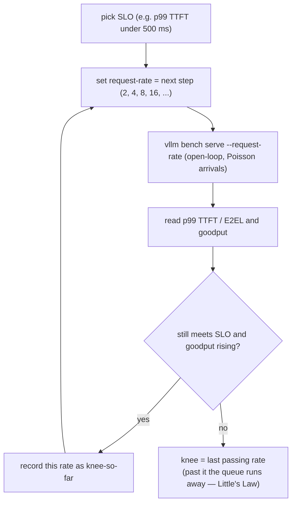

# Load-Testing to Find the Concurrency Knee

!!! info "Baseline: **vLLM 0.26.0** · model `Qwen2.5-7B-Instruct` · single RTX 4090"
    Verified against vLLM 0.26.0 via Context7 (ADR-0004): you drive load with **`vllm bench serve`** against a running server (`--backend vllm`, `--model`, `--endpoint /v1/completions`, `--dataset-name` `random`/`sharegpt`/`hf`, `--num-prompts`). Arrival load is controlled by **`--request-rate`** (requests/s; default **`inf`** = fire all at once) and **`--max-concurrency`** (cap on in-flight requests); report percentiles with **`--percentile-metrics "ttft,tpot,itl,e2el"`** and save with **`--save-result`**. The tool prints **Request/Output/Total token throughput** and **Mean/Median/P99 TTFT, TPOT, ITL**, and validates **goodput** against SLOs. The engine's own **`/metrics`** gauge **`vllm:num_requests_waiting`** shows the queue building at the knee. All numbers here are **illustrative / order-of-magnitude references** — measure your own.

---

## 1 · Intuition & why it matters

You have a [running server](openai-server.md). The question every capacity-planning and system-design interview eventually asks is: **how many concurrent users can this one instance take before it falls over?** Not "what's the throughput" as a single number — that's meaningless without a latency budget — but *where does adding load stop helping and start hurting.*

That point is the **knee** (并发拐点). Below it, adding requests raises throughput and latency barely moves — the GPU has spare batch width. At the knee, the running batch is full; new requests **queue**. Past it, throughput flattens (the GPU was already saturated) while latency **climbs without bound**, because every new request waits behind a growing line. The knee is the honest ceiling of the instance: the maximum load at which you still meet your **SLO**.

You find the knee by **load-testing** — sending controlled, increasing load and watching the latency/throughput curve bend. Two things an interviewer wants you to distinguish:

1. **Open-loop vs closed-loop load.** Firing a fixed *arrival rate* (requests/s, regardless of whether the server keeps up) is **open-loop** and is what models real users. Capping *concurrency* (N requests in flight, launch a new one only when one finishes) is **closed-loop** and models a fixed client pool. They find different things; using the wrong one gives a wrong ceiling.
2. **Throughput and latency are one curve, not two numbers.** "1000 tok/s" means nothing until you say "at p99 TTFT under 500 ms." The knee is defined *by the SLO* — which is why the metric that matters is **goodput** (throughput that meets the SLO), not raw throughput.

So: the shape of the curve and why it bends (the queue), then the tool and the sweep that locate the bend. → see the [Glossary](../glossary.md) for *Knee, SLO, Goodput*.

## 2 · Mental model

Sweep the offered load from low to high and plot two things against it: **throughput** and **p99 latency**. They tell one story.

```text
   throughput (tok/s)                         p99 latency (ms)
        │                  ___________              │              ╱  ← latency explodes
        │            _____╱          saturated      │             ╱      (queue unbounded)
        │        ___╱                (flat)         │           ╱
        │     __╱                                   │        __╱
        │   _╱  linear region                       │  _____╱   ← gentle until the knee
        │ _╱   (spare batch width)                  │ ╱
        └──────────────┬───────────────▶           └────────────┬──────────▶
                     KNEE            offered load              KNEE      offered load

   BELOW knee: batch has room     → throughput ↑, latency ~flat   (add load, all good)
   AT    knee: batch full         → num_requests_waiting > 0       (the queue starts)
   ABOVE knee: saturated + queued → throughput flat, latency ↑↑    (goodput COLLAPSES)
```

The two curves above are quantitative (ASCII per ADR-0005). The *sweep procedure* that locates the knee is a control loop, so Mermaid `flowchart`:



Three shapes to keep:

- **The knee is where the queue begins.** Below it, an arriving request finds a free slot in the running batch (`num_requests_waiting == 0`). At the knee the batch is full; the next request **waits**. That single gauge — `vllm:num_requests_waiting` climbing off zero — *is* the knee, live.
- **Past the knee, throughput is a lie.** The GPU is already 100% busy, so total throughput plateaus — but latency rises linearly with the backlog because [Little's Law](#33-littles-law) ties queue length to wait time. Reporting the plateau throughput as "capacity" ignores that every user is now waiting seconds for their first token.
- **The SLO defines the ceiling.** Two services on identical hardware have different knees if their SLOs differ ("p99 TTFT < 200 ms" vs "< 2 s"). The number you ship is **goodput at your SLO**, and the knee is the offered load where goodput stops rising.

## 3 · Principle

### 3.1 Open-loop vs closed-loop

There are two ways to offer load, and they answer different questions:

- **Open-loop (arrival rate).** Requests arrive at a fixed **rate** λ (req/s) whatever the server is doing — like real internet traffic. Set with `--request-rate λ`. At finite λ the tool spaces arrivals as a **Poisson process** (random gaps averaging 1/λ), which is the realistic model. If λ exceeds the server's capacity, the queue grows **without bound** and latency runs away — exactly the signal you want. This is the mode for finding the SLO-limited knee.
- **Closed-loop (concurrency).** Exactly **N** requests are in flight; a new one launches only when one completes. Set with `--max-concurrency N`. Latency and throughput both *self-limit* — the system can't overload because load is gated by completions. This measures "throughput at concurrency N" and is how you probe the batch width, but it will **never** show the runaway latency of an overloaded open-loop system.

The default `--request-rate inf` fires all `--num-prompts` at once — a **saturation** test (max throughput, ignores latency SLO). Useful for the ceiling number, useless for the knee. To find the knee you **sweep `--request-rate`** upward.

### 3.2 The metrics that matter

`vllm bench serve` reports (Part 0 defined these):

- **TTFT** — time to first token; dominated by [prefill](../part0/inference-flow.md) + queue wait. The number a streaming user feels first.
- **TPOT / ITL** — per-output-token / inter-token latency; the [decode](../part0/inference-flow.md) speed.
- **E2EL** — end-to-end latency per request.
- **Request / output-token / total-token throughput** — the system's rate.
- **Goodput** — requests/s that meet **all** specified SLOs. The only throughput number that respects latency.

You read them at each load level as **percentiles** (mean/median/**P99**), because the tail is what the SLO is written against — a great median with a terrible p99 still fails users.

### 3.3 Little's Law

The reason the curve bends is a law you can state in one line. For a system in steady state:

$$
L = \lambda \cdot W
$$

where $L$ is the average number of requests **in the system**, $\lambda$ is the **arrival rate** (req/s), and $W$ is the average **time a request spends** in the system (s). It's an identity — always true in steady state, no assumptions about distributions.

Read it two ways:

- **Below the knee**, $W$ is roughly constant (requests flow through the full batch without queuing), so $L$ grows linearly with $\lambda$ and everything is fine.
- **At the knee**, the server's max completion rate $\mu$ is reached. Push $\lambda > \mu$ and there is **no steady state**: $L$ (and therefore $W$) grows without bound — the queue and the latency run away. That's the vertical wall on the right of the plot.

So the knee is precisely $\lambda \approx \mu$: the arrival rate that matches the instance's max sustainable completion rate. Find it and you know both the ceiling *and* the load at which to add a [second instance](routing-autoscaling.md).

### 3.4 The sweep

The method: hold the workload shape fixed (input/output lengths via `--random-input-len` / `--random-output-len`, or a real dataset), and **step `--request-rate` up** — e.g. 2, 4, 8, 16, 32 req/s. At each step record p99 TTFT, p99 E2EL, and goodput. The **knee** is the last rate where p99 latency still meets the SLO and goodput is still rising; the next step is where latency jumps and goodput flattens or falls. Report *that* rate as the instance's capacity.

### 3.5 Reading it in vLLM's source (v0.26.0)

The open-loop-vs-saturation distinction of §3.1 is a real code path (ADR-0002: read + reason, don't rewrite):

- **`vllm bench serve`** is [`vllm/benchmarks/serve.py`](https://github.com/vllm-project/vllm/blob/v0.26.0/vllm/benchmarks/serve.py). Its request generator implements exactly §3.1: with a finite `--request-rate` and the default `burstiness = 1.0` the inter-arrival gaps **follow a Poisson process**; a `burstiness` other than 1 switches to a **gamma** distribution (lower = burstier). `--request-rate inf` skips the spacing and fires everything at once — the saturation test.
- **Goodput is computed, not guessed.** `serve.py`'s metrics carry a `request_goodput` field and a `calculate_metrics` step that validates each request against the SLO you pass — the §3.2 "throughput that meets the SLO" made concrete, so the tool itself reports the number the knee is defined by.

Open `serve.py` and find the arrival-rate generator first — the `burstiness`/Poisson branch is the open-loop model of §3.1 in ~10 lines.

## 4 · Complete runnable code + line-by-line

A single benchmark run, then a **sweep** that steps the arrival rate and pulls out the knee.

```bash
# One run at a fixed arrival rate (open-loop, Poisson arrivals at 8 req/s)
vllm bench serve \
    --backend vllm \
    --model qwen2.5-7b \                       # must match the server's --served-model-name
    --endpoint /v1/completions \
    --dataset-name random \                    # synthetic prompts; reproducible shape
    --random-input-len 512 --random-output-len 128 \
    --num-prompts 500 \                        # enough to reach steady state
    --request-rate 8 \                         # OPEN-LOOP: 8 req/s, Poisson-spaced (not 'inf')
    --percentile-metrics "ttft,tpot,itl,e2el" \
    --save-result --result-filename rate_08.json   # --save-result verified; --result-filename shown illustratively
```

```python title="sweep_knee.py"
"""Sweep the arrival rate to locate the concurrency knee.
Runs `vllm bench serve` at increasing --request-rate, parses each JSON result,
and flags the last rate that still meets the SLO. Read-only logic; the runs need the server."""
import json, subprocess

MODEL = "qwen2.5-7b"
RATES = [2, 4, 8, 16, 32]                       # step the OFFERED LOAD upward
SLO_P99_TTFT_MS = 500                           # the SLO that DEFINES the knee

def run(rate):
    out = f"rate_{rate:02d}.json"
    subprocess.run([                            # one open-loop run at this arrival rate
        "vllm", "bench", "serve", "--backend", "vllm", "--model", MODEL,
        "--endpoint", "/v1/completions", "--dataset-name", "random",
        "--random-input-len", "512", "--random-output-len", "128",
        "--num-prompts", "500", "--request-rate", str(rate),
        "--percentile-metrics", "ttft,tpot,itl,e2el",
        "--save-result", "--result-filename", out,
    ], check=True)
    r = json.load(open(out))                    # the tool's JSON schema carries every metric
    return r["p99_ttft_ms"], r["request_throughput"]

knee = None
for rate in RATES:                              # walk up the curve
    p99_ttft, thru = run(rate)
    ok = p99_ttft <= SLO_P99_TTFT_MS            # does this load still meet the SLO?
    print(f"{rate:>3} req/s | p99 TTFT {p99_ttft:7.1f} ms | {thru:6.2f} req/s | {'OK' if ok else 'SLO VIOLATED'}")
    if ok:
        knee = rate                             # last good rate = the knee (so far)
    else:
        break                                   # first violation → we've passed the knee
print(f"\nKnee ≈ {knee} req/s at p99 TTFT ≤ {SLO_P99_TTFT_MS} ms (illustrative — measure your own)")
```

**Line-by-line:**

- **`--request-rate 8`** (not `inf`) — the crux. `inf` dumps all 500 prompts instantly (a saturation test that ignores latency); a finite rate spaces them as a **Poisson** arrival process, modeling real traffic and letting the queue — and latency — reveal the knee.
- **`--max-concurrency`** (not used here) — the closed-loop alternative. Add it to cap in-flight requests; then you're measuring "throughput at N concurrent," which self-limits and can't show open-loop runaway. Pick the mode to match the question.
- **`--num-prompts 500`** — enough requests that the run reaches **steady state** (Little's Law is a steady-state law); too few and you measure warm-up transients, not the plateau.
- **`--percentile-metrics "ttft,tpot,itl,e2el"`** — ask for the **tail**. The SLO is written on p99, so the median alone will mislead you into declaring a knee that fails 1% of users badly.
- **The sweep loop** — steps the offered load and applies the **SLO** at each level. The knee is the **last rate that passes**; the first failure means the queue has started to run away (Little's Law, §3.3). That rate is the number you feed into capacity planning and the trigger for a [second instance](routing-autoscaling.md).
- **`--save-result` + JSON parse** — the tool writes a machine-readable result per run; the sweep reads `p99_ttft_ms` and `request_throughput` back out. (`--save-result` is verified; the exact result-file naming flag — shown here as `--result-filename` — and the JSON field names are illustrative, so inspect one result JSON to confirm both for your version.)

## 5 · Lab — sweep a 4090 and draw the knee

!!! gpu "GPU Lab (single-GPU)"
    - **Min VRAM:** the [same server](openai-server.md) as the previous lesson — `Qwen2.5-7B-Instruct` on a **24 GB RTX 4090**. The benchmark client is CPU-only; run it on the same box or another machine that can reach the port.
    - **Suggested AutoDL card:** single **RTX 4090 (24 GB)** (ADR-0001). No multi-GPU needed.
    - **Est. time / cost:** ~20–30 min for a 5-point sweep · **~¥1–4** (illustrative). Keep prompts modest to save time; the *shape* of the curve is the deliverable, not a headline number.
    - **Platform:** NVIDIA CUDA (default). **Non-NVIDIA:** `vllm bench serve` is a pure HTTP client — it works against any vLLM backend (AMD ROCm, etc.) unchanged; only the server's throughput differs.

Steps:

1. **Warm up.** Start the server, send a few requests so weights/CUDA graphs are hot. Benchmarking a cold server measures the warm-up, not the steady state.
2. **Run the sweep.** `python sweep_knee.py`. Watch each line: p99 TTFT stays flat and low, then jumps. Note the rate where it crosses your SLO — that's the knee.
3. **Watch the queue at the knee.** In another terminal during the run, `watch -n1 'curl -s localhost:8000/metrics | grep num_requests_waiting'`. Below the knee it hovers at 0; at and above the knee it climbs — Little's Law made visible.
4. **Change one thing.** Re-run the sweep with a larger `--gpu-memory-utilization` (bigger KV pool → higher `--max-num-seqs` headroom) or shorter outputs; watch the knee move. Then **power off.**

## 6 · Common pitfalls / counter-intuitive points

- **Only ever running `--request-rate inf`.** That's a pure saturation test: it reports max throughput while ignoring latency, so it *cannot* find the SLO-defined knee. It answers "peak tok/s," not "how many users can I serve well." Sweep finite rates.
- **Confusing closed-loop with open-loop.** `--max-concurrency N` self-limits: latency and throughput plateau gracefully because load is gated by completions, so you'll **never** see the runaway latency of a real overload. Use open-loop `--request-rate` to find the true ceiling; use closed-loop to characterize a fixed client pool.
- **Reporting one throughput number with no latency budget.** "This instance does 1200 tok/s" is unfalsifiable without "at p99 TTFT ≤ X." Throughput past the knee is real but useless — every user is queued. Always pair throughput with a percentile latency and prefer **goodput**.
- **Judging on the median, shipping on the tail.** A median TTFT of 80 ms with a p99 of 3 s means 1% of users have a terrible experience. The SLO — and therefore the knee — lives on **p99**; ask for `--percentile-metrics` and read the tail.
- **Too few prompts / no warm-up.** Little's Law is a **steady-state** identity. A short run dominated by cold caches and ramp-up measures a transient, not the plateau. Use enough `--num-prompts` and warm the server first.
- **Benchmarking over `localhost` and hitting IPv6 weirdness.** vLLM's own tooling recommends `127.0.0.1` over `localhost` to avoid IPv6 resolution stalls that skew latency. Small thing, real artifact.
- **Forgetting the workload shape is part of the answer.** The knee for 512-in/128-out is not the knee for 4k-in/1k-out — prefill-heavy vs decode-heavy workloads saturate different resources. Fix and report the input/output lengths (or the dataset) alongside the knee, or the number doesn't transfer.
- **Assuming a finite `--request-rate` means uniform arrivals.** In `serve.py` a finite rate with the default `burstiness = 1.0` spaces requests as a **Poisson** process — random gaps, not evenly-spaced ticks — which is *why* the queue can spike transiently below the mean-rate knee. If you want smoother (less bursty) arrivals set `burstiness > 1` (gamma); `burstiness < 1` is burstier. Reporting a knee without noting the arrival model hides this variance.

## 7 · Interview links

- [Load-testing & the concurrency knee (Little's Law)](../interview/load-testing-knee.md) — the high-frequency question this lesson prepares you for: *what the knee is and why the curve bends there, open-loop vs closed-loop load, how Little's Law explains the runaway latency past the knee, and which metric (goodput, not raw throughput) you actually report.*

## 8 · Summary & further reading

**One line:** The **knee** is the offered load where a single instance's running batch fills, `vllm:num_requests_waiting` climbs off zero, and — by **Little's Law** $L=\lambda W$ — pushing arrival rate λ past the max completion rate μ makes the queue and latency run away; you find it by sweeping **`vllm bench serve --request-rate`** upward (open-loop Poisson arrivals, not `--request-rate inf` and not closed-loop `--max-concurrency`), reading **p99** TTFT/E2EL and **goodput** against your SLO at each step, and reporting the last rate that still passes as the instance's honest capacity.

Further reading:

- vLLM `docs/benchmarking/cli.md` — `vllm bench serve` flags, datasets, and the result output format.
- vLLM `docs/design/metrics.md` — `vllm:num_requests_waiting` / `num_requests_running` and the latency histograms you correlate with the sweep.
- Little, J. D. C. (1961), *A Proof for the Queuing Formula $L = \lambda W$* — the identity behind the wall.
- The [tuning-knobs sweep](../part5/tuning-knobs-sweep.md) — the same sweep discipline applied to the engine knobs that *move* the knee.
- The [next lesson](routing-autoscaling.md) — what to do once you've hit the knee: add instances and route across them.
- vLLM source (v0.26.0): [`vllm/benchmarks/serve.py`](https://github.com/vllm-project/vllm/blob/v0.26.0/vllm/benchmarks/serve.py) — the `--request-rate` arrival generator (`burstiness`/Poisson vs gamma), `request_goodput`, and `calculate_metrics` from §3.5.

## 9 · Self-check

??? question "You run `vllm bench serve --request-rate inf --num-prompts 1000` and report the resulting throughput as the instance's capacity. Why is that the wrong number for a latency-sensitive service?"
    `--request-rate inf` fires all 1000 prompts at once — a **saturation** test that drives the server to 100% utilization and reports the **maximum** throughput while completely **ignoring latency**. At that operating point the queue is enormous and p99 TTFT/E2EL are far past any reasonable SLO — every user is waiting. For a latency-sensitive service the real capacity is the **knee**: the highest **arrival rate** (open-loop, finite `--request-rate`, Poisson-spaced) at which **goodput** still rises and p99 latency still meets the SLO. Report that rate, not the saturation throughput.

??? question "Below some load, adding requests barely changes latency; above it, latency climbs almost vertically while throughput stops rising. State the law that explains this and what's happening physically."
    **Little's Law**, $L = \lambda W$ (average requests in system = arrival rate × time in system), in steady state. Below the knee the running batch has spare width, so an arrival finds a free slot, $W$ (per-request time) is roughly constant, and $L$ grows linearly with $\lambda$ — throughput rises, latency flat. At the knee the server hits its **maximum completion rate** μ (the GPU is saturated). Push $\lambda > \mu$ and there is **no steady state**: requests arrive faster than they finish, the queue length $L$ grows without bound, and since $W = L/\lambda$, so does the wait — latency runs away vertically while throughput can't exceed μ (it's flat). The knee is exactly $\lambda \approx \mu$.

??? question "When would you deliberately use `--max-concurrency` (closed-loop) instead of `--request-rate` (open-loop), and what would each fail to tell you?"
    Use **`--max-concurrency N`** (closed-loop) when you want to characterize the server at a **fixed number of in-flight requests** — e.g. modeling a fixed pool of N synchronous clients, or probing "what throughput and latency do I get with the batch held at width N?" It **self-limits**: a new request only starts when one finishes, so the system can't overload and you'll never see runaway latency. Use **`--request-rate λ`** (open-loop) when you want the **real ceiling** under traffic that doesn't wait for you — internet users arrive whether or not you're keeping up — which is the only mode that reveals the knee and the post-knee latency explosion. Closed-loop can't show overload; open-loop can't isolate behavior at an exact concurrency. Match the mode to the question: capacity/knee → open-loop; fixed-client characterization → closed-loop.
