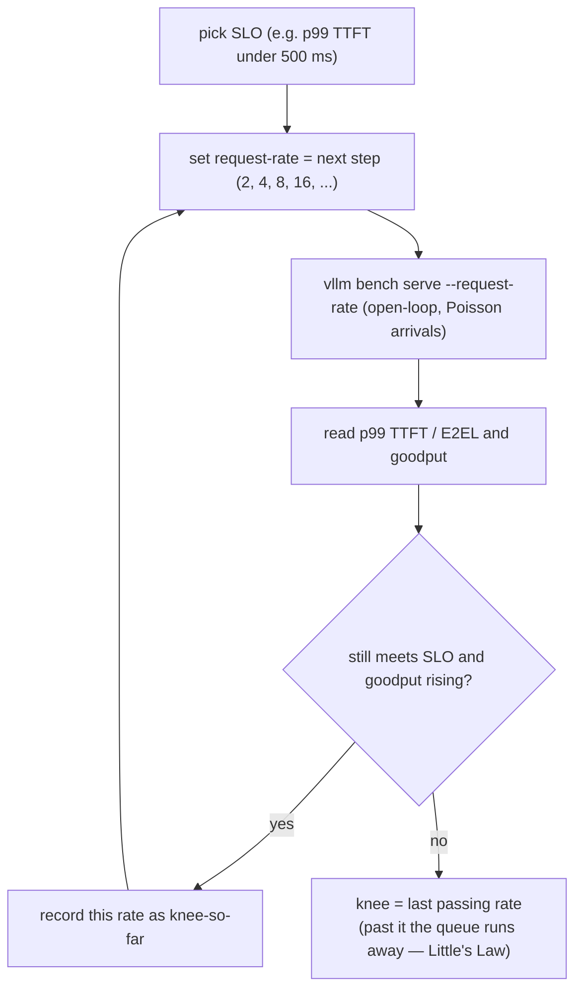

# 压测找并发拐点（knee）

!!! info "基线：**vLLM 0.26.0** · 模型 `Qwen2.5-7B-Instruct` · 单张 RTX 4090"
    已按 ADR-0004 用 Context7 对照 vLLM 0.26.0 核实：用 **`vllm bench serve`** 对一个运行中的 server 施压（`--backend vllm`、`--model`、`--endpoint /v1/completions`、`--dataset-name` `random`/`sharegpt`/`hf`、`--num-prompts`）。到达负载由 **`--request-rate`**（请求/秒；默认 **`inf`** = 一次全发）与 **`--max-concurrency`**（在途请求上限）控制；用 **`--percentile-metrics "ttft,tpot,itl,e2el"`** 报告分位、用 **`--save-result`** 存盘。工具打印 **Request/Output/Total token 吞吐** 与 **Mean/Median/P99 TTFT、TPOT、ITL**，并按 SLO 校验 **goodput**。引擎自身 `/metrics` 的 gauge **`vllm:num_requests_waiting`** 会显示队列在 knee 处堆起来。本节所有数字均为**示例 / 量级参考**——请自测。

---

## 1 · 直觉 & 为什么重要

你有了一个[运行中的 server](openai-server.md)。每个容量规划与系统设计面试迟早会问：**这一个实例在崩掉前能接多少并发用户？** 不是把「吞吐」当成一个数字——那没有延迟预算就毫无意义——而是*加负载在哪里停止有益、开始有害。*

那个点就是 **knee（并发拐点）**。在它之下，加请求抬吞吐、延迟几乎不动——GPU 还有 batch 宽度余量。到 knee，运行 batch 满了；新请求**排队**。过了它，吞吐走平（GPU 早已饱和），而延迟**无界攀升**，因为每个新请求都排在越来越长的队后面。knee 是实例的诚实天花板：你仍满足 **SLO** 的最大负载。

你靠**压测**找 knee——发出受控、递增的负载，看延迟/吞吐曲线折弯。面试官想让你分清两件事：

1. **开环 vs 闭环负载。** 打一个固定*到达率*（请求/秒，不管 server 跟不跟得上）是**开环**，它模拟真实用户。封顶*并发*（N 个在途，完一个才发一个）是**闭环**，它模拟固定客户端池。两者找到不同的东西；用错了会给出错的天花板。
2. **吞吐与延迟是一条曲线，不是两个数字。** 「1000 tok/s」在你说「且 p99 TTFT 低于 500 ms」之前毫无意义。knee 是*由 SLO 定义*的——所以真正重要的指标是 **goodput**（满足 SLO 的吞吐），不是裸吞吐。

所以：先是曲线的形状与它为何折弯（队列），再是定位折点的工具与 sweep。→ 术语见 [术语表](../glossary.md) 的 *Knee、SLO、Goodput*。

## 2 · 心智模型

把施加负载从低扫到高，对它画两样东西：**吞吐**和 **p99 延迟**。它们讲同一个故事。

```text
   吞吐 (tok/s)                                p99 延迟 (ms)
        │                  ___________              │              ╱  ← 延迟爆炸
        │            _____╱          饱和            │             ╱      (队列无界)
        │        ___╱                (走平)          │           ╱
        │     __╱                                   │        __╱
        │   _╱  线性区                               │  _____╱   ← knee 前平缓
        │ _╱   (batch 有余量)                        │ ╱
        └──────────────┬───────────────▶           └────────────┬──────────▶
                     KNEE            施加负载                   KNEE      施加负载

   knee 之下: batch 有位置  → 吞吐 ↑、延迟 ~平   (加负载，都好)
   knee 处:   batch 满     → num_requests_waiting > 0   (队列开始)
   knee 之上: 饱和 + 排队   → 吞吐走平、延迟 ↑↑   (goodput 崩)
```

上面两条曲线是定量图（ASCII，按 ADR-0005）。而定位 knee 的*扫描流程*是一个控制回路，故用 Mermaid `flowchart`（图内标签按 ADR-0005 保持英文）：



三个要记住的形状：

- **knee 就是队列开始的地方。** 在它之下，到达的请求在运行 batch 里找到空槽（`num_requests_waiting == 0`）。到 knee，batch 满了；下一个请求**等**。就那一个 gauge——`vllm:num_requests_waiting` 离开零往上爬——*就是* knee，实时的。
- **过了 knee，吞吐是个谎。** GPU 已 100% 忙，总吞吐走平——但延迟随积压线性上升，因为 Little 定律（§3.3）把队长和等待时间绑在一起。把这个平台吞吐当成「容量」，就是无视每个用户现在都在等好几秒才拿到第一个 token。
- **SLO 定义天花板。** 同样硬件上的两个服务，若 SLO 不同（「p99 TTFT < 200 ms」vs「< 2 s」），knee 就不同。你上线的数字是 **你 SLO 下的 goodput**，而 knee 是 goodput 停止上升的那个施加负载。

## 3 · 原理

### 3.1 开环 vs 闭环

有两种施加负载的方式，回答不同的问题：

- **开环（到达率）。** 请求以固定**速率** λ（请求/秒）到达，不管 server 在干什么——像真实互联网流量。用 `--request-rate λ` 设。有限 λ 时工具把到达间隔排成 **Poisson 过程**（随机间隔、均值 1/λ），这是现实模型。若 λ 超过 server 容量，队列**无界**增长、延迟失控——正是你要的信号。这是找 SLO 受限 knee 的模式。
- **闭环（并发）。** 恰好 **N** 个请求在途；完一个才发一个。用 `--max-concurrency N` 设。延迟与吞吐都*自限*——系统不会过载，因为负载被完成数闸住。这测「并发 N 下的吞吐」、是探 batch 宽度的方式，但它**永远**不会显示过载开环系统的失控延迟。

默认 `--request-rate inf` 把全部 `--num-prompts` 一次发出——一个**饱和**测试（最大吞吐、忽略延迟 SLO）。要天花板数字有用，找 knee 无用。要找 knee，你**扫 `--request-rate`** 往上。

### 3.2 重要的指标

`vllm bench serve` 报告（Part 0 定义过）：

- **TTFT** —— 首 token 延迟；由 [prefill](../part0/inference-flow.md) + 排队等待主导。流式用户最先感到的数字。
- **TPOT / ITL** —— 每输出 token / token 间延迟；[decode](../part0/inference-flow.md) 速度。
- **E2EL** —— 单请求端到端延迟。
- **Request / output-token / total-token 吞吐** —— 系统的速率。
- **Goodput** —— 满足**全部**指定 SLO 的请求/秒。唯一尊重延迟的吞吐数字。

你在每个负载档读它们的**分位**（mean/median/**P99**），因为尾巴才是 SLO 写来对付的——好 median 配烂 p99，仍然坑用户。

### 3.3 Little 定律

曲线为何折弯，源于一条一句话能说清的定律。稳态系统：

$$
L = \lambda \cdot W
$$

其中 $L$ 是**在系统中**的平均请求数，$\lambda$ 是**到达率**（请求/秒），$W$ 是请求**在系统中花的**平均时间（秒）。这是恒等式——稳态下永真，对分布无假设。

两种读法：

- **knee 之下**，$W$ 大致恒定（请求流过满 batch、不排队），故 $L$ 随 $\lambda$ 线性增长，一切正常。
- **到 knee**，达到 server 的最大完成率 $\mu$。推到 $\lambda > \mu$，就**没有稳态**：$L$（因而 $W$）无界增长——队列和延迟失控。那就是图右侧的竖墙。

所以 knee 恰是 $\lambda \approx \mu$：匹配实例最大可持续完成率的那个到达率。找到它，你就同时知道了天花板*和*该加[第二个实例](routing-autoscaling.md)的负载点。

### 3.4 sweep

方法：固定 workload 形状（输入/输出长度用 `--random-input-len` / `--random-output-len`，或用真实数据集），**把 `--request-rate` 往上一档档加**——例如 2、4、8、16、32 请求/秒。每档记 p99 TTFT、p99 E2EL、goodput。**knee** 是 p99 延迟仍满足 SLO 且 goodput 仍在涨的最后一档；下一档就是延迟跳变、goodput 走平或下降之处。把*那个*速率作为实例容量报告。

### 3.5 在 vLLM 源码里读它（v0.26.0）

§3.1 的开环-vs-饱和之分是一条真实代码路径（ADR-0002：读懂 + 会推，不重写）：

- **`vllm bench serve`** 是 [`vllm/benchmarks/serve.py`](https://github.com/vllm-project/vllm/blob/v0.26.0/vllm/benchmarks/serve.py)。它的请求生成器正实现 §3.1：有限 `--request-rate` 且默认 `burstiness = 1.0` 时，到达间隔**服从 Poisson 过程**；`burstiness` 非 1 则切到 **gamma** 分布（越小越 bursty）。`--request-rate inf` 跳过间隔、一次全发——即饱和测试。
- **goodput 是算出来的，不是猜的。** `serve.py` 的 metrics 带一个 `request_goodput` 字段与一个 `calculate_metrics` 步骤，按你传入的 SLO 校验每个请求——§3.2「满足 SLO 的吞吐」的落地，所以工具本身就报出 knee 所依据的那个数字。

先打开 `serve.py` 找到到达率生成器：`burstiness`/Poisson 分支就是 §3.1 的开环模型，约 10 行。

## 4 · 完整可跑代码 + 逐行讲解

先一次 benchmark run，再一个**扫**到达率、拉出 knee 的 sweep。

```bash
# 固定到达率的一次 run（开环，8 请求/秒 Poisson 到达）
vllm bench serve \
    --backend vllm \
    --model qwen2.5-7b \                       # 须匹配 server 的 --served-model-name
    --endpoint /v1/completions \
    --dataset-name random \                    # 合成 prompt；形状可复现
    --random-input-len 512 --random-output-len 128 \
    --num-prompts 500 \                        # 足够多以到达稳态
    --request-rate 8 \                         # 开环：8 请求/秒、Poisson 间隔（不是 'inf'）
    --percentile-metrics "ttft,tpot,itl,e2el" \
    --save-result --result-filename rate_08.json   # --save-result 已核实；--result-filename 为示意
```

```python title="sweep_knee.py"
"""扫到达率以定位并发 knee。
在递增的 --request-rate 上跑 `vllm bench serve`、解析每个 JSON 结果，
并标出仍满足 SLO 的最后一档。逻辑只读；run 需要 server。"""
import json, subprocess

MODEL = "qwen2.5-7b"
RATES = [2, 4, 8, 16, 32]                       # 把施加负载往上一档档加
SLO_P99_TTFT_MS = 500                           # 定义 knee 的那个 SLO

def run(rate):
    out = f"rate_{rate:02d}.json"
    subprocess.run([                            # 这一档的一次开环 run
        "vllm", "bench", "serve", "--backend", "vllm", "--model", MODEL,
        "--endpoint", "/v1/completions", "--dataset-name", "random",
        "--random-input-len", "512", "--random-output-len", "128",
        "--num-prompts", "500", "--request-rate", str(rate),
        "--percentile-metrics", "ttft,tpot,itl,e2el",
        "--save-result", "--result-filename", out,
    ], check=True)
    r = json.load(open(out))                    # 工具的 JSON schema 带着每个指标
    return r["p99_ttft_ms"], r["request_throughput"]

knee = None
for rate in RATES:                              # 沿曲线往上走
    p99_ttft, thru = run(rate)
    ok = p99_ttft <= SLO_P99_TTFT_MS            # 这一档仍满足 SLO 吗？
    print(f"{rate:>3} req/s | p99 TTFT {p99_ttft:7.1f} ms | {thru:6.2f} req/s | {'OK' if ok else 'SLO VIOLATED'}")
    if ok:
        knee = rate                             # 最后一个好档 = knee（到目前）
    else:
        break                                   # 首次违规 → 已越过 knee
print(f"\nKnee ≈ {knee} req/s at p99 TTFT ≤ {SLO_P99_TTFT_MS} ms（示例——请自测）")
```

**逐行讲解：**

- **`--request-rate 8`**（不是 `inf`）—— 关键。`inf` 把 500 个 prompt 瞬间全倒出（一个忽略延迟的饱和测试）；有限速率把它们排成 **Poisson** 到达过程，模拟真实流量、让队列——与延迟——揭示 knee。
- **`--max-concurrency`**（此处未用）—— 闭环替代。加上它可封顶在途请求；那时你在测「并发 N 下的吞吐」，它自限、显示不出开环失控。挑模式来对上问题。
- **`--num-prompts 500`** —— 请求足够多、run 才到**稳态**（Little 定律是稳态定律）；太少就测到热身瞬态、不是平台。
- **`--percentile-metrics "ttft,tpot,itl,e2el"`** —— 要**尾巴**。SLO 写在 p99 上，单看 median 会误导你宣布一个坑掉 1% 用户的 knee。
- **sweep 循环** —— 一档档加施加负载，每档套 **SLO**。knee 是**最后一个通过的档**；首次失败意味队列开始失控（Little 定律，§3.3）。那个速率就是你喂给容量规划、以及加[第二个实例](routing-autoscaling.md)的触发值。
- **`--save-result` + 解析 JSON** —— 工具每 run 写一个机器可读结果；sweep 把 `p99_ttft_ms` 与 `request_throughput` 读回来。（`--save-result` 已核实；确切的结果文件命名 flag——此处示意为 `--result-filename`——与 JSON 字段名均为示例，请检查一个结果 JSON 确认你版本的两者。）

## 5 · Lab —— 扫一张 4090、画出 knee

!!! gpu "GPU Lab（单卡）"
    - **最低显存：** 与上一节[同一个 server](openai-server.md)——`Qwen2.5-7B-Instruct` 在 **24 GB RTX 4090** 上。benchmark 客户端纯 CPU；在同机或另一台够得着端口的机器上跑。
    - **建议 AutoDL 卡型：** 单张 **RTX 4090 (24 GB)**（ADR-0001）。不需多卡。
    - **预估耗时 / 花费：** 5 个点的 sweep 约 20–30 分钟 · **约 ¥1–4**（示例）。prompt 保持适中省时间；曲线的*形状*才是产出，不是头条数字。
    - **平台：** NVIDIA CUDA（默认）。**非 NVIDIA：** `vllm bench serve` 是纯 HTTP 客户端——对任何 vLLM 后端（AMD ROCm 等）都能不改地跑；只是 server 的吞吐不同。

步骤：

1. **热身。** 起 server，发几个请求让权重/CUDA graphs 热起来。压一个冷 server 测到的是热身、不是稳态。
2. **跑 sweep。** `python sweep_knee.py`。看每一行：p99 TTFT 先平且低，然后跳。记下它越过 SLO 的那档——那就是 knee。
3. **在 knee 处看队列。** run 期间另开一个终端 `watch -n1 'curl -s localhost:8000/metrics | grep num_requests_waiting'`。knee 之下它悬在 0；到与过 knee 就往上爬——Little 定律看得见。
4. **改一样东西。** 用更大的 `--gpu-memory-utilization`（更大 KV pool → 更多 `--max-num-seqs` 余量）或更短输出重跑 sweep；看 knee 移动。然后**关机**。

## 6 · 常见坑 / 反直觉点

- **只跑过 `--request-rate inf`。** 那是纯饱和测试：报最大吞吐、忽略延迟，所以*找不到* SLO 定义的 knee。它答「峰值 tok/s」，不答「我能服务好多少用户」。扫有限速率。
- **把闭环当开环。** `--max-concurrency N` 自限：延迟与吞吐优雅走平，因为负载被完成数闸住，所以你**永远**看不到真实过载的失控延迟。用开环 `--request-rate` 找真天花板；用闭环刻画固定客户端池。
- **报一个没有延迟预算的吞吐数。** 「这实例做 1200 tok/s」在没有「且 p99 TTFT ≤ X」时不可证伪。过了 knee 的吞吐真实但无用——每个用户都在排队。吞吐永远配一个分位延迟，且优先用 **goodput**。
- **按 median 判定、按尾巴上线。** median TTFT 80 ms 配 p99 3 s，意味 1% 用户体验糟糕。SLO——因而 knee——住在 **p99**；要 `--percentile-metrics`、读尾巴。
- **prompt 太少 / 无热身。** Little 定律是**稳态**恒等式。被冷缓存与爬坡主导的短 run 测的是瞬态、不是平台。用足 `--num-prompts` 并先热 server。
- **压 `localhost` 撞上 IPv6 怪象。** vLLM 自己的工具建议用 `127.0.0.1` 而非 `localhost`，避免拖慢延迟的 IPv6 解析卡顿。小事，真伪影。
- **忘了 workload 形状是答案的一部分。** 512-in/128-out 的 knee 不是 4k-in/1k-out 的 knee——prefill-heavy vs decode-heavy 饱和不同资源。把输入/输出长度（或数据集）随 knee 一起固定并报告，否则数字不可迁移。
- **以为有限 `--request-rate` 就是均匀到达。** 在 `serve.py` 里，有限速率配默认 `burstiness = 1.0` 会把请求按 **Poisson** 过程排开——随机间隔，而非等距节拍——这正是队列能在均值速率 knee 之下瞬时飙起来的原因。想要更平滑（不那么 bursty）的到达就设 `burstiness > 1`（gamma）；`burstiness < 1` 更 bursty。报 knee 却不说到达模型，就藏了这份方差。

## 7 · 面试连线

- [压测与并发拐点（Little 定律）](../interview/load-testing-knee.md) —— 本节为你准备的高频题：*knee 是什么、曲线为何在那折弯、开环 vs 闭环负载、Little 定律怎么解释过 knee 后的失控延迟、以及你到底报哪个指标（goodput，不是裸吞吐）。*

## 8 · 小结 & 延伸阅读

**一句话：** **knee** 是单实例运行 batch 填满、`vllm:num_requests_waiting` 离开零往上爬的那个施加负载——由 **Little 定律** $L=\lambda W$，把到达率 λ 推过最大完成率 μ 会让队列与延迟失控；你靠**把 `vllm bench serve --request-rate` 往上扫**（开环 Poisson 到达，不是 `--request-rate inf`、也不是闭环 `--max-concurrency`）找到它，每档按 SLO 读 **p99** TTFT/E2EL 与 **goodput**，把最后一个仍通过的档作为实例的诚实容量报告。

延伸阅读：

- vLLM `docs/benchmarking/cli.md` —— `vllm bench serve` 的 flag、数据集与结果输出格式。
- vLLM `docs/design/metrics.md` —— `vllm:num_requests_waiting` / `num_requests_running` 与你与 sweep 相关联的延迟直方图。
- Little, J. D. C. (1961)，*A Proof for the Queuing Formula $L = \lambda W$* —— 竖墙背后的恒等式。
- [调参旋钮 sweep](../part5/tuning-knobs-sweep.md) —— 同样的 sweep 纪律用在*移动* knee 的引擎旋钮上。
- [下一节](routing-autoscaling.md) —— 撞上 knee 之后怎么办：加实例、跨它们路由。
- vLLM 源码（v0.26.0）：[`vllm/benchmarks/serve.py`](https://github.com/vllm-project/vllm/blob/v0.26.0/vllm/benchmarks/serve.py) —— §3.5 的 `--request-rate` 到达生成器（`burstiness`/Poisson vs gamma）、`request_goodput`、`calculate_metrics`。

## 9 · 自测小问

??? question "你跑 `vllm bench serve --request-rate inf --num-prompts 1000`、把得到的吞吐当实例容量报告。对延迟敏感的服务来说，这为什么是错的数字？"
    `--request-rate inf` 把 1000 个 prompt 一次全发——一个**饱和**测试，把 server 逼到 100% 利用、报**最大**吞吐、却完全**忽略延迟**。在那个工作点队列巨大、p99 TTFT/E2EL 远超任何合理 SLO——每个用户都在等。对延迟敏感的服务，真容量是 **knee**：**goodput** 仍上升且 p99 延迟仍满足 SLO 的最高**到达率**（开环、有限 `--request-rate`、Poisson 间隔）。报那个速率，不是饱和吞吐。

??? question "某负载之下，加请求几乎不改延迟；之上，延迟几近垂直攀升而吞吐不再上升。说出解释这现象的定律，以及物理上在发生什么。"
    **Little 定律**，$L = \lambda W$（在系统中的平均请求 = 到达率 × 在系统中的时间），稳态下。knee 之下运行 batch 有余量，到达的请求找到空槽，$W$（每请求时间）大致恒定，$L$ 随 $\lambda$ 线性增长——吞吐升、延迟平。到 knee，server 撞上**最大完成率** μ（GPU 饱和）。推到 $\lambda > \mu$，就**没有稳态**：请求到得比完得快，队长 $L$ 无界增长，而 $W = L/\lambda$ 的等待也随之无界——延迟垂直失控，吞吐不能超过 μ（走平）。knee 恰是 $\lambda \approx \mu$。

??? question "什么时候你会有意用 `--max-concurrency`（闭环）而非 `--request-rate`（开环）？各自会遗漏告诉你什么？"
    当你想在**固定在途数**下刻画 server 时用 **`--max-concurrency N`**（闭环）——例如模拟固定 N 个同步客户端池，或探「batch 保持在宽度 N 时我拿到什么吞吐与延迟？」。它**自限**：完一个才起一个，系统不会过载，你永远看不到失控延迟。当你想要不为你等待的流量下的**真天花板**时用 **`--request-rate λ`**（开环）——互联网用户不管你跟不跟得上都会到——这是唯一揭示 knee 与过 knee 后延迟爆炸的模式。闭环显示不出过载；开环隔离不出某个确切并发下的行为。让模式对上问题：容量/knee → 开环；固定客户端刻画 → 闭环。
