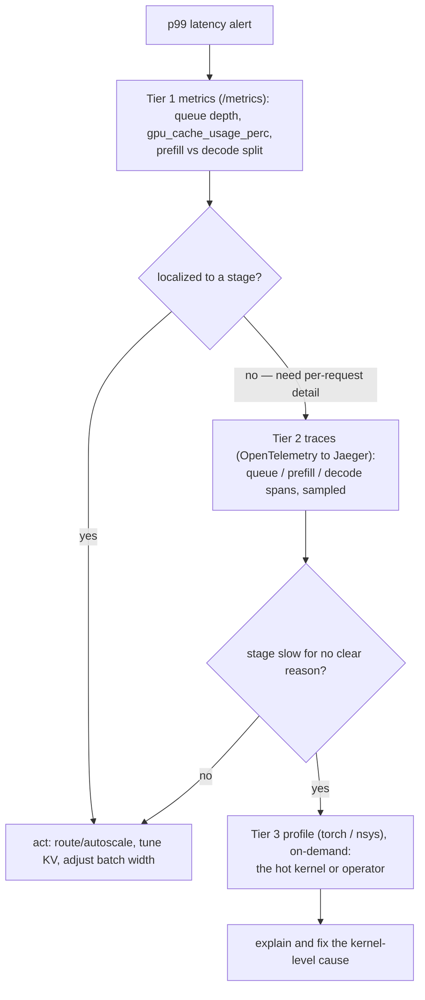

# 可观测性与 profiling：指标、trace 与 kernel 时间线

!!! info "基线：**vLLM 0.26.0** · 模型 `Qwen2.5-7B-Instruct` · 单张 RTX 4090"
    已按 ADR-0004 用 Context7 对照 vLLM 0.26.0 核实：指标来自 Prometheus 的 **`/metrics`** endpoint（`vllm:num_requests_running` / `num_requests_waiting`、`vllm:gpu_cache_usage_perc`，直方图 `vllm:time_to_first_token_seconds` / `vllm:request_prefill_time_seconds` / `vllm:request_decode_time_seconds`，计数器 `vllm:generation_tokens_total`、`vllm:prompt_tokens_cached`、`vllm:request_success_total{finished_reason}`），并有现成的 **Prometheus + Grafana** 示例（`examples/observability/prometheus_grafana`，`docker compose up`）。**OpenTelemetry** 请求 trace 把 span 导出到 OTLP collector（如 **Jaeger**，`OTEL_EXPORTER_OTLP_TRACES_ENDPOINT=grpc://…:4317`）。Profiling：**PyTorch profiler**（`vllm serve … --profiler-config '{"profiler":"torch","torch_profiler_dir":"./vllm_profile"}'` + **`/start_profile`** / **`/stop_profile`** endpoint，或客户端 `vllm bench serve --profile`）与 **Nsight Systems**（`nsys profile … --capture-range=cudaProfilerApi … vllm serve … --profiler-config.profiler cuda`）。本节所有数字均为**示例 / 量级参考**。

---

## 1 · 直觉 & 为什么重要

你在受控 sweep 里[找到了 knee](load-testing-knee.md)。生产不受控：流量在变、prompt 变长、一次发布回归、p99 延迟在凌晨 3 点悄悄爬升。问题不再是「天花板是多少」，而是**「现在慢了——*在哪*慢？」** 快速回答它就是可观测性，也是 on-call 与系统设计的核心技能。

陷阱是抄起错的工具。若因为「延迟高」就开一个 kernel profiler，你会淹死在一 GB 的 GPU 时间线里，还是不知道问题是队列满、prefill 长、还是某个 kernel 慢。纪律是**三个缩放层级**，先便宜的：

1. **指标 (Metrics)** —— 聚合、常开、近乎免费。*有没有*问题、大致在哪（队列？prefill？decode？缓存未命中？）。这是你的仪表盘和告警 24/7 盯的东西。
2. **Trace** —— 逐请求、采样。*哪个*请求生命周期的*哪一段*吃掉了时间（排队 vs prefill vs decode）。
3. **Profile** —— kernel/算子时间线，按需、昂贵。一段*为什么*慢，细到单个 CUDA kernel。

面试官期望两点：你**从指标起步，只在便宜层级指向那里时才往里缩放**，以及你知道 vLLM 三层都自带、你不用发明基础设施。→ 术语见 [术语表](../glossary.md) 的 *SLO、Goodput*。

## 2 · 心智模型

三层，每层是更深的缩放、成本更高——只在当前层定位到问题时才够下一层。

```text
   缩放层级            回答什么                          成本 / 节奏              vLLM 表面
   ──────────────────────────────────────────────────────────────────────────────────────────
   ① 指标         "有没有问题、大致在哪？"                ~免费、常开             /metrics (Prometheus)
      (fleet)      队列深度 · TTFT p99 · 缓存命中          每 15s 抓一次            + Grafana 仪表盘
        │          prefill vs decode 时间 · 完成原因        告警在这里响
        │  指向某个阶段 / 某类请求
        ▼
   ② TRACE        "哪个请求的哪一段？"                    便宜、采样              OpenTelemetry → Jaeger
      (request)    排队 → prefill → decode，逐请求          逐请求 span             (OTLP :4317)
        │  指向某个慢阶段
        ▼
   ③ PROFILE      "这段为什么慢——哪个 kernel/算子？"      昂贵、按需              torch profiler + /start_profile
      (kernel)     GPU 时间线                              几秒捕获                Nsight Systems (nsys)
   ──────────────────────────────────────────────────────────────────────────────────────────
   规则：在 ① 检测、在 ② 定位、在 ③ 解释。永远别从 ③ 开始。
```

上面的三层表是一张语言中立的结构（ASCII，按 ADR-0005）。而*分级升级*——检测 → 定位 → 解释、永远别从 ③ 起——是一个决策流，故用 Mermaid `flowchart`（图内标签按 ADR-0005 保持英文）：



三个要记住的形状：

- **指标检测；profile 解释。** 仪表盘告诉你 p99 TTFT 翻倍、队列变深——那是*告警*、不是*诊断*。profiler 告诉你某个具体 kernel 回归了——那是诊断，但收集它有真实开销，所以只在指标指到那个盒子后才付。
- **直方图已经把 prefill 和 decode 分开了。** vLLM 分别导出 `request_prefill_time_seconds` 与 `request_decode_time_seconds`。这一个事实常常就结束了调查：TTFT 尖峰伴随 *prefill* 时间上升是 prompt 长度/批处理问题；TPOT 尖峰伴随 *decode* 时间上升是显存带宽/batch 宽度问题。这个分叉你很少需要 profiler。
- **profiling 是手术刀，不是监控。** torch profiler 与 Nsight 是**按需**的：你开几秒、捕获、关掉。在生产里一直开着会增加开销、填满磁盘。指标与（采样的）trace 才是常开层。

## 3 · 原理

### 3.1 层 ① —— 指标（Prometheus + Grafana）

`/metrics` endpoint 暴露一份带 `vllm:` 前缀的 Prometheus 文本 feed。承载 on-call 调查的那些：

| 指标 | 类型 | 怎么读 |
|---|---|---|
| `vllm:num_requests_running` / `num_requests_waiting` | gauge | 在用的 batch 宽度 / **队列深度**（[knee](load-testing-knee.md) 信号） |
| `vllm:gpu_cache_usage_perc` | gauge | KV-cache block pool 有多满（接近 1.0 → 抢占、[PagedAttention](../part5/paged-attention.md) 天花板） |
| `vllm:time_to_first_token_seconds` | histogram | **TTFT** 分布——对 p99 告警 |
| `vllm:request_prefill_time_seconds` / `request_decode_time_seconds` | histogram | 时间拆成 **prefill** vs **decode**——任何延迟调查的第一个分叉 |
| `vllm:generation_tokens_total` | counter | 输出 token 吞吐（取时间上的 rate） |
| `vllm:prompt_tokens_cached` | counter | 前缀缓存复用——与 prompt-token 计数器配对算**命中率** |
| `vllm:request_success_total{finished_reason}` | counter | 按 `stop` / `length` / `abort` 分的完成数——`abort` 飙升 = 客户端在超时 |

因为导出的是直方图和计数器（不是预平均的 gauge），你在 **PromQL** 里对任意窗口算 rate 和分位——例如前缀缓存命中率 `rate(vllm:prompt_tokens_cached[5m]) / rate(prompt_tokens_total[5m])`。vLLM 自带 **Prometheus + Grafana** 示例（`examples/observability/prometheus_grafana`，`docker compose up`）和一个可导入的仪表盘，fleet 视图复制粘贴即得。

### 3.2 层 ② —— Trace（OpenTelemetry）

指标跨请求聚合；一个 **trace** 跟随*单个*请求、给每段打时间戳——排队时间、prefill、decode。vLLM 支持 **OpenTelemetry**：把它指向一个 OTLP collector（`OTEL_EXPORTER_OTLP_TRACES_ENDPOINT=grpc://<collector>:4317`，如一个 **Jaeger** all-in-one），每个请求就发出你能在 Jaeger UI 里打开的 span。这回答「p99 差——是几个请求卡在*队列*里，还是长 prompt 的 *prefill* 本身慢？」而无需 profiler。文档提醒：**详细** tracing 可能涉及昂贵/阻塞的操作，所以要采样——别 trace 100% 的生产流量。

### 3.3 层 ③ —— Profile（torch profiler 与 Nsight）

当某个*阶段*慢、你需要看*kernel*时，profile——按需：

- **PyTorch profiler。** 用 `--profiler-config '{"profiler":"torch","torch_profiler_dir":"./vllm_profile"}'` 启动，然后用 **`POST /start_profile`** 与 **`POST /stop_profile`** endpoint 框住窗口（或让 benchmark 客户端用 `vllm bench serve … --profile` 驱动）。它写出你在 **TensorBoard** 或 Perfetto 里打开的 trace——算子时间、shape、Python→kernel 映射。
- **Nsight Systems（`nsys`）。** 看 CUDA 级时间线（kernel 时长、空隙、CUDA-graph replay、NCCL）：`nsys profile --trace-fork-before-exec=true --cuda-graph-trace=node --capture-range=cudaProfilerApi --capture-range-end repeat vllm serve … --profiler-config.profiler cuda`，客户端的 `--profile` 标出捕获范围。`--capture-range=cudaProfilerApi` 就是把 trace 限在你关心的窗口、而非整个 run 的关键。

规则：指标说*decode 里有问题*；profiler 说*这个 attention kernel 是代价*——你只在层 ① / ② 把目标缩窄后，才付层 ③ 的开销。

### 3.4 在 vLLM 源码里读它（v0.26.0）

每一层都对应引擎里一个具体位置（ADR-0002：读懂 + 会推，不重写）：

- **① 指标**由 [`vllm/v1/metrics/loggers.py`](https://github.com/vllm-project/vllm/blob/v0.26.0/vllm/v1/metrics/loggers.py) 里的 stat logger 发出：**`LoggingStatLogger`**（周期日志行）与 **`PrometheusStatLogger`**（`/metrics` feed）——后者正是 §3.1 的 `vllm:num_requests_waiting`、`gpu_cache_usage_perc` 与 TTFT/prefill/decode 直方图声明处。它们聚合的每次迭代数值来自 [`vllm/v1/metrics/stats.py`](https://github.com/vllm-project/vllm/blob/v0.26.0/vllm/v1/metrics/stats.py)。
- **② trace** 由 **`ObservabilityConfig`**（[`vllm/config/observability.py`](https://github.com/vllm-project/vllm/blob/v0.26.0/vllm/config/observability.py)）配置：`otlp_traces_endpoint` 就是 §3.2 的 OTLP 目标，且有一个校验器强制 `collect_detailed_traces` 必须配该 endpoint——「采样、别全 trace」的护栏就在这里。
- **③ profile** 是 [`vllm/entrypoints/openai/api_server.py`](https://github.com/vllm-project/vllm/blob/v0.26.0/vllm/entrypoints/openai/api_server.py) 里的 `/start_profile` 与 `/stop_profile` 路由——由 `--profiler-config` 武装，但在你 POST 它们之前什么都不录（§3.3 的按需契约）。

先打开 `loggers.py`：`PrometheusStatLogger` 是定义你仪表盘与 autoscaler 所读每个 gauge/histogram 的那一个类。

## 4 · 完整可跑代码 + 逐行讲解

先读指标（附你会告警的 PromQL），再按需捕获一个 torch profile。

```bash
# (a) 层 ① —— 抓实时指标 feed、拉出调查信号
curl -s http://localhost:8000/metrics | grep -E \
  "num_requests_(running|waiting)|gpu_cache_usage_perc|request_(prefill|decode)_time_seconds_count"
#   vllm:num_requests_waiting{...} 12.0         # 队列深度——活在积压吗？
#   vllm:gpu_cache_usage_perc{...} 0.97         # KV pool ~满 → 抢占在即
# 你会放到 Grafana 面板 / 告警上的 PromQL：
#   histogram_quantile(0.99, sum by (le) (rate(vllm:time_to_first_token_seconds_bucket[5m])))   # p99 TTFT
#   rate(vllm:request_success_total{finished_reason="abort"}[5m])                                # 客户端在超时
```

```bash
# (b) 层 ③ —— 按需捕获几秒 PyTorch profile
# 1) 启动 server 时开 torch profiler（trace 写到 ./vllm_profile）
vllm serve Qwen/Qwen2.5-7B-Instruct \
    --profiler-config '{"profiler": "torch", "torch_profiler_dir": "./vllm_profile"}'
# 2) 只框住你关心的窗口——start、发负载、stop
curl -X POST http://localhost:8000/start_profile          # 开始捕获
#    （在这里发一小把有代表性的请求）
curl -X POST http://localhost:8000/stop_profile           # 结束捕获 → trace 写到 ./vllm_profile
# 3) 在 TensorBoard / Perfetto 里打开 ./vllm_profile 读算子 + kernel 时间
```

```bash
# (c) Nsight Systems —— CUDA kernel 时间线，限定在客户端的捕获范围
# server：
nsys profile --trace-fork-before-exec=true --cuda-graph-trace=node \
    --capture-range=cudaProfilerApi --capture-range-end repeat \
    vllm serve Qwen/Qwen2.5-7B-Instruct --profiler-config.profiler cuda
# 客户端标出捕获窗口：
vllm bench serve --backend vllm --model Qwen/Qwen2.5-7B-Instruct \
    --dataset-name sharegpt --dataset-path sharegpt.json --profile --num-prompts 2
```

**逐行讲解：**

- **`grep num_requests_waiting | gpu_cache_usage_perc`** —— 两个 gauge 的分诊：**队列**深意味着你过了 knee（加容量 / [路由 + 扩缩](routing-autoscaling.md)）；**`gpu_cache_usage_perc`** 接近 1.0 意味 KV pool 即将被迫抢占（降 `--max-num-seqs` 或升 `--gpu-memory-utilization`）。
- **`histogram_quantile(0.99, … time_to_first_token_seconds_bucket …)`** —— 因为 TTFT 是**直方图**，你在 PromQL 里对任意窗口算任意分位。对 p99 告警，不是均值（[knee 那节](load-testing-knee.md)的尾巴规则）。
- **`request_success_total{finished_reason="abort"}`** —— abort 率上升是客户端撞上超时的机器可见症状：SLO 已被违反。它常是*第一个*响的告警。
- **`--profiler-config '{"profiler":"torch",…}'`** —— 武装 PyTorch profiler，但在你调 `/start_profile` 前什么都不捕获。这就是按需契约：启用 ≠ 录制。
- **`/start_profile` … `/stop_profile`** —— 框住最小的有代表性窗口。profile 全部流量是经典错误（§6）；几秒代表性负载足以看到热算子。
- **`nsys … --capture-range=cudaProfilerApi`** —— 把 CUDA trace 限在客户端标出的窗口（`--profile`）、而非整个进程，于是你得到可读时间线、而非几 GB 的倾泻。`--cuda-graph-trace=node` 展开 decode 用的 [CUDA-graph](../part2/kernel-fusion-cuda-graphs.md) replay。

## 5 · Lab —— 先仪表盘、再 profile

!!! gpu "GPU Lab（单卡）"
    - **最低显存：** 与[同一个 server](openai-server.md)——`Qwen2.5-7B-Instruct` 在 **24 GB RTX 4090** 上。Prometheus/Grafana/Jaeger 在 Docker 里跑 CPU；profiler 只在短暂捕获时需要 GPU。
    - **建议 AutoDL 卡型：** 单张 **RTX 4090 (24 GB)**（ADR-0001）。不需多卡。
    - **预估耗时 / 花费：** 约 25–40 分钟 · **约 ¥1–4**（示例）。先在**无卡模式**下把监控栈拉起来；只在服务 + profile 时开 GPU。
    - **平台：** NVIDIA CUDA（默认）。**非 NVIDIA：** 指标/trace 与硬件无关（纯 HTTP/Prometheus/OTel）。**Nsight Systems 仅 NVIDIA**；AMD ROCm 上用 `rocprof` / PyTorch profiler（同一 `/start_profile` 流程、不同 kernel 查看器）。

步骤：

1. **拉起层 ①。** 从 `examples/observability/prometheus_grafana`，`docker compose up`；导入仪表盘。把 Prometheus 指向你 server 的 `/metrics`。发负载时盯 `num_requests_waiting` 与 `gpu_cache_usage_perc`。
2. **让问题可见。** 把负载推过 knee（[上一节](load-testing-knee.md)）；在仪表盘上看 p99 TTFT 爬升、`finished_reason="abort"` 上跳。**只靠指标检测。**
3. **用 trace 定位（可选）。** 拉起 Jaeger、设 `OTEL_EXPORTER_OTLP_TRACES_ENDPOINT`、发几个请求、读一个请求的排队/prefill/decode span。
4. **用 profile 解释。** 武装 torch profiler、`/start_profile`、发约 2 个请求、`/stop_profile`；打开 `./vllm_profile` 找 top 算子。做完**关机**。

## 6 · 常见坑 / 反直觉点

- **从 profiler 起步。** 因为「慢」就开 `nsys` 会给你一个巨大时间线、没有方向。在指标检测、在 trace 定位，*然后*再 profile 缩窄的目标。
- **生产里一直开着 profiling。** torch profiler 与 Nsight 增加真实开销、写大 trace；`--profiler-config` + `/start_profile` 是给短的、框住的捕获用的。监控是指标（+ 采样 trace），不是常驻 profiler。
- **读均值而非尾巴。** 健康的均值 TTFT 藏着坏的 p99。SLO 住在 p99——对导出的桶用 `histogram_quantile(0.99, …)`，别用均值。
- **无视 prefill/decode 分叉。** vLLM 已经把 `request_prefill_time_seconds` 与 `request_decode_time_seconds` 分开。跳过这个分叉直接上 profiler，浪费了你手里最便宜、最有决定性的信号。
- **`nsys` 不加 `--capture-range`。** trace 整个进程会产出不可读的几 GB 文件。用 `--capture-range=cudaProfilerApi` 把它限在客户端的 `--profile` 窗口。
- **trace 100% 的流量。** 详细 OpenTelemetry span 可能涉及昂贵/阻塞操作；采样。对每个请求全保真 tracing 本身会变成延迟问题。
- **按 GPU 利用率告警。** 如[路由/扩缩](routing-autoscaling.md)所述，利用率对 memory-bound 的 decode 会误导。对**队列深度**、**p99 TTFT/TPOT**、**`gpu_cache_usage_perc`**、**abort 率**告警——跟踪 SLO 的信号。
- **以为 `--profiler-config` 本身就在录。** 武装 profiler 与*捕获*是两步：`--profiler-config` 只*启用*机制——在你 POST **`/start_profile`** 前 trace 一直是空的，直到 **`/stop_profile`** 才写出（两者都在 `api_server.py`）。带着 flag 启动却忘了 endpoint 会得到零 trace；让它对所有流量一直录则得到数 GB 的转储。启用 ≠ 在录。

## 7 · 面试连线

- [可观测性与 profiling：指标、trace 与 kernel 时间线](../interview/observability-profiling.md) —— 本节为你准备的高频题：*三层及各自何时用、你对哪些 vLLM 指标告警、prefill/decode 分叉如何短路一次延迟调查、以及怎么捕获 torch/Nsight profile 而不淹死在数据里。*

## 8 · 小结 & 延伸阅读

**一句话：** 生产调试是**三个缩放层级**——**指标**（Prometheus `/metrics`：`num_requests_waiting`、`gpu_cache_usage_perc`，`time_to_first_token` / `request_prefill_time` / `request_decode_time` 直方图、`request_success_total{finished_reason}`；自带 Grafana 仪表盘）来**检测**；**OpenTelemetry trace**（span 经 OTLP `:4317` 到 Jaeger）来**定位**请求生命周期里的某一段；以及 **PyTorch profiler**（`--profiler-config` + `/start_profile` / `/stop_profile`）或 **Nsight Systems**（`nsys … --capture-range=cudaProfilerApi`）来在 kernel 层**解释**它——永远先便宜层，且 profiling 是按需手术刀、绝非常开监控。

延伸阅读：

- vLLM `docs/design/metrics.md` —— 完整指标列表、直方图、OpenTelemetry tracing 配置。
- vLLM `examples/observability/prometheus_grafana` 与 `examples/observability/opentelemetry` —— 此处引用的复制粘贴监控与 tracing 栈。
- vLLM `docs/contributing/profiling.md` —— torch-profiler 的 `--profiler-config` 与 Nsight 的 `nsys` 配方。
- vLLM 源码（v0.26.0）：[`vllm/v1/metrics/loggers.py`](https://github.com/vllm-project/vllm/blob/v0.26.0/vllm/v1/metrics/loggers.py)（`LoggingStatLogger` / `PrometheusStatLogger`——gauge + 直方图）、[`vllm/v1/metrics/stats.py`](https://github.com/vllm-project/vllm/blob/v0.26.0/vllm/v1/metrics/stats.py)（每次迭代的 stats）、[`vllm/config/observability.py`](https://github.com/vllm-project/vllm/blob/v0.26.0/vllm/config/observability.py)（`ObservabilityConfig.otlp_traces_endpoint`）——§3.4 的 ①/② 层接口。
- [下一节](slo-driven-tuning.md) —— 把这些信号变成 SLO 驱动的调优闭环。

## 9 · 自测小问

??? question "生产里 p99 TTFT 刚翻倍。按顺序走一遍你会用的层级，并说每层告诉你什么。"
    **先层 ① 指标**（免费、已开）：看 `vllm:num_requests_waiting`——若**队列**深，你过了 [knee](load-testing-knee.md)（流量超容量 → 路由/扩缩，不是代码 bug）。看 `gpu_cache_usage_perc`——接近 1.0 意味 KV-pool 压力与抢占。然后读 **prefill vs decode 分叉**（`request_prefill_time_seconds` vs `request_decode_time_seconds`）：TTFT 尖峰伴 *prefill* 时间上升指向更长 prompt / 批处理；*decode* 时间上升指向 batch 宽度 / 带宽。**层 ② trace**（采样 OTel → Jaeger）若你需要确认*单个请求生命周期里*时间去哪——排队 vs prefill vs decode。**层 ③ profile** 只在某阶段莫名慢时：武装 torch profiler、`/start_profile` 几秒、读热算子（或 `nsys` 看 CUDA 时间线）。要点：指标通常就能回答；只在便宜层指向 kernel 级成因时才升级到 profiler。

??? question "为什么 `vllm:gpu_cache_usage_perc` 停在接近 1.0 是个可行动信号？你会改什么？"
    它意味 **KV-cache block pool 快满了**，于是 vLLM 即将（或已经）为腾地方而**抢占 / 重算**运行中的序列——表现为延迟尖峰与 decode 停滞。这是 [PagedAttention](../part5/paged-attention.md) 容量天花板的可见化。动作：若有余量 VRAM 就升 **`--gpu-memory-utilization`**（更大 block pool），*降* **`--max-num-seqs`** 或 **`--max-model-len`**（减少并发 KV 需求），启用/核实 **prefix caching** 复用 KV，或——若这是稳态负载——加一个[实例](routing-autoscaling.md)。盯这个 gauge 让你在抢占拖垮 p99 *之前*行动，而非之后。

??? question "你同事在生产 server 上一直开着完整 Nsight 捕获，「这样我们总有数据」。为什么错？正确姿势是什么？"
    profiler 是**按需手术刀**、不是监控。持续 Nsight/torch 捕获增加真实的逐算子开销（扭曲你正想测的那些延迟）、写巨大 trace 文件填满磁盘——它本身能*变成*事故。正确姿势是分层：**常开** = 便宜的**指标**（Prometheus，~免费）加**采样**的 OpenTelemetry trace；**按需** = 只在指标/trace 定位到问题后，用 `/start_profile` → `/stop_profile`（或限在客户端 `--profile` 窗口的 `nsys --capture-range=cudaProfilerApi`）框住*几秒*代表性负载。便宜且持续地检测与定位；昂贵且短暂地 profile。
