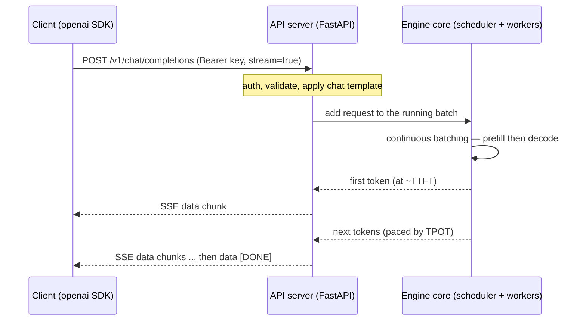

# Serving vLLM over HTTP: the OpenAI-Compatible Server

!!! info "Baseline: **vLLM 0.26.0** · model `Qwen2.5-7B-Instruct` · single RTX 4090"
    Verified against vLLM 0.26.0 via Context7 (ADR-0004): you start the server with **`vllm serve <model>`** (`--host` / `--port` / `--uds`, `--api-key` or the `VLLM_API_KEY` env var — multiple keys allowed for rotation, `--served-model-name` to set the public model id). It exposes the OpenAI routes **`/v1/chat/completions`**, **`/v1/completions`**, **`/v1/models`**, plus utility routes **`/health`** (200 if the engine is alive, 503 if dead), **`/ping`**, **`/version`**, **`/load`**, **`/tokenize`** / **`/detokenize`**, and the Prometheus **`/metrics`** endpoint. Capacity is shaped by the engine args you already met — `--max-num-seqs`, `--max-num-batched-tokens`, `--max-model-len`, `--gpu-memory-utilization`. All numbers here are **illustrative / order-of-magnitude references**.

---

## 1 · Intuition & why it matters

Everything up to Part 7 built and tuned an **engine** — a Python object that turns prompts into tokens as fast as the hardware allows. But nobody ships a Python object. A production service is an **HTTP server**: clients send requests over the network, the server multiplexes them onto the engine, and streams tokens back. This lesson turns the engine into that server.

vLLM's server speaks the **OpenAI API**. That single decision is why vLLM is easy to adopt: any tool, SDK, or app already written against `api.openai.com` — the `openai` Python client, LangChain, LlamaIndex, a chat UI — works against your vLLM server by changing **one line**, the `base_url`. You are not inventing a protocol; you are impersonating the most widely-supported one.

Two things an interviewer expects you to actually know, not just gesture at:

1. **What the server *is*.** It's a thin **FastAPI/uvicorn frontend** in front of the same engine core (scheduler + workers) from the [architecture map](../part5/vllm-architecture-map.md). The frontend does HTTP, auth, request validation, and applies the **chat template**; the engine core does the batching and the GPU work. Knowing which box does what tells you where a bug or a bottleneck lives.
2. **Which knobs are server knobs vs engine knobs.** `--port`, `--api-key`, `--served-model-name` shape the *interface*. `--max-num-seqs`, `--gpu-memory-utilization`, `--max-model-len` shape the *capacity* — they set the ceiling you'll go measure in the [next lesson](load-testing-knee.md). Same binary, two kinds of flags.

So: what the server exposes (the endpoints and auth), and how you talk to it (the OpenAI client + streaming). → see the [Glossary](../glossary.md) for *SLO, Goodput*.

## 2 · Mental model

One binary, two halves: an **HTTP frontend** you can see from `curl`, and the **engine core** you tuned in Parts 4–7.

```text
   vllm serve Qwen/Qwen2.5-7B-Instruct --port 8000
   ─────────────────────────────────────────────────────────────────────────────

   client ──HTTP──▶  API SERVER (FastAPI/uvicorn)  ──▶  ENGINE CORE (the arch map)
   (openai SDK,      the HTTP frontend:                   SCHEDULER
    curl, app)       • /v1/chat/completions (chat template)   │  continuous batching
        ▲            • /v1/completions       (raw text)        ▼
        │            • /v1/models            (served id+LoRA)  WORKERS ──▶ GPU
        │            • /health /metrics /ping /version /load   (PagedAttention)
        └───────────────  tokens stream back (SSE)  ◀──────────────┘

   interface knobs → --port  --api-key  --served-model-name         (how clients talk to you)
   capacity  knobs → --max-num-seqs  --max-num-batched-tokens
                     --max-model-len  --gpu-memory-utilization      ← sets the ceiling you measure
```

The frontend/backend split above is a topology (ASCII per ADR-0005). One request's *lifecycle* through the two halves is an interaction, so Mermaid `sequenceDiagram`:



Three shapes to keep:

- **The server is a frontend; the engine is the backend.** The HTTP layer is cheap and stateless-ish (auth, JSON parsing, chat-template rendering, SSE streaming). The expensive, stateful part — the KV cache, the running batch — lives in the engine core. When latency spikes, it's almost never the FastAPI layer; it's the queue in front of the scheduler (the [next lesson](load-testing-knee.md)).
- **OpenAI-compatible means drop-in.** Point the `openai` client's `base_url` at `http://your-host:8000/v1`, pass any non-empty `api_key`, and the same code that called GPT calls your Qwen. `/v1/chat/completions` applies the model's chat template; `/v1/completions` is raw text-in-text-out.
- **`/health` ≠ "ready for traffic."** `/health` tells you the *engine process is alive* (200) or *dead* (503). It does **not** say "the model finished loading" or "there's spare capacity." Those are different signals — one you'll wire into an autoscaler two lessons from now.

## 3 · Principle

### 3.1 Starting the server

The one command:

```bash
vllm serve Qwen/Qwen2.5-7B-Instruct --host 0.0.0.0 --port 8000
```

`vllm serve <model>` boots the engine (downloads/loads weights, profiles the KV-cache block pool) and then starts a uvicorn server. Useful interface flags, all verified on 0.26.0:

- **`--host` / `--port`** — where to bind. `0.0.0.0` exposes it on all interfaces (see the security pitfall in §6); a local-only dev server uses `127.0.0.1`. `--uds /tmp/vllm.sock` binds a Unix domain socket instead of TCP.
- **`--api-key KEY`** (or the **`VLLM_API_KEY`** env var) — require this bearer token on every request. You can pass the flag **multiple times** to authorize several keys at once, which is how you rotate a key without downtime.
- **`--served-model-name NAME`** — the model id clients must send in the `"model"` field and that `/v1/models` reports. Defaults to the HF path (`Qwen/Qwen2.5-7B-Instruct`); set a stable alias so clients don't hard-code a checkpoint path.

### 3.2 The endpoints

The routes an interviewer might ask you to enumerate:

| Endpoint | Method | What it's for |
|---|---|---|
| `/v1/chat/completions` | POST | Chat with **role messages**; the server applies the model's **chat template**. The main endpoint. |
| `/v1/completions` | POST | Raw **text-in, text-out** — no chat template. |
| `/v1/models` | GET | List the served model (id = `--served-model-name`) **+ any loaded LoRA adapters** ([multi-LoRA](../part6/multi-lora-serving.md)). |
| `/health` | GET | **200** if the engine is alive, **503** if it died (`EngineDeadError`). Liveness. |
| `/ping` | GET/POST | Health check under the name SageMaker expects. |
| `/version` | GET | vLLM version — pin your docs/repro to it (ADR-0004). |
| `/load` | GET | Server **load metrics** (a lighter-weight peek than full Prometheus). |
| `/tokenize`, `/detokenize` | POST | Token↔text without generating — handy for counting tokens client-side. |
| `/metrics` | GET | **Prometheus** metrics (`vllm:num_requests_running`, `vllm:num_requests_waiting`, KV-cache usage, TTFT/ITL histograms). The observability + autoscaling feed. |

### 3.3 Streaming

By default a completion returns once, fully formed. Pass `"stream": true` and the server switches to **Server-Sent Events (SSE)**: each generated token (or small chunk) arrives as its own `data:` event, terminated by `data: [DONE]`. This is what makes a chat UI print token-by-token, and it's why **TTFT** (Part 0) is a user-visible number — with streaming, the user sees the first token the moment prefill finishes, not after the whole response is done.

### 3.4 Interface knobs vs capacity knobs

The same `vllm serve` command carries two families of flags. The **interface** knobs above shape *how clients talk to you*. The **capacity** knobs — which you met tuning the engine — shape *how much you can serve*:

- **`--max-num-seqs`** — max concurrent sequences in a batch (the running-batch width).
- **`--max-num-batched-tokens`** — token budget per scheduler step (the [chunked-prefill](../part5/scheduler-chunked-prefill-pd.md) dial).
- **`--max-model-len`** — max context length; caps per-request KV cache.
- **`--gpu-memory-utilization`** — fraction of VRAM vLLM may claim; more → a bigger KV-cache block pool → higher concurrency.

These four set the **ceiling** of a single instance. The [next lesson](load-testing-knee.md) is entirely about *measuring* where that ceiling is; the lesson after that is about *raising* it by running more instances.

### 3.5 Reading it in vLLM's source (v0.26.0)

The "thin frontend over the engine core" is literally the file layout (ADR-0002: read + reason, don't rewrite):

- **The frontend** is [`vllm/entrypoints/openai/api_server.py`](https://github.com/vllm-project/vllm/blob/v0.26.0/vllm/entrypoints/openai/api_server.py) — the FastAPI app that mounts the routes and streams SSE. It registers an `EngineDeadError` exception handler, which is exactly what makes **`/health`** return 503 when the engine has died (§2).
- **Each endpoint is a serving handler.** `/v1/chat/completions` → **`OpenAIServingChat`** ([`chat_completion/serving.py`](https://github.com/vllm-project/vllm/blob/v0.26.0/vllm/entrypoints/openai/chat_completion/serving.py)) — note its `chat_template` constructor arg: this is the class that *applies the chat template* (§3.2). `/v1/completions` → **`OpenAIServingCompletion`** ([`completion/serving.py`](https://github.com/vllm-project/vllm/blob/v0.26.0/vllm/entrypoints/openai/completion/serving.py)) — raw text, no template. `/v1/models` → **`OpenAIServingModels`** ([`models/serving.py`](https://github.com/vllm-project/vllm/blob/v0.26.0/vllm/entrypoints/openai/models/serving.py)).
- **The interface flags** (`--api-key`, `--served-model-name`, `--host`/`--port`) are defined in [`vllm/entrypoints/openai/cli_args.py`](https://github.com/vllm-project/vllm/blob/v0.26.0/vllm/entrypoints/openai/cli_args.py).

Open `api_server.py` first, then jump to `chat_completion/serving.py` — the split between "HTTP/template" and "engine core" is a file boundary, not just a diagram.

## 4 · Complete runnable code + line-by-line

Start the server, then talk to it three ways: the OpenAI Python client (non-streaming + streaming), and `curl` for the ops endpoints.

```bash
# 1) Launch the server (leave running in one terminal)
vllm serve Qwen/Qwen2.5-7B-Instruct \
    --host 0.0.0.0 --port 8000 \
    --api-key sk-demo-key \                 # require this bearer token; repeat the flag to add more
    --served-model-name qwen2.5-7b \        # the public model id clients must send
    --max-num-seqs 256 \                    # capacity knob: running-batch width
    --gpu-memory-utilization 0.90           # capacity knob: how much VRAM → KV cache
```

```python title="client.py"
"""Talk to a vLLM OpenAI-compatible server with the standard openai SDK.
Offline-safe to read; requires the server above to hit the network."""
from openai import OpenAI

client = OpenAI(
    base_url="http://localhost:8000/v1",   # THE one line: point the OpenAI client at vLLM
    api_key="sk-demo-key",                 # must match a --api-key value (any non-empty string if none set)
)

# (a) Non-streaming chat — server applies Qwen's chat template to these role messages
resp = client.chat.completions.create(
    model="qwen2.5-7b",                    # must equal --served-model-name, not the HF path
    messages=[
        {"role": "system", "content": "You are a terse assistant."},
        {"role": "user",   "content": "Name three GPUs good for LLM inference."},
    ],
    max_tokens=64,
    temperature=0.7,
)
print(resp.choices[0].message.content)     # the full completion, returned once

# (b) Streaming — tokens arrive as SSE events; first chunk lands at ~TTFT
stream = client.chat.completions.create(
    model="qwen2.5-7b",
    messages=[{"role": "user", "content": "Count to five."}],
    stream=True,                           # flip to Server-Sent Events
)
for chunk in stream:                       # each chunk carries the next token(s)
    delta = chunk.choices[0].delta.content
    if delta:
        print(delta, end="", flush=True)   # print token-by-token, like a chat UI
print()
```

```bash
# (c) Ops endpoints — no auth needed for health/metrics; auth IS needed for /v1/*
curl -s http://localhost:8000/health              # -> HTTP 200 (engine alive) or 503 (dead)
curl -s http://localhost:8000/v1/models \
     -H "Authorization: Bearer sk-demo-key"       # -> lists "qwen2.5-7b" (+ any LoRA adapters)
curl -s http://localhost:8000/metrics | grep -E "num_requests_(running|waiting)"
#   vllm:num_requests_running{...} 3.0            # in the running batch right now
#   vllm:num_requests_waiting{...} 0.0            # queued, waiting for a slot
```

**Line-by-line:**

- **`--api-key sk-demo-key`** — the server now rejects any `/v1/*` request without `Authorization: Bearer sk-demo-key`. Repeat the flag (`--api-key k1 --api-key k2`) to accept several keys during a rotation. `/health` and `/metrics` stay unauthenticated so probes and Prometheus can reach them.
- **`--served-model-name qwen2.5-7b`** — decouples the public id from the checkpoint path. Clients send `"model": "qwen2.5-7b"`; if it doesn't match, the server returns a *model-not-found* error (the #1 first-request mistake, §6).
- **`base_url=".../v1"`** — the whole point. The `openai` SDK targets `api.openai.com/v1` by default; this one line retargets it at your box. `api_key` must match a `--api-key` value; with no `--api-key` set, any non-empty string (conventionally `"EMPTY"`) works.
- **`chat.completions.create(..., stream=True)`** — the same call, switched to SSE. The `for chunk in stream` loop receives `delta.content` fragments; the first arrives at roughly **TTFT**, the rest paced by **TPOT** (Part 0). Non-streaming waits for the entire response before returning.
- **`/v1/models`** — returns the served id and any loaded LoRA adapters; this is how a client discovers what it can ask for.
- **`grep num_requests_(running|waiting)`** — the two gauges that summarize load: how many sequences are in the batch now, and how many are queued. `waiting > 0` and climbing is the signature of a saturated instance — the [knee](load-testing-knee.md) and the [autoscaling signal](routing-autoscaling.md).

## 5 · Lab — stand up the server and exercise every endpoint

!!! gpu "GPU Lab (single-GPU)"
    - **Min VRAM:** ~18–20 GB for `Qwen2.5-7B-Instruct` in BF16 at a modest `--max-model-len`; comfortably fits a **24 GB RTX 4090**. Tight? Serve the [INT4 quantized](../part4/quantization-lab.md) checkpoint and raise `--gpu-memory-utilization`.
    - **Suggested AutoDL card:** a single **RTX 4090 (24 GB)** — the default main-line card (ADR-0001). No multi-GPU needed for this lesson.
    - **Est. time / cost:** ~15–25 min hands-on · **~¥1–3** at typical 4090 hourly rates (illustrative). Do the model download in **无卡模式** (CPU-only) first, then power on the GPU only to serve.
    - **Platform:** NVIDIA CUDA (default). **Non-NVIDIA:** the server is pure Python/FastAPI and identical everywhere; only the engine backend differs (AMD ROCm builds of vLLM expose the same endpoints and flags).

Work from launch to observability:

1. **Launch.** Run the `vllm serve …` command above. Watch the logs report the model loading and the **KV-cache block pool size** — that number is your concurrency budget.
2. **Liveness before readiness.** `curl /health` returns 200 *before* the model is fully ready to serve well; note that it's a **liveness** probe, not a "warmed up" signal. Confirm `/v1/models` lists `qwen2.5-7b`.
3. **Chat, then stream.** Run `client.py`. Confirm (a) returns one block and (b) prints token-by-token. Notice the perceptible delay before the first streamed token — that's **TTFT**.
4. **Watch the load.** In a loop, `curl /metrics | grep num_requests`. Fire several concurrent requests (open a few `client.py` at once) and watch `num_requests_running` rise and `num_requests_waiting` go positive when you exceed the batch width. **Power off** when done.

## 6 · Common pitfalls / counter-intuitive points

- **Sending the HF path when you set `--served-model-name`.** If you launched with `--served-model-name qwen2.5-7b`, a request with `"model": "Qwen/Qwen2.5-7B-Instruct"` returns *model not found*. The `"model"` field must equal the **served name**, whatever you chose. (With no `--served-model-name`, it's the HF path.)
- **Forgetting the API key — or assuming there is one.** With `--api-key` set, every `/v1/*` call needs `Authorization: Bearer <key>` or you get 401. With **no** `--api-key`, the server is **open** — any non-empty key string passes. Don't confuse "the client sent `EMPTY`" with "the server is secured."
- **Binding `0.0.0.0` on an untrusted network without auth.** `--host 0.0.0.0` exposes the server on every interface. On a shared/rented box with no `--api-key`, anyone who can reach the port can burn your GPU. Bind `127.0.0.1` for local dev, or set an API key (and a firewall) before exposing it.
- **Treating `/health` as "ready for traffic."** `/health` is **liveness** (engine alive vs dead), not **readiness** (loaded + has spare capacity) and not a load signal. Route load-balancer readiness and autoscaling off the **`/metrics`** gauges (`num_requests_waiting`), not `/health`.
- **Using `/v1/completions` and wondering where the chat formatting went.** `/v1/completions` is **raw** text — it does *not* apply the chat template. Role messages and system prompts only work through **`/v1/chat/completions`**. Sending a bare instruction to `/completions` skips the template the model was tuned for and quality drops.
- **Blaming FastAPI for latency.** The HTTP frontend is microseconds of overhead. If p99 latency is bad, it's the engine queue (too many concurrent requests for `--max-num-seqs`, or prefill starving decode) — go [measure the knee](load-testing-knee.md), don't profile uvicorn.
- **Load-balancer / proxy buffering that breaks streaming.** An intermediate proxy (nginx, some cloud LBs) that **buffers** responses will collect all SSE events and deliver them at once — killing the token-by-token effect and inflating perceived TTFT. Disable response buffering for the streaming route.
- **Expecting the chat template to apply everywhere.** The template is applied *inside* `OpenAIServingChat` (`chat_completion/serving.py`), **not** in `OpenAIServingCompletion` — they're different classes behind different routes. So `/v1/chat/completions` frames your role messages with the model's turn markers, while `/v1/completions` passes text through untouched. Sending chat-style input to `/v1/completions` doesn't error; it just silently skips the template the instruct model expects.

## 7 · Interview links

- [Serving over HTTP: the OpenAI-compatible server & its endpoints](../interview/openai-server-deployment.md) — the high-frequency question this lesson prepares you for: *what `vllm serve` exposes, the difference between `/v1/chat/completions` and `/v1/completions`, what `/health` does and doesn't promise, how auth works, and which flags shape the interface vs the capacity.*

## 8 · Summary & further reading

**One line:** `vllm serve <model>` wraps the engine core in a thin FastAPI frontend that speaks the **OpenAI API** — retarget any OpenAI client with one `base_url` line — exposing `/v1/chat/completions` (applies the chat template), `/v1/completions` (raw), `/v1/models` (served id + LoRA adapters), `/health` (liveness: 200 alive / 503 dead), `/metrics` (the Prometheus feed), and utility routes; auth is `--api-key`/`VLLM_API_KEY` (repeatable for rotation); the **interface** knobs (`--port`, `--api-key`, `--served-model-name`) are separate from the **capacity** knobs (`--max-num-seqs`, `--max-num-batched-tokens`, `--max-model-len`, `--gpu-memory-utilization`) that set the ceiling you go on to measure.

Further reading:

- vLLM `docs/serving/openai_compatible_server.md` — the full endpoint list, request fields, and sampling params.
- vLLM `docs/cli/README.md` — every `vllm serve` flag (host/port/uds, api-key, served-model-name).
- vLLM `docs/usage/security.md` — the utility endpoints (`/health`, `/ping`, `/version`, `/load`, `/tokenize`) and hardening notes.
- vLLM source (v0.26.0): [`vllm/entrypoints/openai/api_server.py`](https://github.com/vllm-project/vllm/blob/v0.26.0/vllm/entrypoints/openai/api_server.py) (FastAPI app + `EngineDeadError`→503), [`chat_completion/serving.py`](https://github.com/vllm-project/vllm/blob/v0.26.0/vllm/entrypoints/openai/chat_completion/serving.py) (`OpenAIServingChat`, chat template), [`completion/serving.py`](https://github.com/vllm-project/vllm/blob/v0.26.0/vllm/entrypoints/openai/completion/serving.py) (`OpenAIServingCompletion`), [`cli_args.py`](https://github.com/vllm-project/vllm/blob/v0.26.0/vllm/entrypoints/openai/cli_args.py) (the flags) — the frontend from §3.5.
- The [vLLM architecture map](../part5/vllm-architecture-map.md) — what the "engine core" behind this frontend actually does.
- The [next lesson](load-testing-knee.md) — turning this server into a measured throughput curve.

## 9 · Self-check

??? question "A client sends `POST /v1/chat/completions` with `{\"model\": \"Qwen/Qwen2.5-7B-Instruct\", ...}` and gets a *model not found* error, even though that's exactly the checkpoint you're serving. Why?"
    Because the server was launched with **`--served-model-name`** set to something else (say `qwen2.5-7b`), and the `"model"` field must match the **served name**, not the Hugging Face checkpoint path. `--served-model-name` deliberately decouples the public id from the checkpoint so clients don't hard-code a path; the cost is that the id you *advertise* (visible at `/v1/models`) is the only one that resolves. Fix: send `"model": "qwen2.5-7b"`, or drop `--served-model-name` so the HF path becomes the id.

??? question "Your uptime monitor polls `/health`, sees 200, and marks the instance ready — but the first real requests are painfully slow or get queued forever. What's the misconception?"
    `/health` is a **liveness** probe: it returns 200 when the engine process is alive and 503 when it has died (`EngineDeadError`). It says **nothing** about readiness (weights fully loaded and warmed) or spare capacity (the batch may already be full with a long queue). Using it as a readiness/traffic signal sends load to an instance that can't serve it well. Readiness and autoscaling should read the **`/metrics`** gauges — especially `vllm:num_requests_waiting` (queue depth) and `vllm:num_requests_running` — which actually reflect whether the instance can take more work. That queue-depth signal is exactly what drives [routing and autoscaling](routing-autoscaling.md).

??? question "What's the practical difference between `/v1/chat/completions` and `/v1/completions`, and when would sending to the wrong one silently hurt quality?"
    `/v1/chat/completions` takes **role messages** (`system`/`user`/`assistant`) and the server applies the **model's chat template** — the exact special-token formatting the instruct model was fine-tuned on. `/v1/completions` is **raw text-in, text-out** with **no template applied**. If you send a bare instruction string to `/v1/completions` for an instruct model, it runs without the template's system framing and turn markers, so the model sees an out-of-distribution prompt and output quality quietly degrades — no error, just worse answers. Use `/v1/chat/completions` for instruct/chat models; reserve `/v1/completions` for base models or when you're deliberately controlling the raw prompt yourself.
